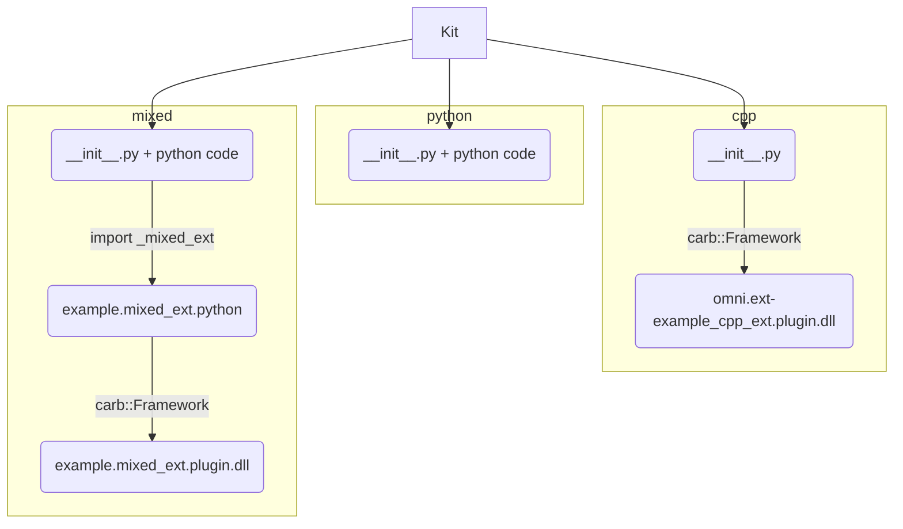

# Getting started

To get started, you will need to do a few things:


## 1. Duplicate the template


*   Fork [https://gitlab-master.nvidia.com/omniverse/kit-extensions/kit-template](https://gitlab-master.nvidia.com/omniverse/kit-extensions/kit-template) into your own space.

    

<p id="gdcalert1" ><span style="color: red; font-weight: bold">>>>>>  gd2md-html alert: inline image link here (to images/image1.png). Store image on your image server and adjust path/filename/extension if necessary. </span><br>(<a href="#">Back to top</a>)(<a href="#gdcalert2">Next alert</a>)<br><span style="color: red; font-weight: bold">>>>>> </span></p>


*   Rename the project and it’s path to be what you want 
*   Transfer the project back to the kit-extensions group with it’s new name

    

<p id="gdcalert2" ><span style="color: red; font-weight: bold">>>>>>  gd2md-html alert: inline image link here (to images/image2.png). Store image on your image server and adjust path/filename/extension if necessary. </span><br>(<a href="#">Back to top</a>)(<a href="#gdcalert3">Next alert</a>)<br><span style="color: red; font-weight: bold">>>>>> </span></p>


    Note that if you have permissions problems transferring back, you should ask or another maintainer to give you permissions.


    Note that the new project still has a fork relationship with kit-template, which means it’s possible to submit and merge MRs across the forks. One disadvantage of this, is that when you submit a new MR, the target branch will be by default in kit-template (maybe it’s possible to change this)


## 2. Modify the build/repo/toolchain configuration files

To start with, find any occurrences of kit-template, kit_template etc and replace with your project name \
 \
Whenever the originals in kit-template get updated, you can either: \
 \
if you have a fork, can do a normal MR too, cherry-pick changes etc..

 \
Or just copy them over from kit-template like this: \


```
cp -R build.bat build.sh .clang-format deps/ docs/ .editorconfig format_code.bat format_code.sh .gitattributes .gitignore package.toml premake5.lua repo.bat repo.sh repo.toml setup.sh tools/ .vscode/ ../kit-usd/
```


And then merge… 


## 3. Duplicate the Teamcity job

This is mostly just a question of going to [https://teamcity.nvidia.com/project/Omniverse_KitExtensions_KitTemplate?mode=builds](https://teamcity.nvidia.com/project/Omniverse_KitExtensions_KitTemplate?mode=builds) and clicking Edit Configuration, then Actions->Copy Project (all in the top right of the browser window). \
You’ll need to modify the VCS root and save it under another name.  \
As a general rule of thumb, everywhere you see “KitTemplate” replace it with the name of your project, which at least guarantees some kind of uniqueness


# Build/repo/toolchain configuration files

What do they give you?

Firstly there are a set of “repo” tools which you can call with ./repo.sh or ./repo.bat in the root of your repo.  \
 \
These are a set of small utility libraries whose source lives in [https://gitlab-master.nvidia.com/omniverse/repo](https://gitlab-master.nvidia.com/omniverse/repo). They are dependencies of your project (you can set their versions by changing deps/repo-deps.packman.xml. The first time you build your project, the chosen versions will be downloaded into _repo.

Calling “./repo.sh” or “./repo.bat” will show you the available tools.

They are configured via a number of *.toml files in your repository \
 \
What can they do for you? Many of them are used by Teamcity to execute various parts of the build pipeline (build/package/publish etc).  \
 \
approximate/simplified  build pipeline is:  \
build->package->test->publish \


Normally these are called via a batch file (.bat/.sh) in teamcity. In general, the principle is should be able to run the same thing locally by just calling the batch script.. Below in yellow is an example script. 

They live in the ./tools folder of your repo


<p id="gdcalert3" ><span style="color: red; font-weight: bold">>>>>>  gd2md-html alert: inline image link here (to images/image3.png). Store image on your image server and adjust path/filename/extension if necessary. </span><br>(<a href="#">Back to top</a>)(<a href="#gdcalert4">Next alert</a>)<br><span style="color: red; font-weight: bold">>>>>> </span></p>


 \
**repo build**

This will build your project and do a lot more: \


1. pull and link dependencies (via packman),
2. setup vscode
3. Generate  license files
4. file copy and link
5. pip install
6. project generation
7. toolchain build call (which in the case of pure python is eally just creating some symlinks.  \


 \
 In the case of a python only repository, it’s really just creating some symlinks.  \
Some configurations have debug/release flavours, not sure what this brings for python only

I think this is equivalent to calling ./build.sh ?

There are many flags, all documented in the tool itself via --help \
 \
One useful thing this does as a side effect is generate python stub files and all of the other plumbing needed to get good intellisense/code completion for vscode in your project, as well as with Kit, USD etc. (for free).

Kit and OV projects in general are set up to use VSCode. You’ll usually find the following in a .vscode folder in your repo (Note: Work out when these files are generated/updated.. At build time?)


*   c_cpp_properties.json
*   extensions.json
*   global-snippets.code-snippets
*   json.code-snippets
*   launch.json
*   settings.json
*   settings.template.json
*   tasks.json

**repo build_doc **

Builds documentation from the debug build of your project. Not sure if this is used in practice with extensions \
 \
**Repo publish_ext**

This will publish extensions to the test extension repository which is used by ETM to test extensions when kit sdk versions and other apps are updated

_This will normally be called by TC_

**repo package**

This will build zip/7z artefacts which can be published to packman. With extension repos, that’s not usually how we publish our extensions anymore (we’re still transitioning though) so mostly this is just used by TC to pass to successive pipeline stages.

There are normally different artefacts per platform/configuration (“configuration” being release/debug flavours). Normally these are stored in _build/packages (this is of course configurable)

Example: \
`./repo.sh package -a`


```

Creating 7z archive: '/home/eoinm/code/omniverse/kit-extensions/kit-usd/_build/packages/kit-usd-extensions@101.1.0+collection_1.0.ce3e9c61.gitlab.linux-x86_64.debug'...
Creating 7z archive: '/home/eoinm/code/omniverse/kit-extensions/kit-usd/_build/packages/kit-usd-extensions@101.1.0+collection_1.0.ce3e9c61.gitlab.linux-x86_64.release'...
```


An archive should be self contained, in the sense that if it doesn’t contain everything it needs to run the extensions, it should contain scripts to bootstrap itself or download dependencies(e.g there’s a “pull_kit_sdk.sh” script which downloads kit… this can be added to your build by including: \
`dofile("tools/autopull/premake5.lua")`

In your main premake5.lua file

**repo publish**

This will publish to packman. As above, not generally needed.

_Note; we do need to decide on how to test in the next step.. Do we include kit-sdk with our extension, or just refer to an existing kit-sdk build?_

**repo test**

Run your tests (startup and unit?) Very simple entry point for running your tests locally

This is what TC will run on the packaged build.

When you do a build, some magic in the build will generate some bat/sh scripts that will run your tests, e,g “tests-python-omni.kit.widget.collection.sh”. This is just starting up Kit, enabling the appropriate extensions, and running their test. “Repo test” is just running those scripts

As well as running tests, it will look for particular patterns in the output (stdout/stderr) to fail on, and others to ignore (configurable).

There’s an  assumption that:


*   if you are running tests locally that you have a local kit build, which can be found by looking at depts/kit-sdk.packman.xml (you can update this to a local dev checkout or any kit by using repo source to modify the dependency, see below)
*   If you are running on TC, you don’t so a kit will have to be checked out

Note: `${test_root}` will be set if you run `--from-package`

**repo source**

This allows you to link to local versions of your dependencies

**repo format**

This will format your code according to OV conventions, using black I think

This is currently optional.

It can also verify formatting

**repo update**

This updates your dependencies by modifying the deps/*xml files to the latest versions (major/minor constraints can be specified)

This is a local only step

**repo licensing**

Will generate licence files for your extensions… most of this is actually handled at the build stage

**repo build_number**

Used by TC only

General notes:


*   Some of these tools work with your local source, some of them work with packaged artefacts, some give you the option of either. Normally TC jobs will be working with packaged artefacts
*   Some of them require you to specify a config e.g release debug, via -c/--config usually. Some default to debug if nothing is passed
*   In order to call your repo setup a success, I think you would have to be able to run your CI pipeline successfully, and successfully run at least build and test locally (ideally on multiple platforms)
*   If you cannot work out why TC jobs are failing, it can be useful to log into the host after the job has completed. Ask on #ct-teamcity, they will allow you access to a host, where you can ssh in via [http://10.36.9.12:8080/guacamole-1.2.0/#/](http://10.36.9.12:8080/guacamole-1.2.0/#/)
*   Not all TC jobs are equal - some stages of the pipeline are triggered by any commit to an MR, some (e.g publishing) might only happen on master


## How to get your extensions into the hands of users

We publish extensions to an extension repository. There are a number of these. This can be done manually from inside Kit (Extensions Window->Burger menu->Publishing Enabled… see below) or via command line from Kit, example: \
 \
`kit.exe --ext-folder C:\eoin\code\eoin\eoin-kit-extensions --publish omni.jira `


<p id="gdcalert4" ><span style="color: red; font-weight: bold">>>>>>  gd2md-html alert: inline image link here (to images/image4.png). Store image on your image server and adjust path/filename/extension if necessary. </span><br>(<a href="#">Back to top</a>)(<a href="#gdcalert5">Next alert</a>)<br><span style="color: red; font-weight: bold">>>>>> </span></p>


There is a validation stage to make sure that you have added the necessary icons, changelog, correct version number etc, and publish will not complete if validation does not pass


# **TC Configuration**

TBD


# **Future work**

We should update** repo_changelog** so it can automatically generate the changelogs for your extensions


# References

See [https://drive.google.com/drive/folders/1XAmdhYQkTQlLwDqHOlxJD7k6waUxYAo7?usp=sharing](https://drive.google.com/drive/folders/1XAmdhYQkTQlLwDqHOlxJD7k6waUxYAo7?usp=sharing) for Anton’s videos about the build system** \
**


<p id="gdcalert5" ><span style="color: red; font-weight: bold">>>>>>  gd2md-html alert: inline image link here (to images/image5.png). Store image on your image server and adjust path/filename/extension if necessary. </span><br>(<a href="#">Back to top</a>)(<a href="#gdcalert6">Next alert</a>)<br><span style="color: red; font-weight: bold">>>>>> </span></p>


# Kit Extensions & Apps Example :package:

This repo is the gold standard for building Kit extensions and applications.

It downloads Kit SDK via packman ([target-deps.packman.xml](deps/target-deps.packman.xml)) or you can use your local build. During build phase extensions are built (native), staged (copied and linked) into
`_build/{platform}/{config}/extensions` folder. Then we just run Kit with custom config which sets to enable those extensions.

The idea is that you fork it, trim down parts you don't need and use it to develop your extensions and applications. Which then can be packaged, shared, reused.


## Getting started

1. run `build.bat`
2. run `_build\windows-x86_64\debug\omni.app.new_exts.bat` or `_build\windows-x86_64\debug\omni.app.new_exts_mini.bat`
3. notice enabled extensions in "Extension Manager Window" of Kit. Also notice that one of them brought its own test in "Test Runner" window.

*. for running from python run `_build\windows-x86_64\debug\example.pythonapp.bat`

## What's included

### Extensions



Each extension is a folder(or zip archive) in the end. You can write user code in python code only, or C++ only, or both. Ultimately extension archive could contain python code, python bindings (pyd/so files) and C++ plugins (dll/so). Each binary file is platform and configuration (debug/release, optionally) specific, one archive can contain binaries for multiple platforms, we put them in separate folders and follow proper naming of python bindings (https://stackoverflow.com/a/37028661).

For more info refer to Kit documentation: http://omnidocs-internal.nvidia.com/py/index.html. 

#### example.python_ext

Example of pure python extesion

[source](source/extensions/example.python_ext)


#### example.cpp_ext

Example of native (C++ only) extension.

[source](source/extensions/example.cpp_ext)


#### example.mixed_ext

Example of mixed extension which has both C++ and python code. They interact via python bindings built and included with this extension.

[source](source/extensions/example.mixed_ext)


### Tests

We also provide examples of writing different tests. They all grouped into one test suite and defined in `repo.toml` file.

Use `repo test --help` to run any of them.

Example:

> `repo.bat test --config debug`


### Docs

Template to generate your documentation for extension with sphinx. Run `tools/build_docs.bat`, results will be in `_build/docs`. Sources are in [docs](docs) folder.

Document your python code with [Google Docstring](https://sphinxcontrib-napoleon.readthedocs.io/en/latest/example_google.html), more info in: (https://gitlab-master.nvidia.com/carbon/Carbonite/blob/master/docs/Documenting.md)


### Apps

Example of an app which runs only those 3 extensions in Kit (and test_runner for tests). All configs are in [source/apps](source/apps), they are linked during build (stage phase).

> `_build\windows-x86_64\debug\omni.app.new_exts.bat`
> `_build\windows-x86_64\debug\omni.app.new_exts_mini.bat`

It also includes example of running Kit from python, both default Kit and an app which runs only those 3 extensions in Kit. 

> `_build\windows-x86_64\debug\example.pythonapp.bat`

That runs default python example, to see list of examples:

> `_build\windows-x86_64\debug\example.pythonapp.bat --help`

Pass different one as first argument to run it.


### RepoMan

All repo tools are based on [RepoMan](https://omniverse.gitlab-master-pages.nvidia.com/repo/repo_man/).
Each of command can be explored with `--help` flag.
Commands:

* `repo.bat build` or `build.bat` - cleans repo, stage files, generates solutions, setups vscode env, builds binaries.
* `repo.bat format` or `format_code.bat` - format C++ and python code.
* `repo.bat build_docs` or `tools/build_docs.bat` - build documentation
* `repo.bat package` or `tools/package.bat` - prepare final package (use [package.toml](package.toml) to configure)
* `repo.bat test` - run different test suites

Config files:

* `premake5.lua` - all configuration for generating platform specific build solutions. [premake5 docs](https://github.com/premake/premake-core/wiki).
* `repo.toml` - configuration of all repo tools (build, package, format etc).
* `package.toml` - lists file wildcards to innclude in packages

### CI

[Teamcity Project](https://teamcity.nvidia.com/project/Omniverse_KitExtensions_KitTemplate?mode=builds) runs on every commit. Builds both platforms, docs, runs tests. Publishing is optional (click "Run" on "publish" configuration).

It can also be easily copied in Teamcity along with forking this project on gitlab.

According to [RepoMan Guidelines](https://omniverse.gitlab-master-pages.nvidia.com/repo/repo_man/manual/overview.html#core-principles) all Teamcity entry points are in [tools/ci](tools/ci) folder.


### VsCode environment

Install VsCode python extension, close VsCode, run `build.bat` first time (`-s` flag is enough), open project again. Python intellisense, linter, formatting should work (we bring our own python).


## Using Local Build of Kit SDK

To use your local build of Kit SDK, assuming it is located say at `C:/projects/kit`.

Use `repo_source` tool to link: 

> `repo source link kit-sdk c:/projects/kit/kit/_build/$platform/$config`

Or use GUI mode to do source linking:

> `repo source gui`

Or you can also do it manually: create a file: `deps/target-deps.packman.xml.user` containing the following lines:

```xml
<project toolsVersion="5.6">
	<dependency name="kit_sdk_${config}" linkPath="../_build/${platform}/${config}/kit">
		<source path="c:/projects/kit/kit/_build/$platform/$config" />
	</dependency>
</project>
```

To remove source link:

> `repo source unlink kit-sdk`

To remove all source links:

> `repo source clear`

As with any repo tool to get more information on arguments just run:

> `repo source`


