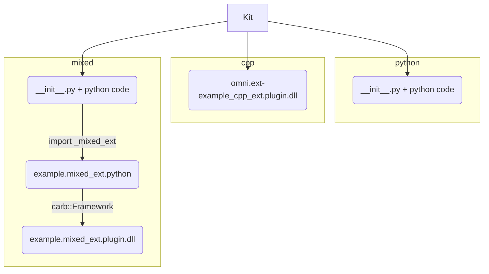

# Kit Extensions & Apps Example :package:

This repo is the gold standard for building Kit extensions and applications.

The idea is that you fork it, trim down parts you don't need and use it to develop your extensions and applications. Which then can be packaged, shared, reused.

This README file provides a quick overview.  In-depth documentation can be found at:

&nbsp;&nbsp;&nbsp;&nbsp;&nbsp;&nbsp;📖 http://omniverse-docs.s3-website-us-east-1.amazonaws.com/kit-template

[Teamcity Project](https://teamcity.nvidia.com/project/Omniverse_KitExtensions_KitTemplate?mode=builds)


# Extension Types




## Getting Started

1. build: `build.bat -c release`
2. run: `_build\windows-x86_64\release\omni.app.new_exts_demo_mini.bat`
3. notice enabled extensions in "Extension Manager Window" of Kit. One of them brought its own test in "Test Runner" window.

To run tests: `repo.bat test`

To run from python: `_build\windows-x86_64\release\example.pythonapp.bat`

## Using a Local Build of Kit SDK

By default packman downloads Kit SDK ([target-deps.packman.xml](deps/target-deps.packman.xml)). For developing purposes local build of Kit SDK can be used. 

To use your local build of Kit SDK, assuming it is located say at `C:/projects/kit`.

Use `repo_source` tool to link: 

> `repo source link kit-sdk c:/projects/kit/kit`

Or use GUI mode to do source linking:

> `repo source gui`

Or you can also do it manually: create a file: `deps/target-deps.packman.xml.user` containing the following lines:

```xml
<project toolsVersion="5.6">
	<dependency name="kit_sdk_${config}" linkPath="../_build/${platform}/${config}/kit">
		<source path="c:/projects/kit/kit/_build/$platform/$config" />
	</dependency>
</project>
```

To see current source links:

> `repo source list`

To remove source link:

> `repo source unlink kit-sdk`

To remove all source links:

> `repo source clear`


# Other Useful Links

+ See [Kit documentation](http://omnidocs-internal.nvidia.com/py/index.html)
+ See [Nathan Cournia's repo tools example](https://gitlab-master.nvidia.com/omniverse/repo/repo_example)
+ See [Anton's Video Tutorials](https://drive.google.com/drive/folders/1XAmdhYQkTQlLwDqHOlxJD7k6waUxYAo7?usp=sharing) for Anton’s videos about the build systems.
+ See [Carbonite documentation](https://nv/carb-docs/latest)
