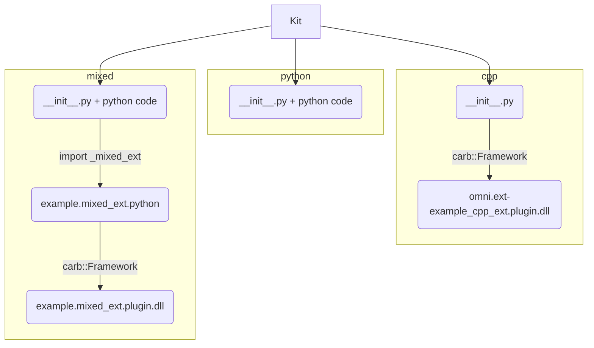

# Kit Extensions & Apps Example :package:

This repo is the gold standard for building Kit extensions and applications.

It downloads Kit SDK via packman ([target-deps.packman.xml](deps/target-deps.packman.xml)) or you can use your local build. During build phase extensions are built (native), staged (copied and linked) into
`_build/{platform}/{config}/extensions` folder. Then we just run Kit with custom config which sets to enable those extensions.

The idea is that you fork it, trim down parts you don't need and use it to develop your extensions and applications. Which then can be packaged, shared, reused.


## Getting started

1. run `build.bat`
2. run `_build\windows-x86_64\debug\omni.app.new_exts.bat` or `_build\windows-x86_64\debug\omni.app.new_exts_mini.bat`
3. notice enabled extensions in "Extension Manager Window" of Kit. Also notice that one of them brought its own test in "Test Runner" window.

*. for running from python run `_build\windows-x86_64\debug\example.pythonapp.bat`

## What's included

### Extensions



Each extension is a folder(or zip archive) in the end. You can write user code in python code only, or C++ only, or both. Ultimately extension archive could contain python code, python bindings (pyd/so files) and C++ plugins (dll/so). Each binary file is platform and configuration (debug/release, optionally) specific, one archive can contain binaries for multiple platforms, we put them in separate folders and follow proper naming of python bindings (https://stackoverflow.com/a/37028661).

For more info refer to Kit documentation: http://omnidocs-internal.nvidia.com/py/index.html. 

#### example.python_ext

Example of pure python extesion

[source](source/extensions/example.python_ext)


#### example.cpp_ext

Example of native (C++ only) extension.

[source](source/extensions/example.cpp_ext)


#### example.mixed_ext

Example of mixed extension which has both C++ and python code. They interact via python bindings built and included with this extension.

[source](source/extensions/example.mixed_ext)


### Tests

We also provide examples of writing different tests. They all grouped into one test suite and defined in `repo.toml` file.

Use `repo test --help` to run any of them.

Example:

> `repo.bat test --config debug`


### Docs

Template to generate your documentation for extension with sphinx. Run `tools/build_docs.bat`, results will be in `_build/docs`. Sources are in [docs](docs) folder.

Document your python code with [Google Docstring](https://sphinxcontrib-napoleon.readthedocs.io/en/latest/example_google.html), more info in: (https://gitlab-master.nvidia.com/carbon/Carbonite/blob/master/docs/Documenting.md)


### Apps

Example of an app which runs only those 3 extensions in Kit (and test_runner for tests). All configs are in [source/apps](source/apps), they are linked during build (stage phase).

> `_build\windows-x86_64\debug\omni.app.new_exts.bat`
> `_build\windows-x86_64\debug\omni.app.new_exts_mini.bat`

It also includes example of running Kit from python, both default Kit and an app which runs only those 3 extensions in Kit. 

> `_build\windows-x86_64\debug\example.pythonapp.bat`

That runs default python example, to see list of examples:

> `_build\windows-x86_64\debug\example.pythonapp.bat --help`

Pass different one as first argument to run it.


### RepoMan

All repo tools are based on [RepoMan](https://omniverse.gitlab-master-pages.nvidia.com/repo/repo_man/).
Each of command can be explored with `--help` flag.
Commands:

* `repo.bat build` or `build.bat` - cleans repo, stage files, generates solutions, setups vscode env, builds binaries.
* `repo.bat format` or `format_code.bat` - format C++ and python code.
* `repo.bat build_docs` or `tools/build_docs.bat` - build documentation
* `repo.bat package` or `tools/package.bat` - prepare final package (use [package.toml](package.toml) to configure)
* `repo.bat test` - run different test suites

Config files:

* `premake5.lua` - all configuration for generating platform specific build solutions. [premake5 docs](https://github.com/premake/premake-core/wiki).
* `repo.toml` - configuration of all repo tools (build, package, format etc).
* `package.toml` - lists file wildcards to innclude in packages

### CI

[Teamcity Project](https://teamcity.nvidia.com/project/Omniverse_KitExtensions_Example?mode=builds) runs on every commit. Builds both platforms, docs, runs tests. Publishing is optional (click "Run" on "publish" configuration).

It can also be easily copied in Teamcity along with forking this project on gitlab.

According to [RepoMan Guidelines](https://omniverse.gitlab-master-pages.nvidia.com/repo/repo_man/manual/overview.html#core-principles) all Teamcity entry points are in [tools/ci](tools/ci) folder.


### VsCode environment

Install VsCode python extension, close VsCode, run `build.bat` first time (`-s` flag is enough), open project again. Python intellisense, linter, formatting should work (we bring our own python).


## Using Local Build of Kit SDK

To use your local build of Kit SDK, assuming it is located say at `C:/projects/kit`.

Use `repo_source` tool to link: 

> `repo source link kit_sdk_debug c:/projects/kit/kit`

Specify `kit_sdk_release` for release configuration.

Or use GUI mode to do source linking:

> `repo source gui`

Or you can also do it manually: create a file: `deps/target-deps.packman.xml.user` containing the following lines:

```xml
<project toolsVersion="5.6">
  <dependency name="kit_sdk_debug" linkPath="../_build/kit_debug">
    <source path="C:/projects/kit/kit" />
  </dependency>
  <dependency name="kit_sdk_release" linkPath="../_build/kit_release">
    <source path="C:/projects/kit/kit" />
  </dependency>
</project>
```

To remove source link:

> `repo source unlink kit_sdk_debug`

To remove all source links:

> `repo source clear`

As with any repo tool to get more information on arguments just run:

> `repo source`


