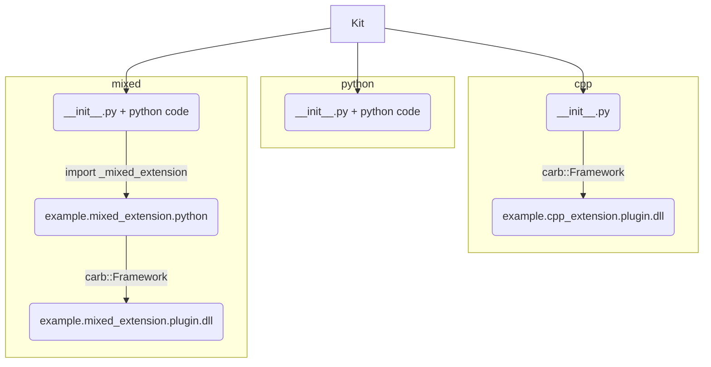

# Kit Extensions & Apps Example :package:

This repo is the gold standard for building Kit extensions and applications.

It downloads Kit SDK via packman ([target-deps.packman.xml](deps/target-deps.packman.xml)) or you can use your local build. During build phase extensions are built (native), staged (copied and linked) into
`_build/{platform}/{config}/extensions` folder. Then we just run Kit with custom config which sets to enable those extensions.

The idea is that you fork it, trim down parts you don't need and use it to develop your extensions and applications. Which then can be packaged, shared, reused.


## Getting started

1. run `build.bat`
2. run `_build\windows-x86_64\debug\example.app.bat`
3. notice enabled extensions in "Extension Manager Window" of Kit. Also notice that one of them brought its own test in "Test Runner" window.

## What's included

### Extensions



Each extension is a folder(or zip archive) in the end. It always starts with minimal python code. You can write user code in python code only, or C++ only, or both. Ultimately extension archive could contain python code, python bindings (pyd/so files) and C++ plugins (dll/so). Each binary file is platform and configuration (debug/release, optionally) specific, one archive can contain binaries for multiple platforms, we put them in separate folders and follow proper naming of python bindings (https://stackoverflow.com/a/37028661).

For more info refer to Kit documentation: http://omnidocs-internal.nvidia.com/py/index.html.

#### example.python_extension

Example of pure python extesion

[source](source/extensions/example.python_extension)


#### example.cpp_extension

Example of native (C++ only) extension.

[source](source/extensions/example.cpp_extension)


#### example.mixed_extension

Example of mixed extension which has both C++ and python code. They interact via python bindings built and included with this extension.

[source](source/extensions/example.mixed_extension)


### Tests

We also provide examples of writing different tests. 

Use `tools/test_runner.bat --help` to run any of them. There are:

* (TBD) `unittests` - C++ test of particular interface/plugin
* `pythontests` - python test of bindings (+plugin), which run without running Kit itself
* `kittests` - python tests of extension inside of running Kit

Example:

> `tools/test_runner.bat --suite pythontests --config debug`


### Docs

Template to generate your documentation for extension with sphinx. Run `tools/build_docs.bat`, results will be in `_build/docs`. Sources are in [docs](docs) folder.

Document your python code with [Google Docstring](https://sphinxcontrib-napoleon.readthedocs.io/en/latest/example_google.html), more info in: (https://gitlab-master.nvidia.com/carbon/Carbonite/blob/master/docs/Documenting.md)


### Apps

Example of an app which runs only those 3 extensions in Kit (and test_runner for tests). All files are in [source/apps](source/apps), they are copied and linked during build (stage phase).

### RepoMan

All repo tools are based on [RepoMan](https://omniverse.gitlab-master-pages.nvidia.com/repo/repo_man/).
Each of command can be explored with `--help` flag.
Commands:

* `build.bat` - cleans repo, stage files, generates solutions, setups vscode env, builds binaries.
* `format_code.bat` - format C++ and python code.
* `tools/build_docs.bat` - build documentation
* `tools/package.bat` - prepare final package (use [package.toml](package.toml) to configure)
* `tools/test_runner.bat` - run different test suites

Config files:

* `premake5.lua` - all configuration for generating platform specific build solutions. [premake5 docs](https://github.com/premake/premake-core/wiki).
* `prebuild.toml` - lists files to copy and folders to link before building.
* `package.toml` - lists file patterns to package

### CI

[Teamcity Project](https://teamcity.nvidia.com/project/Omniverse_KitExtensions_Example?mode=builds) runs on every commit. Builds both platforms, docs, runs tests. Publishing is optional (click "Run" on "publish" configuration).

It can also be easily copied in Teamcity along with forking this project on gitlab.

According to [RepoMan Guidelines](https://omniverse.gitlab-master-pages.nvidia.com/repo/repo_man/manual/overview.html#core-principles) all Teamcity entry points are in [tools/ci](tools/ci) folder.


### VsCode environment

Install VsCode python extension, close VsCode, run `build.bat` first time (`-s` flag is enough), open project again. Python intellisense, linter, formatting should work (we bring our own python).


## Using Custom Kit SDK

To use your local build of Kit SDK create a file, deps/target-deps.packman.xml.user containing the following lines:

```xml
<project toolsVersion="5.6">
  <dependency name="kit_sdk_debug" linkPath="../_build/target-deps/kit_sdk_debug">
    <source path="C:/projects/Graphene" />
  </dependency>
  <dependency name="kit_sdk_release" linkPath="../_build/target-deps/kit_sdk_release">
    <source path="C:/projects/Graphene" />
  </dependency>
</project>
```

Where `C:/projects/Graphene` is path to your Kit SDK folder.

## TODO

* C++ unit tests example
* CI (TC project + tools/ci)
* take dependencies from Kit SDK xml files
* Finish Linux support
