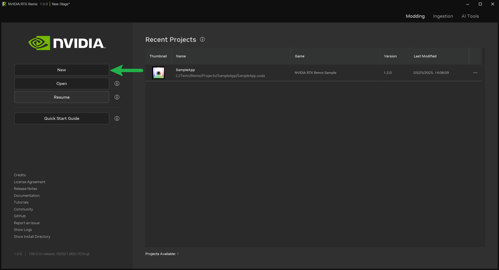
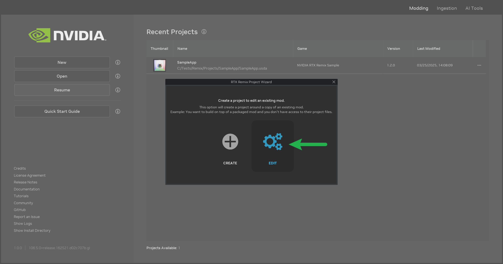
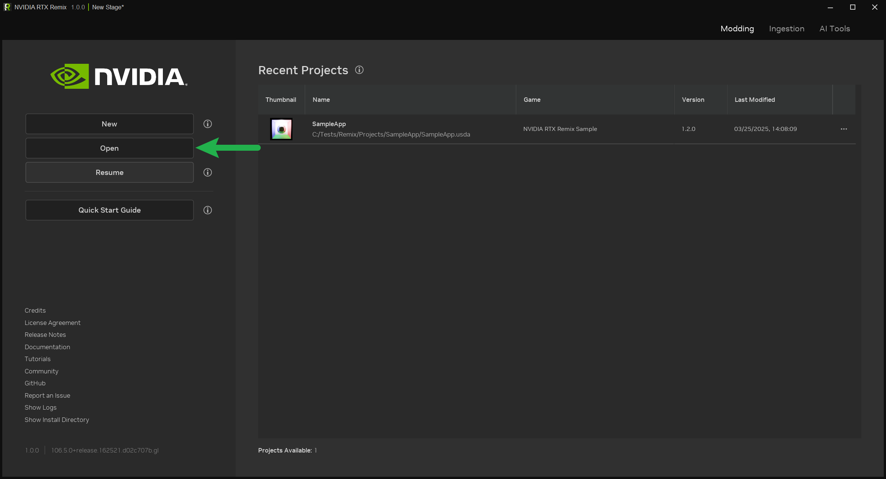

# Setting Up a Project with the RTX Remix Toolkit

```{warning}
**Make sure the RTX Remix Runtime and the RTX Remix Toolkit are installed and setup before you start setting up your
project.**

You can follow the [Installing the RTX Remix Runtime](../installation/install-runtime.md),
[Installing the RTX Remix Toolkit](../installation/install-toolkit.md) and
[Setting Up the RTX Remix Runtime with your Game](learning-runtimesetup.md) sections for directions on how to install
and setup the RTX Remix Runtime.
```

## Understanding RTX Remix Project Basics

Before creating a new project, it's helpful to understand these core concepts:

* "**Project**": This refers to the main USD file that links together your mod layer and capture layer. It is also used
  to store various project metadata.
* "**Mod Layer**": This layer holds all the changes you make to the game, like new assets, lighting tweaks, and other
  modifications. It's a sublayer of the project and can have its own sublayers for better organization.
* "**Capture Layer**": When you capture elements from the game using RTX Remix, this layer stores the captured assets.
  It's created by the runtime. See the [Capturing The Scene](learning-runtimesetup.md#capturing-the-scene) section for
  more details on the capture process.
* "**_rtx-remix_ Directory**": This folder is located in your game's installation directory. It contains the captured
  data and the currently active mods. While not directly part of your project file, it's important because the runtime
  looks here for the active mod layer. When you create a new project,
  a [symbolic link](https://learn.microsoft.com/en-us/windows/win32/fileio/symbolic-links) is created from your project
  to the `rtx-remix/mods` directory.

***

## Creating a New Project

To create a new RTX Remix project:

1. Open the RTX Remix Toolkit.
2. Click the `New` button.



This will open the Project Wizard. Select `Create` to set up a blank project. The wizard will guide you through the
necessary steps.

Keep in mind that you can create your project folder almost anywhere on your computer since Project Wizard will
automatically create a special link between your project folder and the _rtx-remix_ directory.

```{seealso}
See the [Following Best Practices](../howto/learning-bestpractices.md) section for more information on project
organization and best practices.
```

### Working with Existing Mods

If you have an existing mod that you want to edit:

1. Open the RTX Remix Toolkit.
2. Click the "New" button (this will open the Project Wizard).
3. Select the "Edit" option.



This will allow you to choose an existing mod, and a new project will be created for it.

```{note}
The contents of the edited mod will be copied to the new project directory in order to avoid data loss in the game
installation directory.
```

## Opening an Existing Project

To open an existing RTX Remix project:

1. Open the RTX Remix Toolkit.
2. Click the "Open" button.



A file dialog will appear, allowing you to select your project file. The Toolkit will also check if the necessary links
are in place. If you're opening the project for the first time, you might be asked to locate the _rtx-remix_ directory
so the Toolkit can create the required links.

***

## Understanding RTX Remix Projects Further

### Folder Structure Explained

RTX Remix automatically organizes captured data within the _rtx-remix_ folder in your game's directory, which is also
accessible in the project's directory via the _deps_ symlink.

```text
rtx-remix
├ captures -> Contains captures taken within the runtime
│ ├ capture_(year)_(month)_(day)_(hour)_(minutes)_(seconds).usd
│ ├ gameicon.exe_icon
│ ├ lights
│ ├ materials
│ ├ meshes
│ ├ textures
│ └ thumbs
└ mods ← Automatically created after creating a project
  └ YOUR_PROJECT ← (Automatically created symlink to `YOUR_PROJECT` directory to make sure the project can be live updated in-game)

=================================================================

Projects ← (SUGGESTION) Can be located anywhere, contains a list of Remix projects
└ YOUR_PROJECT ← Created during the project creation process, contains the files for your project
  ├ assets ← (SUGGESTION) Manually Made
  | └ ingested ← (SUGGESTION) Manually Made -> Also the default value set in the ingestion wizard.
  |   ├ models ← (SUGGESTION) Manually Made -> Contains the ingested models
  |   └ materials ← (SUGGESTION) Manually Made -> Contains the ingested materials
  └ deps ← (Automatically created symlink to `rtx-remix` directory to make sure you have referenced files available)
```

### Project Naming Rules

When creating mods for the same game, make sure each project has a unique name for its project directory. The Project
Wizard will help enforce this. If you try to create a project with **the same parent directory name** as an existing
mod, the creation process will fail.

### Drive Format Requirement

Both the drive where your RTX Remix project is located and the drive where your game is installed must be formatted
using NTFS. exFat does not support symbolic links, which are essential for RTX Remix to function correctly.

***

## Next Steps

Now that your project is set up, you can start authoring your mod.

You can visit any of the pages in the "How To" section of the documentation to learn how to use the RTX Remix Toolkit
for various stages of the modding process.

We recommended starting with the [Understanding the Toolkit](../howto/learning-toolkit.md#understanding-the-toolkit)
section and moving on to the following section if this is your first time modding with RTX Remix.

***
<sub> Need to leave feedback about the RTX Remix Documentation?  [Click here](https://github.com/NVIDIAGameWorks/rtx-remix/issues/new?assignees=nvdamien&labels=documentation%2Cfeedback%2Ctriage&projects=&template=documentation_feedback.yml&title=%5BDocumentation+feedback%5D%3A+) </sub>
