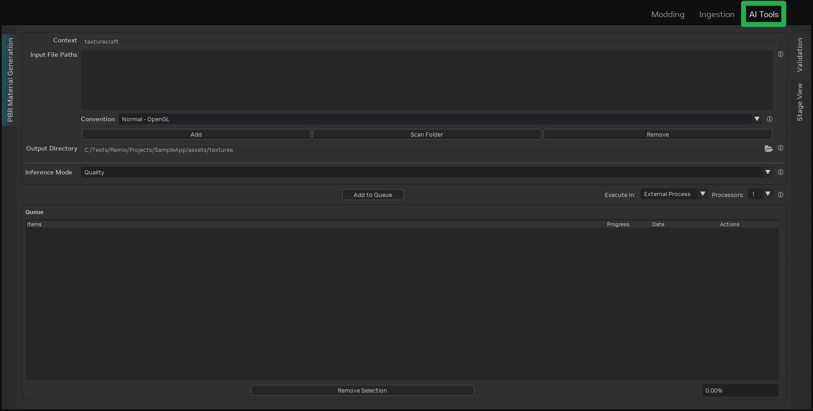

# Using AI Texture Tools

The AI Tools integrated into the RTX Remix Toolkit are designed for simplicity and seamless integration.

AI Tools offer a valuable resource for enhancing textures within your game, particularly for individuals who may not be
artists or for rapid prototyping purposes. Smaller teams with limited art expertise, manpower, or time can also leverage
AI tools to efficiently process background assets, enabling artists to concentrate on hero assets and other key
elements.

## AI Tools Output

* **Upscaling:** The AI Tools increase the resolution of input textures by a factor of **4x**.

  ```{note}
  The final resolution may vary depending on the input resolution.

  Refer to the [AI Tools Inference Mode](#ai-tools-inference-mode) section for details on how the inference mode affects
  the final output resolution.
  ```

* **PBR Texture Generation:** The AI Tools generate a set of Physically Based Rendering (PBR) textures from the input
  texture. The generated textures include:
    * Albedo Texture
    * Normal Map
    * Roughness Map

## Using the AI Texture Tools

The AI Texture Tools can be accessed by clicking the `AI Tools` tab in the RTX Remix Toolkit.



The interface is similar to the [Material Ingestion tab](learning-ingestion.md#ingesting-assets), providing a familiar
user experience. Consult the ingestion documentation for detailed instructions on using the interface.

### AI Tools Inference Mode

Inference modes modify the behavior of the AI Texture Tools. The available modes are:

* **Speed:** This mode prioritizes speed, resulting in lower-resolution output. It is suitable for quick iterations.

  This mode resizes the input texture to 256x256 before processing, consistently producing 1k (1024x1024) output
  textures. The entire inference process is executed in a single pass for speed.

* **Quality:** This mode prioritizes high-quality output, recommended for final textures.

  This mode uses the input texture at its original resolution. The inference process tiles the input texture into
  256x256 tiles and processes each tile sequentially. Consequently, the output resolution is 4x the input resolution,
  regardless of the original resolution. The inference process is longer for larger input images due to the increased
  number of tiles. This mode also requires more VRAM to store the input and output textures.

  ```{warning}
  While any input resolution is acceptable, using input textures with a maximum resolution of 512x512 is recommended to
  prevent VRAM overflow into system memory.

  VRAM overflow will **significantly** decrease inference speed.
  ```

## Technical Requirements

Although the [minimum requirements](../introduction/intro-requirements.md) for using the AI Texture Tools are the same
as those for the RTX Remix Toolkit, increased VRAM capacity accelerates texture processing. A minimum of 12 GB of VRAM
is recommended for a smooth experience.

```{tip}
Closing the project before submitting textures to the AI Texture Tools can improve processing speed and ensure
sufficient VRAM availability for the model.

Refer to the ["Close Project" button](../toolkitinterface/remix-toolkitinterface-layouttab.md#mod-setup) section for
more information.
```

## Using Third-Party AI Tools

Third-Party AI Tools can be integrated into RTX Remix workflows, allowing for the implementation of various AI-driven
techniques, including style transfer, to reimagine a game's visual style.

The [Using the REST API](learning-restapi.md) section provides details on leveraging the RTX Remix Toolkit REST API to
integrate third-party tools into your workflow.

The [ComfyUI RTX Remix integration](https://github.com/NVIDIAGameWorks/ComfyUI-RTX-Remix) is an example of using the
REST API to incorporate third-party tools.

***
<sub> Need to leave feedback about the RTX Remix Documentation?  [Click here](https://github.com/NVIDIAGameWorks/rtx-remix/issues/new?assignees=nvdamien&labels=documentation%2Cfeedback%2Ctriage&projects=&template=documentation_feedback.yml&title=%5BDocumentation+feedback%5D%3A+) </sub>
