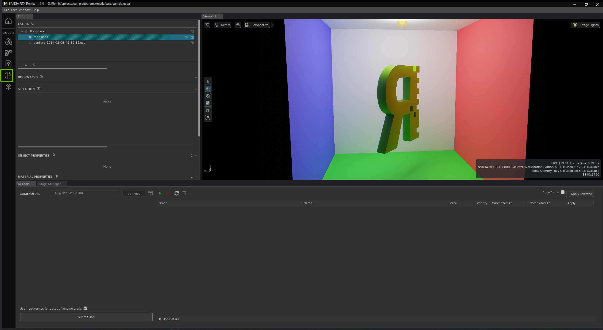
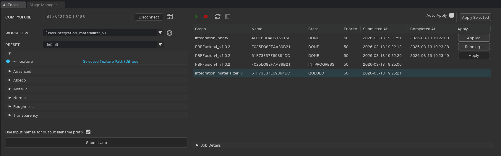
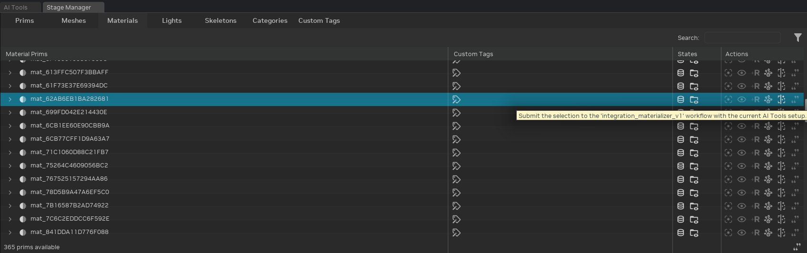

# Using AI Tools

The AI Tools in the RTX Remix Toolkit use [ComfyUI](https://github.com/comfyanonymous/ComfyUI), an open-source
node-based workflow engine, to run AI-powered workflows on your scene assets. ComfyUI handles the actual inference,
while the Toolkit provides a streamlined interface for submitting jobs, configuring parameters, and applying results to
your USD stage.

By connecting to a ComfyUI instance, you gain access to the broader ComfyUI ecosystem (custom models, node packs, and
community workflows) while keeping the submission experience simple. Workflows can perform any task that ComfyUI
supports: PBR texture generation, upscaling, style transfer, mesh processing, and more. The Toolkit is workflow-agnostic
and exposes whatever inputs and outputs the workflow author has tagged for RTX Remix.

**Who benefits:** Modders, small teams, and anyone doing rapid prototyping. For example, AI-generated PBR maps can let
non-artists produce usable textures, freeing experienced artists to focus on hero assets.

## Getting Started

### Prerequisites

- **GPU:** NVIDIA GPU with at least 8 GB VRAM (12 GB+ recommended)
- **[ComfyUI](#installing-comfyui):** A working ComfyUI installation
- **[ComfyUI Manager](#installing-comfyui-manager):** For installing nodes and models
- **[RTX Remix Node Pack](#installing-the-rtx-remix-node-pack):** Required for workflows that expose inputs/outputs to the Toolkit
- **[Template Workflow Preparation](#preparing-template-workflows):** Install missing custom nodes for the bundled template workflows

### Installing ComfyUI

ComfyUI can be installed in several ways:

- **Desktop App (recommended):** Download the [ComfyUI Desktop App](https://www.comfy.org/download) for a managed
  installation with automatic updates.

  ```{note}
  The Desktop App bundles its own Python environment. When exporting workflows, use the right-click
  "Export Workflow for RTX Remix" option rather than the API export, as the Desktop App's export format may differ.
  ```

- **Portable (Windows):** Download a portable release from the
  [ComfyUI releases page](https://github.com/comfyanonymous/ComfyUI/releases). Extract and run
  `run_nvidia_gpu.bat`.

- **Manual:** Clone the [ComfyUI repository](https://github.com/comfyanonymous/ComfyUI) and follow the manual
  installation instructions.

  ```{warning}
  Avoid installation paths containing spaces. Some ComfyUI nodes may fail to resolve paths correctly.
  ```

### Installing ComfyUI Manager

[ComfyUI Manager](https://github.com/Comfy-Org/ComfyUI-Manager) simplifies installing custom nodes and models. It is
required for easily installing the RTX Remix Node Pack and any models your workflows depend on.

ComfyUI Manager comes **pre-installed with the Desktop App**. For Portable or Manual installations, install it
manually:

1. Navigate to `ComfyUI/custom_nodes/` in your ComfyUI installation.
2. Clone the repository:

   ```bat
   git clone https://github.com/Comfy-Org/ComfyUI-Manager.git
   ```

3. Restart ComfyUI.

### Installing the RTX Remix Node Pack

The [RTX Remix Node Pack](https://github.com/NVIDIAGameWorks/ComfyUI-RTX-Remix) provides nodes for tagging workflow
inputs and outputs, saving textures with type metadata, and exporting workflows for the Toolkit. Install it through
ComfyUI Manager:

1. Open ComfyUI in your browser.
2. Open ComfyUI Manager (button in the top menu bar).
3. Search for **RTX Remix** and install the node pack.
4. Restart ComfyUI.

```{note}
Requires ComfyUI v0.3.48 or newer (V3 schema API support).
```

### Preparing Template Workflows

The RTX Remix Node Pack ships with ready-made template workflows. These templates may depend on additional custom nodes
that are not installed by default. Before using a template for the first time, install its dependencies:

1. Open ComfyUI in your browser.
2. Click **Templates** in the left sidebar.
3. Scroll down to the **EXTENSIONS** section in the left panel and select **ComfyUI RTX Remix**.
4. Click on the template workflow you want to use. The workflow loads onto the canvas.
5. A **"This workflow has missing nodes"** dialog appears listing the custom nodes required by the template that
   aren't yet installed. This is expected on first load. Click **Skip for Now** to dismiss the dialog — you'll
   install the missing nodes via the Manager in the next step.
6. Open **ComfyUI Manager** (the **Manager** button in the top-right area of the menu bar).
7. Click **Install Missing Custom Nodes**.
8. Select all listed nodes and click **Install**.
9. After installation completes, click **Restart** to reboot the ComfyUI server.

Once the server restarts, reopen the template workflow. All nodes should load without errors.

```{note}
When you reopen a template, ComfyUI may prompt you to download missing AI models. You can safely **dismiss this
prompt** — the RTX Remix templates include downloader nodes that fetch the required models automatically the first
time the workflow runs. This initial download can take a while depending on your connection speed and the size of
the models. Subsequent runs use the cached models and start much faster.
```

```{tip}
You only need to do this once per template. After the required custom nodes are installed, the template will load
cleanly in future sessions.
```

### Running ComfyUI

ComfyUI must be running and accessible over HTTP for the Toolkit to connect. How you start it depends on your
installation method:

- **Desktop App:** Launch the application. ComfyUI starts automatically and is accessible at
  `http://127.0.0.1:8000` by default. The port can be changed in the
  [Server Config](https://docs.comfy.org/interface/settings/server-config) settings menu within the Desktop App.
- **Portable:** Run `run_nvidia_gpu.bat` from the ComfyUI directory. The server starts on port `8188` by default.
- **Manual:** Run `python main.py` from the ComfyUI directory. The server starts on port `8188` by default. Use
  `--port` to specify a different port.

```{important}
The Desktop App uses port **8000** by default, while Portable and Manual installations use port **8188**. Make sure
the port in the Toolkit's ComfyUI URL field matches your ComfyUI instance.
```

````{tip}
Several template workflows download large AI models from [HuggingFace](https://huggingface.co/) on first run.
Anonymous downloads are heavily rate-limited and can be very slow — set an `HF_TOKEN` environment variable to
dramatically improve download speeds.

1. Generate a free read-only token from [your HuggingFace settings](https://huggingface.co/settings/tokens).
2. Export it **before launching ComfyUI**:

   ```bash
   export HF_TOKEN=hf_xxxxxxxxxxxxxxxxxxxx     # macOS / Linux
   set HF_TOKEN=hf_xxxxxxxxxxxxxxxxxxxx        # Windows (cmd)
   $env:HF_TOKEN = "hf_xxxxxxxxxxxxxxxxxxxx"   # Windows (PowerShell)
   ```

3. Start ComfyUI from the same shell.

For the Desktop App (or if you prefer per-workflow control), you can instead paste a token into the `hf_token` field
on each `RTX Remix Download Model` node — but the environment variable approach covers every node at once.
````

### Connecting the Toolkit to ComfyUI

1. Click the **AI Tools** button in the left sidebar (in the **Layouts** group) to open the AI Tools layout.

   

2. In the **ComfyUI URL** field, enter the address of your ComfyUI instance:
   - Desktop App: `http://127.0.0.1:8000`
   - Portable / Manual: `http://127.0.0.1:8188`
3. Click **Connect**.
4. The status indicator updates to **Connected** when the connection is established. Available workflows populate the
   workflow dropdown automatically.



```{note}
The ComfyUI URL is persisted across sessions. You only need to set it once unless you change your ComfyUI setup.
```

## Basic Usage: Running Your First Workflow

### Selecting a Workflow

The workflow dropdown lists all RTX Remix-compatible workflows available on the connected ComfyUI instance. Each entry
is displayed in the format:

> **(source_type) workflow_name**

The `source_type` indicates the origin of the workflow, for example whether it is a template bundled with the node pack
or a workflow you exported yourself. Select a workflow to load its configurable fields into the panel below.

### Using Presets

When a workflow defines presets, a **preset dropdown** appears above the field editors. Presets provide curated
combinations of field values tuned for specific use cases. For example, a workflow might include presets for different
material types.

- Selecting a different preset resets all fields to their defaults, then applies the preset's overrides.

```{tip}
Presets are defined by workflow authors in ComfyUI. The presets available depend entirely on the workflow you select.
Different workflows may offer different presets, or none at all. See
[Managing Presets](https://github.com/NVIDIAGameWorks/ComfyUI-RTX-Remix?tab=readme-ov-file#managing-presets) in the
RTX Remix Node Pack documentation for details on creating and managing presets.
```

### Configuring Field Values

Below the preset selector, each exposed workflow parameter appears as an editable field. Field types include text
inputs, numeric sliders, checkboxes, dropdowns, and file paths, matching the parameter type defined in the workflow.

Fields that have been modified from their default value display a **blue indicator dot**. Click the dot to reset the
field to its default value.

### Sending Scene Data to ComfyUI

Some workflow fields can be configured to automatically pull data from your Remix scene instead of using a static value
you type in. For example, instead of manually entering a texture path, you can bind a field so it automatically reads
the diffuse texture path from whatever prim you submit.

To set up a dynamic input:

1. Click the **More** button (three-dot icon) on a compatible field.
2. The menu shows available data sources that match the field's type.
3. Select an option (e.g., **"Selected Texture Path (Diffuse)"**) to bind the field.
4. When you submit a job, the bound value is resolved individually for each selected prim.

To switch back to a static value, click the **More** button and choose **"Custom..."**.

```{note}
Dynamic inputs are what make batch processing powerful. By binding the input field to scene data, you can submit
dozens of prims in one action, and each job automatically picks up the correct data from its prim.
```

### Submitting a Job

1. Select one or more prims in the viewport or Stage Manager.
2. Configure the workflow fields.
3. Click **Submit Job**.
4. If this is your first job, click the **Play** button (triangle icon) in the job queue toolbar to start the job
   scheduler. Jobs will not be sent to ComfyUI until the scheduler is running.

Once a job completes, it appears in the job queue with an **Apply** button.

```{note}
The scheduler only needs to be started once per session. It continues processing queued jobs until you stop it with
the **Stop** button.
```

### Applying Results

Each completed job shows an **Apply** button in its queue row. Clicking it applies the job's outputs to the USD
stage. For example, generated textures are ingested and assigned to the appropriate shader attributes on the submitted
prims.

The button reflects the current state:

| State | Meaning |
|-------|---------|
| **Apply** | Ready to apply results |
| **Running...** | Application in progress |
| **Applied** | Results have already been applied in this context |

To apply results automatically as jobs complete, enable the **Auto Apply** checkbox in the job queue toolbar. When
enabled, each finished job is applied immediately without manual intervention. You can also select multiple jobs and
click **Apply Selected** to apply them in bulk.

```{tip}
**Auto Apply** is useful for large batch runs where you want results to land on the stage as soon as they're ready.
For more deliberate workflows, leave it off and apply jobs individually after reviewing them.
```

### Job Details

Click a job row to expand the **Job Details** panel at the bottom of the queue. This shows:

- **Open Job Folder** button to browse the output files on disk
- The job ID and total processing duration
- An execution log with timestamps for each stage (start, pre-execute, execute, post-execute, results)

## Processing at Scale

### Batch Submission

Select multiple prims and click **Submit Job** to queue jobs for all of them at once. When combined with dynamic
inputs, each prim's job resolves its own input values automatically.

### Job Deduplication

The system automatically detects when multiple prims share the same input data. Rather than submitting duplicate jobs to
ComfyUI, it groups these prims and submits a single job, then applies the results to all prims in the group. This
significantly reduces processing time for scenes with shared assets.

### Job Persistence

The job queue is stored in a SQLite database and survives application restarts. If you close the Toolkit mid-processing,
your queued jobs are preserved and continue when you reconnect.

### Stage Manager Integration

You can submit jobs directly from the Stage Manager without switching to the AI Tools panel. Each prim row in the
Stage Manager has an **AI Tools** icon in the **Actions** column. Click it to submit the selected prim(s) using the
currently configured workflow and field values.



The icon appears enabled when ComfyUI is connected and a workflow is selected. When disabled, hover over it to see
why (e.g., no connection, no workflow selected, or no texture path on the prim).

```{tip}
Submit from the **Materials** tab in the Stage Manager to apply results at the Material prim level. This creates an
override on the Material that all meshes sharing that material will inherit, so you only need to process each
material once rather than per-mesh.
```

## Creating Custom Workflows

The [RTX Remix Node Pack](https://github.com/NVIDIAGameWorks/ComfyUI-RTX-Remix) documentation covers the full workflow
creation process:

1. **Build your workflow** in ComfyUI using standard nodes.
2. **Tag inputs and outputs** for RTX Remix by right-clicking nodes and selecting "Tag for RTX Remix". Tagged inputs
   appear as configurable fields in the Toolkit UI. Tagged outputs tell the Toolkit how to handle results.
3. **Export** by right-clicking the canvas and selecting "Export Workflow for RTX Remix".

```{warning}
The standard "Save (API Format)" export does not include RTX Remix metadata. Always use the RTX Remix-specific
export option.
```

See the
[Integration Workflow Guide](https://github.com/NVIDIAGameWorks/ComfyUI-RTX-Remix?tab=readme-ov-file#integration-workflow-guide)
for step-by-step instructions on tagging, exporting, and testing workflows.

## Run Configurations

### Single Machine

The simplest setup: ComfyUI and the RTX Remix Toolkit run on the same machine. Use the default URL
(`http://127.0.0.1:8000` for the Desktop App, or `http://127.0.0.1:8188` for Portable/Manual). This is ideal for
individual modders and small projects.

```{note}
ComfyUI and the Toolkit share GPU resources on a single machine. If you experience slow inference or VRAM pressure,
consider closing the project before submitting large batches, or use a remote configuration.
```

### Remote Machine

Run ComfyUI on a separate machine (e.g., a dedicated GPU server) to free the local GPU for viewport rendering:

1. Start ComfyUI with the `--listen` flag on the remote machine so it accepts external connections:

   ```bat
   python main.py --listen
   ```

2. In the Toolkit, enter the remote machine's IP and port (e.g., `http://192.168.1.100:8188`).
3. Click **Connect**.

```{tip}
If you have multiple GPUs, you can run separate ComfyUI instances on different GPUs using `--cuda-device` and
`--port` to assign each instance to a specific GPU and port.
```

## Troubleshooting

| Symptom | Solution |
|---------|----------|
| No workflows appear after connecting | Ensure the RTX Remix Node Pack is installed and ComfyUI has been restarted after installation. |
| "No texture path found" on submit | The selected prim has no texture assigned. Required when dynamic inputs reference prim textures. |
| Results not appearing on prim | Verify the prim hierarchy includes a shader that the Toolkit can locate. |

For general ComfyUI issues (model loading, out of memory, node errors), check the ComfyUI console output and refer to
the [ComfyUI documentation](https://docs.comfy.org/).

***

```{seealso}
[ComfyUI RTX Remix Node Pack](https://github.com/NVIDIAGameWorks/ComfyUI-RTX-Remix): source and documentation for
the node pack
```

***
<sub> Need to leave feedback about the RTX Remix Documentation?  [Click here](https://github.com/NVIDIAGameWorks/rtx-remix/issues/new?assignees=sambvfx&labels=documentation%2Cfeedback%2Ctriage&projects=&template=documentation_feedback.yml&title=%5BDocumentation+feedback%5D%3A+) </sub>
