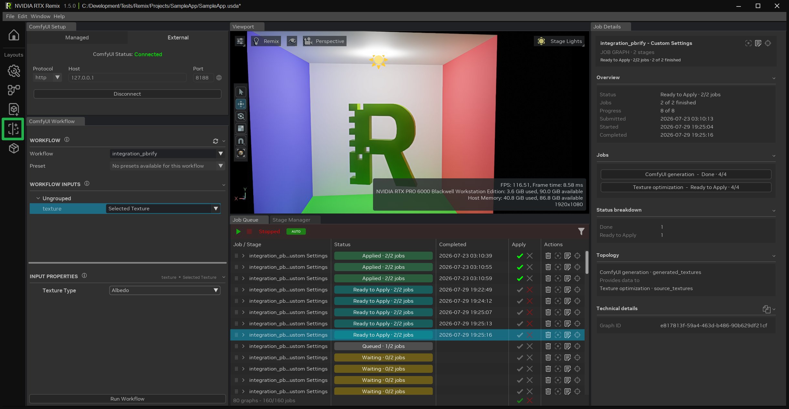
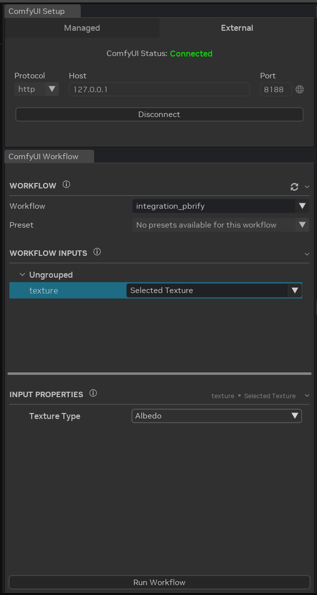
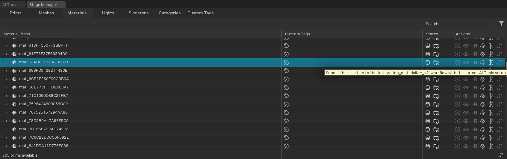

# Using AI Tools

The RTX Remix Toolkit AI Tools integrate [ComfyUI](https://github.com/comfyanonymous/ComfyUI), an open-source,
node-based workflow engine. ComfyUI runs the AI workflows. The Toolkit lets you configure and submit those workflows,
monitor their progress, and apply their results to your USD stage.

You can use compatible ComfyUI workflows for tasks such as PBR texture generation, upscaling, style transfer, and mesh
processing. The fields shown in the Toolkit come from the inputs and outputs that the workflow author tagged for RTX
Remix.

AI Tools is useful for modders, small teams, and rapid prototyping. For example, AI-generated PBR maps can help
non-artists create usable textures while experienced artists focus on hero assets.

## Getting Started

### Prerequisites

- **GPU:** An NVIDIA GPU with at least 8 GB of VRAM (12 GB or more recommended).
- **[ComfyUI](#installing-comfyui):** A working ComfyUI installation.
- **[ComfyUI Manager](#installing-comfyui-manager):** Used to install nodes and models.
- **[RTX Remix Node Pack](#installing-the-rtx-remix-node-pack):** Required for workflows that expose inputs and
  outputs to the Toolkit.
- **[Template workflow preparation](#preparing-template-workflows):** Missing custom nodes must be installed before
  you use a bundled template workflow.

### Installing ComfyUI

ComfyUI can be installed in several ways:

- **Desktop App (recommended):** Download the [ComfyUI Desktop App](https://www.comfy.org/download) for a managed
  installation with automatic updates.

  ```{note}
  The Desktop App bundles its own Python environment. When exporting workflows, use the right-click
  "Export Workflow for RTX Remix" option rather than the API export, as the Desktop App's export format may differ.
  ```

- **Portable (Windows):** Download a portable release from the
  [ComfyUI releases page](https://github.com/comfyanonymous/ComfyUI/releases). Extract and run
  `run_nvidia_gpu.bat`.

- **Manual:** Clone the [ComfyUI repository](https://github.com/comfyanonymous/ComfyUI) and follow the manual
  installation instructions.

  ```{warning}
  Avoid installation paths containing spaces. Some ComfyUI nodes may fail to resolve paths correctly.
  ```

### Installing ComfyUI Manager

[ComfyUI Manager](https://github.com/Comfy-Org/ComfyUI-Manager) provides the easiest way to install custom nodes and
models, including the RTX Remix Node Pack and any dependencies required by your workflows.

ComfyUI Manager comes **pre-installed with the Desktop App**. For Portable or Manual installations, install it
manually:

1. Navigate to `ComfyUI/custom_nodes/` in your ComfyUI installation.
2. Clone the repository:

   ```bat
   git clone https://github.com/Comfy-Org/ComfyUI-Manager.git
   ```

3. Restart ComfyUI.

### Installing the RTX Remix Node Pack

The [RTX Remix Node Pack](https://github.com/NVIDIAGameWorks/ComfyUI-RTX-Remix) provides nodes for tagging workflow
inputs and outputs, saving textures with type metadata, and exporting workflows for the Toolkit. Install it through
ComfyUI Manager:

1. Open ComfyUI in your browser.
2. Open ComfyUI Manager (button in the top menu bar).
3. Search for **RTX Remix** and install the node pack.
4. Restart ComfyUI.

```{note}
Requires ComfyUI v0.3.48 or newer (V3 schema API support).
```

### Preparing Template Workflows

The RTX Remix Node Pack ships with ready-made template workflows. These templates may depend on additional custom nodes
that are not installed by default. Before using a template for the first time, install its dependencies:

1. Open ComfyUI in your browser.
2. Click **Templates** in the left sidebar.
3. Scroll down to the **EXTENSIONS** section in the left panel and select **ComfyUI RTX Remix**.
4. Click on the template workflow you want to use. The workflow loads onto the canvas.
5. If the **This workflow has missing nodes** dialog appears, click **Skip for Now**. You will install the listed
   nodes through ComfyUI Manager in the next step.
6. Open **ComfyUI Manager** (the **Manager** button in the top-right area of the menu bar).
7. Click **Install Missing Custom Nodes**.
8. Select all listed nodes and click **Install**.
9. After installation completes, click **Restart** to reboot the ComfyUI server.

Once the server restarts, reopen the template workflow. All nodes should load without errors.

```{note}
When you reopen a template, ComfyUI may prompt you to download missing AI models. You can safely **dismiss this
prompt** — the RTX Remix templates include downloader nodes that fetch the required models automatically the first
time the workflow runs. This initial download can take a while depending on your connection speed and the size of
the models. Subsequent runs use the cached models and start much faster.
```

```{tip}
You only need to do this once per template. After the required custom nodes are installed, the template will load
cleanly in future sessions.
```

### Running ComfyUI

ComfyUI must be running and accessible over HTTP for the Toolkit to connect. How you start it depends on your
installation method:

- **Desktop App:** Launch the application. ComfyUI starts automatically. Use the local URL shown by the Desktop App;
  the app can manage the port for the selected installation.
- **Portable:** Run `run_nvidia_gpu.bat` from the ComfyUI directory. The server starts on port `8188` by default.
- **Manual:** Run `python main.py` from the ComfyUI directory. The server starts on port `8188` by default. Use
  `--port` to specify a different port.

```{important}
ComfyUI's default port is **8188**, but the Desktop App or custom launch settings may use another port. Paste the
complete URL for the running ComfyUI instance into the Toolkit's **Host** field; the Toolkit automatically fills the
**Protocol**, **Host**, and **Port** settings.
```

````{tip}
Several template workflows download large AI models from [HuggingFace](https://huggingface.co/) on first run.
Anonymous downloads are rate-limited and can be slow. Set an `HF_TOKEN` environment variable to improve download
speeds.

1. Generate a free read-only token from [your HuggingFace settings](https://huggingface.co/settings/tokens).
2. Export it **before launching ComfyUI**:

   ```bat
   REM Set the environment variable in the Windows console
   set HF_TOKEN=hf_xxxxxxxxxxxxxxxxxxxx
   ```

   or

   ```powershell
   # Set the environment variable in PowerShell
   $env:HF_TOKEN = "hf_xxxxxxxxxxxxxxxxxxxx"
   ```

   Use the first command on macOS or Linux, the second in Windows Command Prompt, or the third in Windows PowerShell.

3. Start ComfyUI from that shell.

For the Desktop App (or if you prefer per-workflow control), you can instead paste a token into the `hf_token` field
on each `RTX Remix Download Model` node — but the environment variable approach covers every node at once.
````

### Connecting the Toolkit to ComfyUI

1. Click the **AI Tools** button in the left sidebar (in the **Layouts** group) to open the AI Tools layout.

   

2. In the **External** tab, paste the complete URL into the **Host** field. The Toolkit automatically sets the
   **Protocol**, **Host**, and **Port** fields:
   - If ComfyUI is using its default port: `http://127.0.0.1:8188`
   - If the Desktop App shows another local URL, paste that URL instead.
3. Click **Connect**.
4. The persistent connection banner updates to **Connected** when the Toolkit verifies the connection. Available
   workflows populate the workflow dropdown automatically.



```{note}
The parsed Protocol, Host, and Port settings are persisted across sessions. You only need to paste the URL again when
your ComfyUI setup changes.
```

The connection banner explains the current connection state:

| Banner | Meaning and available action |
|--------|------------------------------|
| **Disconnected** | Paste the complete URL into **Host**, then select **Connect**. |
| **Connecting** | The Toolkit is checking the configured server. The connection settings are unavailable while it checks. |
| **Connected** | The banner displays the exact verified ComfyUI URL. Select **Open Browser** to open that verified endpoint. |
| **Connection Failed** | Paste a corrected complete URL into **Host** if needed, then select **Retry**. **Show Logs** is available for this state only. |

Each banner action is compact and right-aligned inline to the right of the flexible wrapped status text. **Open
Browser** is available only while the connection is verified. **Show Logs** opens an in-app modal with the exact
endpoint and Toolkit-captured connection error in a selectable, copyable, read-only multiline field. It does not show
the external ComfyUI server's console or process logs.

## Basic Usage: Running Your First Workflow

### How a Job Is Processed

Each row in the job queue represents a **job graph**: a group of stages that run in a specific order. A standard
ComfyUI job has two stages:

1. **ComfyUI generation:** Sends the values resolved from your scene and workflow fields to ComfyUI.
2. **Texture optimization:** Converts the generated textures into optimized textures that RTX Remix can use.

Click the expansion arrow at the start of a job row to view its stages. A stage may also provide a quick action, such
as **Show Generated Output Folder** for the texture optimization stage.

### Selecting a Workflow

The **Workflow** dropdown lists all RTX Remix-compatible workflows available on the connected ComfyUI instance.
Workflows are grouped by source: those bundled with the node pack and those you exported. Select a workflow to load
its configurable fields.

### Using Presets

When a workflow defines presets, the **Preset** dropdown becomes available. A preset provides a combination of field
values for a specific use case, such as a material type.

Selecting a preset resets every field to its default value before applying the preset's values. If you then change a
field manually, the preset is no longer selected, but your field values remain.

```{tip}
Presets are defined by workflow authors in ComfyUI. The presets available depend entirely on the workflow you select.
Different workflows may offer different presets, or none at all. See
[Managing Presets](https://github.com/NVIDIAGameWorks/ComfyUI-RTX-Remix?tab=readme-ov-file#managing-presets) in the
RTX Remix Node Pack documentation for details on creating and managing presets.
```

### Configuring Field Values

Under the preset selector, each exposed workflow parameter appears as an editable field. Depending on the parameter
type, the field may be a text box, numeric control, checkbox, dropdown, or file path.

Fields that have been modified from their default value display a **blue indicator dot**. Click the dot to reset the
field to its default value.

### Sending Scene Data to ComfyUI

Some workflow inputs can read data from your Remix scene instead of using a fixed value:

1. In **Workflow Inputs**, find the input that you want to configure.
2. Open the dropdown beside the input and choose how it gets its value. For example, choose **Selected Texture** to
   read a texture from each selected prim, or **Constant** to use the same value for every submission.
3. Select the input row, then configure its options in **Input Properties**. A texture input, for example, lets you
   choose the texture type.

The available choices depend on the input type. Values are resolved when you submit the job.

```{note}
Scene-based inputs make batch processing possible. You can submit many prims at once, and each job resolves the
appropriate value from its prim.
```

### Submitting a Job

1. Select one or more prims in the viewport or Stage Manager.
2. Configure the workflow fields.
3. Click **Submit Job**.
4. If the scheduler is stopped, click the **Play** (▶️) button in the job queue toolbar to start the job
   scheduler. Jobs will not be sent to ComfyUI until the scheduler is running.

When processing finishes, the job row provides **Apply** (✔️) and **Decline** (✖️) actions.

```{note}
The scheduler only needs to be started once per session. It continues processing queued jobs until you stop it with
the **Stop** button.
```

### Applying Results

Each completed job shows **Apply** (✔️) and **Decline** (✖️) in its queue row. **Apply** assigns the optimized output
textures to the appropriate shader attributes on the submitted prims. **Decline** keeps the processed files but marks
the result as not applied.

The button reflects the current state:

| State | Meaning |
|-------|---------|
| Buttons are unavailable | The action cannot be used. Hover over a button to see why. |
| Neither button is active | The job is ready to be applied or declined. |
| **Apply** is active | The result is applied. Click it again to revert the USD override without deleting the processed files. You can apply the result again later. |
| **Decline** is active | The result is declined and will not be applied automatically. You can still apply it later. |

To apply results as soon as processing finishes, select **Auto** in the job queue toolbar. In **Manual** mode, review
each result and click **Apply** yourself.

```{tip}
**Auto Apply** is useful for large batch runs where you want results to land on the stage as soon as they're ready.
For more deliberate workflows, leave it off and apply jobs individually after reviewing them.
```

### Job Details

Select a job row to open its information in the **Job Details** panel. The panel includes:

- **Open Job Input Folder** and **Open Job Generated Output Folder** actions.
- The job ID and total processing time.
- An execution log with timestamps for each stage.
- The job graph and its data flow.

## Processing at Scale

### Batch Submission

Select multiple prims and click **Submit Job** to queue jobs for all of them at once. When combined with dynamic
inputs, each prim's job resolves its own input values automatically.

### Job Deduplication

The system automatically detects when multiple prims share the same input data. Rather than submitting duplicate jobs to
ComfyUI, it groups these prims and submits a single job, then applies the results to all prims in the group. This
significantly reduces processing time for scenes with shared assets.

### Job Persistence

The job queue is stored in a SQLite database and survives application restarts. If you close the Toolkit while work is
queued, the jobs remain available. Reconnect to ComfyUI and start the scheduler to continue processing them.

### Stage Manager Integration

You can submit jobs directly from the Stage Manager without switching to the AI Tools panel. Each prim row in the
Stage Manager has an **AI Tools** icon in the **Actions** column. Click it to submit the selected prims using the
currently configured workflow and field values.



The icon appears enabled when ComfyUI is connected and a workflow is selected. When disabled, hover over it to see
why (e.g., no connection, no workflow selected, or no texture path on the prim).

```{tip}
Submit from the **Materials** tab in the Stage Manager to apply results at the Material prim level. This creates an
override on the Material that all meshes sharing that material will inherit, so you only need to process each
material once rather than per-mesh.
```

## Creating Custom Workflows

The [RTX Remix Node Pack](https://github.com/NVIDIAGameWorks/ComfyUI-RTX-Remix) documentation covers the full workflow
creation process:

1. **Build your workflow** in ComfyUI using standard nodes.
2. **Tag inputs and outputs** for RTX Remix by right-clicking nodes and selecting "Tag for RTX Remix". Tagged inputs
   appear as configurable fields in the Toolkit UI. Tagged outputs tell the Toolkit how to handle results.
3. **Export** by right-clicking the canvas and selecting "Export Workflow for RTX Remix".

```{warning}
The standard "Save (API Format)" export does not include RTX Remix metadata. Always use the RTX Remix-specific
export option.
```

See the
[Integration Workflow Guide](https://github.com/NVIDIAGameWorks/ComfyUI-RTX-Remix?tab=readme-ov-file#integration-workflow-guide)
for step-by-step instructions on tagging, exporting, and testing workflows.

## Run Configurations

### Single Machine

The simplest setup: ComfyUI and the RTX Remix Toolkit run on the same machine. In the **External** tab, paste the local
URL used by the running ComfyUI instance into **Host** (for the standard default, `http://127.0.0.1:8188`). The Toolkit
fills the separate connection fields automatically. This is ideal for individual modders and small projects.

```{note}
ComfyUI and the Toolkit share GPU resources on a single machine. If you experience slow inference or VRAM pressure,
consider closing the project before submitting large batches, or use a remote configuration.
```

### Remote Machine

Run ComfyUI on a separate machine (e.g., a dedicated GPU server) to free the local GPU for viewport rendering:

1. Start ComfyUI with the `--listen` flag on the remote machine so it accepts external connections:

   ```bat
   python main.py --listen
   ```

2. In the Toolkit's **External** tab, paste the complete remote URL into **Host** (for example,
   `http://192.168.1.100:8188`). The Toolkit fills the separate connection fields automatically.
3. Click **Connect**.

```{tip}
If you have multiple GPUs, you can run separate ComfyUI instances on different GPUs using `--cuda-device` and
`--port` to assign each instance to a specific GPU and port.
```

## Troubleshooting

| Symptom | Solution |
|---------|----------|
| **Connection Failed** banner | Paste the correct complete URL into **Host** to repopulate the connection fields, then ensure ComfyUI is running and select **Retry**. Select **Show Logs** to view the exact endpoint and captured connection error. |
| No workflows appear after connecting | Ensure the RTX Remix Node Pack is installed and ComfyUI has been restarted after installation. |
| "No texture path found" on submit | The selected prim has no texture assigned, but a scene-based workflow input requires one. Assign the required texture or change the input configuration. |
| Results not appearing on prim | Verify the prim hierarchy includes a shader that the Toolkit can locate. |

For general ComfyUI issues (model loading, out of memory, node errors), check the external ComfyUI console or process
logs and refer to the [ComfyUI documentation](https://docs.comfy.org/). Those logs are separate from the connection
failure details shown by **Show Logs**.

```{seealso}
[ComfyUI RTX Remix Node Pack](https://github.com/NVIDIAGameWorks/ComfyUI-RTX-Remix): source and documentation for
the node pack
```

***
<sub> Need to leave feedback about the RTX Remix Documentation?  [Click here](https://github.com/NVIDIAGameWorks/rtx-remix/issues/new?assignees=sambvfx&labels=documentation%2Cfeedback%2Ctriage&projects=&template=documentation_feedback.yml&title=%5BDocumentation+feedback%5D%3A+) </sub>
