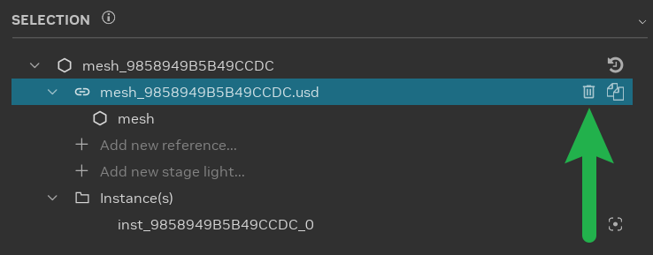
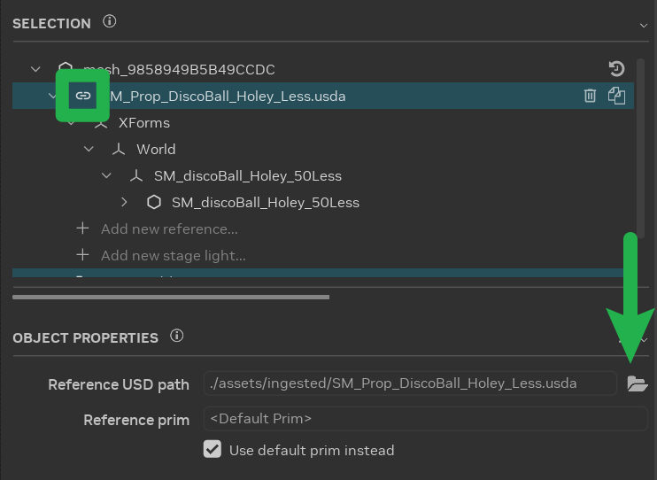
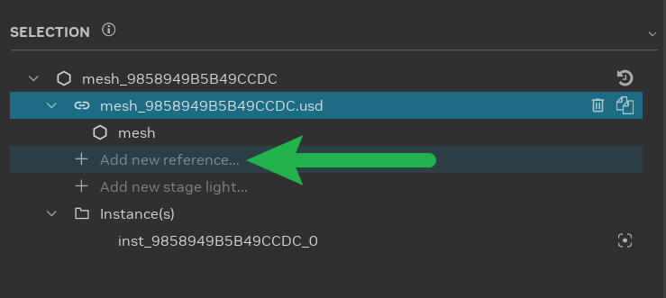
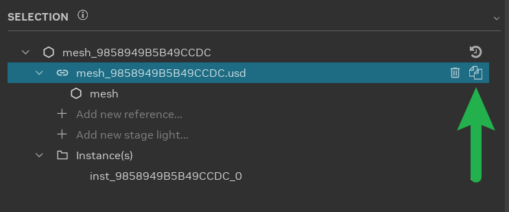
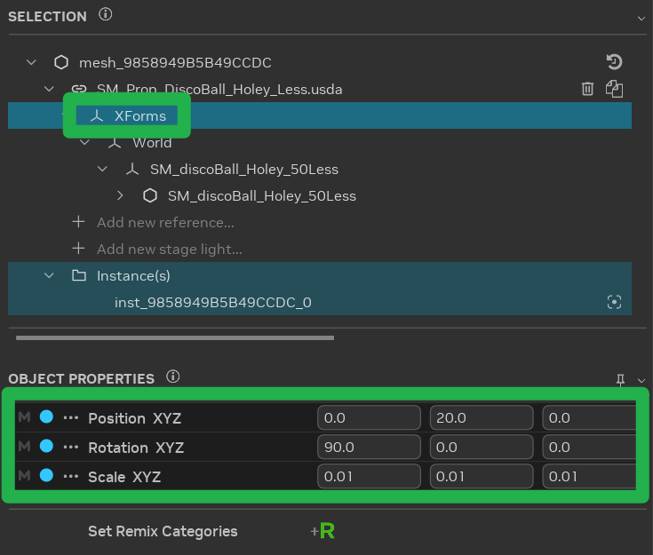

# Setting Up Asset Replacements

Replacing the original game's visuals with modern, higher-quality assets is a key part of using RTX Remix to remaster a
game. Older games often have simpler, lower-detail models. RTX Remix allows modders to upgrade these visuals by
swapping out the original assets with more detailed and modern ones. This process is central to creating a visually
enhanced experience.

```{warning}
**All assets must be ingested into the project directory before they can be used in a mod.**

Refer to the [Ingesting Assets](learning-ingestion.md) section for information on asset ingestion.
```

## Ensuring Hash Stability

Asset replacement requires a stable hash for the asset. This stability ensures the RTX Remix Runtime can accurately
identify the asset and its corresponding replacements.

A hash, a unique identifier derived from the asset's data, serves as a reference for the RTX Remix Runtime to recognize
and manage the asset during gameplay.

Older games frequently exhibit unstable hashes in world geometry in part due to culling mechanisms.

To verify hash stability:

1. **In-Game Debugging:** Within the game, press "Alt+X", navigate to the "Debug" tab under "Rendering", and enable
   "Debug View".
2. **Geometry Hash Verification:** Switch to "Geometry Hash" in the debug view. If the game world displays color
   variations, it indicates hash instability, potentially necessitating workarounds or preventing replacement.

If the hashes appear stable, proceed with asset replacement. If signs of instability are present, consider using
anchor assets as an alternative way to replace assets.

### Using Anchor Assets

In scenarios involving unstable hashes, direct asset replacement may encounter difficulties. To address this, users can
employ "Anchor Assets" as stable, non-culled stand-in assets within the game level. These anchor assets serve as
reliable reference points for the placement of replacement assets, ensuring accurate positioning even when the original
game geometry exhibits hash instability.

The recommended workflow is as follows:

1. **Identify a Suitable Anchor Asset:** Select an asset within the game that is known to have a stable hash and is not
   subject to culling. Ideally, this asset should be a unique prop or element that can be easily identified and
   manipulated.
2. **Remove the Original Asset:** Remove the original asset that exhibits unstable hash behavior, as detailed in the
   [Managing Asset References](#managing-asset-references) section.
3. **Append the Anchor Asset:** Add a reference to the selected anchor asset into the scene, also described in the
   [Managing Asset References](#managing-asset-references) section.
4. **Transform the Anchor Asset:** Position, rotate, and scale the appended anchor asset to the precise location and
   orientation of the original asset that was removed, as detailed in the
   [Adjusting Replaced Assets](#adjusting-replaced-assets) section.
   This step ensures that the replacement asset will occupy the correct space within the game world.

By utilizing anchor assets and following this workflow, users can effectively overcome challenges posed by unstable
hashes and achieve accurate asset placement within their RTX Remix projects.

## Managing Asset References

The RTX Remix Toolkit supports asset removal, replacement, appending, and duplication. The process remains consistent
across these operations, with usage determined by the desired outcome.

```{warning}
Asset removal, addition, or movement in the RTX Remix Toolkit only alters rendering. Game-side events, such as
collisions, remain based on the original asset.
```

1. **Asset Removal:** Remove an asset from the scene without replacement by clicking the "Delete" button in the
   Selection Panel.

   

2. **Asset Replacement:** Select an asset in the scene and choose a replacement asset. Modify the reference in the
   Object Properties panel by clicking the "Browse" button. **This is the most common asset modification.**

   

3. **Asset Appending:** Select an asset in the scene and append a new asset. Select the reference item in the Selection
   Panel, click "Add new reference...", and choose the desired asset.

   

4. **Asset Duplication:** Select an asset in the scene and create a duplicate instance. Select the reference item in the
   Selection Panel and click the "Duplicate" button.

   

5. **Reset Asset Reference:** To revert the asset reference to its original state, click
   the
   {.svg-icon}
   icon located on the topmost item within the [Selection Panel](learning-toolkit.md#selection-panel).

   ```{warning}
   The "Restore all properties" function will reset all properties of the selected asset to their original values. This
   includes the object's transform, any added references, and other modifications.
   ```

## Adjusting Replaced Assets

After replacement, appending, or duplication, adjust asset position, rotation, and scale using the "Transform"
properties in the "Object Properties" panel.



```{tip}
Apply transforms to the "Xforms" prim, available on all ingested assets. Captured assets should have transforms applied
to the "mesh" prim.
```

## Handling Animated Assets

Animated asset replacement varies depending on the game's skeleton animation type.

### Skeleton Animation Types

**GPU-Based Skeleton Animation:** Replace existing 3D assets with new assets sharing the same skeleton. New assets adopt
animations from the original asset's bone transformations.

**Non-GPU-Based Skeleton Animation:** Replacement occurs on the engine side. Re-capture animations post-replacement,
then assign PBR textures in Remix. See the [Setting Up Material Replacements](learning-materials.md) section for more
information on texture replacements.

### Skeletons in Remix

Skinned replacements require expertise.

**Skeleton Data in USD Capture:** Replace 3D assets with assets using the same skeleton.

Considerations:

1. **Bone Indices and Weights:** The runtime reads bone indices and weights per vertex from replacement assets.
2. **Skeleton Changes:** Modeling tools may alter skeletons during import/export, disrupting mapping. Remapping to
   original vertices is supported, but requires manual specification.
3. **Limited Skeleton Information:** The GPU receives information from the bind pose to the current pose, complicating
   bind pose or hierarchy reconstruction.
4. **Differing Joint Counts:** Game skeletons often have fewer joints than replacements. Joint remapping is required.

### Remapping Skeletons

The RTX Remix Toolkit attempts automatic remapping upon adding a replacement skinned mesh with a detected USD skeleton.
Automatic remapping occurs when joints are named identically or are in the same order.

Alternatively, add a `skel:remix_joints` attribute to the bound mesh to specify joint mapping:
`uniform token[] skel:remix_joints = ["root", "root/joint1", "root/joint2", "root/joint3" ...]`.

### Remapping Skeleton Tool

The RTX Remix Toolkit provides a tool for manual joint remapping.

1. Open the [Stage Manager](../toolkitinterface/remix-toolkitinterface-layouttab.md#stage-manager) and navigate to the "
   Skeletons" tab.

   

2. Locate the bound replacement mesh.

3. Click "Remap Joint Indices" to open the remapping tool.

   

4. Select a captured skeleton joint to drive each replacement asset joint. Use "Auto Remap Joints" for name/order-based
   mapping, "Reset" to start from scratch, and "Clear" to undo changes.

5. Click "Apply" to re-author joint influences on the replacement mesh, matching the captured joint index.

***
<sub> Need to leave feedback about the RTX Remix Documentation?  [Click here](https://github.com/NVIDIAGameWorks/rtx-remix/issues/new?assignees=nvdamien&labels=documentation%2Cfeedback%2Ctriage&projects=&template=documentation_feedback.yml&title=%5BDocumentation+feedback%5D%3A+) </sub>
