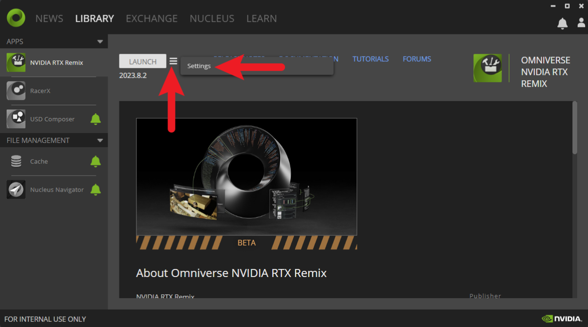
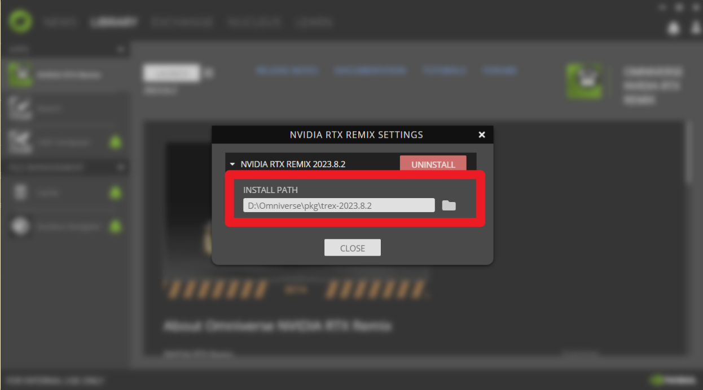
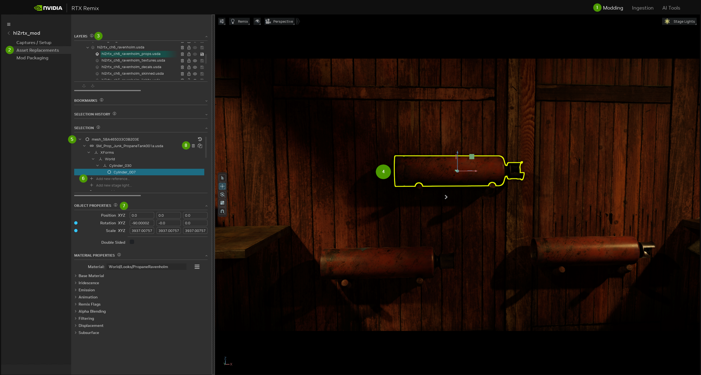
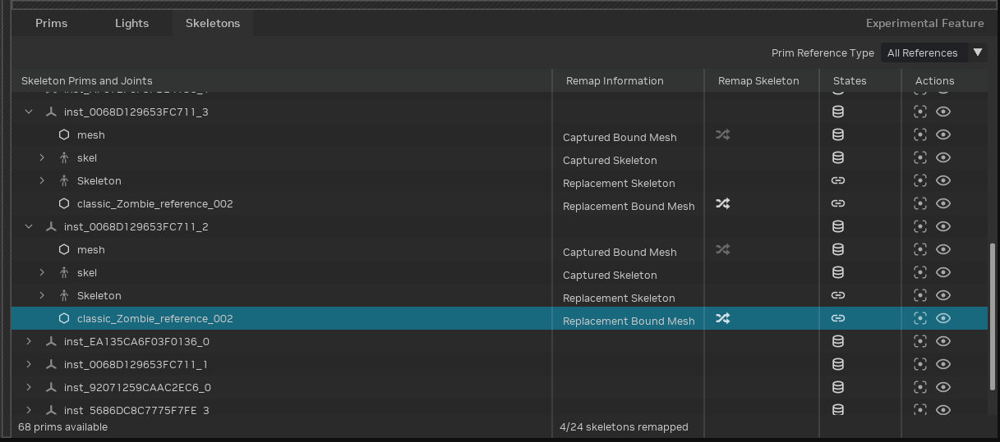
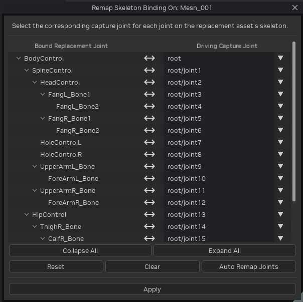

# Introduction to Asset Replacement

**Enhancing Your Game with Remix Assets**

Remix relies heavily on Assets to elevate your gaming experience, forming the core of your creative work. This tutorial focuses on the Asset workflow, sharing some similarities with replacing world textures.

**Best Practices**

Always reference Assets and textures from within the project directory.
Ingested assets (those you bring into the project) should reside inside the project directory. If not, create a symbolic link (symlink) inside the directory.
References to captures or external mods (dependencies) can be streamlined through the "deps" symlink.

**Example**
Instead of referencing a capture at <code>C:\Program Files (x86)\Steam\common\Portal\rtx-remix\captures\capture_01.usd</code>, opt for a cleaner reference: <code>./deps/captures/capture_01.usd</code>. This ensures a more organized and efficient workflow.


## Ingesting an Asset

The RTX Remix Toolkit is your go-to for refining game capture assets by removing specific elements like shaders and texture formats. Follow this step-by-step guide to streamline the process:

1. **Check File Format:** Ensure your asset is in an acceptable format (refer to the [Format Section](../remix-formats.md) for details) and load the asset into Remix.
2. **Access the Ingest Tab:** Open the Remix window and locate the **Ingest** tab on the top right.  Choose the Asset(s) from the vertical left tabs.
3. **Upload Source Asset:** Click the **Add** button under the **Input File Path** panel then upload your source asset file.
4. **Set Output Directory:** Paste a folder link into the output directory bar or browse to the directory using the folder icon.
5. **Specify Asset Format:** Choose the desired asset format (USD, USDA, or USDC).
6. **_[OPTIONAL]_** Set optional parameters such as the _asset scale factor_*.
7. **Add to Queue:** Press the "Add to Queue" button to initiate the cleanup process.
8. **Post-Ingestion Validation:** After the ingestion process, navigate to the validation tab then access a detailed report on your asset ingestion.

> ⚠️ Issues with Ingestion will be highlighted in red with corresponding error messages.

> 📝 All Ingested files, even textures & Assets, will have MetaData files.

### Notes:

`*` Additional information about the asset scale factor can be found in the [Omniverse USD documentation](https://docs.omniverse.nvidia.com/usd/latest/learn-openusd/independent/units.html).

## CLI Asset Ingestion Tool (Advanced)

For advanced users there is a CLI tool that can be used to ingest large batches of assets.

### Finding Install Directory

In order to run the CLI Tool, you will need to know where RTX Remix is installed. Open up the launcher and navigate to the Library > RTX Remix.



Click on the hamburger menu and then Settings to bring up the install path:



### Running CLI Asset Ingestion Tool

Follow these steps to run the CLI Asset Ingestion Tool for customizing your assets:

1. Copy Schema File:
    * Locate the schema file for Model Ingestion:
        <code>YOUR_APP_INSTALL\exts\lightspeed.trex.app.resources\data\validation_schema\model_ingestion.json</code>
    * For Texture Ingestion:
        <code>YOUR_APP_INSTALL\exts\lightspeed.trex.app.resources\data\validation_schema\material_ingestion.json</code>
    * Save the path to this file as SCHEMA_PATH for later reference.
2. Open Schema File in Text Editor:
    * Open the file in a text editor.
    * Update the list of files to ingest in the <code>context_plugin -> data -> input_files</code> (Tip: Use a script to save time).
    * Update the output directory in <code>context_plugin -> data -> output_directory</code>.
    * Save the schema file.
3. Execute Commands in CMD:
    * Open a cmd window.
    * Navigate to the installation location of the app.
    * Execute the following commands:
        ```bat
        lightspeed.app.trex.ingestcraft.cli.bat -s SCHEMA_PATH -ex 1
        ```
4. Note on Arguments:
    * <code>-s</code>: Points to the path of the modified schema file.
    * <code>-e</code>: It specifies extensions to enable.
    * <code>-x--/renderer/mdl/searchPaths/templates</code>: Can be ignored; it indicates where to look for MDLs.
    * <code>-ex</code>: Choose 0 for sequential ingestion (async) or 1 for more stable ingestion on separate threads.
    * <code>-t</code>: Sets a timeout for ingestion (default is 600 seconds).

## Replacing, Adding, or Appending an Asset

**Replacing an Asset**
This involves substituting an existing Asset with a new one.

**Adding an Asset**
Adding an Asset typically refers to incorporating a new Asset alongside existing ones.

**Appending an Asset**
 Appending a Asset implies sequentially adding Assets to a project. For example, you might start with a basic scene and then append additional Assets to enhance or expand the environment.



1. **Access Stage**: Go to the "Modding" tab on the top right.
2. **Select Asset Replacements**: Choose the "Asset Replacements" tab on the left.
3. **Layers**: In the top left, you'll see layers. Select your desired layer as the edit target.
4. **Choose Mesh**: Pick your mesh for replacement.
5. **Selection Tab**: Look at the "Selection" tab, where you'll find the original Asset hash and the converted/captured USD.
6. **Add New Reference**: Click “Add New Reference” and navigate to the ingested Asset to append the new reference.
7. **Adjust Position and Properties**: Modify the positioning, orientation, and scale using "Object Properties", or the viewport gizmo, until it matches the original.
8. You can then safely delete the original captured asset and same that layer.


# Ingesting Asset Textures

1. **Navigate to the Ingest Tab:** Head to the Ingest tab and select "Texture Ingestion."
2. **Add Your Texture:** Click "Add" and effortlessly upload the texture of your choice (supports PNG or DDS formats).
3. **Assign Texture Channel (Optional):**
    * Explore the "convention" dropdown below the input file paths box.
    * Set it to DirectX, OpenGL, or Octahedral based on the encoding type of your input normal map.
    * Assign the texture to one of seven channels: Diffuse, Emissive Mask, Metallic, Normal - OpenGL, Normal - DirectX, Roughness, or Other.
    * Opt for "Other" for a standardized ingestion without altering the name. This step is often automated, but choose "Other" for textures like heightmaps.
4. **Set Output Directory:** Establish an output directory within your project file structure.
5. **Initiate Ingestion:**
    * Click "Run" to kickstart the texture export process.
    * The output directory will contain additional files, but all you need for in-game use is the converted DDS file.


## Replacing an Asset's Texture

1. **Stage**: Access "Stage" and go to the "Asset Replacements" tab.
2. **Layers**: Choose your layer as the edit target.
3. **Select Mesh**: Pick your mesh.
4. **Material Properties**: Look for "Material Properties" at the bottom. Assign textures, adjust settings, and save the layer.


## Translucency

Translucency is handled in the Ingestion process.  If a material has the word “translucent” or “glass” or “trans” in the name, it will be converted automatically into a translucent material.

**Automatic Conversion during Ingestion:**

* If a material has words like "translucent," "glass," or "trans" in its name during the Ingestion process, it will automatically become translucent.
* While an asset is selected in the viewport, access the "material properties" box.
* Click the three lines in the top right of the box to convert a material into a translucent type or vice versa.

**Manual Conversion (If Missed During Ingestion):**

* Select the mesh you want to convert to translucent or opaque.
* In Asset Replacements, find "Material Properties."
* Click the hamburger menu of "Material" and choose "Create Material Override (Translucent)."


## Emissive Elements

**Emissive Textures:** To make parts of an Asset emit light, go to the "emissive" tab, tick "Enable Emission," and assign the Emissive Mask map texture. Adjust the Emissive Intensity value as needed.


## Animated Assets

### Types of Skeleton Animation

**For Games Using GPU-Based Skeleton Animation**
If your game employs GPU-based skeleton animation, you have the option to swap out an existing 3D Asset with a new one that has the same skeleton. The new Assets will seamlessly adopt the animations derived from the original Asset's bone transformations.

**For Games Without GPU-Based Skeleton Animation**
In cases where your game doesn't utilize GPU-based skeleton animation, the process of replacing animated Assets occurs on the engine side. After this replacement, you'll need to capture the animations anew. Once that is done, you can proceed to assign PBR textures in Remix.

### Skeletons in Remix

Skinned replacements require expertise to handle. This process is best suited for experienced users who are comfortable with these intricacies.

Here's how it works:

**Skeleton Data in the USD Capture**: If the 3D Asset you want to replace includes skeleton data, you can create a replacement Asset that uses the same skeleton. This replacement will also be animated.

However, there are some important things to keep in mind:

1. **Bone Indices and Weights:** The runtime of the game only reads bone indices and weights for each vertex from replacement Assets.
2. **Skeleton Changes:** Modeling tools sometimes alter the skeleton during import/export, which can break the mapping if joint order or count changes. The Toolkit supports remapping back to the original vertices, but you will need to specify the mapping manually.
3. **Limited Skeleton Information:** The game's skeleton sent to the GPU contains information only from the bind pose to the current pose. This means we can't reconstruct the bind pose or hierarchy, making skinning more challenging.
4. **Differing Joint Counts:** The game's skeleton often has fewer joints than the higher-poly replacement. In such cases, you'll need to remap the joints.

### Remapping Skeletons

When you first add a new reference to a replacement skinned mesh in the RTX Remix Toolkit, if a skeleton is detected in the USD, it will attempt to automatically remap to the captured skeleton. If the joints are named exactly the same and or they are in the same order, this can happen automatically.

The other strategy is to add a special attribute to your bound mesh that explains how the mesh should be bound to the original skeleton. It will be something like this: `uniform token[] skel:remix_joints = ["root", "root/joint1", "root/joint2", "root/joint3" ...]`. If that attribute exists when the skeleton is brought in, it will be automatically remapped. (Both remix_joints and the canonical `joints` attribute will be checked.)

### Remapping Skeleton Tool

The RTX Remix Toolkit has a remapping tool which will allow you to manually remap the joints once a replacement skeleton is brought in.

1. Select an appropriate edit target layer for mod skeleton data.
1. Open the "Stage Manager" and navigate to the "Skeletons" tab.

1. Locate the bound replacement mesh you want to remap.
1. Click the "Remap Joint Indices" button to open the remapping tool.

1. Select a joint from the captured skeleton that will drive each replacement asset's joint. You can use the "Auto Remap Joints" button to guess the mapping based on joint names and joint order. "Reset" will assign all to root so you can start from scratch. "Clear" will undo any changes and return to the mapping that was last applied.
1. Hit "Apply" and the toolkit will re-author the joint influences on your replacement mesh to match the captured joint index.


## Anchor Assets

**Anchor Assets**: In Remix, there's a situation where some parts of the game's 3D objects can't be easily replaced with new, stable Assets. This problem typically occurs in older games, especially when the game decides not to show certain parts of the game world because the player can't see them. When this happens, it messes with the identification codes (hashes) of these objects, as they move in and out of the player's view.

To fix this issue, you can create a kind of "stand-in" Asset, or as we like to call them, **Anchor Assets**, in the game level. Think of it as an "anchor" that keeps track of where the full Asset replacement should go. You'll have to do this for every occurrence of the object you want to replace. Ideally, you should modify the game's levels to make this work seamlessly. But if that's not possible, you can also use a unique prop (a game object) as long as it's not used anywhere else in the game. This unique prop serves as the anchor for the new Asset, making sure it appears correctly even when parts of the world are hidden from view.

***
<sub> Need to leave feedback about the RTX Remix Documentation?  [Click here](https://github.com/NVIDIAGameWorks/rtx-remix/issues/new?assignees=nvdamien&labels=documentation%2Cfeedback%2Ctriage&projects=&template=documentation_feedback.yml&title=%5BDocumentation+feedback%5D%3A+) </sub>
