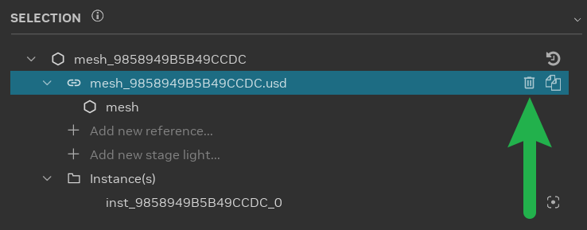
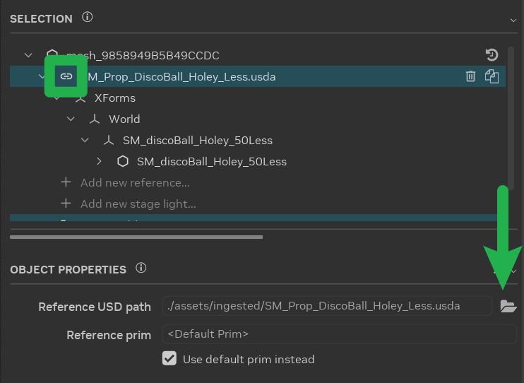
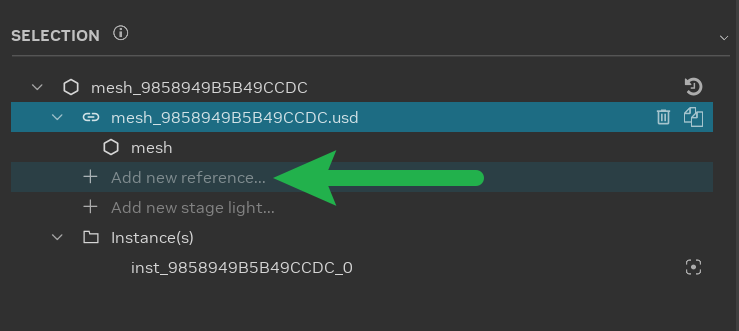
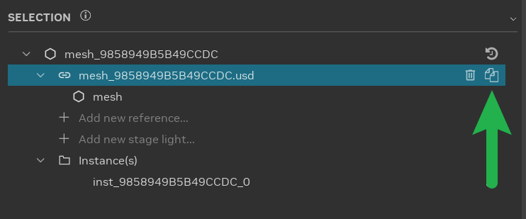
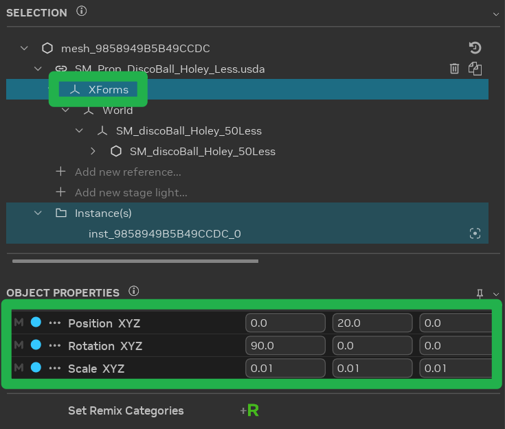
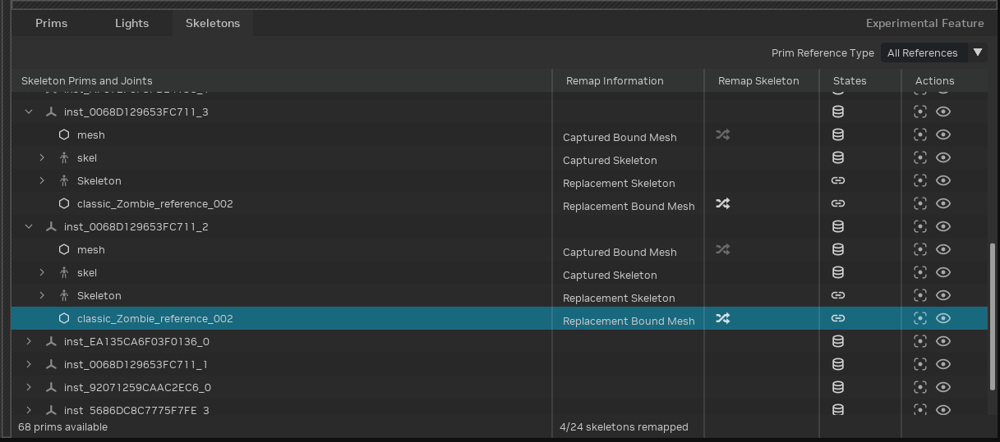
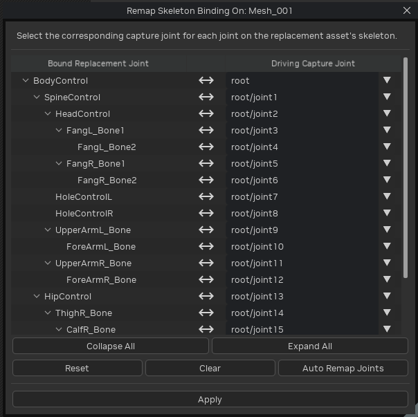

# Setting Up Asset Replacements

Replacing the original game's visuals with modern, higher-quality assets is a key part of using RTX Remix to remaster a
game. Older games often have simpler, lower-detail models. RTX Remix allows modders to upgrade these visuals by
swapping out the original assets with more detailed and modern ones. This process is central to creating a visually
enhanced experience.

```{warning}
**All assets must be ingested into the project directory before they can be used in a mod.**

Refer to the [Ingesting Assets](learning-ingestion.md) section for information on asset ingestion.
```

## Ensuring Hash Stability

Asset replacement requires a stable hash for the asset. This stability ensures the RTX Remix Runtime can accurately
identify the asset and its corresponding replacements.

A hash, a unique identifier derived from the asset's data, serves as a reference for the RTX Remix Runtime to recognize
and manage the asset during gameplay.

Older games frequently exhibit unstable hashes in world geometry in part due to culling mechanisms.

To verify hash stability:

1. **In-Game Debugging:** Within the game, press "Alt+X", navigate to the "Debug" tab under "Rendering", and enable
   "Debug View".
2. **Geometry Hash Verification:** Switch to "Geometry Hash" in the debug view. If the game world displays color
   variations, it indicates hash instability, potentially necessitating workarounds or preventing replacement.

If the hashes appear stable, proceed with asset replacement. If signs of instability are present, consider using
anchor assets as an alternative way to replace assets.

### Using Anchor Assets

In scenarios involving unstable hashes, direct asset replacement may encounter difficulties. To address this, users can
employ "Anchor Assets" as stable, non-culled stand-in assets within the game level. These anchor assets serve as
reliable reference points for the placement of replacement assets, ensuring accurate positioning even when the original
game geometry exhibits hash instability.

The recommended workflow is as follows:

1. **Identify a Suitable Anchor Asset:** Select an asset within the game that is known to have a stable hash and is not
   subject to culling. Ideally, this asset should be a unique prop or element that can be easily identified and
   manipulated.
2. **Remove the Original Asset:** Remove the original asset that exhibits unstable hash behavior, as detailed in the
   [Managing Asset References](#managing-asset-references) section.
3. **Append the Anchor Asset:** Add a reference to the selected anchor asset into the scene, also described in the
   [Managing Asset References](#managing-asset-references) section.
4. **Transform the Anchor Asset:** Position, rotate, and scale the appended anchor asset to the precise location and
   orientation of the original asset that was removed, as detailed in the
   [Adjusting Replaced Assets](#adjusting-replaced-assets) section.
   This step ensures that the replacement asset will occupy the correct space within the game world.

By utilizing anchor assets and following this workflow, users can effectively overcome challenges posed by unstable
hashes and achieve accurate asset placement within their RTX Remix projects.

## Managing Asset References

The RTX Remix Toolkit supports asset removal, replacement, appending, and duplication. The process remains consistent
across these operations, with usage determined by the desired outcome.

```{warning}
Asset removal, addition, or movement in the RTX Remix Toolkit only alters rendering. Game-side events, such as
collisions, remain based on the original asset.
```

1. **Asset Removal:** Remove an asset from the scene without replacement by clicking the "Delete" button in the
   Selection Panel.

   

2. **Asset Replacement:** Select an asset in the scene and choose a replacement asset. Modify the reference in the
   Object Properties panel by clicking the "Browse" button. **This is the most common asset modification.**

   

3. **Asset Appending:** Select an asset in the scene and append a new asset. Select the reference item in the Selection
   Panel, click "Add new reference...", and choose the desired asset.

   

4. **Asset Duplication:** Select an asset in the scene and create a duplicate instance. Select the reference item in the
   Selection Panel and click the "Duplicate" button.

   

5. **Reset Asset Reference:** To revert the asset reference to its original state, click the **Restore all Properties**  icon located on the topmost item within the [Selection Panel](learning-toolkit.md#selection-panel).

   ```{warning}
   The "Restore all properties" function will reset all properties of the selected asset to their original values. This
   includes the object's transform, any added references, and other modifications.
   ```

## Adjusting Replaced Assets

After replacement, appending, or duplication, adjust asset position, rotation, and scale using the "Transform"
properties in the "Object Properties" panel.



To set all three axes to the same value, click either link icon between the X, Y, and Z fields for **Position**,
**Rotation**, or **Scale**. Enabling the link immediately copies that object's X value to Y and Z. For multiple selected
objects, each object uses its own X value. Both links, the row, and label become highlighted to indicate that grouped
editing is active. The first axis receives inline keyboard focus and is selected for immediate typing without moving any
field out of the row. Typing a value or dragging any field applies that value equally to all three axes. While grouped
editing remains active, double-click any axis field to edit that field directly. Click either link again, or link another
transform row, to return to editing one axis at a time without changing the current values.

```{tip}
Apply transforms to the "Xforms" prim, available on all ingested assets. Captured assets should have transforms applied
to the "mesh" prim.
```

## Handling Animated Assets

Animated asset replacement varies depending on the game's skeleton animation type.

### Skeleton Animation Types

**GPU-Based Skeleton Animation:** Replace existing 3D assets with new assets sharing the same skeleton. New assets adopt
animations from the original asset's bone transformations.

**Non-GPU-Based Skeleton Animation:** Replacement occurs on the engine side. Re-capture animations post-replacement,
then assign PBR textures in Remix. See the [Setting Up Material Replacements](learning-materials.md) section for more
information on texture replacements.

### Skeletons in Remix

Skinned replacements require expertise.

**Skeleton Data in USD Capture:** Replace 3D assets with assets using the same skeleton.

Considerations:

1. **Bone Indices and Weights:** The runtime reads bone indices and weights per vertex from replacement assets.
2. **Skeleton Changes:** Modeling tools may alter skeletons during import/export, disrupting mapping. Remapping to
   original vertices is supported, but requires manual specification.
3. **Limited Skeleton Information:** The GPU receives information from the bind pose to the current pose, complicating
   bind pose or hierarchy reconstruction.
4. **Differing Joint Counts:** Game skeletons often have fewer joints than replacements. Joint remapping is required.

### Remapping Skeletons

The RTX Remix Toolkit attempts automatic remapping upon adding a replacement skinned mesh with a detected USD skeleton.
Automatic remapping occurs when joints are named identically or are in the same order.

Alternatively, add a `skel:remix_joints` attribute to the bound mesh to specify joint mapping:
`uniform token[] skel:remix_joints = ["root", "root/joint1", "root/joint2", "root/joint3" ...]`.

### Remapping Skeleton Tool

The RTX Remix Toolkit provides a tool for manual joint remapping.

1. Open the [Stage Manager](../toolkitinterface/remix-toolkitinterface-layouttab.md#stage-manager) and navigate to the "
   Skeletons" tab.

   

2. Locate the bound replacement mesh.

3. Click "Remap Joint Indices" to open the remapping tool.

   

4. Select a captured skeleton joint to drive each replacement asset joint. Use "Auto Remap Joints" for name/order-based
   mapping, "Reset" to start from scratch, and "Clear" to undo changes.

5. Click "Apply" to re-author joint influences on the replacement mesh, matching the captured joint index.

## Converting Alpha Cards to Mesh (Experimental)

Alpha-tested foliage cards are expensive to path trace because every ray that crosses the transparent part of a card
still runs the alpha test. The experimental **Convert Alpha Cards to Mesh** action cuts the card geometry along the
alpha channel of its diffuse texture so only the opaque area remains.

1. In the **Stage Manager**, right-click a capture mesh or instance and choose
   **Experimental** > **Convert Alpha Cards to Mesh**. The **Convert Alpha Cards to Mesh** window opens with the
   selected prototype. While the window stays open it follows the selection, so picking another capture mesh
   makes that one the mesh up for conversion.
2. Pick an **Output Folder**. It defaults to `assets/ingested/alpha_cutout` inside the project. The mesh produces one
   `cutout_<HASH>.usda` file with an ingestion sidecar, so the replacement passes the packaging checks.
3. Adjust the **Parameters** and click **Convert**:
   - **Alpha threshold** is the alpha value at or above which a texel counts as opaque.
   - **Trace resolution** is the size of the mask that is traced. Higher values follow the texture more closely and
     produce more triangles.
   - **Simplify tolerance** and **Minimum island area** reduce the triangle count by smoothing the outline and dropping
     specks.
   - **Edge margin** grows the outline so bilinear filtering at the edge is not clipped. Use `0` when alpha testing is
     disabled, because the cut edge then is the visible silhouette.
   - **Minimal vertex outline** connects the traced cutoff with the fewest points that stay within the simplify
     tolerance. It is on by default, costs a little time and typically saves 5 to 20 percent of the outline
     vertices compared with the greedy pass, so raising the trace resolution and tuning the tolerance is the way to trade accuracy for
     triangles.
   - **Disable alpha test on the generated material** authors the opaque alpha state on the material copy so the
     runtime renders the cut mesh as fully opaque geometry.
   - **Thicken mesh** extrudes the cut mesh backwards, against the surface normal, by **Thickness** mesh units.
     Every outline edge gets two triangles. **Back face** closes the extrusion with a reversed copy of the front;
     turning it off keeps only the sides, which gives the illusion of thickness at a fraction of the polygons
     because a double-sided capture still shows its front face from behind. **UV anti-stretch** textures the
     sides with the band of the texture just inside the outline instead of smearing the edge texel.
   - The **Normals** section holds **Smooth normals**, which blends the normals of the thickened mesh towards the
     average around each position by **Smoothing** so the rim shades rounded instead of creased, and
     **Up-facing normals**, which blends every vertex normal towards the stage up axis by **Up amount**. A card is a flat
     plane, so every card shades by its own tilt and a canopy reads as a pile of differently lit planes; bending
     the normals up makes the canopy shade like one lit volume. The up direction is taken in the prototype's own
     space, so rotated instances are not accounted for.

**Replacement meshes.** The action also works on a replacement mesh made in a DDC tool. The window then lists
every mesh of the replacement file that has a diffuse texture, ticked for conversion; untick the ones to keep. The
cutout is written next to the original as `<name>_cutout_replacement<ext>`, so the output field is locked, and the
original file is never overwritten. The reference of the replacement is pointed at the cutout file on the same
prim, so material and transform overrides keep applying, and converting again with other settings starts from the
original file.

The conversion masks the capture reference of each mesh on the current edit target layer and references the generated
file instead, like a regular mesh replacement. Converting the same mesh again with other parameters overwrites its file
and keeps the existing reference, so you can tune the settings until the result looks right. One undo reverts the stage
edits of a run; the generated files stay on disk.

Each generated file carries its own copy of the captured material, named `AlphaCutoutMaterial`, with the composed
values at conversion time. Later edits to the captured material do not propagate to converted meshes; convert again to
refresh the copy. The runtime reads the alpha test type as a raw integer, so the copy stores `7` for *always pass*,
which the material property panel labels as *Greater Or Equal*.

Skinned meshes and meshes without texture coordinates or a diffuse texture are skipped and listed in the **Results**
section. Animated captures convert their first time sample.

***
<sub> Need to leave feedback about the RTX Remix Documentation?  [Click here](https://github.com/NVIDIAGameWorks/rtx-remix/issues/new?assignees=nvdamien&labels=documentation%2Cfeedback%2Ctriage&projects=&template=documentation_feedback.yml&title=%5BDocumentation+feedback%5D%3A+) </sub>
