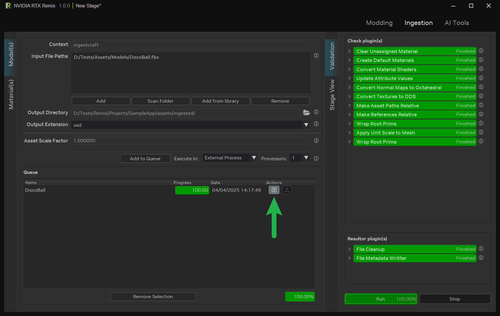

# Ingesting Assets

The ingestion process is a fundamental step in preparing assets for use within RTX Remix. It involves the conversion and
optimization of meshes and textures to ensure compatibility with the RTX Remix Runtime.

Assets can be ingested via the RTX Remix Ingest Tab. The procedure remains consistent whether ingesting a model or a
texture.

For advanced users, a Command Line Interface (CLI) tool is available to facilitate batch processing of assets, providing
enhanced customization and control over the ingestion process.

```{note}
All ingested files, including source and processed files, are accompanied by Metadata files to track the ingestion
state. Consequently, any modification to a source asset necessitates re-ingestion to update the processed asset.
```

***

## Ingesting an Asset Through the UI

1. **File Format Verification:** Confirm that the asset is in an acceptable format (refer to
   the [File Format Compatibility](learning-ingestion.md#file-format-compatibility) section for details) before loading
   the asset into Remix.

2. **Accessing the Ingest Tab:** Open the Remix window and navigate to the **Ingestion** tab located in the top right
   corner. Select the _**Model(s)** Tab_[*](#notes) from the vertical tabs in the top left corner.

   

3. **Source Asset Upload:** Click the **Add** button within the **Input File Path** panel to upload the source asset
   file. Alternatively, drag and drop files into the panel.

   ```{tip}
   For the Input File Paths to be considered valid during asset import, the list must include at least one file.
   ```

4. **Output Directory Specification:** An output directory (`<PROJECT DIRECTORY>/assets/ingested`) is automatically
   assigned by default. This value can be modified by updating the corresponding field.

5. **Asset Format Selection:** Choose the desired asset format: USD, USDA, or USDC.

   ```{tip}
   The default format, USD, is recommended for most scenarios due to its optimal balance of compatibility and
   performance.

   USDA is recommended for debugging and development purposes, as it is a human-readable format that can be readily
   edited.
   ```

6. **_[OPTIONAL]_** Configure optional parameters, such as the _Asset Scale Factor_[**](#notes) for models.

7. **Queue the Asset:** Click the "Add to Queue" button to initiate the ingestion process.

```{tip}
Following the ingestion process, navigate to the validation tab to access a detailed report on the asset ingestion.
Any issues encountered during ingestion are highlighted in red, accompanied by relevant error messages.


```

### Notes:

* `*` **Asset(s) Tab:** Textures can be ingested similarly to models using the **Material(s)** vertical tab. The primary
  distinction lies in the requirement for each ingested texture to have an assigned texture type for proper processing.
* `**` **Asset Scale Factor**: Additional information regarding the asset scale factor can be found in
  the [Omniverse USD documentation](https://docs.omniverse.nvidia.com/usd/latest/learn-openusd/independent/units.html).

***

## Utilizing the Ingestion Tool CLI (Advanced)

Advanced users can leverage the CLI tool for batch ingestion of assets.

### Locating the Installation Directory

To execute the CLI Tool, the RTX Remix installation directory must be identified.

Refer to
the [How can I locate the RTX Remix Toolkit Installation Folder?](../remix-faq.md#how-can-i-locate-the-rtx-remix-toolkit-installation-folder)
section of the documentation for instructions on locating the RTX Remix install directory.

### Executing the CLI Asset Ingestion Tool

Follow these steps to execute the CLI Asset Ingestion Tool for asset customization:

1. **Locating the Schema File:**
    * Locate the schema file for Model Ingestion:
       <code>
       [<INSTALL_DIRECTORY>](../remix-faq.md#how-can-i-locate-the-rtx-remix-toolkit-installation-folder)\exts\lightspeed.trex.app.resources\data\validation_schema\model_ingestion.json
       </code>
    * For Texture Ingestion:
       <code>
       [<INSTALL_DIRECTORY>](../remix-faq.md#how-can-i-locate-the-rtx-remix-toolkit-installation-folder)\exts\lightspeed.trex.app.resources\data\validation_schema\material_ingestion.json
       </code>
    * Save the path to this file as `SCHEMA_PATH` for subsequent reference.

2. **Editing the Schema File:**
    * Open the file in a text editor.
    * Update the list of files to ingest within `context_plugin -> data -> input_files` (scripting this step is
      recommended for efficiency).
    * Modify the output directory in `context_plugin -> data -> output_directory`.
    * Save the schema file.

3. **Command Execution:**
    * Open a command prompt window.
    * Navigate to the application's installation directory.
    * Execute the following commands:
        ```bat
        lightspeed.app.trex.ingestcraft.cli.bat -s <SCHEMA_PATH> -ex 1
        ```

4. **Argument Notes:**
    * `-s`: Specifies the path to the modified schema file.
    * `-e`: Enables specified extensions.
    * `-x--/renderer/mdl/searchPaths/templates`: Allows you to override where the cli will look for mdl files.
    * `-ex`: Select 0 for sequential ingestion (asynchronous) or 1 for multi-threaded ingestion.
    * `-t`: Sets the ingestion timeout (default is 600 seconds).

***

## File Format Compatibility

Before assets can be used in mods, they need to go through an "ingestion" process. This process optimizes the assets for
the RTX Remix renderer. Understanding the compatible input and output formats for this process is crucial.

### Input Formats

These are the file formats that can be used as source material for the ingestion process.

#### Model Formats

| Extension | Format                        | Description                                 |
|:----------|:------------------------------|:--------------------------------------------|
| `.fbx`    | Autodesk FBX Interchange File | Common 3D model format.                     |
| `.obj`    | Object File Format            | Another common 3D model format.             |
| `.gltf`   | GL Transmission Format File   | Format for 3D scene descriptions.           |
| `.lxo`    | Foundry MODO 3D Image Format  | Format used by Foundry MODO for 3D content. |

#### Texture Formats

| Extension | Format                            | Description                            |
|:----------|:----------------------------------|:---------------------------------------|
| `.bmp`    | Bitmap Image File                 | Common image format.                   |
| `.dds`    | DirectDraw Surface                | Format for textures and environments.  |
| `.gif`    | Graphical Interchange Format File | Web format for images.                 |
| `.hdr`    | High Dynamic Range Image File     | Format for high dynamic range images.  |
| `.pgm`    | Portable Gray Map                 | Format for grayscale images.           |
| `.jpg`    | Joint Photographic Experts Group  | Common compressed image format.        |
| `.pic`    | PICtor raster image format        | Image format historically used in DOS. |
| `.png`    | Portable Network Graphics File    | Common lossless image format.          |
| `.ppm`    | Adobe Photoshop Document          | Native format for Photoshop documents. |

### Output Formats

These are the file formats that assets are converted to after the ingestion process, ready for use in the mod.

#### Model Formats

| Extension | Format                               | Description                                                                                 |
|:----------|:-------------------------------------|:--------------------------------------------------------------------------------------------|
| `.usd`    | Universal Scene Description (Binary) | Standard format for 3D scenes and assets, efficient for storage and processing.             |
| `.usda`   | Universal Scene Description (ASCII)  | Text-based format for USD, useful for debugging but less efficient.                         |
| `.usdc`   | Universal Scene Description (Crate)  | Optimized binary format for USD, preferred for performance in asset storage and production. |

#### Texture Formats

| Extension | Format             | Description                                                                 |
|:----------|:-------------------|:----------------------------------------------------------------------------|
| `.dds`    | DirectDraw Surface | Microsoft DirectX format for textures and environments, optimized for GPUs. |

***
<sub> Need to leave feedback about the RTX Remix Documentation?  [Click here](https://github.com/NVIDIAGameWorks/rtx-remix/issues/new?assignees=nvdamien&labels=documentation%2Cfeedback%2Ctriage&projects=&template=documentation_feedback.yml&title=%5BDocumentation+feedback%5D%3A+) </sub>