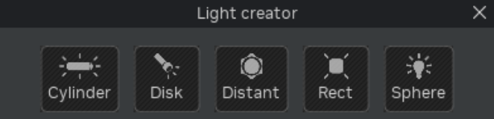

# Relight a Game

Remix uses a fully physically-based renderer, which means that lighting is simulated more realistically than what games tend to do. This means that the ideal lighting setup can be somewhat different compared to typical game engines.

Remix supports both primitive lights as well as emissive meshes. Primitive lights are light entities defined based on one of a set of simple geometric primitives; they emit light but aren’t themselves visible in the scene. Emissive meshes are regular, textured meshes with an emissive mask applied to them that causes all or part of their surface to become emissive and can emit light that is colored based on a texture map.

```{seealso}
You can review more lighting details by looking at the [Lighting Toolkit Interface](../toolkitinterface/remix-toolkitinterface-lighting.md) and/or the [Lighting Runtime Interface](../runtimeinterface/renderingtab/remix-runtimeinterface-rendering-lighting.md) interface option for the RTX Remix Toolkit application.
```

## How to pick the right light

Generally speaking, primitive lights are good at lighting a scene, while emissive meshes are good at making objects look “bright”.

As a rule of thumb, the overall lighting of a scene should come from primitive lights and not emissive meshes. Both primitive lights as well as emissive meshes will cast light in a physically correct way, so their behavior is similar. However, primitive lights are sampled much more efficiently by the Remix renderer, resulting in both higher performance and lower noise when compared to emissive meshes. Whenever a primitive light can do the job, it should be preferred.

Use emissive meshes for detail lighting, making objects such as computer monitors glow.

Light fixtures benefit from using both types of lights. A fluorescent tube light fixture could be represented as a rectangular primitive light that covers the fixture and emits light in the same general direction, while the fluorescent tube itself could be modeled as a cylindrical emissive mesh. This way the fixture looks and feels like the real thing (the fluorescent tube is bright, you get light reflecting into the fixture and illuminating it, along with light bloom, etc) but the renderer will be able to mostly sample the primitive light for illuminating the scene itself, resulting in less overall noise and better performance.


## How to use Primitive lights



Remix provides five types of primitive lights: cylinder, disc, rectangular, sphere, and distant lights.

**Step 1: Select Your Mesh**

Select the mesh you want to append the light source to

**Step 2: Add New Stage Light**


Navigate to the "Selection" tab and click on "Add New Stage Light." This opens up the options to choose the type of light you want to add.

### Primitive Light Types

1. **Cylinder, Disc, Rectangular, Sphere Lights:**
    * These lights are based on simple geometric shapes.
    * They define a shape that emits light, either uniformly or along a primary direction.
    * Ideal for creating specific lighting effects on surfaces.
2. **Distant Lights:**
    * Represent directional light coming from an infinite distance.
    * Commonly used to simulate light sources like the Sun.

### Light Shaping in Remix

Remix also supports light shaping, allowing you to control the direction of light emitted from certain primitive light types - sphere lights, disk lights, and rect lights. This feature lets you create convincing effects, like a flashlight, using just a single sphere light.

### RTX Remix Conversion
When using RTX Remix, all base game lighting converts to path traced lights. This means:

* Point lights become sphere lights.
* Spot lights transform into sphere lights with light shaping applied.
* Directional lights turn into distant lights in Remix.

### Understanding Light Intensity
Light intensity values in Remix are measured in **radiance**, a physical unit determining the amount of light emitted per unit area. Larger lights with the same radiance emit more light compared to smaller ones. For distant lights, radiance measures how much light arrives at a surface in the world, not how much light is emitted.

It is preferable to use light radiance values around 1.0 to increase precision when rendering. Both the overall radiance used as well as the exposure values set in the tonemapper will influence the final result, so adjusting radiance ranges for lights should go together with adjusting tonemapper exposure. Note that tonemapper settings are global for the entire game: they affect both captured as well as replaced lights, and are applied identically to every scene in the game.

When capturing lights from the original game, Remix will determine radiance for each light based on the values the game is using, so you may see relatively high values for radiance on captured lights. When replacing lighting in the game, you may have to stay within a similar range for replacement lights if you want to also use some of the original lights from the game. In practice, radiance values up to around 1000 tend to work reliably, but going over 10000 can generate lighting artifacts.

Sphere lights are generally the most efficient type of primitive light, followed by rectangular, disk and finally cylinder lights. In most cases the shape of the emitter will determine the type of light required, but in cases where multiple light types can work, consider choosing the most efficient type first.


## Using Emissive Meshes

Remix supports emissive meshes, which are regular geometric meshes where all or part of the surface becomes a light source (determined by an emissive map). They emit light based on the surface color, which can be uniform or textured.

Both emissive meshes and primitive lights cast light around the scene in a similar way, meaning both direct and indirect lighting works similarly for both. Emissives do not participate in volumetric lighting, however, so some effects that depend on that (such as particle lighting) will behave differently.

However, light sampling in the renderer for emissive meshes is done differently than for primitive lights — they are essentially sampled randomly over the surface of the mesh. This means that a mesh that is fully emissive will be sampled more efficiently than a mesh where only a small part is emissive (since random samples may hit non-emissive parts of the mesh and be discarded). In such cases, it is preferable to split the emissive part into a separate mesh.

```{note}
Emissive meshes will generally require more GPU time and can generate more noise in the scene compared to primitive lights.
```

Emissive meshes should be used for “bright” objects that mostly cast light locally, such as monitors that create glow on a desk but don’t significantly contribute to lighting up the room they’re in. If an emissive object is intended to light up a larger area, consider coupling it with a primitive light.

Translucent materials can be emissive as well. A filament light bulb could be modeled by making both the filament as well as the glass surface emissive, to allow it to cast light into the fixture efficiently (and coupled with a sphere primitive light to illuminate the scene itself).

The Remix runtime exposes a setting (rtx.emissiveIntensity), which acts as a scale factor for light emitted from emissive meshes. It is often used by modders to adjust the overall lighting levels in a scene, and will apply to replacements as well. Be aware of this setting when working with existing mods, as well as when sharing configuration files across your modding team, as it can drastically change the lighting in your game.

## General Best Practices

Using a large number of lights can increase noise, as it makes it harder for the renderer to pick the best light samples when computing lighting. The same can happen when there are many occluded lights in a given area — this is generally OK for small areas (e.g., under a desk or behind a crate), but can be problematic for larger areas.
Conversely, having too few lights in an area can also increase noise, as the renderer is forced to rely on longer lighting paths. This can be unavoidable in areas meant to be indirectly lit.

Very thin geometry or detailed curvature on shiny surfaces or glass may cause lighting to become noisy. This is because camera jitter (used for AA and upscaling) can throw off the denoiser in these cases, as Remix loses the ability to track that geometry across frames.

Avoid having light sources intersect other geometry in the scene. Sampling becomes much less efficient if portions of a light are occluded.

***
<sub> Need to leave feedback about the RTX Remix Documentation?  [Click here](https://github.com/NVIDIAGameWorks/rtx-remix/issues/new?assignees=nvdamien&labels=documentation%2Cfeedback%2Ctriage&projects=&template=documentation_feedback.yml&title=%5BDocumentation+feedback%5D%3A+) </sub>
