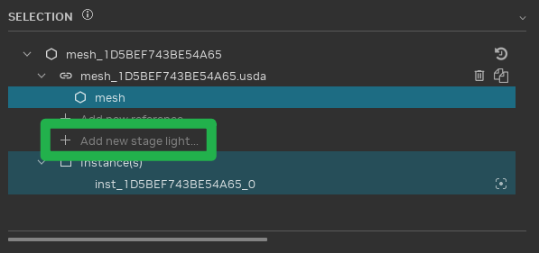

# Relighting a Game

In RTX Remix, achieving an optimal lighting setup may require a different approach compared to typical game engines.
This is because RTX Remix simulates lighting with greater realism than many games. Consequently, modifying the game's
original lighting setup may be necessary to produce the best visual results.

Remix supports two primary types of light sources: **primitive lights** and **emissive meshes**.

**Primitive lights** are light entities based on simple geometric shapes. They emit light but are not visible objects
themselves.

**Emissive meshes** are standard, textured meshes with an emissive mask applied, causing all or part of their surface to
emit light. The emitted light can be colored based on a texture map.

***

## Selecting the Appropriate Light Type

When choosing between primitive lights and emissive meshes, consider these guidelines:

Primitive lights generally excel at illuminating a scene, while emissive meshes are effective at making objects
appear "bright".

As a general rule, the overall illumination of a scene should primarily originate from primitive lights, not emissive
meshes. While both types of light sources cast light in a physically accurate manner and exhibit similar behavior,
primitive lights are sampled much more efficiently by the Remix renderer. This efficiency translates to improved
performance and reduced noise compared to emissive meshes. Therefore, primitive lights should be preferred whenever they
can adequately fulfill the lighting requirements.

Emissive meshes are best utilized for detail lighting, such as creating the glow of computer monitors.

Light fixtures can benefit from a combination of both light types. For example, a fluorescent tube light fixture could
be represented by a rectangular primitive light to cover the fixture's area and emit light in the appropriate direction.
Simultaneously, the fluorescent tube itself could be modeled as a cylindrical emissive mesh. This combination accurately
replicates the appearance and feel of the real-world fixture, including the tube's brightness, light reflection within
the fixture, and light bloom, while enabling the renderer to efficiently sample the primitive light for scene
illumination, minimizing noise and maximizing performance.

***

## Utilizing Primitive Lights

1. **Mesh Selection:** In the "Selection" panel, select the mesh to which the light source will be added.

2. **Stage Light Addition:** Click the "Add new stage light..." entry to open the light creation dialog.

   

   RTX Remix offers five types of primitive lights: cylinder, disc, rectangular, sphere, and distant lights.

   

### Primitive Light Types

1. **Cylinder, Disc, Rectangular, and Sphere Lights:**
    * These lights are based on fundamental geometric shapes.
    * They define a shape that emits light, either uniformly or in a specific direction.
    * They are ideal for generating precise lighting effects on surfaces.
2. **Distant Lights:**
    * These lights represent directional light originating from an infinite distance.
    * They are commonly used to simulate light sources such as the Sun.

### Light Shaping in Remix

RTX Remix supports light shaping, enabling control over the direction of light emitted from certain primitive light
types, including sphere lights, disk lights, and rectangular lights. This capability allows for the creation of
compelling effects, such as a flashlight beam, using only a single sphere light.

### Understanding Light Intensity

Light intensity values in Remix are measured in **radiance**, a physical unit that quantifies the amount of light
emitted per unit area. Larger lights with the same radiance value emit more total light than smaller lights. For distant
lights, radiance represents the amount of light arriving at a surface, not the amount emitted by the source.

For optimal rendering precision, it is recommended to use light radiance values around 1.0. The final lighting result is
influenced by both the light radiance values and the exposure settings of the tonemapper. Therefore, adjusting light
radiance ranges should be performed in conjunction with adjusting tonemapper exposure. Note that tonemapper settings are
applied globally across the entire game, affecting both captured and replacement lights uniformly in every scene.

When capturing lights from the original game, Remix determines the radiance of each light based on the game's internal
values. As a result, captured lights may exhibit relatively high radiance values. When replacing lighting in the game,
it may be necessary to use similar radiance ranges for replacement lights to maintain consistency with any remaining
original lights. In practice, radiance values up to approximately 1000 generally produce reliable results, while values
exceeding 10000 may introduce lighting artifacts.

Sphere lights are generally the most efficient type of primitive light, followed by rectangular, disk, and cylinder
lights. While the shape of the emitter often dictates the required light type, selecting the most efficient light type
should be prioritized when multiple options are viable.

***

## Utilizing Emissive Meshes

Remix supports emissive meshes, which are standard geometric meshes that emit light from all or part of their surface,
as defined by an emissive map. These meshes emit light based on their surface color, which can be uniform or textured.

Emissive meshes and primitive lights illuminate the scene in a similar manner, producing comparable direct and indirect
lighting effects. However, emissive meshes do not contribute to volumetric lighting. Consequently, effects that rely on
volumetric lighting, such as particle lighting, may behave differently.

The renderer samples emissive meshes differently than primitive lights. Emissive meshes are sampled randomly across
their surface. This means that a fully emissive mesh will be sampled more efficiently than a mesh with only a small
emissive area, as random samples may fall on non-emissive parts of the latter. In such cases, it is preferable to
separate the emissive portion into a distinct mesh.

```{warning}
Emissive meshes generally require more GPU processing and can introduce more noise into the scene compared to primitive
lights.
```

Emissive meshes are best suited for representing "bright" objects that primarily cast light locally, such as computer
monitors that create a glow on a desk but contribute minimally to the overall room lighting. If an emissive object is
intended to illuminate a larger area, it is advisable to combine it with a primitive light.

Translucent materials can also be emissive. For example, a filament light bulb could be modeled by making both the
filament and the glass surface emissive. This approach would allow the bulb to efficiently cast light into the fixture (
and can be combined with a sphere primitive light to illuminate the scene itself).

The Remix Runtime provides a setting (`rtx.emissiveIntensity`) that acts as a scaling factor for light emitted from
emissive meshes. Modders frequently use this setting to adjust overall lighting levels within a scene. It is important
to be aware of this setting when working with existing mods or collaborating on configuration files, as it can
significantly alter the lighting in the game.

***

## Captured Lights Conversions

During scene capture, all original game lighting is converted to path-traced lights. This conversion results in the
following transformations:

* Point lights become sphere lights.
* Spotlights are transformed into sphere lights with light shaping.
* Directional lights are converted to distant lights in Remix.

***
<sub> Need to leave feedback about the RTX Remix Documentation?  [Click here](https://github.com/NVIDIAGameWorks/rtx-remix/issues/new?assignees=nvdamien&labels=documentation%2Cfeedback%2Ctriage&projects=&template=documentation_feedback.yml&title=%5BDocumentation+feedback%5D%3A+) </sub>
