# Using Remix Logic

## Overview

Remix Logic introduces a powerful paradigm to alter the graphics for remix mods based on detected game events.

Once a game has been remastered, modders often want to make the replacement content react to the state of the game. The Remix Logic system provides a flexible way to sense what's happening in the game, make decisions based on that information, and then apply visual changes accordingly. This unlocks a whole new layer of dynamic visuals. At launch, this feature will support applying RtxOption config files ("conf files"), and blending between them based on game events that are detected.

```{seealso}
- [Component Reference](../components/index.md) - Full documentation for all Logic Components
- [Remix Logic Runtime Documentation](https://github.com/NVIDIAGameWorks/dxvk-remix/blob/main/documentation/RemixLogic.md) - Runtime implementation details in the DXVK Remix repository
```

### Examples

Here are some of the things you can achieve with the system.

*   When a user aims down sights with a weapon that decreases the FOV, enable night vision mode

*   When a user walks outside, global fog levels change to simulate a weather or atmospheric change

*   When a user turns on a device, enemies begin to emit particles

*   When a user presses a hotkey, turn on a flashlight

### Current Limitations

The initial Logic release focuses on RtxOption layer actions. Some capabilities are planned but not yet available:

*   **Per-light and per-mesh modifications**: Logic cannot yet modify individual light or material properties at runtime. Only global RtxOptions can be changed.

*   **Cross-hierarchy sensing**: Sense nodes can only target meshes within the same mesh_HASH hierarchy as the graph's anchor. To detect a different mesh, attach a separate graph to that mesh.

***

# Quickstart

## Key Concepts

Before diving in, here are the essential terms you'll encounter:

**Components** (also called **Nodes**): The building blocks of Logic. Each Component is a self-contained function that takes inputs, processes them, and produces outputs. Think of them as individual LEGO blocks. Components fall into four categories:

*   **Sense**: Read information from the game (camera position, keyboard input, mesh proximity, time)
*   **Transform**: Process and manipulate data (math operations, comparisons, value remapping)
*   **Act**: Apply changes to rendering (currently only RtxOptionLayerAction for blending `.conf` files)
*   **Constant**: Provide fixed values to other Components

**Graphs**: Connect multiple Components together, where the output of one feeds into the input of another—like snapping LEGO blocks together, following the basic pattern: **Sense → Transform → Act**.

**Graph Attachment**: Logic graphs don't exist in isolation—they must be attached to a mesh or light,
just like other replacements in Remix. The graph only runs when its anchor is
present in the game's draw calls. If the anchor mesh isn't visible or doesn't
exist in the current scene, the graph is dormant.

To illustrate how these Components work together, let's go through a few examples we've created with the Sample App that comes loaded with RTX Remix.

## Seeing Graphs in Action

To help you get started with Remix Logic, we've created a few example graphs that you can run and experiment with, and we ship them as part of the Sample App.

You'll first need to hook up the Remix Runtime to the Sample App. As a reminder, you can review how to drop the Remix Runtime into the sample from our earlier documentation here: [Sample Application Tutorial](../tutorials/tutorial-remixtool.md)

The Sample App turns off graphs by default, so in order to see them you'll need to activate them here.

### Enable Logic Graphs in Remix Runtime

In the Developer Settings Menu, go to the **Enhancements** tab, look under **"Remix Logic"** and toggle on **"Enable"**.


That will change the conf setting to: `rtx.graph.enable = True`

### Viewing Logic Graphs in Remix Runtime

Once enabled, you can view your active Logic Graphs in the same tab, where you can see what parameters are being tuned and review the current game state.

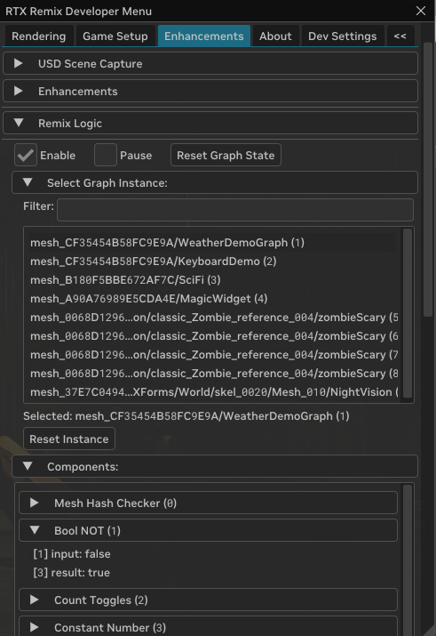

### Enable Free Camera in Remix Runtime

One more thing you'll want to do is enable the free camera so you can move around the scene because 3 of the examples are driven by the camera position.

In the Developer Settings Menu, go to the Dev Settings tab, under "Camera" > "Free Camera" and toggle on "Enable Free Camera". Refer to the camera controls under "Show Camera Controls" for more information.

### Go Play!

Now you should be able to see the following 4 example graphs in action. See below for details on how each one works.

If you want to build on them, you'll need your own project... let's get started with that in the next section.

## Initial Project Set Up

Similar to other replacements, Logic Graphs can be created and edited in the Remix Toolkit.

First, you'll need to take a capture of the Sample App and set up a project, follow the instructions in the [Sample Application Tutorial](../tutorials/tutorial-remixtool.md#4-create-a-project-for-the-sample-application-mod) but with these changes:

1. Click **"New"**, and when you see the wizard, click **"Edit"** not **"Create"**.

1.  Select Project location by creating a clean directory (i.e. MyRemixLogicSampleProject) and specifying a project name that is not `mod.usda` (i.e. logic-sample.usda)

    ```{tip}
    To make sure your mod loads over the included logic sample mod: name your project alphabetically before `RemixLogicExamples`.
    ```

1.  Select the `sample\rtx-remix` directory for the sample app that has the existing mod with graph examples

1. Drag and drop the sample mod `RemixLogicExamples\mod.usda` from available mods into selected mods.

    

1. Then click **"Create"**.


## Creating or Editing a Logic Graph:

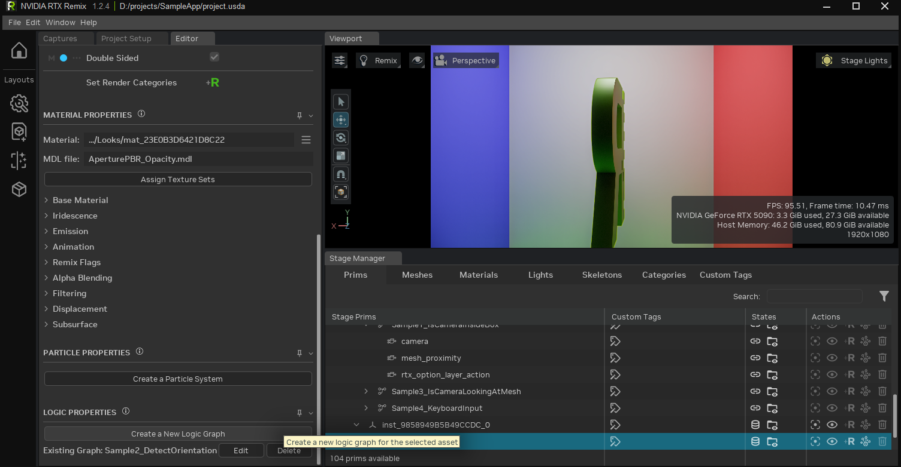

1.  First, ensure your edit target is set to your desired layer where you'd like to author your graphs. In the Sample App, this is just the mod.usda but you may want a dedicated layer for Component graphs for a more complex project.

2.  Select the mesh (or light) you want to attach your graph to, and click "Create a New Logic Graph" near the bottom of the "Editor" tab.  If your mesh already has a graph attached to it, you can also edit or delete graphs from here.

    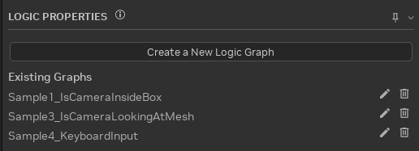

3.  Creating a new logic graph or editing an existing graph will open the Remix Logic Graph Editor.

    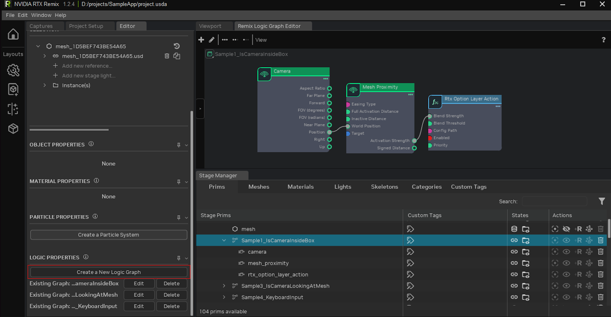

4.  You can now drag nodes from the catalog on the left and connect them up to make a graph. With a node selected you can edit properties with the property editor.

5.  You'll want to pass information from Sense nodes to Act nodes, with Transform nodes in between if needed.

6.  You'll have added a bunch of prims underneath your target prim. Once you save this layer out to USD, you'll be able to see that graph loaded in game.

### Node Tooltips and Documentation

Each property in the "Logic Properties" panel, ports on nodes, and the nodes themselves come with tooltips to help explain how they function.

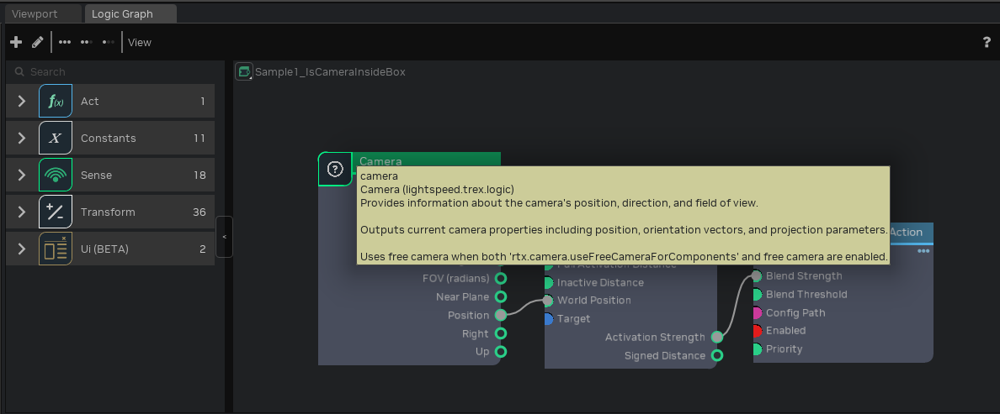


```{seealso}
- [Component Reference](../components/index.md) - Full documentation for all Logic Components
```

***

# Remix Sample Example Graphs

The following examples ship with the Remix Sample App. Read on to learn how each one is designed.

## **Example 1:** "Is Camera Inside Box" Graph

When the player camera comes near the cube, alter the graphics to a white mode (maxed out albedo bias).

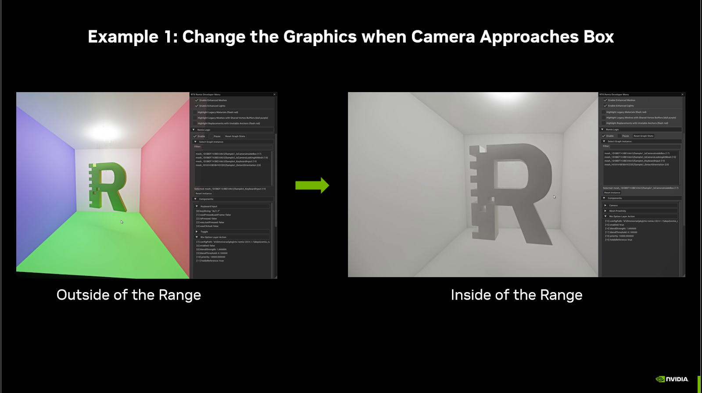

Here's how our graph looks that is driving this example:

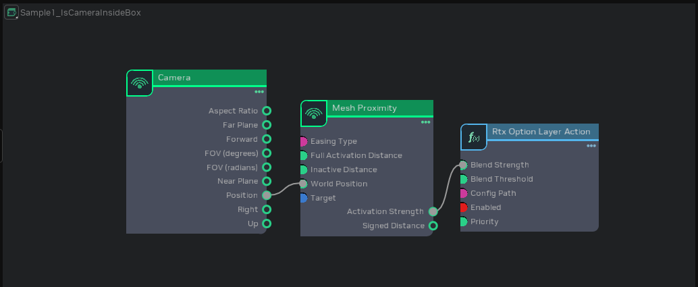

Here we connected a Sense node ("Camera") to another Sense node ("Mesh Proximity") via the position and world position I/O points. If we click on the "Mesh Proximity" node, we can view all of its properties, and see how it works.

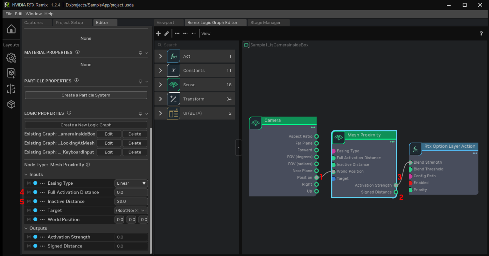

The camera position is a 3D point in space. That point is passed into the "Mesh Proximity node", to see how close the point is to the Mesh's bounding box (1). The distance can be output as the "Signed Distance" (2), but that is not needed here. We can simply use the "Activation Strength" output, which outputs a 0 to 1 signal depending on how far away (or how far inside) the point is from the bounding box (3).

By setting "Full Activation Distance" (4) and "Inactive Distance" (5) to 32 and 0, "Activation Strength" will begin increasing when the Camera is 32 units away from the box, and reach 1 when the camera is 0 units away from the box, i.e. it is on the surface of the bounding box.

The final node in this graph is an Action node, "Rtx Option Layer Action". It loads and applies the `white_mode.conf` file.
* If "Enabled" is true and "Blend Strength" is 1, that config file will be applied at full strength.
* When "Blend Strength" is between 0 and 1, the options in the layer will be blended with the existing options.
* When "Blend Strength" reaches 0, the options are no longer applied.

By connecting the Mesh Proximity's "Activation Strength" to the Rtx Option Layer Action's "Blend Strength", `white_mode.conf` will be activated gradually as the camera approaches the box, only being applied fully once the camera is inside the box.

## **Example 2:** "Detect Orientation" Graph
When the R is backwards, activate a particle effect. Each time the R is backwards, the particle effect changes between deactivated, falling upwards, or falling downwards.

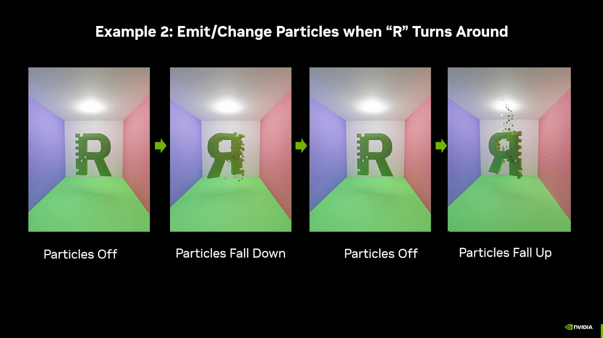

This **"Detect\_mesh\_rotation"** section of this graph reads the mesh's transform using the "Read Transform" node, extracts the y Component of the rotation, and checks if it is between two values.

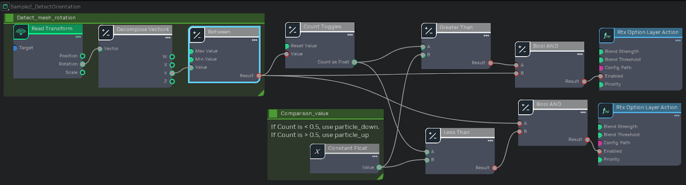

The rest of the graph is a combination of Transform nodes, which will switch between two config files: one that has particles flying upwards, and another that has particles falling down. Each conf file is activated based on the number of times the **Detect\_mesh\_rotation** section has switched from false to true.

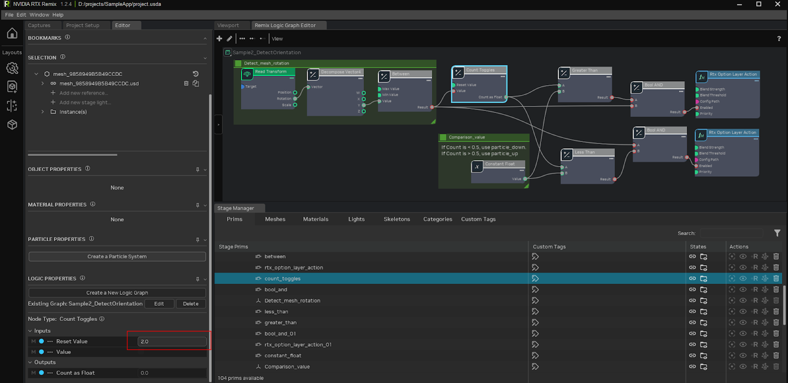

To break it down, the "Count Toggles" will output either 0 or 1, since it is configured to reset when it reaches a count of 2.

The Less Than and Greater Than nodes will compare the count to 0.5, so only one config file is active at a time.

If Count Toggles is outputting 0, then the Less Than node will check "0 < 0.5" and output True.  That True signal is combined with the True signal from **Detect\_mesh\_rotation** using a Boolean AND, which will only output True if both inputs are True. The result is that particle\_down.conf will be enabled when both signals are True. Similarly, when "Count Toggles" is outputting 1, the "Greater Than" node will see that "1 > 0.5", and output true.  That will also be combined with the **Detect\_mesh\_rotation** output in a Boolean AND node; if **Detect\_mesh\_rotation** is outputting True, and Count Toggles is outputting 1, particle\_up.conf will be enabled.

Whenever the **Detect\_mesh\_rotation** output is false, both config files are disabled, turning the particle emission off.

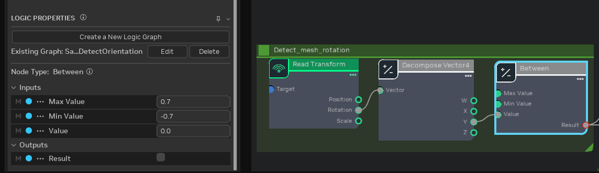

The hardest part with creating this graph is understanding how to populate the "Between" node.

The values required for the "Between" node are impossible to guess, instead they must be gathered by observing the game at runtime. See [Gathering Values for Configuration](#gathering-values-for-configuration) in the Debugging section for the process. In this case, you would watch the rotation value change as the R rotates, then use those coordinates to populate the "Between" node.

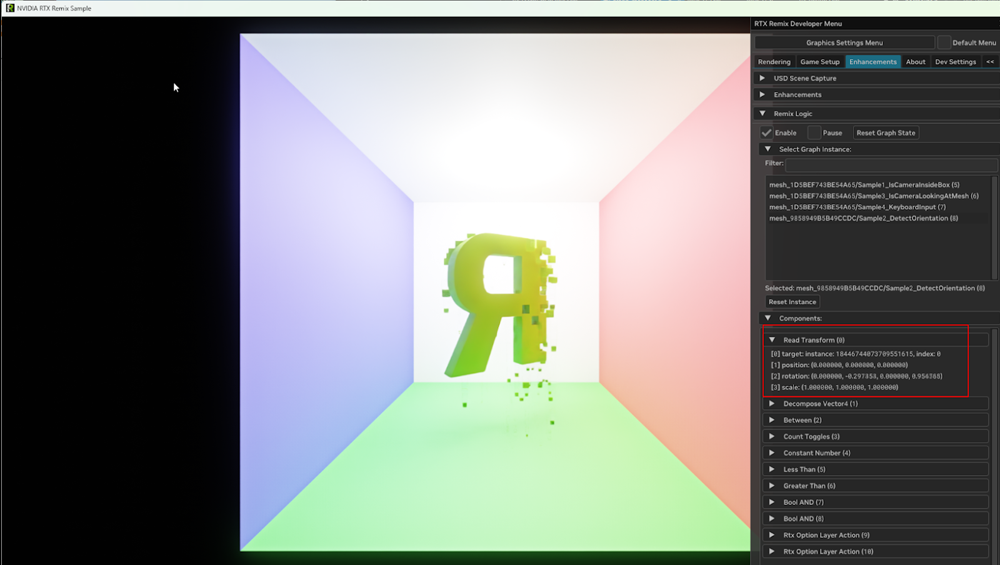

## **Example 3:** "Is Camera Looking At Mesh" Graph
When the player is looking away from the R, animate the paranoia.conf file on and off.

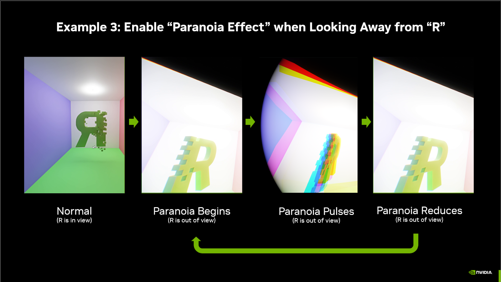

This example showcases a gameplay mechanic powered by Remix Logic. It resembles a "Spidey Sense" for when an object (or enemy) is nearby, and the player is facing away from it, the player gets "paranoid", warning them of danger. We create this paranoia effect by pulsing the intensity of Remix's "vignette" effect and "chromatic aberration".

This graph has 2 sections.  The bottom section checks if the camera is looking at the R, and the top section creates a looping animation.  Both sections output 0 to 1 signals, which are multiplied together to create a single 0 to 1 signal that drives the Rtx Option Layer Action's "Blend Strength"

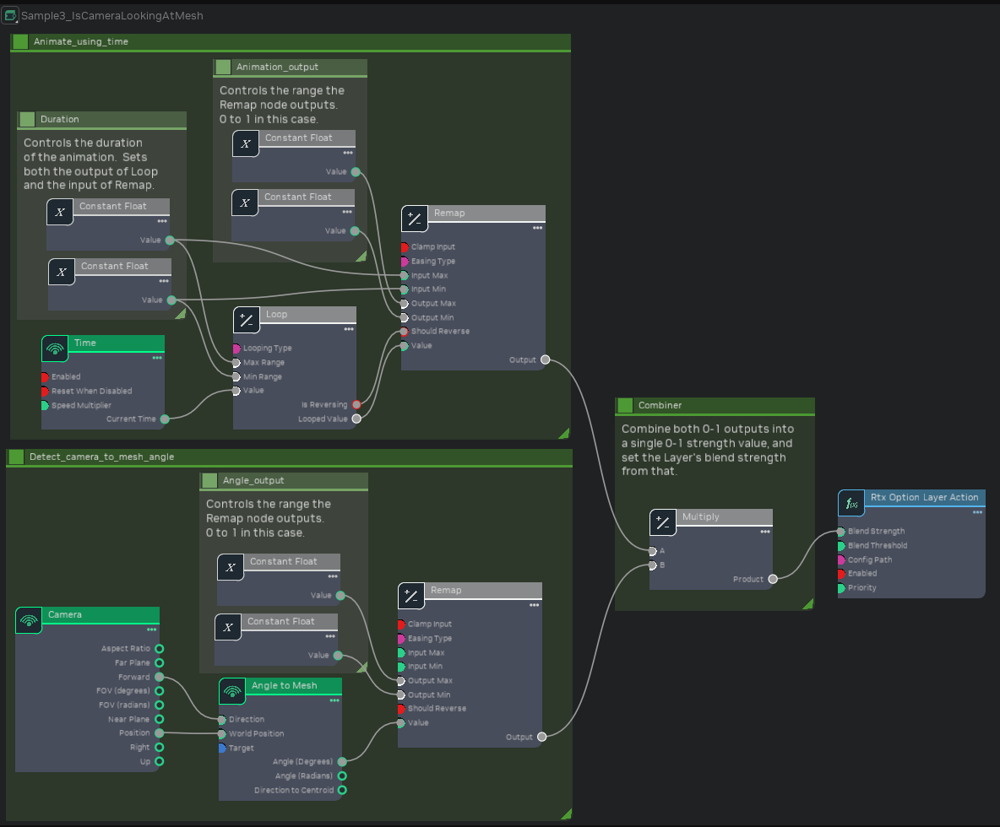

The animation section starts with a Time sensor. Loop with a "Looping Type" of "PingPong" makes it so that when the Time is larger than 0.8, the Looped Value progresses backwards back down to reach 0 when Time is 1.6, then it starts going up again. Finally, Remap will take in that 0 to 0.8 value, and convert it to a 0 to 1 value. Because Remap's Easing Type is set to "Sine", the output value will change faster in the middle of the range and slower at the start and end, creating a gentle sine wave instead of a sharp VVV shape.

The **Detect\_camera\_to\_mesh\_angle** section will calculate two vectors - the camera position to Mesh position vector, and the camera forward vector. The angle between these two vectors is how far away from the mesh the camera is looking. Note that the center of the mesh's bounding box is used for this calculation, not the mesh's transform position.

Once again the "Remap" node is used, this time to clamp the angle (a 0-180 value) to a 15 to 45 degree range, then remap that to a 0 to 1 value (so that "Remap" outputs 0 if the angle is less than 15, and 1 if the angle is greater than 45).

## **Example 4:** "Keyboard Input" Graph
When the player presses Alt+F, activate a flashlight.

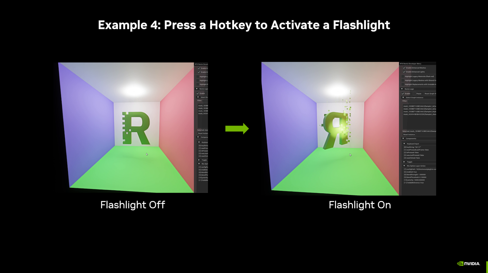

This simple graph uses a hotkey to activate Remix's fallback flashlight. When the hotkey is released, "Was Clicked" will be true for one frame.  That will switch Toggle's "Is On" from False to True (or vice versa), turning the flashlight on or off.

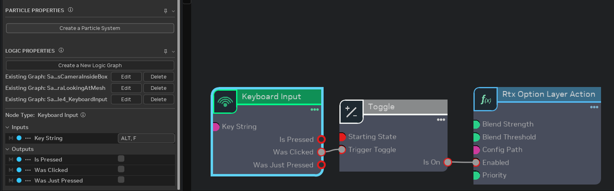

To achieve this effect we bind a "Keyboard Input" node to a "Toggle" node. When the toggle is detected as on, the flashlight.conf file is enabled that activates the fallback flashlight.

***

# Common Patterns

These patterns appear frequently in Logic graphs. Understanding them will help you build new behaviors beyond the examples.

## Detecting Camera Inside a Volume

To trigger effects when the camera enters an area:

1.  **Camera** → outputs position
2.  **Mesh Proximity** → takes position, outputs activation strength
3.  **RtxOptionLayerAction** → use activation strength as Blend Strength

Set Mesh Proximity's "Full Activation Distance" to a negative value (inside the bounding box) and "Inactive Distance" to 0 or positive (outside) for inside-detection.

## Toggle with Hotkey

To let players toggle an effect on/off:

1.  **Keyboard Input** → configure your desired key combo, use "Was Clicked" output
2.  **Toggle** → flips state each time it receives a true signal
3.  **RtxOptionLayerAction** → connect Toggle's "Is On" to "Enabled"

```{tip}
Use "Is Pressed" instead of "Was Clicked" if you want "hold to activate" rather than toggle behavior. Connect "Is Pressed" directly to the action's "Enabled" input, bypassing the Toggle node.
```

## Smooth Transitions with Remap

To create non-linear transitions:

1.  Get a raw value (distance, angle, time)
2.  **Remap** → set input range and output range, choose an easing type
3.  Use the remapped value as Blend Strength

Easing types like "Sine" create smooth acceleration and deceleration instead of linear changes.

## Looping Animations

To create repeating effects:

1.  **Time** → outputs seconds since creation
2.  **Loop** → configure period and looping type (reset or ping-pong)
3.  **Remap** → convert to desired output range
4.  Use the result to drive Blend Strength or other properties

A ping-pong loop with sine easing creates a gentle breathing or pulsing effect.

## Combining Multiple Conditions

To require multiple things to be true:

1.  Create each condition (proximity, keyboard, mesh presence, etc.)
2.  Use **Boolean AND** to combine them
3.  Connect the AND result to your action's "Enabled" input

For "any of these conditions" use **Boolean OR** instead.

## Counting Events

To cycle through states:

1.  **Counter** → counts true inputs, configure to reset at a threshold
2.  Use **Less Than**, **Greater Than**, or **Between** to check the count
3.  Different counts enable different layers

This pattern powers effects that cycle through multiple states, like the particle direction example above.

## Using Constant Components

Components like Add, Multiply, Clamp, etc. can all operate on multiple types of inputs (Number, Vector2, Vector3, etc). These flexible input fields don't support writing values directly on the component—instead, you need to create a ConstNumber or ConstVector2, set the value in that, and then connect that Const component to the flexible component's input field.

Another common use case for Const components is creating a single shared piece of data to be used by multiple components, such as a total animation length. If you have a multi-stage animation that blends various layers at different times, setting each timestamp directly in each component makes adjusting the overall length tedious. Instead, create a single ConstNumber for the total animation time and have each component do math on that number (e.g., multiply by 0.5 for half the total time). This way, you can adjust the entire animation length by changing a single field.

```{tip}
When you find yourself entering the same value in multiple places, consider using a Const component instead. This makes your graph easier to maintain and tune.
```

***

# Remix Logic In-Depth

## Logic Graph Structure

All Logic Graphs are DAGs (Directed Acyclic Graphs) and will follow 3 basic phases: sensing the game's renderable state, performing input transformations or decision making, and acting on the Remix's rendering.

These phases correspond to the node types: **Sense**, **Transform**, **Act**.

```{important}
Components must be connected in a way that has a clear starting point and doesn't create loops; each Component can only use information from Components that come before it in the chain.
```

## Remix Logic & New Conf Files

The **RTX Remix Logic** system required developing a layering system for juggling and transitioning between multiple ".conf" files, each loaded with a unique set of RTX Remix Runtime options. Modders can define the relative "blend strength" of each layer, allowing smooth interpolation between values for fine-grain control.

To help streamline mod creation, Remix has introduced three types of config files.

*   **`rtx.conf` files**. These haven't changed. They are core to a modder's workflow for making a game "Remix Compatible". Modders can adjust how a game renders to make it work best with Remix, save it to the `rtx.conf` file, and share it in places like ModDB to make it easier for other modders to get started with their mod.

*   **`user.conf` files**. These are new, and meant to store a user's personal graphics settings, like their graphical preset, and whether they play with Frame Generation on. These should be tailored to the player, and reflect the best graphical settings for them.

*   **New Logic `.conf` files**. For Remix Logic graphs, modders can export a `new.conf` file from the Runtime. This file is meant to be renamed and used as a layer that is temporarily loaded in reaction to a change in the game state.

When modders save their Runtime settings on the "User Graphics Menu" it automatically saves to the `user.conf`. Additionally, on the "Advanced Developer Menu", modders will see a new drop down near the save button:

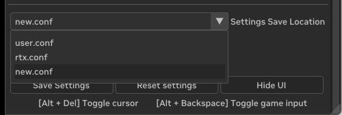

## Creating Conf Files for Remix Logic

```{warning}
If you plan to create new `.conf` files for Remix Logic, you need to ensure your `user.conf` contains only your personal graphics settings, including any derived settings that are set based on graphics preset or hardware compatibility. This will prevent those settings from being included in exported `.conf` files, which could accidentally change another player's graphics settings.
```

* **First**, delete any existing `user.conf` you might have in your file structure.

* **Second,** In-game, launch the Runtime graphics settings menu and hit save (without going to the advanced developer menu).

* **Third,** relaunch the game.

 Now all of your personal graphics settings are written to your `user.conf` file, and won't be duplicated to the `.conf` files you export for Remix Logic.

As mentioned, Remix Logic will let you blend between multiple `.conf` files in response to a change in game state. The process generally follows these steps:

Modify your Remix Runtime settings to reflect the visual state you want to change to

Save the settings to a `new.conf` file. The save settings should look like this when you do:

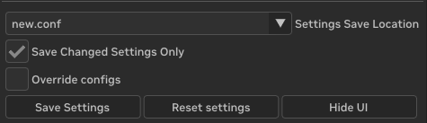

The `new.conf` file can be found in your file structure next to the `rtx.conf` file.

Modders should rename the `new.conf` file, maintaining the `.conf` extension. They should then manually move it to their mod folder (in the root or any subfolder).

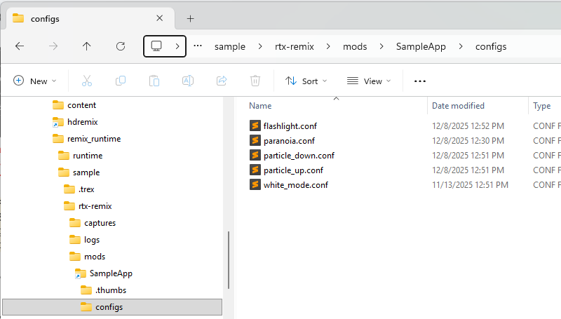

In the Remix Toolkit, modders create a graph that features a "RTX Option Layer Action" Node. From the Logic Properties pane, they should point this node to the `.conf` file they want to transition the visuals to. When a particular game event is detected, the `.conf` file will be applied on top of the existing config, enacting a visual change at whatever blend strength the modder has specified.

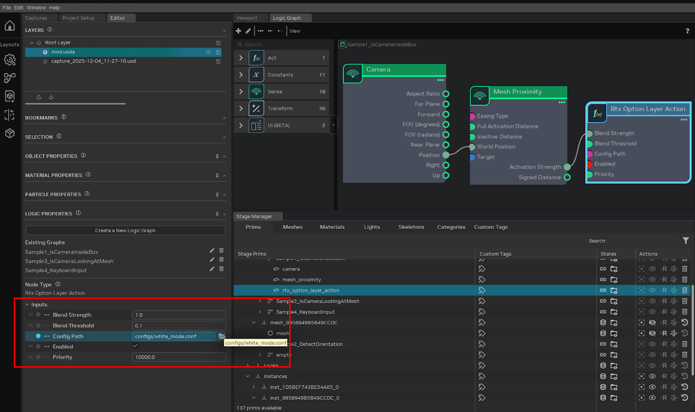

## Understanding `user.conf` Priority

```{important}
**Config priority (highest to lowest):** `user.conf` > Logic `.conf` layers > `rtx.conf`
```

`user.conf` stores the local graphics settings and is intended for the end user-settings the player chooses for their hardware and personal preferences. It is **not** meant for shareable mod-related settings.

Because `user.conf` has the highest priority, **Logic cannot override values defined in `user.conf`**. If
you're testing and your Logic layer seems to have no effect on certain values, check if those values exist
in `user.conf`.

**Best practice**: Keep your development `user.conf` minimal. Before releasing your mod, test with a clean `user.conf` to ensure your Logic effects work as intended for end users.

```{warning}
Logic cannot override values in `user.conf`. Keep mod settings in your layer `.conf` files or `rtx.conf`, not in `user.conf`.
```

***

# Debugging & Troubleshooting

## Viewing Graph State in Runtime

The most powerful debugging tool is the Runtime's **Enhancements** tab. With your mod loaded:

1.  Open the Runtime menu (`Alt+X`)
2.  Navigate to the **Enhancements** tab
3.  Expand **Remix Logic**
4.  Select your graph from the list

The panel shows every Component's current input values, state, and output values in real-time. You can watch values change as you play, which reveals exactly what each Component is doing.

## Gathering Values for Configuration

Some node properties require values you can't guess—like the rotation range for a Between or Remap node detecting a moving object.

1.  Create a Read Transform node and save your mod
2.  Load the game with the Runtime
3.  Open Enhancements → Remix Logic → your graph
4.  Observe the values as you trigger the condition you want to detect
5.  Note the range of values
6.  Return to the Toolkit, delete the Read Transform node and configure your Between/Remap node with those values

## Common Issues

**Graph not activating at all?**
*   Check that the anchor mesh is being rendered in your current scene
*   Verify the graph was saved to the correct layer
*   Look for the graph in the Runtime's Enhancements tab—if it's not listed, the anchor isn't active

**Values not changing?**
*   Check connections in the graph editor
*   Verify Sense nodes are outputting expected values in the Runtime
*   Check Transform node configurations (ranges, thresholds)

**Layer not applying?**
*   Verify the `.conf` file exists at the specified path
*   Check that values aren't locked by `user.conf` (see "Understanding `user.conf` Priority" above)
*   Look at the Option Layers panel in Dev Settings to see if the layer appears and at what strength

**Tonemapping or other values don't reset correctly?**
*   When a Logic layer releases a value, the Runtime falls back to the next lower priority layer's value
*   If no layer defines it, the value falls back to the RtxOption's built-in default—which may not be what you expect
*   Define your desired baseline values in `rtx.conf` so the Runtime knows what to fall back to

## Known Issues

For a list of known issues with the current 1.3 release, see the [Release Notes Known Issues.](../changelog/remix-releasenotes.md#known-issues)

***

# Advanced: Using Custom Logic Components in Toolkit

The Toolkit UI for Components is driven by schema files that are auto-generated from the C++ Component class. To get new Components to show up in the Toolkit, you need to regenerate those schema files and then notify the toolkit.

Once you've followed the instructions in the runtime documentation for authoring your own Logic Components in the [Remix Logic documentation](https://github.com/NVIDIAGameWorks/dxvk-remix/blob/main/documentation/RemixLogic.md#creating-components), you are ready to use them in the toolkit.

## Requirements

*   Local build of runtime with custom Components OR custom Components from another user

*   Local build of Remix Toolkit OR release build that you are willing to modify


Since the toolkit copies the generated .ogn and .py files when it is built you'll need to build it first and then copy the new nodes (both .ogn + .py files)  into the correct folder. An easier and more official workflow will be coming soon.

`.\Remix 1.3.6.2\exts\lightspeed.trex.logic.ogn\lightspeed\trex\logic\ogn\ogn\python\nodes\*`

When you are done, you should have the custom Logic Components available in the Graph Editor.

```{tip}
If you create useful custom Logic Components, consider sharing them with the community by submitting a PR to the [RTX Remix Runtime GitHub repository](https://github.com/NVIDIAGameWorks/dxvk-remix).
```

***

<sub>Need to leave feedback about the RTX Remix Documentation?  [Click here](https://github.com/NVIDIAGameWorks/rtx-remix/issues/new?assignees=nvdamien&labels=documentation%2Cfeedback%2Ctriage&projects=&template=documentation_feedback.yml&title=%5BDocumentation+feedback%5D%3A+) </sub>
