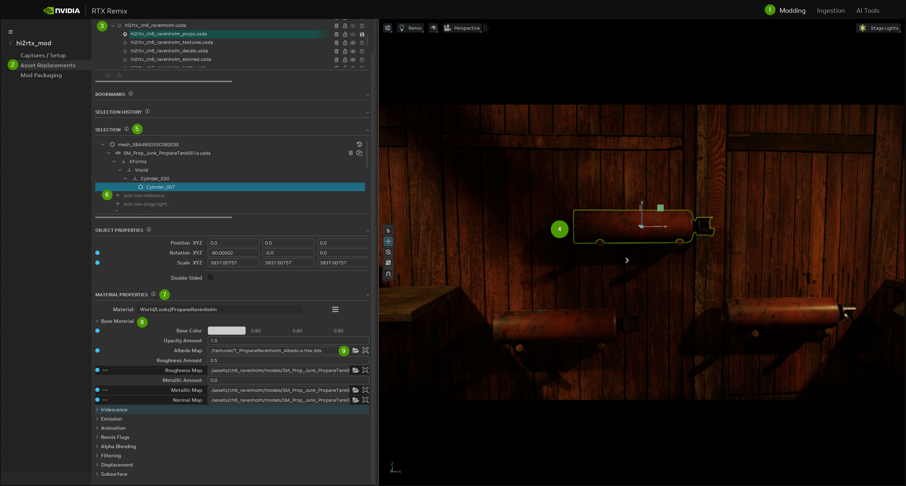

# Introduction to Material Replacement

In Remix, materials on meshes get a PBR (Physically-Based Rendering) makeover, allowing you to use high-quality and more physically accurate Materials in your game. In this tutorial, we'll focus on replacing materials for world geometry. If you want to replace materials on models, check out the Model Replacement section of this guide.

## Ingesting Material Textures

1. **Navigate to the Ingest Tab:** Head to the Ingest tab and select "Texture Ingestion."
2. **Add Your Texture:** Click "Add" and effortlessly upload the texture of your choice (supports PNG or DDS formats).
3. **Assign Texture Channel (Optional):**
    * Explore the "convention" dropdown below the input file paths box.
    * Set it to DirectX, OpenGL, or Octahedral based on the encoding type of your input normal map.
    * Assign the texture to one of seven channels: Diffuse, Emissive Mask, Metallic, Normal - OpenGL, Normal - DirectX, Roughness, or Other.
    * Opt for "Other" for a standardized ingestion without altering the name. This step is often automated, but choose "Other" for textures like heightmaps#
4. **Set Output Directory:** Establish an output directory within your project file structure.
4. **Initiate Ingestion:**
    * Click "Run" to kickstart the texture export process.
    * The output directory will contain additional files, but all you need for in-game use is the converted DDS file.

> ⚠️ Issues with Ingestion will be highlighted in red with corresponding error messages.

> 📝 All Ingested files, even Materials & Assets, will have MetaData files.

## Replacing, Adding, or Appending a Material

**Replacing a Material**
This involves substituting an existing Material with a new one.

**Adding a Material**
Adding a Material typically refers to incorporating a new Material alongside existing ones.

**Appending a Material**
 Appending a Material implies sequentially adding Materials to a project. For example, you might start with a basic scene and then append additional Materials to enhance or expand the environment.

1. **Access Stage:** Go to the "Modding" tab on the top right.
2. **Select Asset Replacements:** Choose the "Asset Replacements" tab on the left.
3. **Layers:** In the top left, you'll see layers. Select your desired layer as the edit target.
4. **Choose Mesh:** Pick your mesh for texture replacement.
5. **Selection Tab:** Look at the "Selection" tab, where you'll find the original Material hash and the converted/captured USD.
6. **Add New Reference (Optional):** If you are replacing a model, follow the steps above for “Replacing, Adding, or Appending an Asset”.
7. **Material Properties:** Scroll down to view the “Material Properties” tab on your selected asset.
8. **Assigning Textures:** Click the arrow next to a material property to see a list of adjustments you can make.
    * _For example:_ In the Base Material dropdown, you can add an Albedo, Roughness, Metallic, and Normal Map texture.
    * If you are replacing a texture on a captured model, the original captured texture will be present in the “Albedo” channel.
9. **Selecting Textures:** Click the browse icon to navigate to your texture file pathing and then select it to add the texture to that channel

## Checking Hash Stability

World geometry has unstable hashes in many older games due to culling mechanisms. To check hash stability, follow these steps:

1. **In-Game Debugging:** In-game, press Alt+X, scroll down to the "Debug" tab under "Rendering", and enable "Debug View".
2. **Check Hash Stability:** To make sure that everything is working smoothly, switch to "Geometry Hash" in the debug view. If you notice a model, Material, or a part of the game world changing color in this view, that's a sign that the hash isn't stable. In such cases, you might need to use a workaround, and replacing it might not be an option.

## Understanding Parallax Occlusion Mapping in RTX Remix

Parallax Occlusion Mapping (POM) is a technique used in RTX Remix to add depth and realism to surfaces. It's achieved by simulating the displacement of pixels based on a height map, creating the illusion of intricate surface details.

**What is Displacement Using Parallax Occlusion Mapping?**

Displacement is a family of techniques used to make simple geometry appear more complex than it actually is.  In the context of RTX Remix, this is done using Parallax Occlusion Mapping.

**Depth of a Pixel**

In Remix, five factors determine the apparent depth of the displacement, which is calculated like this:

<code>(height_map_pixel * (displace_in + displace_out) - displace_in) * displacementFactor * UV_to_world</code>

* <code>Height_map_pixel</code> A black pixel will be displaced back to max_depth, a white pixel will be displaced forward to max_height.
* <code>displace_in</code> A material property that determines how far below the original surface a pixel can appear
* <code>displace_out</code> A material property that determines how far above the original surface a pixel can appear
* <code>rtx.displacement.displacementFactor</code> A global RtxOption primarily used for debugging.  We recommend leaving this at 1.0.
* <code>UV_to_world</code> The UV density of a given surface (i.e. how many world units to go from u=0 to u=1, or how often the texture tiles)
* For example, if you have a wall panel that repeats every 1.5 meters, a black pixel will appear to be 1.5 * <code>displace_in</code> meters behind the wall. A white pixel will be 1.5 * <code>displace_out</code> meters in front of the wall.

A few useful calculations:

<code>total_height = displace_out + displace_in</code> The total possible range of the displacement (before factoring in displacementFactor or uv scale)

<code>neutral_height = displace_in / total_height</code> The height_map value to have no displacement

**Comparison with Substance Designer**

In Substance Designer, a black pixel on the height map is 1 unit * <code>height_scale</code> deep, with the default preview mesh being 100x100 units.

**Adjusting displace_in for Consistency**

* To match the depth of the surface in Remix with Substance Designer's preview, adjust <code>displace_in</code> as follows: <code>displace_in = height_scale / 100</code>.
* This adjustment ensures that the displacement scale in Remix is consistent with Substance Designer's default preview mesh.
* If outwards displacement is desired, <code>displace_in + displace_out</code> should equal <code>height_scale / 100</code>

**Considerations for Custom Meshes**

If the artist uses a custom mesh in Substance Designer, the adjustment factor for <code>displace_in</code> and <code>displace_out</code> may need to be fine-tuned based on the specific characteristics of the custom mesh.  Substance Designer does not factor in the UV density when calculating depth, so rather than simply dividing by 100, they will need to divide by the UV density of their custom mesh.

## Animated Materials

Working with animated textures involves a few additional steps. Follow this easy guide:

1. **Capture Each Frame:** Slow down the game's framerate to capture each frame of the animated texture.
2. **Use Anchor Textures:**
    * Generate a series of Anchor or stand-in textures for each animation frame.
    * Render these textures into a test level to capture the hashes.
3. **Utilize the Alt+X Developer Menu:**
    * Access the material setup tab in the Alt+X developer menu.
    * Tick on "preserve discarded textures" to retain all the hashes for each frame in the material menu.
4. **Create a Hash List:** Make a list of all the hashes obtained from the preserved frames in the material menu.
5. **Manual Replacement in USDA:** Replace these hashes through simple manual editing in a layer's USDA.

### Animated Materials using a Sprite Sheet

To bring animations from a sprite sheet into the application, it's a simple process. The user just needs to specify three things:
1. The number of rows
1. The number of columns
1. The desired frames per second

Once you've set these values, ensure that all your Materials are configured to use sprite sheet Materials.

A key point to remember is that the spritesheet should be organized from left to right, and from top to bottom, just like the example image presented below:

<!---  --->

## Subsurface Scattering

Subsurface Scattering (SSS) allows light to penetrate through a solid object. The SSS is described with a BSSRDF model, an extension of BRDF model which assumes the light enters and exits at the same point of the surface.
This model is often used to render realistic models for translucent objects, such as skin, wax, marble, etc. When light enters these objects, it should be scattered longer than the standard opaque models. Using a BSDF model would hide the feature and cause unrealistic results.

To setup SSS, the user needs to set the following parameters in Subsurface:

* <code>Transmittance Color</code> Determines the base color of the SSS surface, it's similar to the diffuse albedo color for diffuse materials. This parameter can also be set with a texture map.
* <code>Subsurface Scattering Radius</code> Determines the distance (mean free path) that light will be transported inside the SSS object for each color channel. Larger value will allow the corresponding color scattered further on the surface, it will look like a tail extends from the diffuse model. This parameter can also be set with a texture map.
* <code>Subsurface Scattering Scale</code> A scale that controls the SSS intensity of the whole object.
* <code>Subsurface Scattering Max Scale</code> The maximum distance that that light can scatter. Samples larger than this scale will be clamped.

***
 Need to leave feedback about the RTX Remix Documentation?  [Click here](https://github.com/NVIDIAGameWorks/rtx-remix/issues/new?assignees=nvdamien&labels=documentation%2Cfeedback%2Ctriage&projects=&template=documentation_feedback.yml&title=%5BDocumentation+feedback%5D%3A+) 
