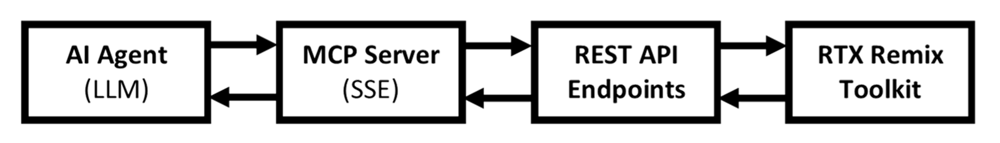
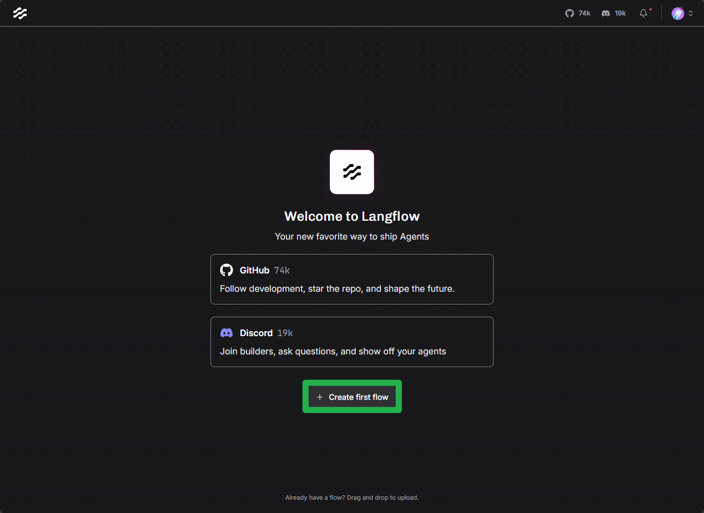
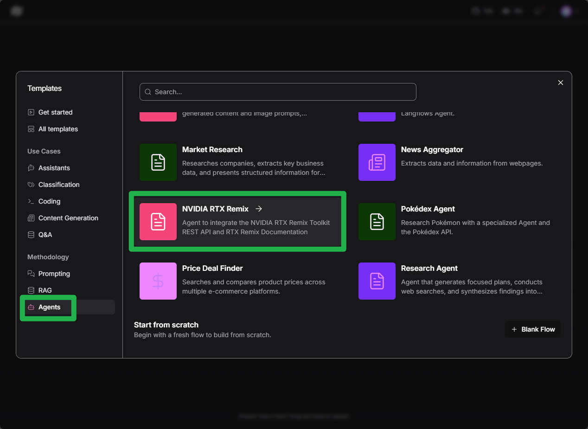
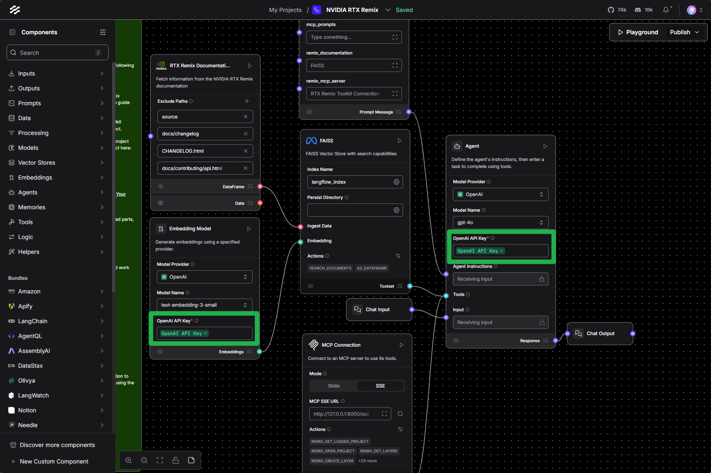
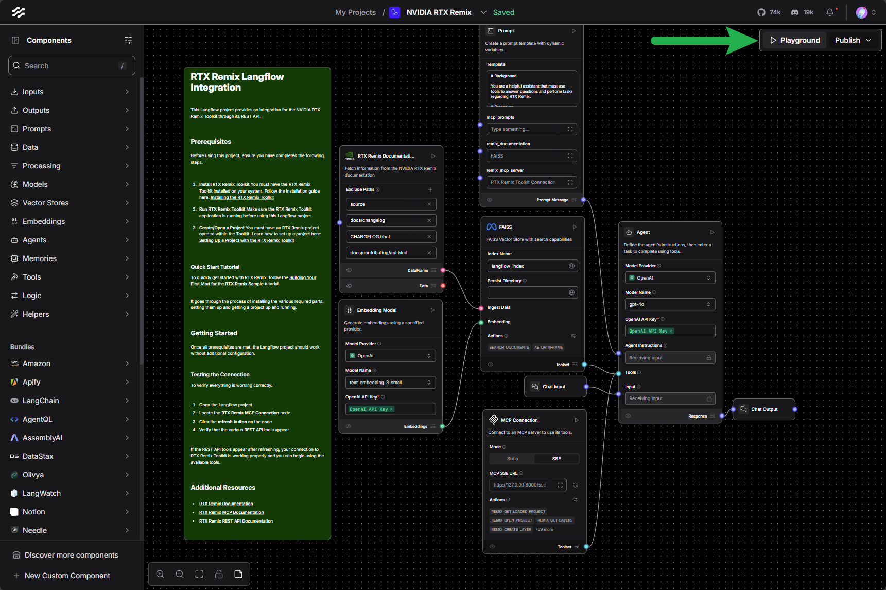
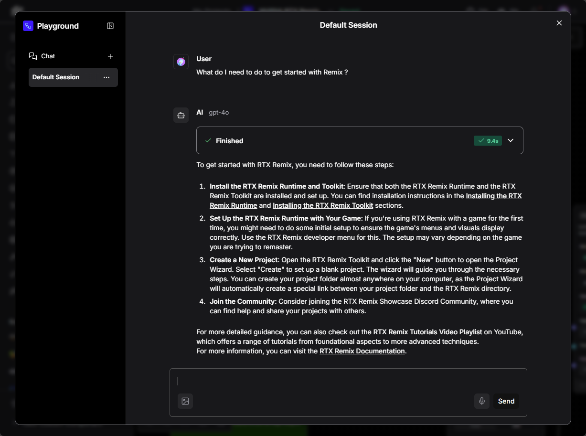

# Using AI Agents with MCP

The RTX Remix Model Context Protocol (MCP) server enables AI agents and Large Language Models (LLMs) to interact with
the Toolkit. This allows for workflow automation, AI-powered feature integration, and Toolkit control through natural
language commands.

***

## What is MCP?

Model Context Protocol (MCP) is an open standard that provides a unified way for AI applications to interact with
external tools and data sources. In the context of RTX Remix, MCP acts as a bridge between AI agents and the Toolkit's
functionality, exposing the REST API endpoints in a format that LLMs can understand and use through tool calling.

### Key Benefits

- **Natural Language Control**: Interact with the Toolkit using conversational commands
- **Automation**: Create AI-powered workflows to automate repetitive tasks
- **Integration**: Connect the Toolkit with AI platforms and custom agents
- **Standardization**: Use a widely-adopted protocol supported by multiple AI frameworks

***

## How MCP Works with RTX Remix

The RTX Remix MCP server operates as follows:

1. **Automatic Startup**: The MCP server starts automatically when launching the RTX Remix Toolkit
2. **REST API Translation**: It translates the Toolkit's REST API endpoints into MCP-compatible tools
3. **Server-Sent Events (SSE)**: Uses SSE streams for real-time communication with AI agents
4. **Tool Definitions**: Provides structured descriptions of available actions that LLMs can understand
5. **MCP Prompts**: Defines reusable prompt recipes that guide agents through complex workflows

```{seealso}
See the [REST API Documentation](./learning-restapi.md) for more information on the RTX Remix Toolkit's REST API.
```

### Technical Architecture



***

## Building Complex Workflows

MCP **Prompts** are predefined recipe templates that guide AI agents through multi-step workflows. These prompts provide
structured instructions to the agent's system context, specifying the exact sequence of operations and parameters needed
to accomplish complex tasks.

### How MCP Prompts Work

MCP Prompts act as intelligent workflow templates that:

- Define step-by-step procedures for common tasks
- Specify which tools to use and in what order
- Include parameter guidance for each operation
- Handle conditional logic and error scenarios

### Example: Asset Replacement Workflow

When asking an agent to "replace the selected asset in the viewport," the MCP Prompt guides the agent through:

1. **Get Current Selection**: Query the viewport to identify the currently selected asset
2. **Retrieve Available Assets**: List all ingested assets that could serve as replacements
3. **Perform Replacement**: Execute the replacement operation with the appropriate parameters

The prompt ensures the agent uses the correct API endpoints, passes the right arguments, and handles the response
appropriately.

### Benefits of MCP Prompts

- **Consistency**: Ensures agents follow best practices for common workflows
- **Efficiency**: Reduces the need for lengthy natural language explanations
- **Reliability**: Minimizes errors by providing explicit parameter specifications
- **Reusability**: Allows sharing of workflow patterns across different AI agents

***

## Finding the MCP Server Information

When the RTX Remix Toolkit starts, the MCP server automatically begins running with the following default configuration:

- **Protocol**: Server-Sent Events (SSE)
- **Host**: `127.0.0.1` or `localhost`
- **Port**: `8000`
- **Endpoint**: `http://127.0.0.1:8000/sse`

***

## Connecting AI Agents to MCP

There are several ways to connect AI agents to the RTX Remix MCP server:

### Using Langflow

[Langflow](https://www.langflow.org/) is a visual framework for building AI agents that supports MCP:

```{important}
An OpenAI API key is required to use the NVIDIA RTX Remix Langflow template as-is, however, the template can be modified
to use different LLM providers. See the [Agent component documentation](https://docs.langflow.org/components-agents) for
more information on the Agent component.
```

1) Install Langflow by following the [installation guide](https://docs.langflow.org/get-started-installation)

2) Launch the RTX Remix Toolkit

3) Create a new flow in Langflow

   

4) Select the `NVIDIA RTX Remix` Template in the "Agents" section

   

5) Update the required API Keys. Using Langflow's Environment Variables can simplify this process:

   

6) Test the flow by entering the "Playground"

   

7) Interact with the flow by entering a message in the "Input" field and clicking the "Send" button.

   

```{tip}
For troubleshooting flow issues, refer to the README node in the Langflow project for detailed information on template
usage and common issue resolution.
```

### Using MCP-Compatible Clients

Many AI frameworks now support MCP. To connect them:

1) Configure the client with the SSE endpoint URL
2) Ensure the RTX Remix Toolkit is running
3) The client will automatically discover available tools through the MCP protocol

***

## Testing the MCP Server

The [MCP Inspector](https://github.com/modelcontextprotocol/inspector) is the recommended tool for testing:

1) Make sure `Node.js` is installed. If not, following the instructions [here](https://nodejs.org/en/download)
2) Start the RTX Remix Toolkit (ensures MCP server is running)
3) Launch MCP Inspector:
   ```bash
   npx @modelcontextprotocol/inspector
   ```
4) Connect to the RTX Remix MCP server:
    - Click "Add Server"
    - Enter the SSE endpoint: `http://127.0.0.1:8000/sse`
    - Click "Connect"
5) Explore available tools, test commands, and view responses

***
<sub> Need to leave feedback about the RTX Remix Documentation?  [Click here](https://github.com/NVIDIAGameWorks/rtx-remix/issues/new?assignees=nvdamien&labels=documentation%2Cfeedback%2Ctriage&projects=&template=documentation_feedback.yml&title=%5BDocumentation+feedback%5D%3A+) </sub>
