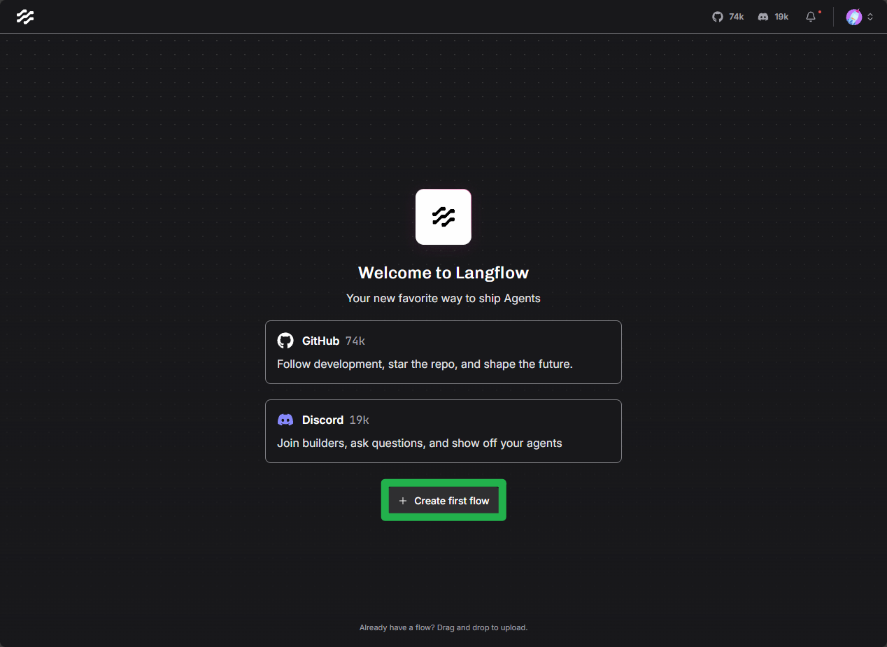
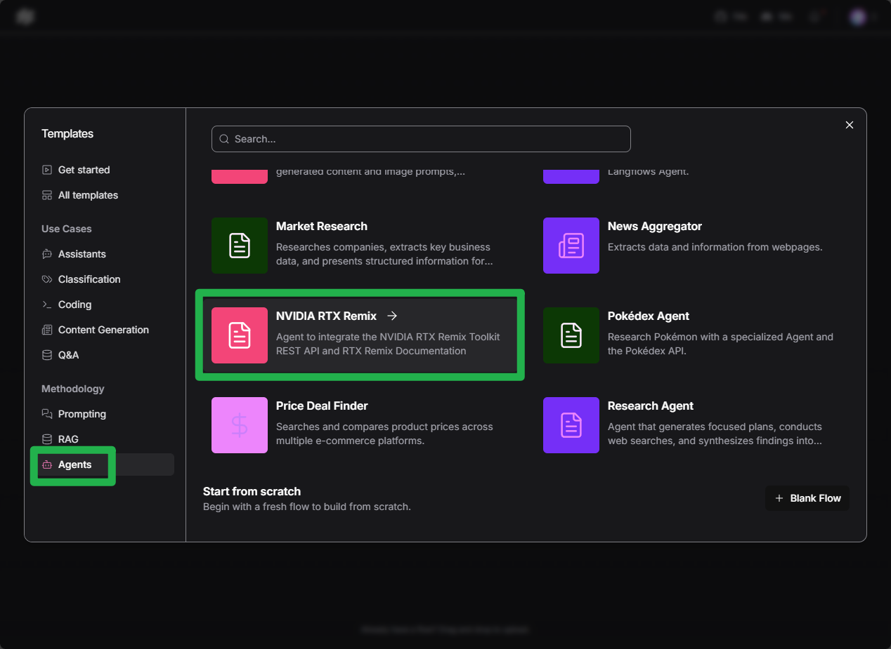
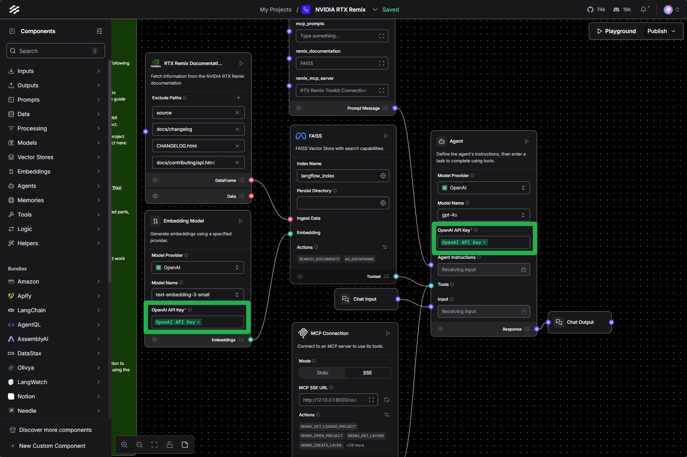
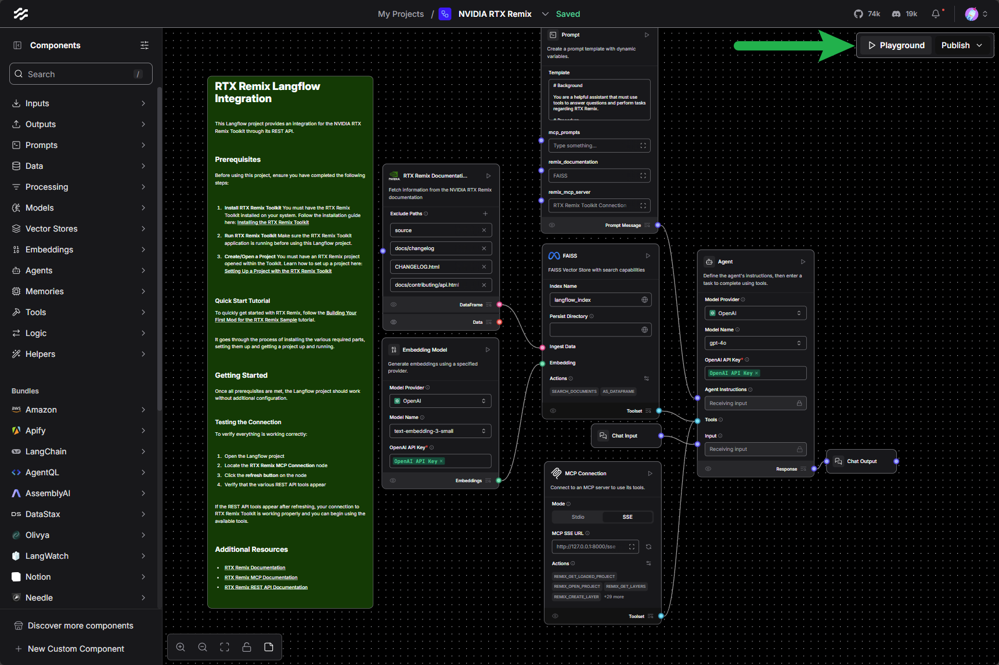
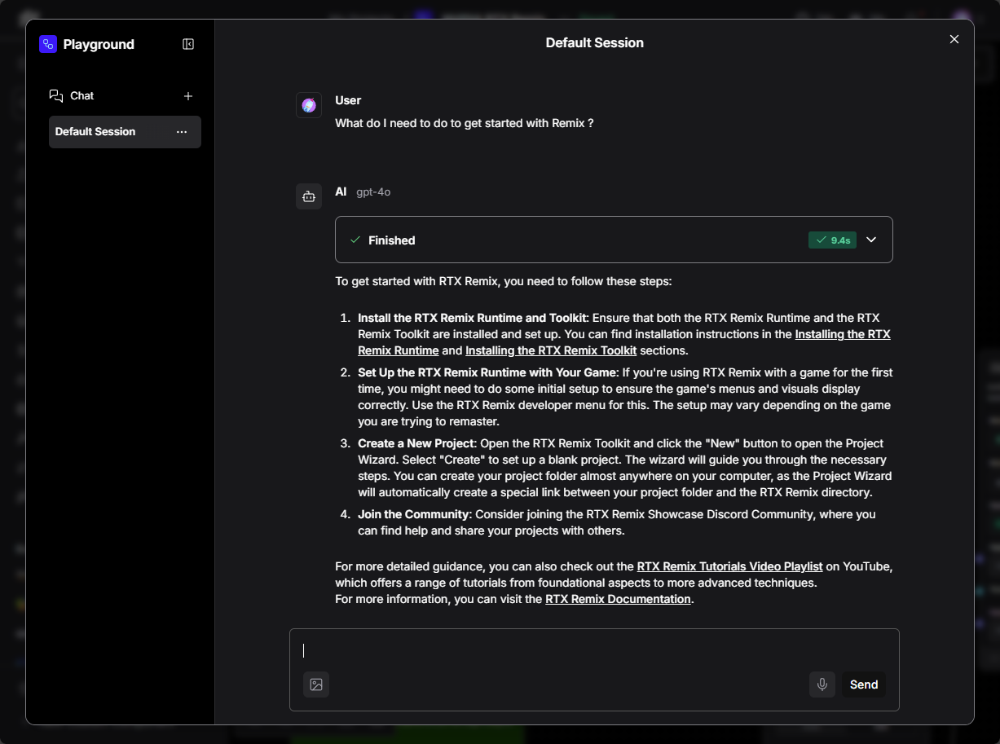
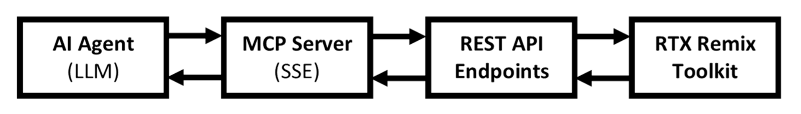

# Using AI Agents with MCP

The RTX Remix Model Context Protocol (MCP) Server enables AI agents and Large Language Models (LLMs) to interact with
the Toolkit. This allows for workflow automation, AI-powered feature integration, and Toolkit control through natural
language commands.

***

```{seealso}
To jump straight into setting up a Remix AI Agent Assistant see the [Connecting AI Agents with MCP](#connecting-ai-agents-to-mcp) section.
```

## Background Information

### What is MCP?

Model Context Protocol (MCP) is an open standard that provides a unified way for AI applications to interact with
external tools and data sources. In the context of RTX Remix, MCP acts as a bridge between AI agents and the Toolkit's
functionality, exposing the REST API endpoints in a format that LLMs can understand and use through tool calling.

#### Key Benefits

- **Natural Language Control**: Interact with the Toolkit using conversational commands
- **Automation**: Create AI-powered workflows to automate repetitive tasks
- **Integration**: Connect the Toolkit with AI platforms and custom agents
- **Standardization**: Use a widely-adopted protocol supported by multiple AI frameworks

***

## Finding the MCP Server Information

When the RTX Remix Toolkit starts, the MCP server automatically begins running with the following default configuration:

- **Protocol**: Streamable HTTP
- **Host**: `127.0.0.1` or `localhost`
- **Preferred port**: `18014`
- **Endpoint**: `http://127.0.0.1:18014/mcp/`

On Windows, read `mcp_endpoint` from `%LOCALAPPDATA%\NVIDIA\RTX Remix\mcp.json` for the
running server's address, including fallback ports. Check that its `pid` is still running and
confirm readiness before connecting; a crash can leave a stale file. See the
[discovery manifest details](../../source/extensions/lightspeed.trex.mcp.core/docs/README.md#discovery-manifest).

If the port is occupied, the Toolkit tries the remaining ports through `18019` in order. If all
six ports are unavailable, MCP startup logs an error and stops. Find `MCP_PORT_FALLBACK` in
the Toolkit log and use its `endpoint=` URL in your client configuration. Wait for
`SERVICE_READY service=mcp` with the matching host and port before connecting. Client settings
do not update automatically when the port changes.

Clients that cannot yet connect over Streamable HTTP can fall back to the protocol's legacy SSE transport by
setting `/exts/lightspeed.trex.mcp.core/transport` to `sse`, which serves `http://127.0.0.1:18014/sse` instead.

***

## Connecting AI Agents to MCP

There are many frameworks that will allow AI Agents to connect to the RTX Remix MCP Server. This guide will go through the steps of connecting an AI Agent to the MCP Server with Langflow, but we also include some general steps for any MCP-Compatible client.

### Using Langflow

[Langflow](https://www.langflow.org/) is a visual framework for building AI agents that supports MCP:

```{important}
An OpenAI API key is required to use the NVIDIA RTX Remix Langflow template as-is, however, the template can be modified
to use different LLM providers. See the [Agent component documentation](https://docs.langflow.org/components-agents) for
more information on the Agent component.
```

1) Install Langflow by following the [installation guide](https://docs.langflow.org/get-started-installation)

```{tip}
- Minimum version of the Langflow Desktop application required is `1.5.13`.
- Minimum version of the Langflow PIP package required is `1.5.0.post2`.
```

2) Launch the RTX Remix Toolkit

3) Launch Langflow and create a new flow in Langflow

   

4) Select the `NVIDIA RTX Remix` Template in the "Agents" section

   

5) Update the required API Keys. Using Langflow's Environment Variables can simplify this process:

   

6) Test the flow by entering the "Playground"

   

7) Interact with the flow by entering a message in the "Input" field and clicking the "Send" button.

   

```{tip}
For troubleshooting flow issues, refer to the README node in the Langflow project for detailed information on template
usage and common issue resolution.
```

### Using MCP-Compatible Clients

Any MCP-compatible client can connect to the Toolkit. To connect:

1) Configure the client for Streamable HTTP at `http://127.0.0.1:18014/mcp/`, or the fallback endpoint from the Toolkit log
2) Ensure the RTX Remix Toolkit is running
3) The client will automatically discover available tools through the MCP protocol

***

## Bundled modding skill

The Toolkit includes the `rtx-remix-modding` skill and its reference files. Start your coding
agent from the Toolkit installation directory, or open that directory as its workspace, to use
its bundled skill discovery files. The skill's instructions are in `skills/rtx-remix-modding/SKILL.md`.

[Connect the agent to MCP](#connecting-ai-agents-to-mcp) separately; loading the skill does not
establish a connection to the Toolkit.

***

## How MCP Works with RTX Remix

The RTX Remix MCP server operates as follows:

1. **Automatic Startup**: The MCP server starts automatically when launching the RTX Remix Toolkit
2. **REST API Translation**: It translates the Toolkit's REST API endpoints into MCP-compatible tools
3. **Streamable HTTP**: Carries MCP requests and responses between clients and the Toolkit
4. **Tool Definitions**: Provides structured descriptions of available actions that LLMs can understand

```{seealso}
See the [REST API Documentation](./learning-restapi.md) for more information on the RTX Remix Toolkit's REST API.
```

### Technical Architecture



The diagram labels the legacy SSE transport; the default transport is Streamable HTTP.

***

## Troubleshooting

### Testing the MCP Server

The [MCP Inspector](https://github.com/modelcontextprotocol/inspector) is the recommended tool for testing:

1) Make sure `Node.js` 22.19 or newer is installed. If not, follow the instructions
   [here](https://nodejs.org/en/download). Older versions fail to start the Inspector with an error about
   `styleText` missing from `node:util`.
2) Start the RTX Remix Toolkit (ensures MCP server is running)
3) Launch MCP Inspector:
   ```bash
   npx @modelcontextprotocol/inspector
   ```
   It prints a `http://127.0.0.1:6274` URL with an auth token already filled in. Open that URL.
4) Add the RTX Remix MCP server:
    - Choose "Add Servers", then "Add manually"
    - Server ID: any name, for example `rtx-remix`
    - Transport: `streamable-http`
    - URL: `http://127.0.0.1:18014/mcp/` (use the logged endpoint if the preferred port is occupied)
    - Click "Add"
5) Turn on the new server's Connect toggle. Once connected, the card reports the negotiated protocol
   revision.
6) Use the Tools tab to explore and invoke Toolkit operations, and the Messages pane to inspect the
   request and response traffic

***
<sub> Need to leave feedback about the RTX Remix Documentation?  [Click here](https://github.com/NVIDIAGameWorks/rtx-remix/issues/new?assignees=nvdamien&labels=documentation%2Cfeedback%2Ctriage&projects=&template=documentation_feedback.yml&title=%5BDocumentation+feedback%5D%3A+) </sub>
