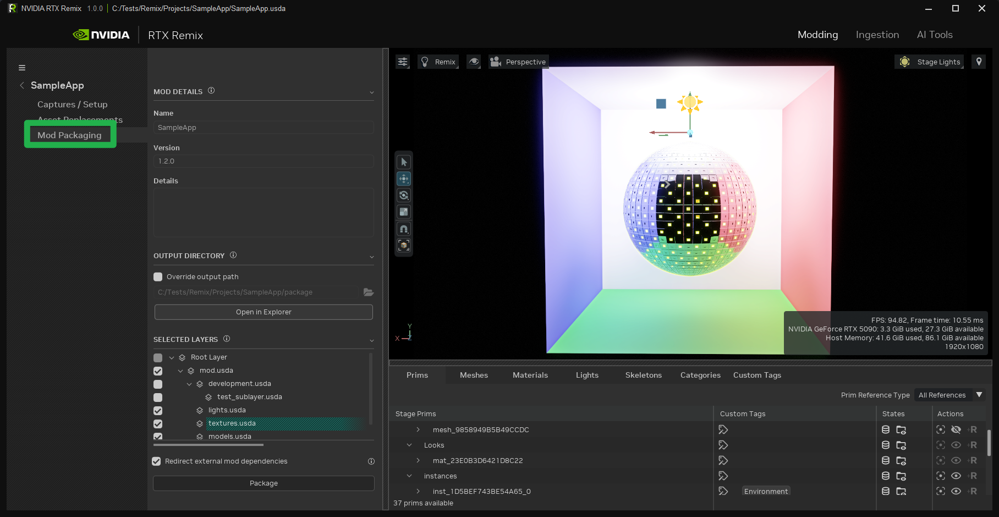

# Packaging Your Mod

When a mod is ready for distribution, the packaging process is necessary to ensure that all required elements, such as
assets, textures, and sublayers, are included within the project directory and that all references are relative and
self-contained.

The packaging process can be completed through a series of straightforward steps.

***

## Using the Packaging Tab

The packaging tab is accessible within the "Modding" page of the Toolkit interface, situated directly below the "Asset
Replacement" tab.



### Mod Details Panel

* **Name:** This identifier is used to identify the mod being packaged.
* **Version:** The specified version can be used for versioning the mod. This is useful for tracking changes and updates
  to the mod over time. It can be used in conjunction with the details to track changelogs.
* **Details:** This section provides a space for comprehensive information about the mod being packaged. This field
  accommodates arbitrary messages, allowing for diverse content as needed.

### Output Directory Panel

The output directory is set by default to the `package` subdirectory within the current project directory. This default
value can be overridden.

After the packaging process is complete, the output directory can be opened in Explorer by clicking the "Open in
Explorer" button.

```{note}
Zipping this directory facilitates easier sharing of the mod, making it ready for uploading and distribution on
platforms such as [ModDB](https://www.moddb.com/rtx/) or any other preferred location.
```

### Selected Layers Panel

This panel gathers the dependencies of the selected layers. Layers that are unchecked will be excluded from the
packaging process. This functionality is useful for excluding development layers, for example.

### Redirect External Mod Dependencies

This section allows for specifying how to handle external mod dependencies during the packaging process.

* **Redirect:** This option replaces reference paths from "./deps/mods/\<Name>" to "../mods/\<Name>". This requires both
  mods to be present in the `rtx-remix/mods` directory when setting up the game.
* **Copy:** Selecting this option copies the external references into the packaging directory. If there is uncertainty
  about which option to choose, selecting "Copy" is generally safer to ensure all dependencies are included in the
  package.

***

## Fixing Unresolved Assets

If unresolved assets are detected during the packaging process, the Toolkit will prompt for their resolution.


Unresolved assets can be fixed using three methods:

1. **Ignore:** This option proceeds with the packaging process while disregarding the unresolved assets. This is not
   recommended, as it may result in missing assets in the mod.
2. **Replace Asset:** This option allows for replacing the unresolved asset with a valid asset. The "Scan Directory"
   function facilitates finding assets with matching names in a new directory, which is useful if assets were moved and
   references were broken but the assets remain available.
3. **Remove Reference:** This option removes the reference to the unresolved asset from the project. This is useful if
   the asset is no longer required in the mod.

***
<sub> Need to leave feedback about the RTX Remix Documentation?  [Click here](https://github.com/NVIDIAGameWorks/rtx-remix/issues/new?assignees=nvdamien&labels=documentation%2Cfeedback%2Ctriage&projects=&template=documentation_feedback.yml&title=%5BDocumentation+feedback%5D%3A+) </sub>
