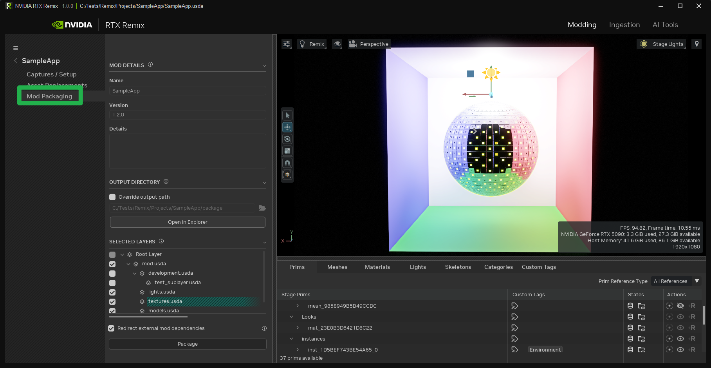
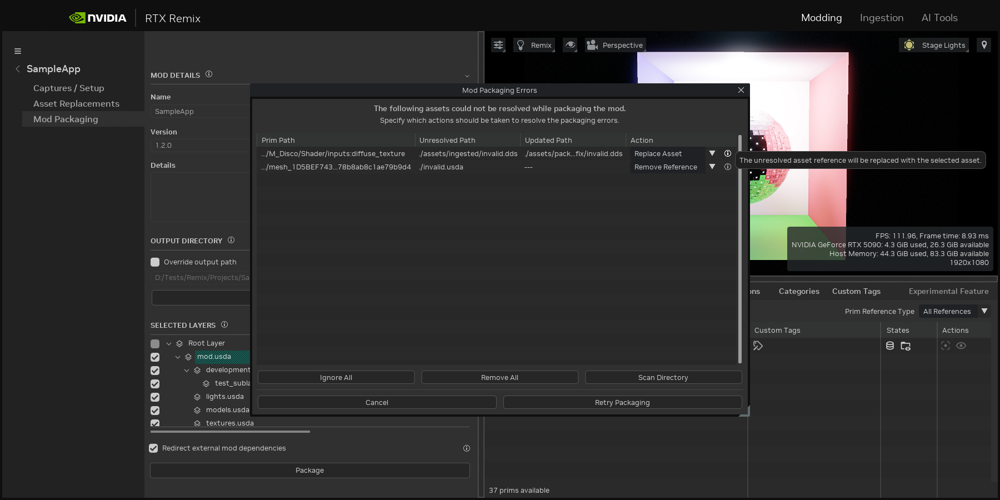

# Packaging Your Mod

When a mod is ready for distribution, the packaging process is necessary to ensure that all required elements, such as
assets, textures, and sublayers, are included within the project directory and that all references are relative and
self-contained.

The packaging process can be completed through a series of straightforward steps.

***

## Using the Packaging Tab

The packaging tab is accessible within the "Modding" page of the Toolkit interface, situated directly below the "Asset
Replacement" tab.



### Mod Details Panel

* **Name:** This identifier is used to identify the mod being packaged.
* **Version:** The specified version can be used for versioning the mod. This is useful for tracking changes and updates
  to the mod over time. It can be used in conjunction with the details to track changelogs.
* **Details:** This section provides a space for comprehensive information about the mod being packaged. This field
  accommodates arbitrary messages, allowing for diverse content as needed.

### Output Directory Panel

The output directory is set by default to the `package` subdirectory within the current project directory. This default
value can be overridden.

After the packaging process is complete, the output directory can be opened in Explorer by clicking the "Open in
Explorer" button.

```{note}
Zipping this directory facilitates easier sharing of the mod, making it ready for uploading and distribution on
platforms such as [ModDB](https://www.moddb.com/rtx/) or any other preferred location.
```

### Selected Layers Panel

This panel gathers the dependencies of the selected layers. Layers that are unchecked will be excluded from the
packaging process. This functionality is useful for excluding development layers, for example.

### Packaging Mode

This dropdown controls how external mod dependencies are handled during packaging.

* **Redirect dependencies:** This keeps references pointed at installed dependency mods by replacing paths from
  "./deps/mods/\<Name>" to "../mods/\<Name>". This creates the smallest package, but the dependency mods must also be
  installed in the `rtx-remix/mods` directory.
* **Import dependencies:** This copies the external references into the package and preserves the layered USD output.
  This produces a standalone mod package.
* **Flatten into one layer:** This first imports dependencies, then flattens the packaged result into one authored root
  USD layer. This also prunes packaged content so only assets still referenced by the flattened result are kept.

Packaging is non-destructive. The packaging process only writes to temporary packaging layers and the output package
directory. The source project and its sublayers are not modified during packaging. The only exception is when unresolved
asset fixes are explicitly applied through the fix dialog.

### RTX IO Packaging

The RTX IO Packaging controls optionally compress packaged DDS textures into RTX IO `.pkg` files after the normal
packaging process completes. Use this when you want the packaged mod to stream texture data through RTX IO in the RTX
Remix Runtime.

The controls in this section are:

* **Packaging mode:** Enables RTX IO compression for DDS textures in the packaged output. The source project is not
  modified.
* **Delete packaged DDS files after compression:** Removes the DDS files from the packaged output only after RTX IO
  compression succeeds. Leave this disabled if you want to keep the uncompressed DDS files for inspection or fallback
  testing.
* **Split package files:** Splits the generated RTX IO package files at the selected size. Use this when a mod has many
  textures and you want package files capped at a predictable size. Available presets are `1 GB`, `2 GB`, `4 GB`,
  `8 GB`, and `16 GB`.

After packaging with RTX IO compression, add this setting to the mod's `rtx.conf` so the runtime loads the generated
`.pkg` files:

```ini
rtx.io.enabled = True
```

If the packaged DDS files are deleted but RTX IO is not enabled in `rtx.conf`, the runtime will not have the DDS files
available as a fallback. Enable RTX IO before distributing a package that relies on the generated `.pkg` files.

***

## Fixing Unresolved Assets

If unresolved assets are detected during the packaging process, the Toolkit will prompt for their resolution.



Unresolved assets can be fixed using three methods:

1. **Ignore:** This option proceeds with the packaging process while disregarding the unresolved assets. This is not
   recommended, as it may result in missing assets in the mod.
2. **Replace Asset:** This option allows for replacing the unresolved asset with a valid asset. The "Scan Directory"
   function facilitates finding assets with matching names in a new directory, which is useful if assets were moved and
   references were broken but the assets remain available.
3. **Remove Reference:** This option removes the reference to the unresolved asset from the project. This is useful if
   the asset is no longer required in the mod.

***
<sub> Need to leave feedback about the RTX Remix Documentation?  [Click here](https://github.com/NVIDIAGameWorks/rtx-remix/issues/new?assignees=nvdamien&labels=documentation%2Cfeedback%2Ctriage&projects=&template=documentation_feedback.yml&title=%5BDocumentation+feedback%5D%3A+) </sub>
