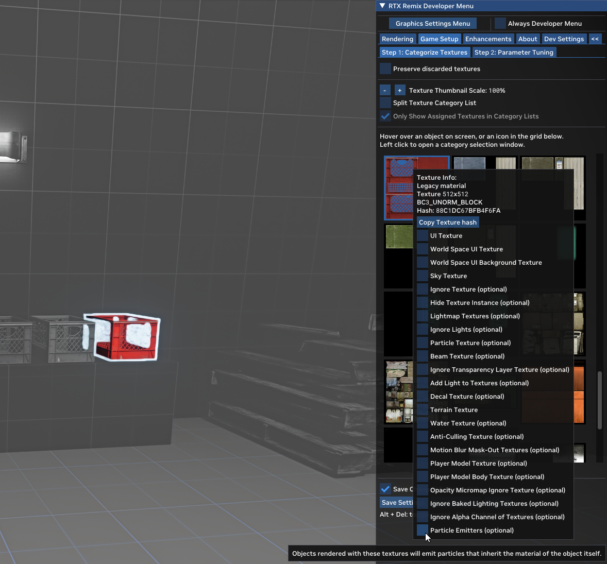
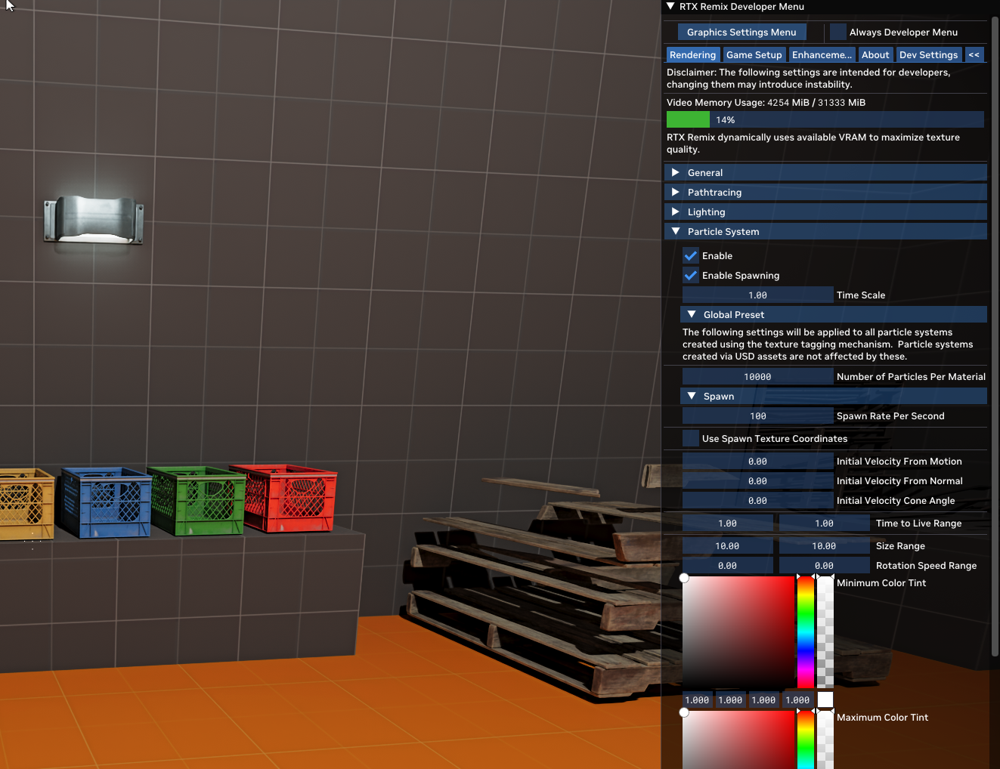
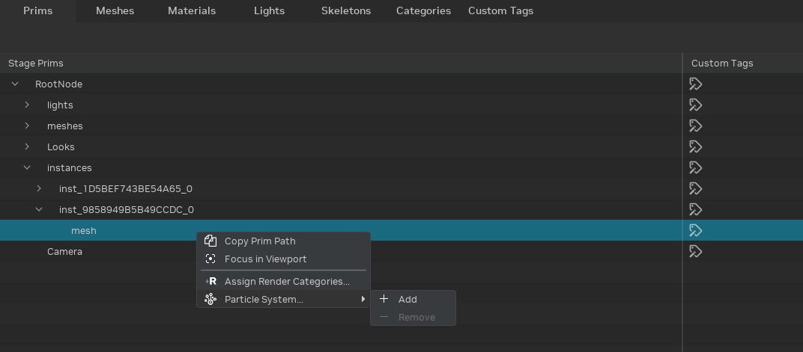
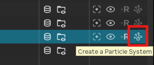
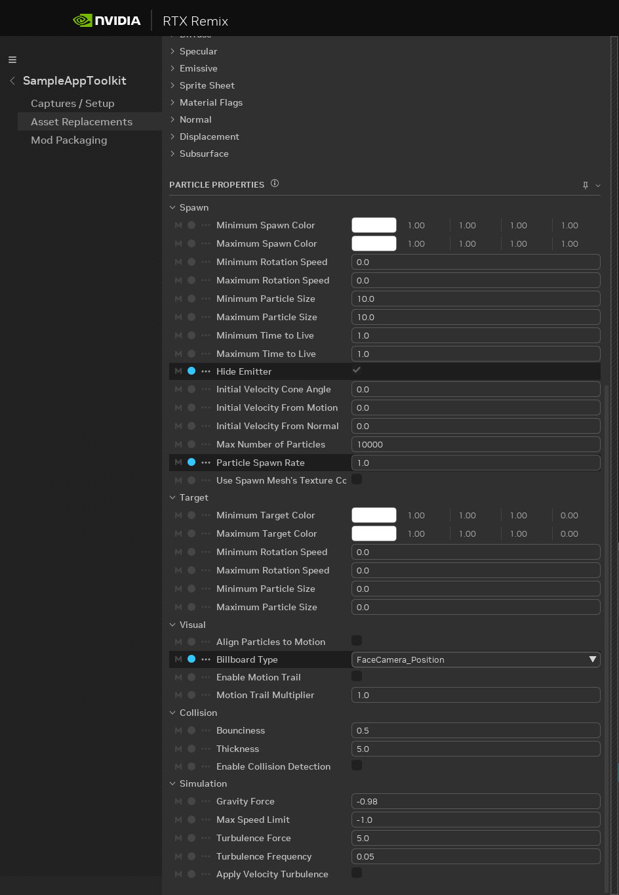
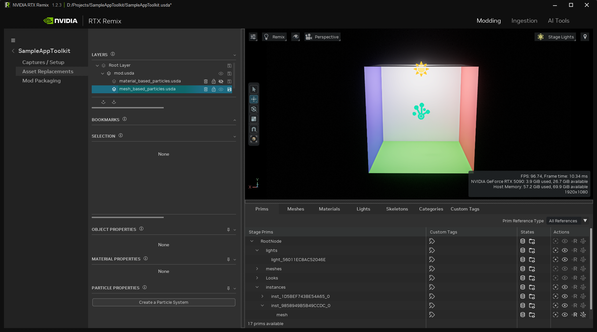
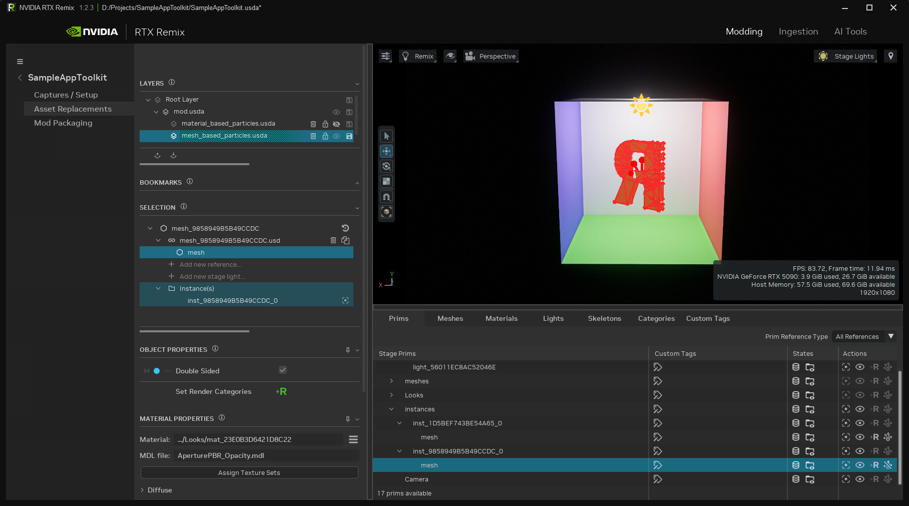
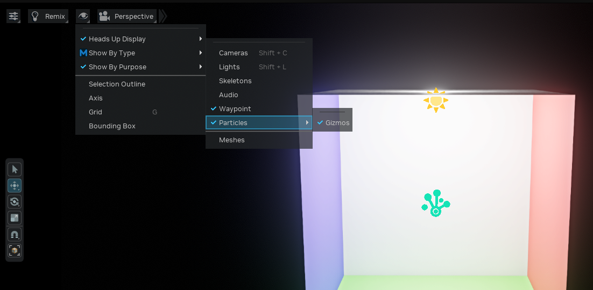

# Adding Particle Systems

You can now add ray traced particles to your Remix Mods…

# Editing in the Remix Runtime

## Turn any texture into a particle emitter

In the runtime, assigning a “Particle Emitter” [Render Category](../gettingstarted/learning-runtimesetup.md#understanding-render-categories) to any texture will create a particle system.

This is a quick and easy way to see particle effects in game. However there are a couple limitations.

1. All particles will use a single set of global settings
2. Can only be added to textures

### Tag a Texture



1. Open the Developer Settings
2. Go to "Game Setup" Tab
3. Click on a texture or right click on an object in the game.
4. Add the "Particle Emitters (optional)" category

### Tune Global Particle Settings



1. Open the Developer Settings
2. Go to "Rendering" Tab
3. Change the "Particle System > Global Preset" Settings

For more complex effects, you can build your particle systems in the Remix Toolkit…

# Editing in the Remix Toolkit

## Creating a Particle System

Right-click on a mesh or a material in the Stage Manager and you will see options to turn the mesh into an emitter or add a new emissive mesh as a child of that Prim.

Right click \-\> Add \-\> Particle System



You can also use the action buttons to create or remove particle systems on a prim. They will only be clickable on prims that can be made into a particle system.



Lastly, you can use the “Create Particle System” action in the properties pane.

To see an effect, you’ll need to set the “Spawn Rate Per Second” attribute at a minimum. From there you can dial in the look.


## Configuring a Particle System

### Particle Parameters



When a prim with the RemixParticleSystemAPI schema applied is selected in the app, you will see all the properties of a particle system in the properties panel.

For a full set of property descriptions see the [Remix Particle System Schema](https://github.com/NVIDIAGameWorks/dxvk-remix/blob/main/src/usd-plugins/RemixParticleSystem/schema.usda).

## Particle System Gizmo

1. To select a particle in the viewport, click on the blue spike icon. (Tip: Rectangle select also works to make sure you grab it.)
   
2. Once it’s selected you’ll see a hologram for hidden emitters or a wireframe outlining visible ones.
   


Particle Gizmos can be turned on and off in the viewport.



# RemixParticleSystemAPI

In order to support defining particle properties on both meshes and materials, we’ve added a USD API Schema that will give those prims that ability.

```
over "mesh_9858949B5B49CCDC"
{
    over "mesh" (
        active = true
        prepend apiSchemas = ["ParticleSystemAPI"]
    )
    {
        float primvars:particle:initialVelocityFromNormal = 1
        float primvars:particle:spawnRatePerSecond = 100
        token visibility = "inherited"
    }
}
```

# Creating Complex Particle Systems

To get more complicated effects you can use a number of replacement meshes to layer a number of different particle systems on top of each other. For example you can produce realistic looking fire with particles for flames, sparks and smoke.

## Controlling Particle look with Material Properties
Particles will take on properties of their emitters material, so you can get interesting effects by modifying those material properties.

## Animated Particles using a Sprite Sheet
Create Sprite image sequence and configure it according to these [instructions](../howto/learning-materials.md#animated-materials-using-a-sprite-sheet).

***
<sub> Need to leave feedback about the RTX Remix Documentation?  [Click here](https://github.com/NVIDIAGameWorks/rtx-remix/issues/new?assignees=nvdamien&labels=documentation%2Cfeedback%2Ctriage&projects=&template=documentation_feedback.yml&title=%5BDocumentation+feedback%5D%3A+) </sub>
