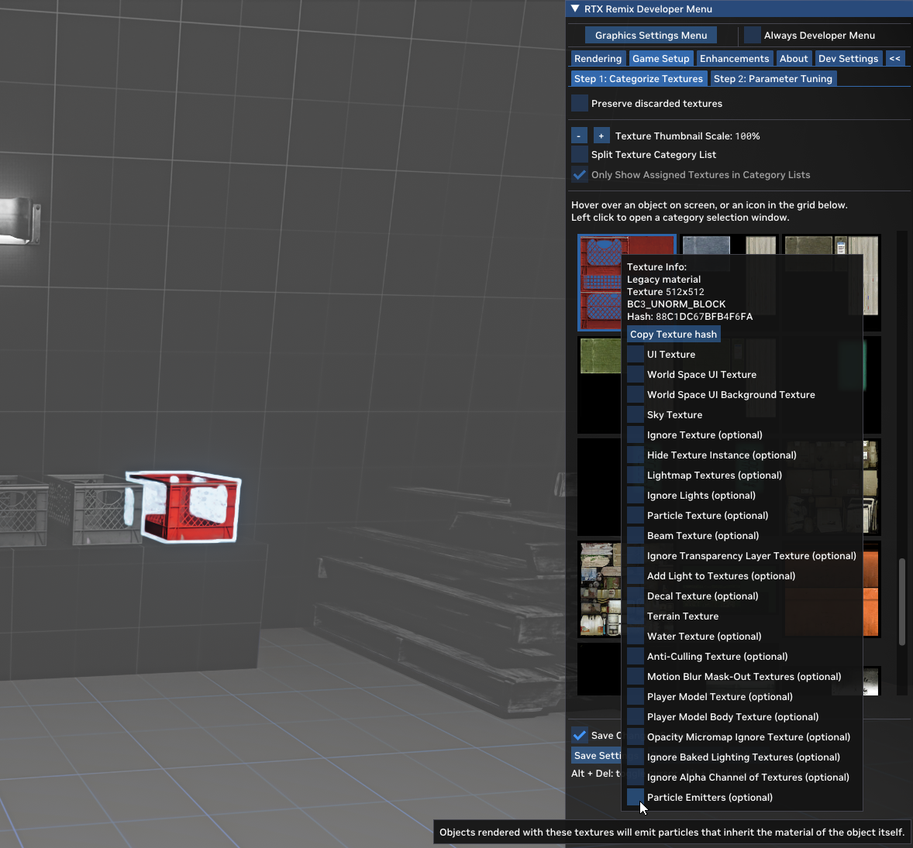
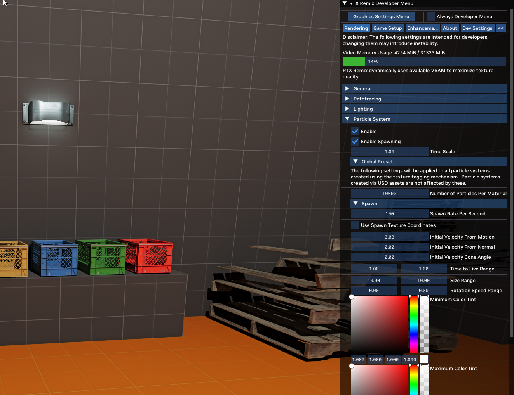
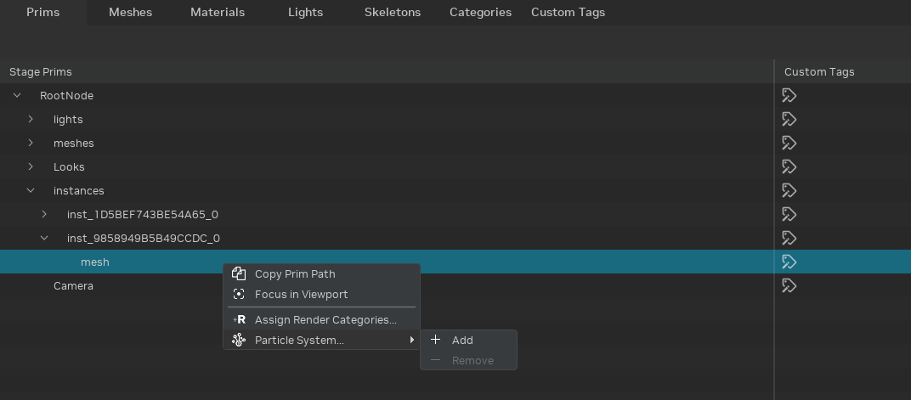
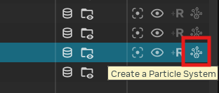
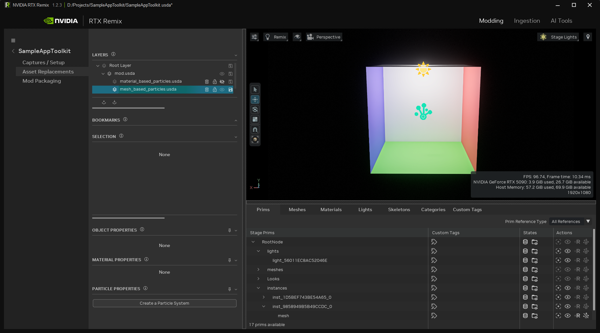
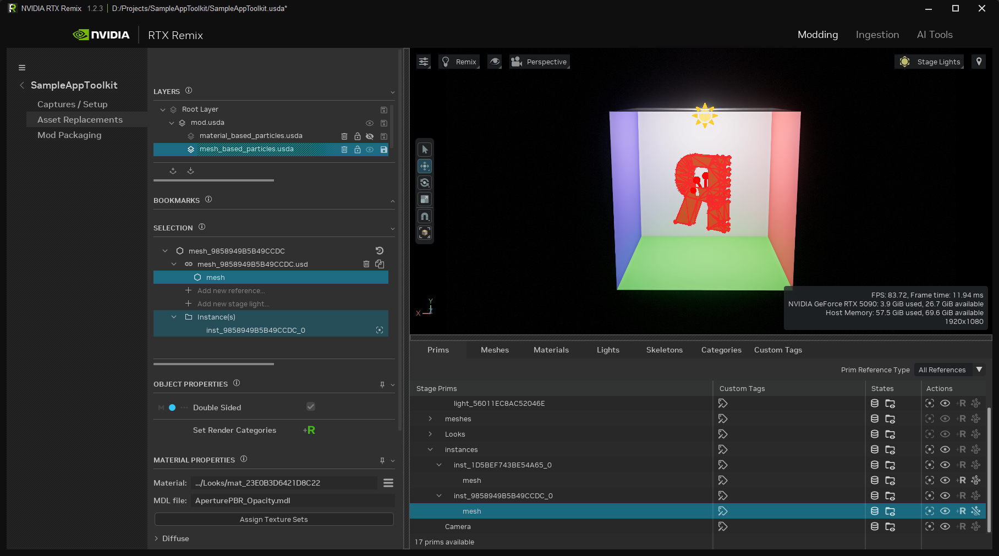
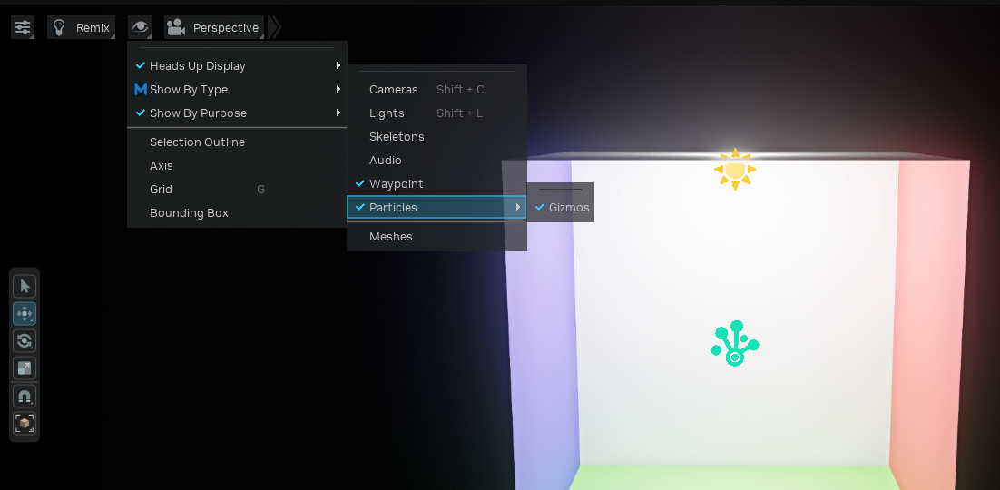
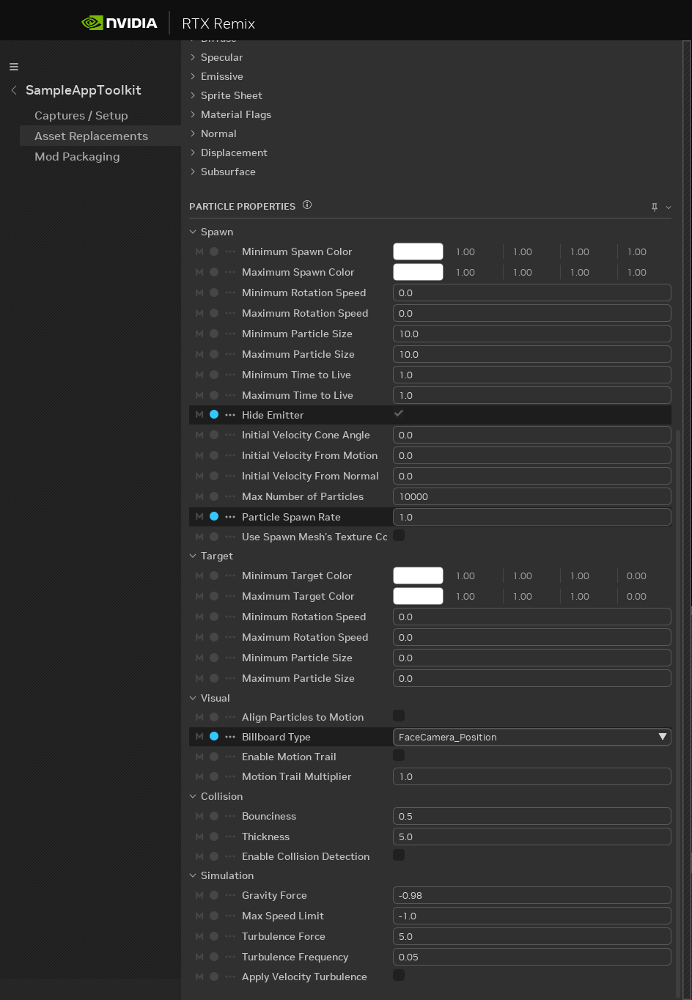
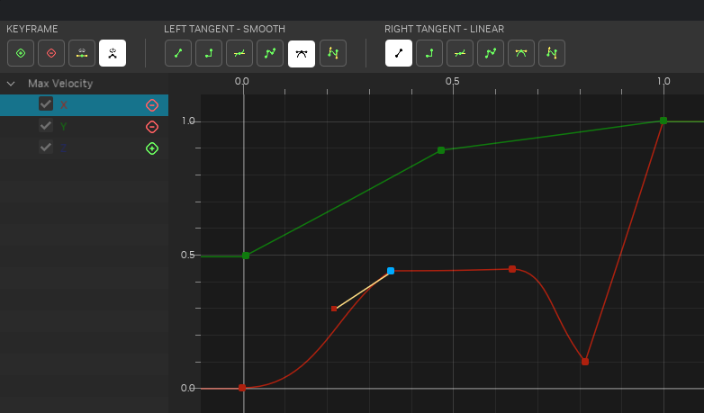

# Adding Particle Systems

RTX Remix lets you add ray-traced GPU particle effects directly to your mods. Particles are defined per-emitter using the
**ParticleSystemAPI** USD schema, giving each emitter its own independent set of parameters. The Particle System supports:

- Keyframe animation via the Curve Editor
- Physics behaviors including attractors, collision modes, and drag
- Visual controls for size, orientation, and sprite sheet playback

***

## Editing in the Remix Runtime

The Runtime is the quickest way to get particles into a game scene. You tag a texture as a particle emitter directly in
the Developer Settings, and all particles share a single global preset. This approach is ideal for rapid prototyping,
though for per-emitter control and advanced animation you will want to use the Toolkit.

### Turn Any Texture into a Particle Emitter

In the Runtime, assigning a "Particle Emitter" [Render Category](../gettingstarted/learning-runtimesetup.md#understanding-render-categories)
to any texture will create a particle system.

This is a quick and easy way to see particle effects in game. However there are a couple limitations:

1. All particles will use a single set of global settings
2. Can only be added to textures

**To tag a texture:**



1. Open the **Developer Settings**
2. Go to the **Game Setup** tab
3. Click on a texture or right-click on an object in the game
4. Add the **Particle Emitters (optional)** category

### Tune Global Particle Settings



1. Open the **Developer Settings**
2. Go to the **Rendering** tab
3. Change the **Particle System > Global Preset** settings

For animatable parameters such as color, size, and rotation speed, the Runtime exposes **Spawn** and **Target** value
controls. The particle interpolates linearly between these two values over its lifetime. This is the Runtime equivalent
of the Toolkit's Curve Editor — simpler, but sufficient for many effects.

```{tip}
If you are using the Remix Logic system alongside particles, save your `rtx.conf` when Logic graph effects are not
active to avoid Logic overrides being written into your particle configuration.
```

For more complex effects with per-emitter control and keyframe animation, use the Remix Toolkit.

***

## Editing in the Remix Toolkit

The Toolkit gives you full control over particle systems — one set of parameters per emitter, configured through the
Properties panel. Each particle emitter is stored as USD data in your mod's layer files, so effects carry over to the
Runtime automatically when you save your mod.

### Creating a Particle System

Right-click on any mesh or material prim in the **Stage Manager** to add a particle system directly to that prim:

**Right click -> Particle System... -> Add**

```{note}
The **ParticleSystemAPI** can be applied to mesh or material prims.
```



You can also use the action buttons in the **Stage Manager** to create or remove particle systems on a prim. The buttons
are only enabled on prims that support particle systems.



Lastly, you can use the **Create Particle System** action in the **Properties** pane.

To see an effect, set the **Spawn Rate Per Second** attribute to a non-zero value. From there you can dial in the look.

### Particle System Gizmo

1. To select a particle system in the viewport, click on the blue spike icon. Rectangle select also works if the icon
   is hard to click.
   
2. Once selected, you will see a hologram for hidden emitters or a wireframe outlining visible ones.
   

You can toggle particle gizmos on and off in the viewport menu.



## Configuring a Particle System

When a prim with the `ParticleSystemAPI` schema applied is selected, its properties appear in the **Properties** panel.




***

## Particle System Controls

```{seealso}
[Remix Particle System Schema](https://github.com/NVIDIAGameWorks/dxvk-remix/blob/main/src/usd-plugins/RemixParticleSystem/schema.usda) — complete parameter list with descriptions, default values, and valid ranges.
```

### Visual Controls

```{versionadded} 1.4
```

**2D Particle Size**

Particle size now has independent width and height (`minSize`/`maxSize` as Float2), enabling rectangular particles.
Both dimensions are animatable via the Curve Editor. Useful for raindrops (tall and narrow), leaves (wide and short),
or any effect where square billboards look unnatural.

```{versionadded} 1.4
```

**Motion Trail**

The **Enable Motion Trail** (`enableMotionTrail`) toggle elongates particles along their velocity vector, creating
a streak effect for fast-moving particles like sparks, meteors, or tracer rounds. The **Motion Trail Multiplier**
(`motionTrailMultiplier`, default `1.0`) scales the trail length — values above `1.0` lengthen the trail, values
below shorten it.

```{note}
Motion trail stretches the center of the particle quad; edges preserve the texture boundary. For best results,
use simple or uniform textures rather than detailed sprite sheets.
```

```{versionadded} 1.4
```

**Random Axis Flipping**

The **Random Axis Flipping** (`randomFlipAxis`) setting flips particle textures at spawn to break up repetitive
patterns in dense effects:

* **None** (default) — No flipping
* **Horizontal** — Random horizontal flip at spawn
* **Vertical** — Random vertical flip at spawn
* **Both** — Random flip in both directions at spawn

```{versionadded} 1.4
```

**Initial Rotation Deviation**

The **Initial Rotation Deviation** (`initialRotationDeviationDegrees`) adds a randomized starting angle to each
particle at spawn. The value (0–180 degrees) sets the randomization range. Combined with random axis flipping, this
makes even simple textures look varied across a particle field.

### Physics Controls

```{versionadded} 1.4
```

**Attractor**

The attractor introduces a force-field system. You define a point in world space with a configurable radius and force
strength. Particles within the radius are pulled toward the point (positive force) or pushed away from it (negative
force). Three parameters control this:

* `attractorPosition` — World-space coordinates of the force point
* `attractorForce` — Strength in cm/s²; positive attracts, negative repels
* `attractorRadius` — Falloff radius; particles outside this radius are unaffected

```{versionadded} 1.4
```

**Collision Modes** — Stop and Kill

The **Collision Mode** (`collisionMode`) parameter now supports three behaviors. Enable collision detection first with
the `enableCollisionDetection` toggle, then choose:

* **Bounce** (default) — Particles reflect off surfaces. **Bounciness** (`collisionRestitution`) controls velocity
  retained on impact: `1.0` = perfectly elastic, `0.0` = completely inelastic.
* **Stop** — Particles halt immediately on contact and remain at the collision point for the rest of their lifetime.
  Useful for snowflakes settling on a surface or debris coming to rest.
* **Kill** — Particles are destroyed on contact. Useful for raindrops that disappear on impact or sparks that
  extinguish when they hit the ground.

```{versionadded} 1.4
```

**Burst Duration**

The **Burst Duration** (`spawnBurstDuration`) parameter enables periodic bursting instead of continuous emission. A
value of `0` (default) means continuous spawning. Values greater than `0` spawn particles in bursts separated by the
specified number of seconds. Useful for explosions, muzzle flashes, and spark effects.

```{versionadded} 1.4
```

**Drag / Air Resistance**

The **Drag Coefficient** (`dragCoefficient`) slows particles over time, simulating air resistance. A value of `0`
(default) means no drag. Higher values cause particles to decelerate more quickly after spawn.

```{versionadded} 1.4
```

**Axis Restriction**

Three toggles constrain particle motion to specific axes or planes:

* `restrictVelocityX` — Prevents movement along the X axis
* `restrictVelocityY` — Prevents movement along the Y axis
* `restrictVelocityZ` — Prevents movement along the Z axis

Enable **Restrict Y** to create particles that move only horizontally (ground-level dust or fog). Enable **Restrict X**
and **Restrict Z** to create particles that only move vertically (rising smoke or falling rain).

### The Curve Editor

```{versionadded} 1.4
```

The Curve Editor replaces the simple start-and-end-value system with a full keyframe animation editor. Instead of
defining only how a parameter starts and ends, you can add multiple keyframes with tangent-controlled interpolation
across the particle's 0-to-1 lifetime.



The following parameters support curve-based animation:

* **Color** (min/max) — RGBA gradient over the particle's lifetime. The **Color Gradient** widget lets you place
  color stops along the particle's 0-to-1 lifetime to create a smooth animated color transition from spawn to death.
  The alpha channel of each stop controls opacity, making it the primary tool for fade-in and fade-out effects.
  The widget also includes built-in presets for common gradient patterns.
* **Size X / Size Y** (min/max) — Independent width and height, each animatable separately.
* **Rotation Speed** (min/max) — Rotation speed in revolutions per second over the particle's lifetime.
* **Max Velocity X / Y / Z** — Per-axis velocity cap, each independently animatable.

**Tangent types** control the interpolation shape between keyframes:

* **Linear** — Straight-line interpolation between keyframes.
* **Auto** — Automatically calculates smooth slopes through keyframes.
* **Smooth** — Rounded, continuous curve. Good for organic transitions like a fade-in.
* **Flat** — Horizontal approach and departure; useful for hold values and plateaus.
* **Step** — Holds the previous value until the keyframe, then immediately jumps. Useful for abrupt changes.
* **Custom** — Manual tangent slope control for precise curve shaping.

Tangents can also be **broken**, meaning the incoming and outgoing tangents at a single keyframe can have different
types. This enables effects like a slow fade-in that ends in an abrupt cutoff.

***

## Creating Complex Particle Systems

For elaborate effects like fire, you can layer multiple particle systems on different replacement meshes — one for
flames, one for sparks, and one for smoke — each with its own emitter mesh and properties.

### Controlling Particle Look with Material Properties

Particles inherit properties from their emitter's material, so adjusting material properties (emissive intensity,
base color, opacity) is an effective way to control the overall appearance of a particle effect without changing the
simulation parameters.

### Animated Particles using a Sprite Sheet

Create a sprite image sequence and configure it according to the
[Sprite Sheet instructions](learning-materials.md#animated-materials-using-a-sprite-sheet).

```{versionadded} 1.4
```

**Sprite Sheet Modes** — Override modes

The **Sprite Sheet Mode** (`spriteSheetMode`) controls how particles play back a sprite sheet animation:

* **Use Material Sprite Sheet** (default) — Uses the sprite sheet parameters defined in the bound material. All
  particles play in sync.
* **Override Material - Lifetime** — Each particle independently plays through the full sprite sheet from spawn to
  death, regardless of other particles. Ideal for effects where each particle completes its own animation cycle
  (expanding rings, flickering flames).
* **Override Material - Random** — Each particle randomly selects one sprite sheet frame at spawn and holds it for
  its entire lifetime. Useful for debris, leaves, or sparks where visual variety is more important than animation.

***

## The ParticleSystemAPI Schema

The `ParticleSystemAPI` is a USD applied schema that attaches particle simulation parameters to any mesh or material
prim. When you add a particle system in the Toolkit, this schema is written into your mod's USD layer:

```usda
over "mesh_9858949B5B49CCDC"
{
    over "mesh" (
        active = true
        prepend apiSchemas = ["ParticleSystemAPI"]
    )
    {
        float primvars:particle:initialVelocityFromNormal = 1
        float primvars:particle:spawnRatePerSecond = 100
        token visibility = "inherited"
    }
}
```

All particle attributes use the `primvars:particle:` prefix. The schema is shared between the Toolkit and the Runtime,
so any particle system authored in the Toolkit renders correctly in the Runtime without additional conversion. For the
complete parameter list with default values and valid ranges, see the [Remix Particle System Schema](https://github.com/NVIDIAGameWorks/dxvk-remix/blob/main/src/usd-plugins/RemixParticleSystem/schema.usda).

***

<sub> Need to leave feedback about the RTX Remix Documentation?  [Click here](https://github.com/NVIDIAGameWorks/rtx-remix/issues/new?assignees=nvdamien&labels=documentation%2Cfeedback%2Ctriage&projects=&template=documentation_feedback.yml&title=%5BDocumentation+feedback%5D%3A+) </sub>
