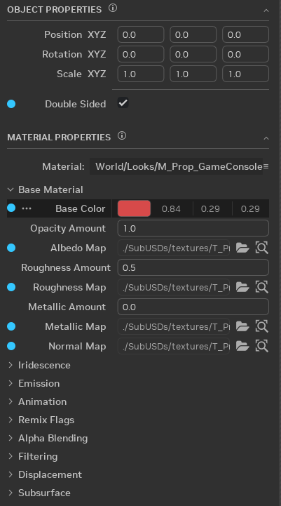
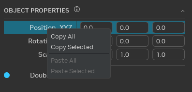

# Properties

The object and material properties expose related editable USD attributes for the selected objects.

- The blue dot displayed on some of the attributes indicate that the attribute is not the default USD value.
- The `...` and the darker background indicate that there are overrides for this attribute present on one or more layers. You can select this button to delete overrides from specific layers, or from all layers.

## Copy/Paste

Attributes can be copy/pasted using the right click context menu.

- `Copy All`: Copies all items in the tree view to the clipboard regardless of selection. This includes items in collapsed groups. Note that `OBJECT PROPERTIES` and `MATERIAL PROPERTIES` are two separate tree views and both cannot be copied at the same time.
- `Copy Selected`: Copies selected items to the clipboard. Selecting a group expands the selection to all children.
- `Paste All`: If anything in the clipboard is compatible with any items in the tree view, then this menu item is enabled and will paste matching items from the clipboard.
- `Paste Selected`: Works the same as `Paste All` except will only paste values to the selected items.

This context menu provides a way to copy the same attribute(s) between objects, but not between attributes on the same object.
