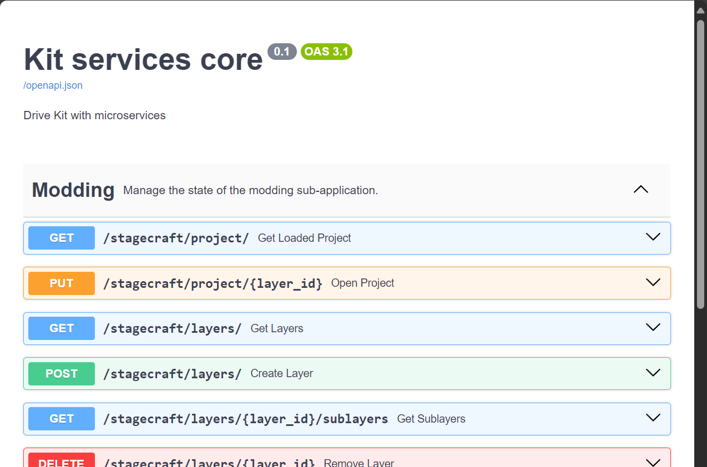

# Using the REST API

The RTX Remix REST API allows users to send and receive information to and from the Toolkit respectively, as well as
trigger actions in the Toolkit (such as starting the ingestion of a given file, etc.) via HTTP requests.

## Finding the Documentation

The documentation for the Remix Toolkit REST API can be accessed in two different ways: **Live**, and **Static**.

To view the list of endpoints exposed by the RTX Remix Toolkit REST API, follow these instructions:

### Live Documentation:

The live documentation is generated when the Remix Toolkit starts up and gives the ability to test the various endpoints
seamlessly directly from the documentation itself.

1) Start the Remix Toolkit
2) Visit the following website in your web browser: [`http://127.0.0.1:8011/docs#/`](http://127.0.0.1:8011/docs#/) or [
   `http://localhost:8011/docs#/`](http://localhost:8011/docs#/)

   **_NOTE: The 2 websites are equivalent and can be used interchangeably_**

### Static Documentation:

The static documentation doesn't require the Remix Toolkit to be installed and running.

1) Visit the [`API documentation page`](./learning-restapi-docs.html)

## Understanding the Documentation

When opening the documentation website, you will be greeted with a list of available endpoints. Every row is a unique
endpoint (HTTP Verb + URL) with a unique purpose.

Clicking on said row will reveal more information about the endpoint, including the expected path parameters,
query parameters, request body, etc.



### Endpoint Versioning

The Remix Toolkit REST API uses a versioning header to version every endpoint available individually. A dropdown with
the list of available endpoint version headers can be found in the endpoint details with the `Request body` text or
within the `Successful Response` sub-section of the `Responses` section. The header should have the following format:

```text
application/lightspeed.remix.service+json; version=1.0
```

## Testing the Endpoints

Endpoints can be easily tested directly in the documentation. To do so, follow these instructions:

1) Expand the endpoint your would like to test
2) Click the `Try it now` button
3) Fill in any required parameters/body
4) Click the `Execute` button
5) In the `Responses` section, look for the `Server response` subsection.
6) You should see a response `Code` and `Details` for the request you sent in the previous step.


***
<sub> Need to leave feedback about the RTX Remix Documentation?  [Click here](https://github.com/NVIDIAGameWorks/rtx-remix/issues/new?assignees=nvdamien&labels=documentation%2Cfeedback%2Ctriage&projects=&template=documentation_feedback.yml&title=%5BDocumentation+feedback%5D%3A+) </sub>
