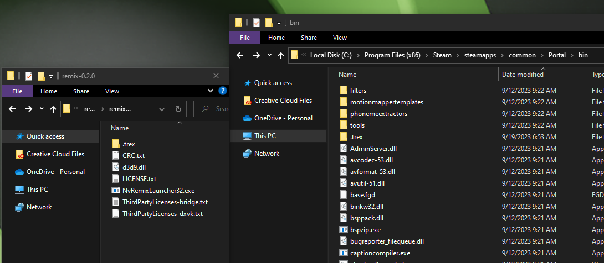
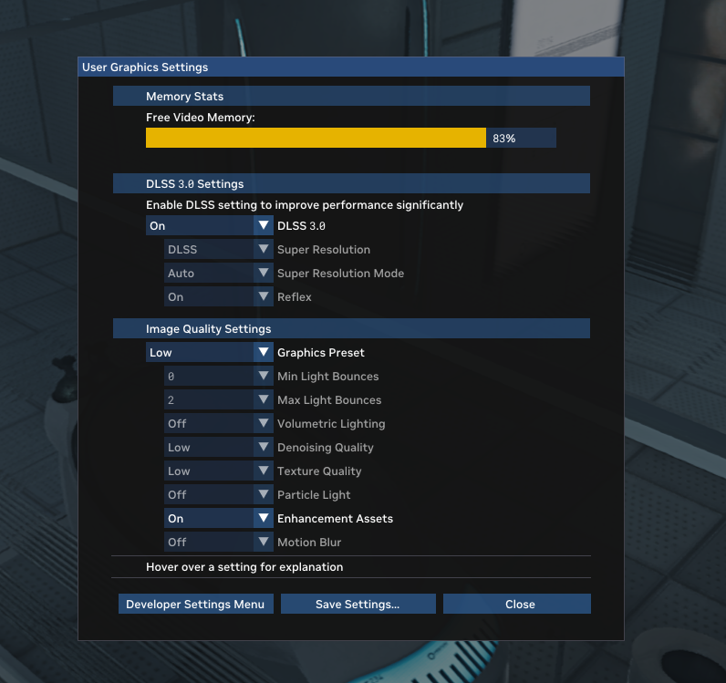

# Setup RTX Remix Runtime with your Game

When preparing your game, the best place to start is by coping the contents of the remix-0.1.0 directory into the game’s directory, right next to the main executable of the game. You should end up with the d3d9.dll and .trex/ folder sitting right next to the main game executable. 
> ⚠️ Some games will search for d3d9.dll in a different directory other than the directory of the main game executable. For example, Source Engine games will search in the bin directory next to the main game executable for d3d9.dll instead.

Once RTX Remix files are in place, you can start the game normally. You can verify RTX Remix is working by checking for the splash message at the top of the screen when the game starts. It should say: “Welcome to NVIDIA Remix… ” and provide hotkey information to access the Remix menus.

## Support for Other Graphics APIs
While support for D3D9 is included in Remix out of the box, games that use other graphics APIs can also be made to work by utilizing translation layers that target D3D9. You will have to acquire these separately. For example, D3D8 games can be supported through D3D8to9 ([link](https://github.com/crosire/d3d8to9)).

1. Open the folder that contains the source files of the game you wish to mod.
2. Locate where the executible (.exe) file is stored.  This file is usually found inside a folder named "bin".
3. Copy and paste the Contents of the RTX Remix Runtime folder into the folder that contains the executible (.exe) file 

4. Ensure that the d3d9.dll file from the RTX Remix folder copies over the d3d9.dll file in the game folder.
5. Now, run the game.  If you can use  **Alt + X** to open up the user-end **User Graphics Settings** Remix menu, then you've successfully installed the Runtime 

## Performing Per Game Setup
If this is the first time RTX Remix is added for a given game, you may need to do some setup in order to get game menus and the game itself to display properly. You will need to open the RTX Remix developer menu to do this (more detailed documentation on this menu below).

1. Press Alt-X on the keyboard to bring up the User Graphics Settings Menu, and from here select Developer Settings Menu.
2. In Developer Settings, choose the tab for Game Setup, and then go to Step 1 – UI Textures. This section will give you a visual list of textures in the current scene. You need to tag every texture associated with UI components by clicking on them. This will let RTX Remix handle them properly, and not confuse them with in-game textures.
3. Once done, chances are you will be seeing the main menu of the game render correctly, as well as the game world itself.
4. Finally, press Save Settings at the bottom of the menu, to store your texture tagging configuration in a file called rtx.conf, which is generated next to your game executable. This way, you won’t have to go through setup again when restarting the game.
5. You can always return to the UI tagging menu if you encounter new UI textures while exploring the game.

With UI setup out of the way, you can perform an additional test to ensure RTX Remix is functioning correctly.

1. Go to the Enhancements tab in the RTX Remix Developer Menu, and press Capture Frame in USD.
2. This will create your first capture of the game, which you can use to remaster assets, materials and lights. Capture files will be placed in a special folder called rtx-remix/captures – this will be placed next to the game executable, when first created. The rtx_remix folder is also where pre-made RTX Remix mods will go, under folder mods.

> 📝 If you are having trouble, try launching your game in Direct X v.7 or lower

> ⚠️ Per game setup may be different depending on the game you are trying to remaster.  Join the [RTX Discord Community](http://discord.gg/rtxremix) where you can check out the **Remix-Projects** channel for help for the game you wish to remaster!