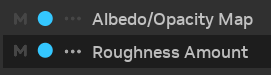

# Understanding the Toolkit

RTX Remix projects typically progress through three key stages: [project setup](#project-setup),
[mod authoring](#mod-authoring), and [mod packaging](#mod-packaging). The "Modding" page within the application provides
dedicated tabs for each of these steps.

***

## Project Setup

The `Project Setup` tab is primarily used to manage the currently loaded capture layer, as the project wizard
streamlines the remaining setup processes.

```{seealso}
Refer to the [Creating a New Project](../gettingstarted/learning-toolkitsetup.md#creating-a-new-project) section for
comprehensive information on the project wizard and the project creation workflow.
```

***

## Mod Authoring

The `Asset Replacements` tab is the primary workspace for authoring your mod. This tab features various panels that
enable the visualization and editing of diverse information pertaining to your mod. The subsequent sections will provide
a detailed explanation of the panels within this tab.

### Layers Panel

The Layers panel is a powerful tool for managing the layers within your project. Layers serve to organize and segregate
different aspects of your mod, facilitating collaborative workflows and enabling focused editing of specific elements
without impacting others.

Adhering to the guidelines outlined in
the [Project Organization Using Layers](learning-bestpractices.md#project-organization-using-layers) section is
recommended for effective layer management.

```{seealso}
USD Layers can initially present a counterintuitive concept, particularly for those unaccustomed to their behavior.
Unlike traditional hierarchical structures where child layers typically override parent properties, USD Layers operate
on an aggregation principle. Parent layers exert a stronger influence (higher opinion strength) than children layers,
effectively determining how properties are ultimately resolved.

For a deeper understanding of layers and composition arcs, consult
the [OpenUSD Layer Stack](https://openusd.org/release/glossary.html#usdglossary-layerstack) documentation.
```

The Layers panel offers the following functionalities:


* **Expand Layer Items**: Layers can be recursively composed of sublayers, forming a hierarchical tree structure.
  Expanding layer items reveals each layer's sublayers.
* **Layer Actions**: A range of actions can be performed on layers. Certain actions may be restricted on specific
  layers; hovering over the icons will display a tooltip explaining any such restrictions.
* **Setting the Edit Target**: The edit target, indicated by a teal hashed background, is the layer that will be
  modified when scene changes are made. To set the edit target, click the
  {.svg-icon}
  icon associated with the desired layer.
* **Creating/Importing Sublayers**: Sublayers can be created or imported by first selecting a valid layer and then
  clicking the
  {.svg-icon} or
  {.svg-icon}
  icons located at the bottom of the panel. These buttons are enabled only when a valid layer for the respective action
  is selected.
* **Context Menu**: The Layers panel context menu (accessed by right-clicking) provides additional actions that can be
  performed on layers, such as transferring the contents of a layer.

```{tip}
The scroll bar at the bottom of each panel allows for both horizontal scrolling and vertical resizing of individual
panels, enabling users to view more of the panel's content.
```

***

### Bookmarks Panel

Bookmarks provide a powerful mechanism for quick navigation to specific locations within the scene. They can be used to
mark important objects or group components of larger objects.

Utilizing bookmarks in conjunction with Stage Manager tags can enhance scene navigation efficiency and ensure important
assets are easily tracked.


Creating a bookmark involves selecting the "Create a new bookmark..." entry and adding items to it. By default, all
currently selected items are added to the new bookmark. Additional items can be added by selecting the desired objects
and clicking the {.svg-icon}
icon.

Removing items from a bookmark is straightforward: select the bookmark and click
the {.svg-icon} icon.

Bookmarks can be deleted entirely by clicking
the {.svg-icon}
icon.

Nesting bookmarks is also supported. To nest a bookmark, simply drag and drop the bookmark into the target bookmark.

```{tip}
The Bookmarks panel employs a "secondary" selection concept. When a bookmark is selected, but only a subset of the items
within it are also selected in the scene, the bookmark is highlighted with a faint color. Conversely, if all items
within the bookmark are selected in the scene, the bookmark is highlighted with a more vivid color.

Clicking on a bookmark will select all the items contained within it.
```

***

### Selection Panel

Understanding the Selection panel is essential for effective use of the Properties panels, as the latter dynamically
displays content based on the current selection.


The most crucial aspect of the Selection panel is the type of the currently selected item. Icons preceding the item
names indicate their type:

* {.svg-icon}:
  **Mesh**. Meshes are transformable and should have an associated material.
* {.svg-icon}:
  **Transform** (_Xform_). Transforms can be manipulated (moved, rotated, scaled) but do not possess associated
  materials.
* {.svg-icon}:
  **Light**. Lights are transformable and have adjustable light properties.
* {.svg-icon}:
  **Reference**. References can be replaced with other assets, duplicated, or removed from the scene. They are not
  directly transformable and do not have material properties.

```{seealso}
Refer to the [Setting Up Asset Replacements](learning-assets.md) section for detailed information on references and
their management.

Consult the [Relighting a Game](learning-lighting.md) section for comprehensive information on adding and editing
lights.
```

***

### Object Properties

The Properties panels, comprising the [Object Properties](#object-properties)
and [Material Properties](#material-properties) panels, are the most frequently used components of the RTX Remix
Toolkit. These panels are central to the modding workflow, providing the means to modify nearly every aspect of the
game's visual elements. Through these interfaces, users can replace original game meshes with newly authored assets,
configure all material properties including the assignment of textures, and adjust the attributes of any lights present
in the scene. Furthermore, the Properties panels enable the transformation of meshes (translation, rotation, and scale),
offering fundamental control over the placement and appearance of objects within the remastered game world. A thorough
understanding of these panels is crucial for effectively realizing creative visions and achieving desired visual
fidelity in RTX Remix projects.

The Object Properties panel provides the means to modify object attributes within the scene. The panel's content
dynamically adapts to reflect the properties of the selected object(s).

For example:

* **Reference Selection**: When a reference is selected, the panel displays the reference file path. These properties
  enable the addition, removal, or replacement of references within the mod.

  

* **Transformable Item Selection (XFormable)**: Selecting a transformable item presents the transform properties. These
  properties facilitate the manipulation of the object's position, rotation, and scale within the 3D space.

  

* **Light Selection**: The panel displays the light properties when a light source is selected. These properties allow
  for the adjustment of light attributes, such as color and intensity.

  

* Furthermore, this panel allows the assignment of Render Categories to various objects within the scene, influencing how
  they are rendered by the RTX Remix Runtime.

***

### Material Properties

The Material Properties panel allows for the modification of material attributes within the scene. The panel's content
displays the shader inputs available, as defined by the selected MDL file.


This panel also offers the functionality to toggle materials between translucent and opaque states, depending on the
original material's characteristics.

Additionally, it enables the assignment of complete texture sets to the material through drag-and-drop actions or by
clicking the "Assign Texture Set" button.

***

### Additional Properties Panels Features

#### Properties Pinning

The current selection can be retained within the properties panel by clicking the pin icon located in the top right
corner of the panel. This feature allows the properties panel to remain open and focused on a specific item while
different objects are selected in the scene.


#### Attribute State

Each attribute within the properties panel features multiple state indicators that provide immediate information
regarding the current state of the selection.



* The {.svg-icon}
  icon indicates
  whether the attribute exhibits varying values across the selected objects. If the
  attribute holds the same value for all selected objects, this icon appears disabled. If the selected items possess
  differing attribute values, the icon becomes brighter and colored. Hovering over this icon displays a tooltip
  containing details about the selection.
* The circle icon indicates whether the attribute value matches the default value. If the attribute value is the
  default, this icon appears disabled. If the attribute value deviates from the default, the icon becomes brighter and
  colored. Clicking the icon resets the value to its default. Hovering over this icon displays a tooltip providing
  information on the selection.
* The {.svg-icon} icon
  and the
  darker background signify whether the attribute has been overridden. If the attribute has
  been overridden, this icon becomes brighter and colored, and the background darkens. If the attribute is not
  overridden, the icon appears disabled, and the background retains its default color. Clicking the icon reveals a menu
  enabling the removal of all overrides or overrides from specific layers.

#### Copy / Paste Values

An efficient method for transferring values between objects involves utilizing the context menu within the properties
panel. Right-clicking any selected properties will present a context menu with the following options:


* `Copy All`: Copies all items within the tree view to the clipboard, irrespective of the current selection. This
  includes items within collapsed groups.
  ```{note}
  `OBJECT PROPERTIES` and `MATERIAL PROPERTIES` constitute two distinct tree views, and simultaneous copying from both
  is not supported.
  ```
* `Copy Selected`: Copies the currently selected items to the clipboard. Selecting a group expands the selection to
  encompass all its child items.
* `Paste All`: If the clipboard contains data compatible with any items in the tree view, this menu item becomes enabled
  and will paste the matching items from the clipboard.
* `Paste Selected`: Functions similarly to `Paste All` but restricts pasting values only to the items currently
  selected.

```{important}
This context menu facilitates the replication of the same attribute(s) between different objects, but not between
different attributes of the same object.
```

***

### Stage Manager

The Stage Manager in the RTX Remix Toolkit is a robust tool designed for effective management and visualization of stage
data.

The tabs located at the top provide convenient switching between different views of your stage data. Each tab offers a
unique set of filters and columns that can be customized to align with specific workflow requirements. This adaptability
enables the grouping of data in a manner that enhances comprehension and management of your stage.


### Performance Considerations

The Stage Manager automatically updates in response to changes in your stage data. These updates occur asynchronously,
preventing UI blocking. However, with a very large number of prims, performance may be impacted, potentially slowing
down the Stage Manager.

If the Stage Manager begins to impede workflow efficiency, it can be disabled using
the [Optional Features](../toolkitinterface/remix-toolkitinterface-layouttab.md#mod-setup) option accessible via the
hamburger menu. This feature grants control over the Stage Manager's usage, ensuring it remains a productivity aid.

```{important}
Optional features settings are persistent across RTX Remix Toolkit restarts, eliminating the need to repeatedly enable
or disable the Stage Manager.
```

***

## Mod Packaging

The `Mod Packaging` tab is the central location for preparing your mod for distribution to other gamers.

```{seealso}
Consult the [Packaging Your Mod](learning-packaging.md) section for detailed instructions on mod packaging and sharing.
```

***

## Telemetry

The RTX Remix Toolkit collects anonymous usage data to help us understand how users interact with the application and
identify areas for improvement. This data helps us make the toolkit more user-friendly and resolve issues in a timely
manner.

The telemetry data is collected by the `omni.flux.telemetry.core` extension, which is enabled by default but can be
disabled by overriding the `/exts/omni.flux.telemetry.core/enabled` setting.

```{seealso}
See the [Overriding Settings](#overriding-settings) section of the documentation for more information on how to
override the telemetry setting.
```

***

## Advanced Features

```{warning}
The following sections provide information on features for advanced users.

Using these features incorrectly can cause the application to crash or behave unexpectedly.
```

***

### Alternative Application Executables

The RTX Remix Toolkit provides many alternative executables for different purposes.

A few examples of alternative application executables are listed below.

All of the application executables are located in the
[RTX Remix Toolkit installation directory](../remix-faq.md#how-can-i-locate-the-rtx-remix-toolkit-installation-folder).

| Application                        | Executable                                | Description                                                                                                                                                                   |
|------------------------------------|-------------------------------------------|-------------------------------------------------------------------------------------------------------------------------------------------------------------------------------|
| Release RTX Remix Toolkit          | `lightspeed.app.trex.bat`                 | The standard version of the RTX Remix Toolkit that is used for production purposes.                                                                                           |
| Developer RTX Remix Toolkit        | `lightspeed.app.trex_dev.bat`             | A special version of the RTX Remix Toolkit that is used for development purposes. It exposes additional menus and settings that are not available in the release application. |
| Standalone RTX Remix Ingestion CLI | `lightspeed.app.trex.ingestcraft.cli.bat` | A CLI tool that can be used to ingest assets into the RTX Remix Toolkit without needing to launch the complete RTX Remix Toolkit.                                             |

```{seealso}
Refer to the
[Utilizing the Ingestion Tool CLI (Advanced)](learning-ingestion.md#utilizing-the-ingestion-tool-cli-advanced)
section of the documentation for more information on the standalone ingestion application.
```

***

### Overriding Settings

The RTX Remix Toolkit provides a mechanism for overriding certain settings within the application. This feature is
particularly useful for users who require customized configurations that deviate from the default settings.

To override a setting:

1. Open a command prompt and navigate to the
   [RTX Remix Toolkit installation directory](../remix-faq.md#how-can-i-locate-the-rtx-remix-toolkit-installation-folder).

   For example, run the following command:

    ```bash
    cd "C:\Program Files\NVIDIA Corporation\RTX Remix"
    ```

2. Run the application executable file with the desired settings.

   For instance, to disable telemetry for the release version of the RTX Remix Toolkit, run the following command:

    ```bash
    ./lightspeed.app.trex.bat --/exts/omni.flux.telemetry.core/enabled=0
    ```

   See the [Alternative Application Executables](#alternative-application-executables) section for more information on
   the different application executables.

#### Getting Available Settings

To get a list of available settings:

1. Open the Developer RTX Remix Toolkit (See [Alternative Application Executables](#alternative-application-executables)
   section for more information)

2. Open the `Script Editor` window.
    1. Click the `Window` menu
    2. Select `Script Editor`.

   

3. Copy the following script into the `Script Editor` window:

   ```python
   import carb
   print(carb.settings.get_settings().get("/"))
   ```

4. Click the `Run` button in the bottom left corner.

5. The output will be displayed at the top of the `Script Editor` window and in the command prompt used to open the
   Developer RTX Remix Toolkit.

```{note}
The output will likely be overwhelming due to the large number of settings available. Formatting the output may help
with readability.

Getting sub-sections of the settings will greatly reduce the amount of settings output.

For instance, to get the settings for the `omni.flux.telemetry.core` extension, run the same command as above but
replace `/` with `/exts/omni.flux.telemetry.core`.
```

***
<sub> Need to leave feedback about the RTX Remix Documentation?  [Click here](https://github.com/NVIDIAGameWorks/rtx-remix/issues/new?assignees=nvdamien&labels=documentation%2Cfeedback%2Ctriage&projects=&template=documentation_feedback.yml&title=%5BDocumentation+feedback%5D%3A+) </sub>
