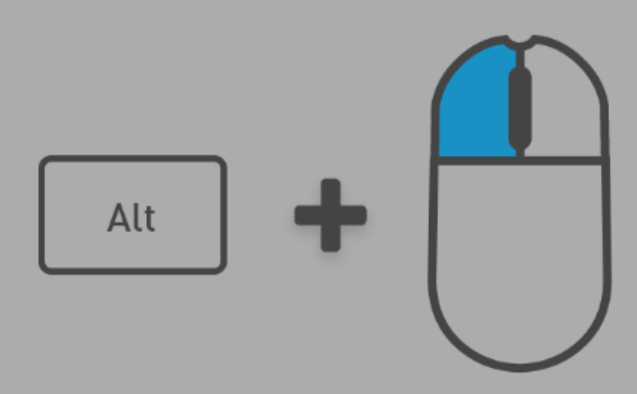
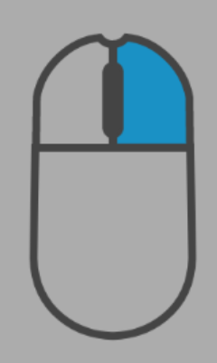
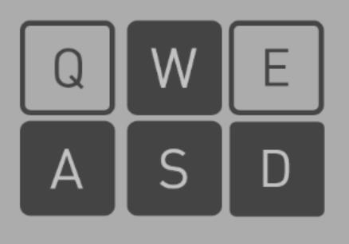
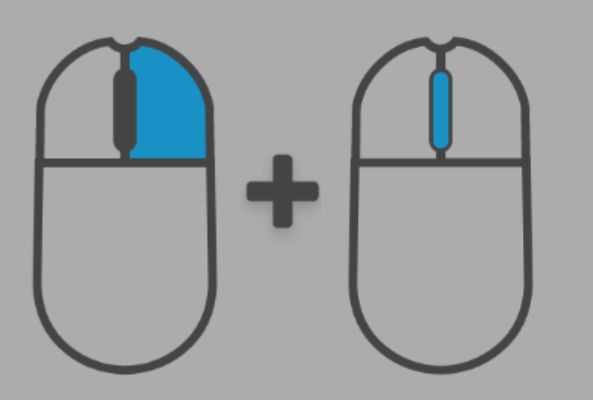
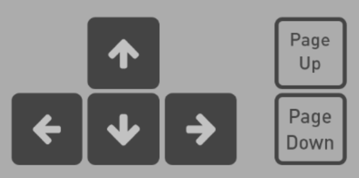
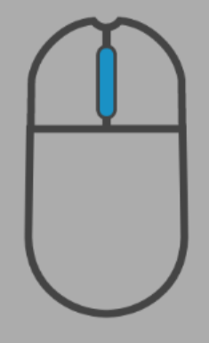

# Viewport Navigation

## Navigation Overview

| Navigation | Description | Image Reference |
|:-----|:-----|:---------------:|
| **Home** | Use the **Home** control to bring the camera back to where the scene started. | |
| **Orbit**    | Rotate the camera around a point by using the **Orbit** control. It's like circling around an object while keeping it in view. |  |
| **Look**     | To **Orbit**, choose an object with the focus, hold Alt, and left-click while moving the mouse. |  |
| **Walk**     | Move the camera in a straight line relative to the current view. Hold the right mouse button to **Look**, and use the arrow keys (W, A, S, D, Q, E) to **Walk**. Alternatively, use the arrow keys plus Page Up and Page Down. Adjust walking speed by scrolling while holding the right mouse button.|          |
| **Pan**      | Move the camera parallel to the viewpoint by holding the middle mouse button and moving the mouse. |  |
| **Focus**    | Zoom in on an object with the **Focus** control. Click an object, press F to **Focus**, and **Orbit** around it. Press F again to un-focus. | |
| **Dolly**    | Move the camera forward or backward by scrolling on your mouse. |  |
| **Teleport** | Instantly move the camera to a specific point and direction. Hold Y and move the mouse to set the target. | |

## Navigation Keyboard Shortcuts

* RMB = Right Mouse Button

| Name | Input | Description |
|:-----|:-----|:-----|
| **Home** | H | The **Home** control returns the Viewport camera to the scene’s point of origin. |
| **Focus** | F | The **Focus** control zooms the Viewport camera in on a specific object. |
| **Teleport** | Y | The **Teleport** control instantly moves the Viewport camera to a specific point, Looking in a specific direction. |
| Up (Walk) | RMB + W | Moves forward |
| Left (Walk) | RMB + A | Moves left |
| Down (Walk) | RMB + S | Moves backward |
| Right (Walk) | RMB + D | Moves right |
| Page Up (Walk) | RMB + Q | Moves down |
| Page Down (Walk) | RMB + E | Moves up |

***
 Need to leave feedback about the RTX Remix Documentation?  [Click here](https://github.com/NVIDIAGameWorks/rtx-remix/issues/new?assignees=nvdamien&labels=documentation%2Cfeedback%2Ctriage&projects=&template=documentation_feedback.yml&title=%5BDocumentation+feedback%5D%3A+) 
