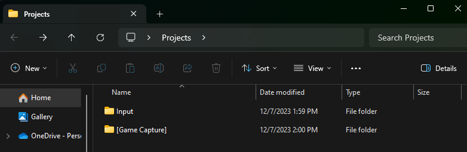
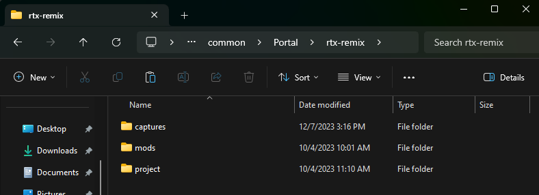
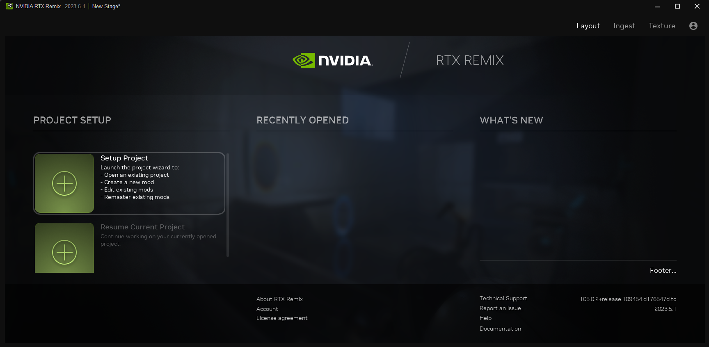
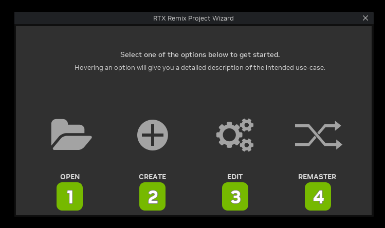
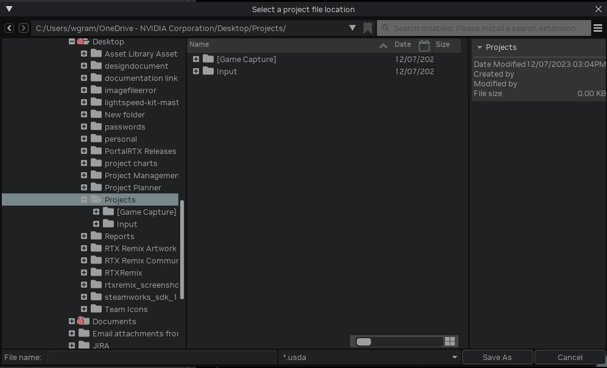
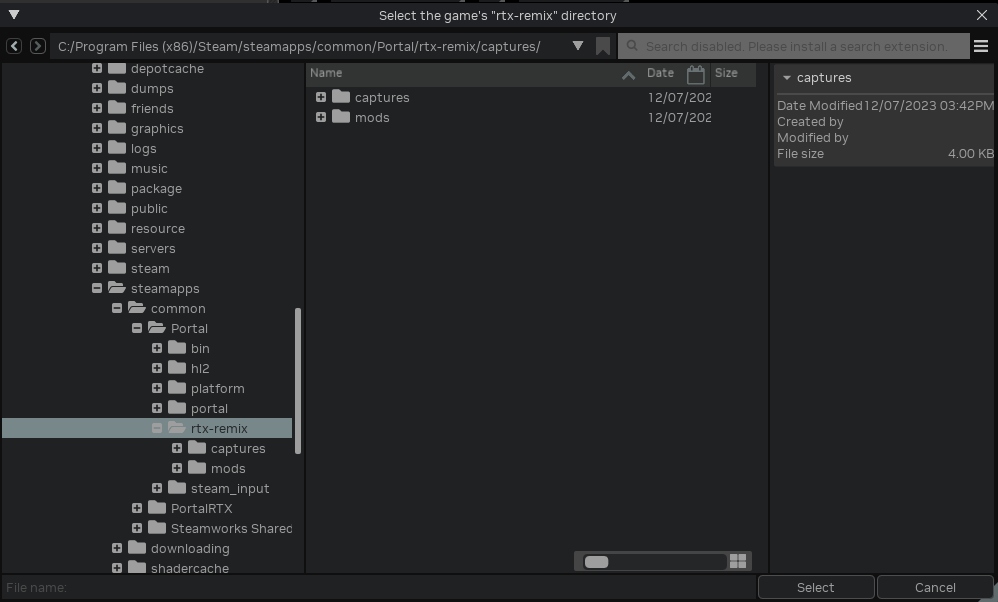
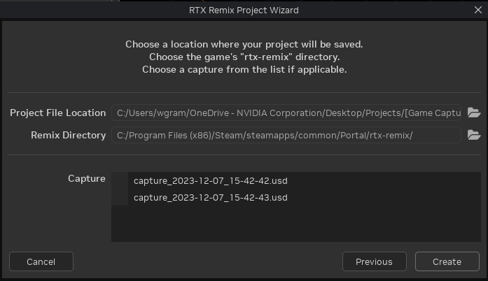
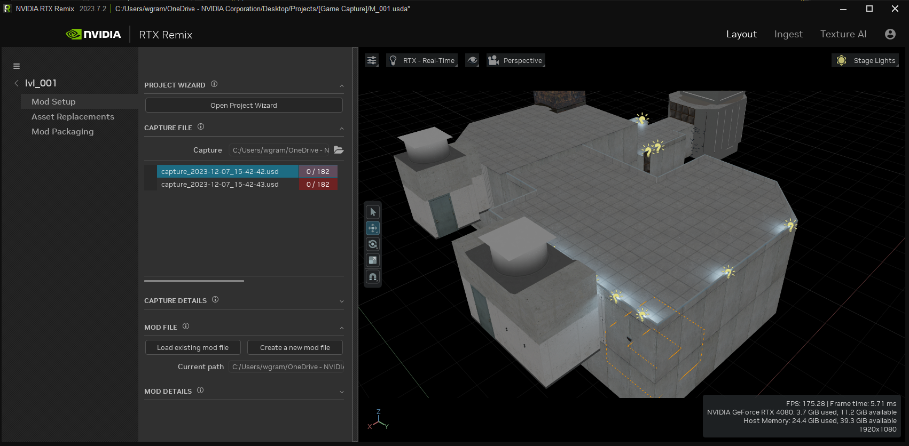

# Tutorial: Remaster Portal using Portal RTX
To learn the process of setting up a game, here is an example of how to setup the RTX Remix Runtime for the Portal / Portal RTX.  This process **ONLY** works with source games. (These instructions also work with HL2.)

## Setup RTX Remix Runtime

1. **Game Installation:** Make sure you have both Portal and Portal With RTX installed and fully updated. Many games tend to require some unique treatment for them to properly hook to RTX Remix’s renderer. In the case of Portal, steps 2-5 utilize modifications we’ve made with Portal With RTX that improve compatibility with RTX Remix. These steps should be thought of as configuration steps unique to making Portal compatible.
2. **Backup CFG Folder:** Go to the **cfg** folder for Portal (common\Portal\portal\cfg) and rename it to something like "original-cfg." This way, you won't delete any of the existing data.
3. **Copy CFG Contents:** Copy all the files from the cfg folder of PortalRTX (common\PortalRTX\portal_rtx\cfg) and paste them into the cfg folder of Portal (common\Portal\portal\cfg).
4. **Backup BIN Folder:** Similarly, go to the bin folder for Portal (common\Portal\bin) and rename it to something like "original-bin" to preserve the data.
5. **Copy BIN Contents:** Copy all the files from the bin folder of PortalRTX (common\PortalRTX\bin) and paste them into the bin folder of Portal (common\Portal\bin).
6. **Copy Configuration Files:** Copy the files named **rtx.conf** and **dxvk.conf** from "common\PortalRTX" to "common\Portal"
7. **RTXRemix Application:** Extract the contents of the RTXRemix Application (latest version) to "common\Portal\bin," and overwrite any existing files if prompted.
8. **Launch the Game:** Launch the game from your Steam library.
9. **Console Variables (if needed):** Depending on your preferences, you may need to set certain console variables. These can also be set via the command line. Here they are:
    1. Set DirectX Level to v.7.0
    2. Set r_3dsky to 0
    3. Set viewmodel_fov to 90
    4. Set cl_first_person_uses_world_model to 0
    5. Steam Launch Options Example: -dxlevel 70 -r_3dsky 0 -viewmodel_fov 90 -cl_first_person_uses_world_model 0

## Setup Your Project Folder Structure

1. Create a "Projects" folder on your computer, outside of your game folder, to contain your game captures.
> ⚠️ Do not place your Projects folder inside of the captures folder generated by running the Remix Runtime.

2. Inside your Projects folder,
    1. Create an "Input" folder
    2. Create a Capture folder using the name of the capture you are taking.  _Example: Portal_



```text
Projects                <--- Manually create folder
|--- Input              <--- Manually create folder
|--- [GameTitle]        <--- Manually create folder
```

## Take Your First Scene Capture

Get started with scene capture using these simple instructions:

1. **Launch Portal:** Open Portal where you've installed the RTX Runtime.
2. **Navigate to the First Scene:** Head to the first scene in the game.
3. **Open the Enhancements Tab:** Access the Enhancements tab in the Developer Settings Menu.
4. **Choose an Option:**
    * Option 1: Press Alt + X, click on the Developer Settings Menu button, then select the Enhancements tab.
    * Option 2: Press Ctrl + Shift + Q to open the Enhancements Settings.
5. **Adjust Settings (If Needed):** If the "Capture Frame in USD" button is not visible, uncheck the "Enable Enhanced Assets" checkbox to reveal it.
6. **Capture the Frame:**
    * Click on the "Capture Frame in USD" button.
    * The file will be saved with the format (capture)(year)(month)(day)(hour)(minutes)(seconds).
    * A DDS thumbnail with the same name will be created in a folder next to the capture directory.
7. **Explore the Captured Scene:**
    * Once you've captured your first game scene, a folder named "rtx-remix" will be created by the RTX Runtime.
    * Inside this folder, you'll find all the materials, textures, lights, and meshes for the captured game scene in USD format.

> 📝 Before creating your project file, please see the section on _Renaming Captures_ in the _Best Practices_ section.



## Setup Your First Project

1. Launch the RTX Remix Application from the NVIDIA Omniverse Platform



2. Select **Setup Project** from the Project Setup panel to open the the **RTX Remix Project Wizard**



3. Click the Plus Icon labeled **Create** in the Project Wizard
4. For the "Project File Location", navigate to the "Projects" folder you created in the setup above, then select your [CaptureTitle] folder
5. Name your file in the Project File Location menu _(Example: lvl_001)_ and "Save As" as **.usda** file



6. For the "Remix Directory", navigate to the file path containing your **rtx-remix** folder


7. Click the "Select" button
8. Select the capture.usd file you wish to remaster and select “**Create**”.



9. You should now see your usd file loaded into the project viewer under the **Layout** tab where you can see the **Mod Setup**, **Asset Replacements**, and **Mod Packaging** details.



## Helpful Information

### How to Launch a Steam Game into different levels of DirectX

1. Open Steam
2. Go to the "Library"
3. Right-click the game which needs to be reconfigured
4. Select "Properties..." from the menu
5. Go to the section "Launch Options"
6. Remove any launch options currently shown in the input box
7. Type one of the DirectX level launch options specified below in the box
    1. DirectX Level Launch Options:
        1. “-dxlevel 90” (DirectX v9.0)
        2. “-dxlevel 81” (DirectX v8.1)
        3. “-dxlevel 80” (DirectX v8.0)
        4. “-dxlevel 70” (DirectX v7.0)

***
<sub> Need to leave feedback about the RTX Remix Documentation?  [Click here](https://github.com/NVIDIAGameWorks/rtx-remix/issues/new?assignees=nvdamien&labels=documentation%2Cfeedback%2Ctriage&projects=&template=documentation_feedback.yml&title=%5BDocumentation+feedback%5D%3A+) <sub>