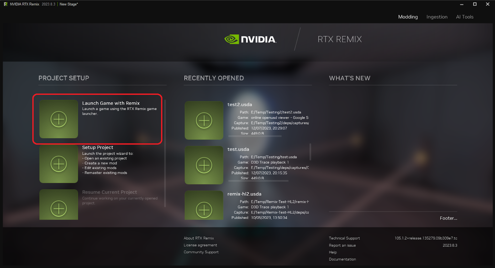
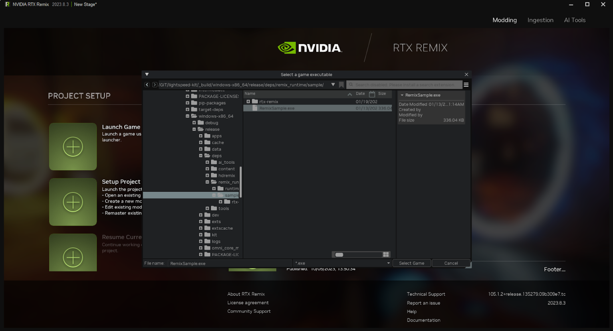
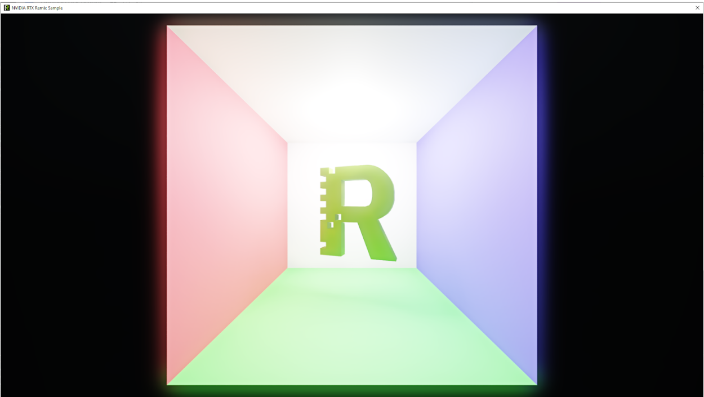
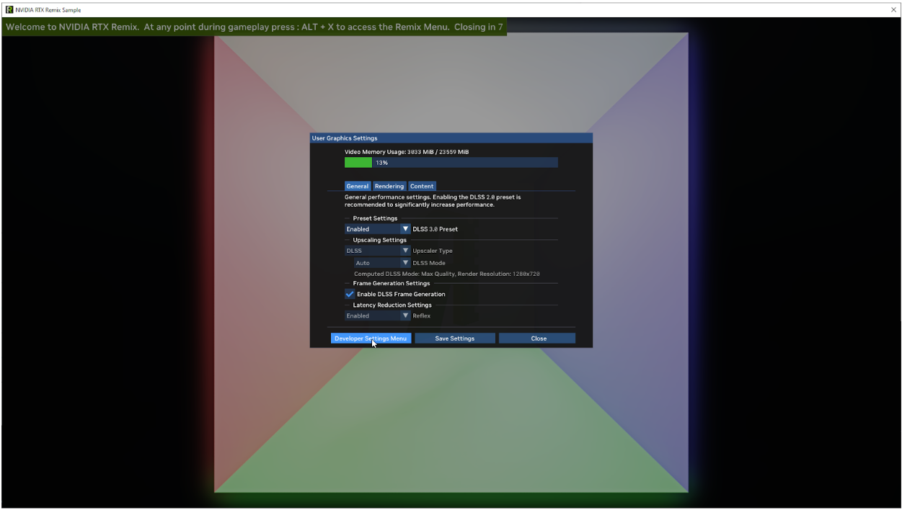
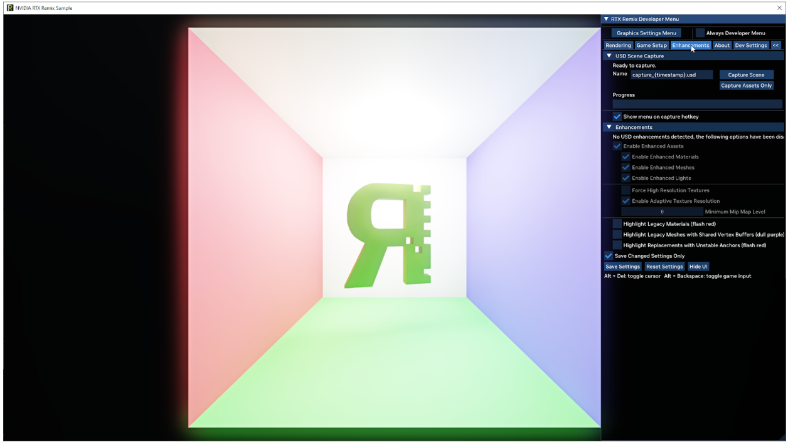
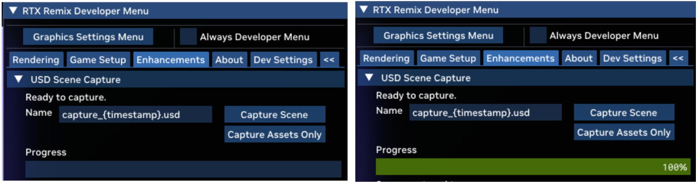
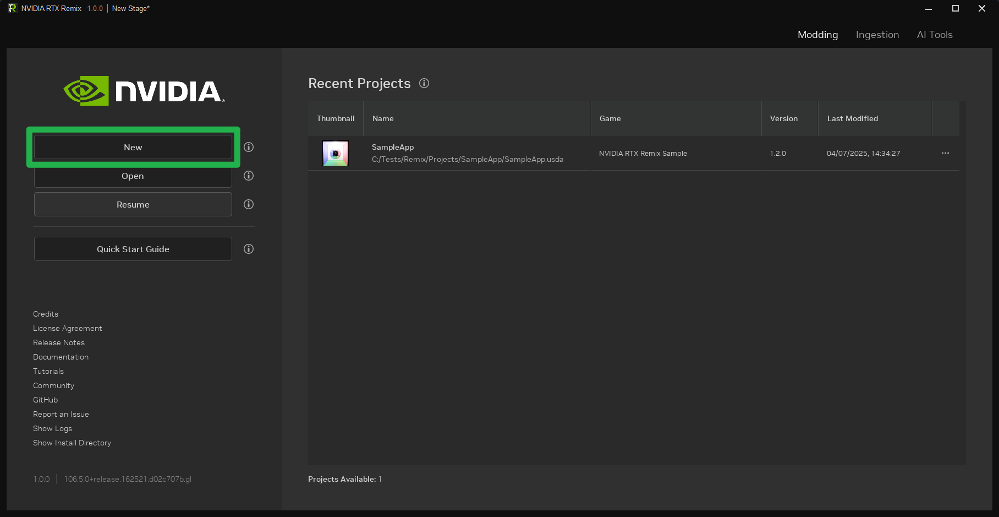
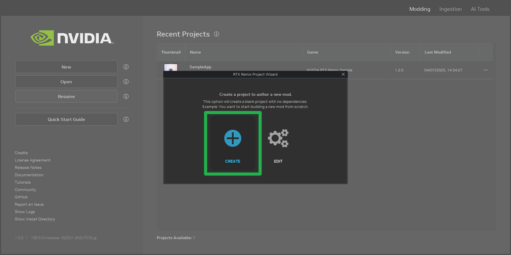
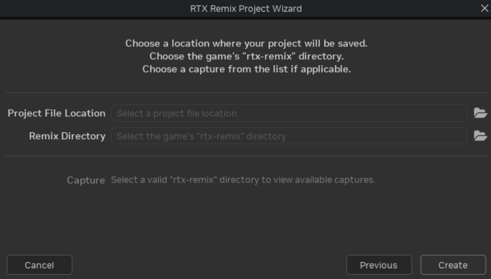
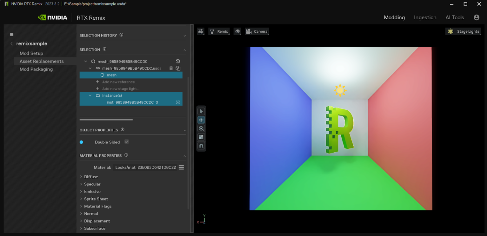

# Tutorial: Remix Sample
## RTX Remix Runtime Workflow
> ⚠️ Remix Runtime and Sample Application can be found in: <remix-toolkit-install-dir>\deps\remix_runtime ⚠️

1. Launch the Remix toolkit.  From here, select the “Launch Game with Remix” button found on the main menu, highlighted in **Red** below:

2. When clicking on this button a file dialog window will open.  By default this dialog will open in the Remix sample directory included with the Remix toolkit.  Select the "RemixSample.exe"

3. You should see something like the below:

4. From here, treat this application as any other classic game. Menus (ALT+X) and capture should work as expected. So let’s take a capture and enhance this scene.

> Press **ALT+X** to bring up the Remix menu and select the "Developer Settings Menu" button as shown below:

5. From the "Developer Settings Menu" click on the "Enhancements Tab":

6. From here, we can specify a name for our capture, and hit the “Capture Scene” button when ready. This will capture the current frame, and write a USD containing all the data to disk. The progress bar will show how far into the capturing process we are, once it reaches 100% we can begin the toolkit workflow.

## RTX Remix Toolkit Workflow

1. Switch back to the RTX Remix Toolkit Application and select the Setup "Project" button from the startup page:

2. In the "RTX Remix Project Wizard" select the "Create" button (annotated as number 2 below) to start a new project.

3. When presented with the dialog below, the next steps are to decide on your project file location (can be placed anywhere on your system) and to point the toolkit at the USD capture we did in the earlier steps. Click the folder icon to the right of “Project File Location” which will open up a file browser.

4. In the file browser, you can create a new blank folder for your project. Make sure the name does not have any spaces in it. Select the folder,  type in a file name and select the USD file type. USDA is a text readable representation of USD, which can be useful for debugging, but will consume more memory than the USD (binary) variants. Click “Save As”.

5. Next, Click on “Remix Directory” and navigate to the “rtx-remix” directory which was produced as a result of performing a capture in the RTX Remix Runtime (step 5 in the Runtime Workflow section).

6. With the project file location and remix directory configured, select the capture we made earlier and hit the "Create" button.

7. Once you’ve made some changes save your project.  You can try replacing the ‘R’ mesh with this disco-ball asset:
(SM_Prop_Discoball)[https://d4i3qtqj3r0z5.cloudfront.net/SM_Prop_DiscoBall%402.zip]

> See the [Introduction to Asset Replacement](learning-assets.md) documentation for more details.

8. Finally, to see what you’ve done, just launch the original RemisSample.exe and it will pick up your new mod!

***
 Need to leave feedback about the RTX Remix Documentation?  [Click here](https://github.com/NVIDIAGameWorks/rtx-remix/issues/new?assignees=nvdamien&labels=documentation%2Cfeedback%2Ctriage&projects=&template=documentation_feedback.yml&title=%5BDocumentation+feedback%5D%3A+) 