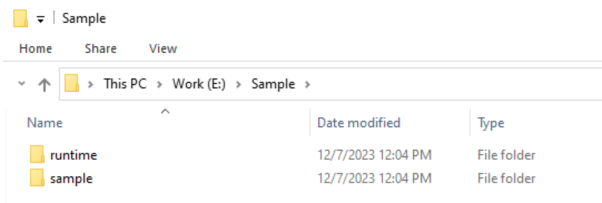
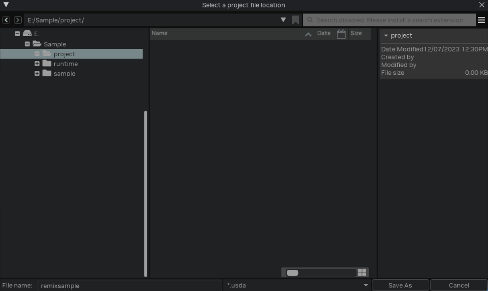
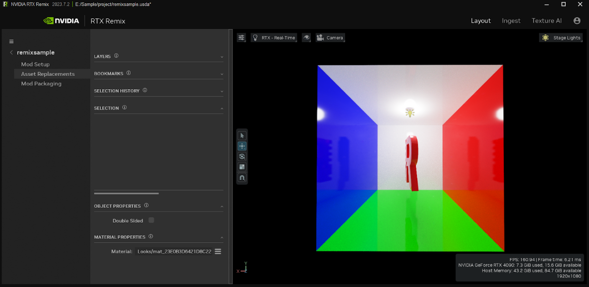

# Tutorial: Remix Sample
## RTX Remix Runtime Workflow
> ⚠️ Remix Runtime and Sample Application can be found in: <remix-toolkit-install-dir>\deps\remix_runtime ⚠️

1. Copy the contents of this folder somewhere on your local system, and all the following steps should be performed from that location.  This is just so we can always maintain a clean copy of the original installation.  After your directory should look something like this:

2. Copy the contents of the ‘runtime/:trex’ directory, to the ‘sample’ directory.  So after it should look something like the below.

3. Run "RemixSample.exe" and you should see something like this:

4. From here, treat this application as any other Remix app.  Menus (ALT+X) and capture should work as expected.  So let’s take a capture and enhance this scene.

    Press ALT+X to bring up the Remix menu and select the "Developer Settings Menu" button as shown below:

5. From the "Developer Settings Menu" click on the "Enhancements Tab":

6. From here, we can specify a name for our capture, and hit the “Capture Scene” button when ready. This will capture the current frame, and write a USD containing all the data to disk. The progress bar will show how far into the capturing process we are, once it reaches 100% we can begin the toolkit workflow.

## RTX Remix Toolkit Workflow

1. Launch the RTX Remix Toolkit Application and select the Setup "Project" button from the startup page:

2. In the "RTX Remix Project Wizard" select the "Create" button (annotated as number 2 below) to start a new project.

3. When presented with the dialog below, the next steps are to decide on your project file location and to point the toolkit at the capture. Click the folder icon to the right of “Project File Location” which will open up a file browser

4. In the file browser, you can create a new blank folder for your project. Make sure the name does not have any spaces in it. Select the folder,  type in a file name and select the USD file type. USDA is a text readable representation of USD, which can be useful for debugging, but will consume more memory than the USD (binary) variants. Click “Save As”.

5. Next, Click on “Remix Directory” and navigate to the “rtx-remix” directory which was produced as a result of performing a capture in the RTX Remix Runtime (step 5 in the Runtime Workflow section).

6. With the project file location and remix directory configured, select the capture we made earlier and hit the "Create" button.

6. From here the following should be visible on screen, and the remixing can begin:

7. Once you’ve made some changes save your project and the .mod file.

8. Finally, to see what you’ve done, just launch the original RemisSample.exe and it will pick up your new mod!

***
 Need to leave feedback about the RTX Remix Documentation?  [Click here](https://github.com/NVIDIAGameWorks/rtx-remix/issues/new?assignees=nvdamien&labels=documentation%2Cfeedback%2Ctriage&projects=&template=documentation_feedback.yml&title=%5BDocumentation+feedback%5D%3A+) 