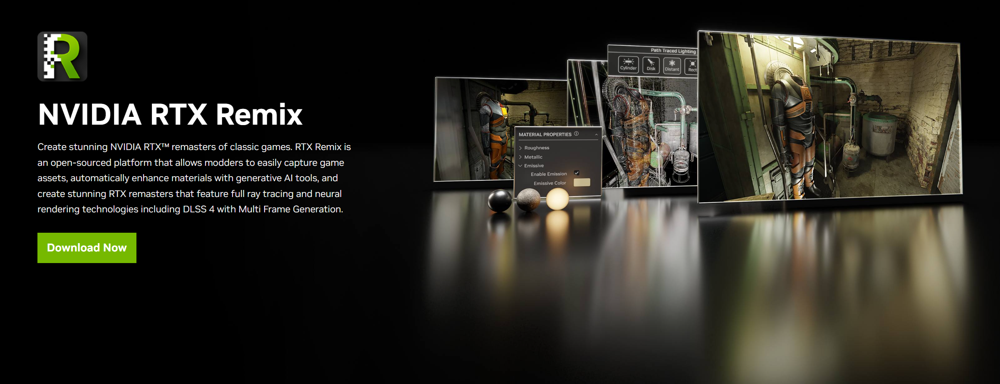

# Installing the RTX Remix Toolkit

The RTX Remix Toolkit includes everything you need to create your own RTX Remix mods, including a build of the RTX Remix
Runtime. Here's how to install it:

```{tip}
To find the installation directory of the RTX Remix Toolkit, see the
[How can I locate the RTX Remix Toolkit Installation Folder?](../remix-faq.md#how-can-i-locate-the-rtx-remix-toolkit-installation-folder)
section.
```

## Install from the NVIDIA App

1. Go to the [RTX Remix website](https://www.nvidia.com/en-us/geforce/rtx-remix/).
2. Follow the instructions to download and install the [NVIDIA App](https://www.nvidia.com/en-us/software/nvidia-app/).
3. Open the NVIDIA App and install `RTX Remix`.



## Install from GitHub

For access to the latest, potentially unstable features, you can install the RTX Remix Toolkit from GitHub.

1) Clone [the following repository](https://github.com/NVIDIAGameWorks/toolkit-remix)
2) Follow
   the [Build Instructions](https://github.com/NVIDIAGameWorks/toolkit-remix?tab=readme-ov-file#build-instructions) in
   the README.

***
<sub> Need to leave feedback about the RTX Remix Documentation?  [Click here](https://github.com/NVIDIAGameWorks/rtx-remix/issues/new?assignees=nvdamien&labels=documentation%2Cfeedback%2Ctriage&projects=&template=documentation_feedback.yml&title=%5BDocumentation+feedback%5D%3A+) </sub>
