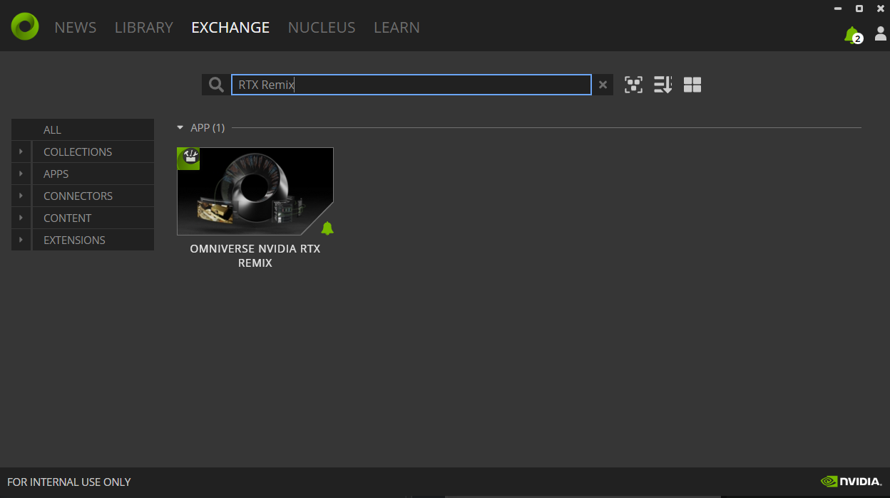
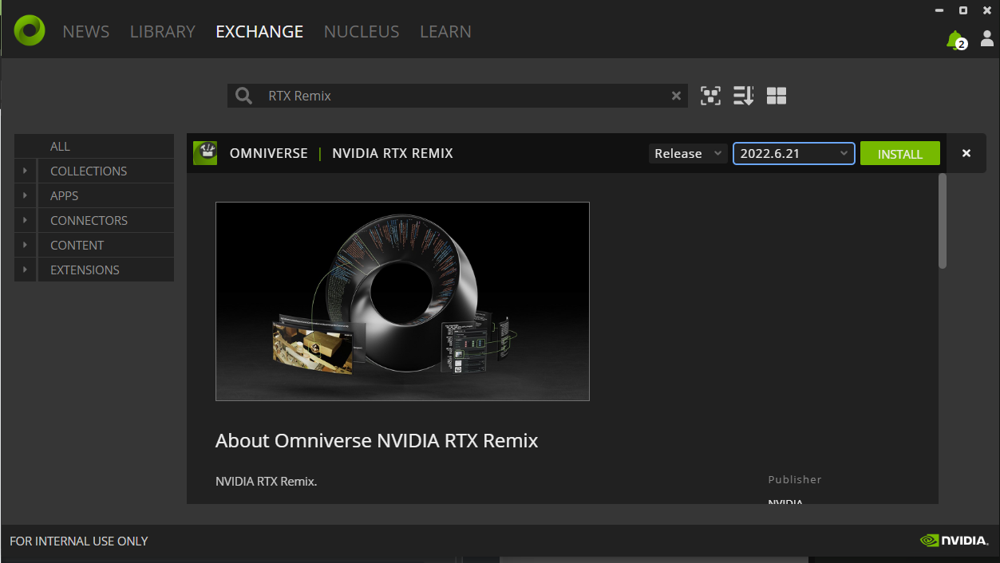
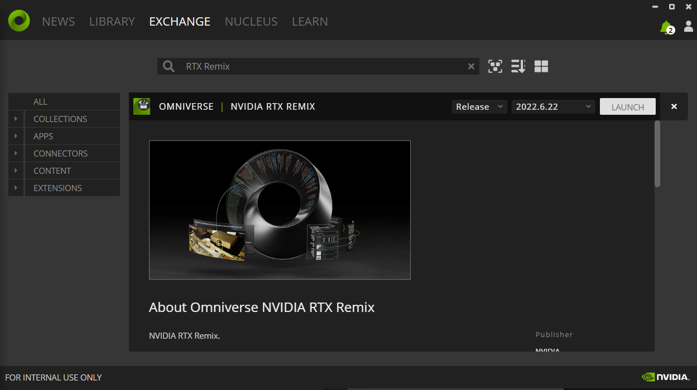

# Installation Guide

RTX Remix consists of two components - the **RTX Remix Runtime** and the **RTX Remix Toolkit**.  The **RTX Remix Runtime**, which is open source,  injects the path tracing into the game and bridges the gap between the original game's renderer and the RTX Toolkit.  The **RTX Remix Toolkit** allows you to modify captures created via the RTX Runtime, ingest assets, and make scene changes.  Both are required to fully remaster a game end-to-end.


## Install the RTX Remix Runtime

To install RTX Remix Runtime, you’ll need to download the latest application through GitHub via this link: [github.com/NVIDIAGameWorks/rtx-remix](https://github.com/NVIDIAGameWorks/rtx-remix/releases/).

> This version includes the **Runtime Bridge** and the **DXVK-Remix** applications required to run the Runtime.  You may download these applications separately through GitHub.
>  1. For the Bridge Application: [bridge-remix](https://github.com/NVIDIAGameWorks/bridge-remix).
> 2. For the DXVK-Remix Application: [dxvk-remix](https://github.com/NVIDIAGameWorks/dxvk-remix/)

When you download RTX Remix Runtime, you should get a zip file with the necessary components to prep a supported game for RTX Remix. Unzipping the file, you should see a folder structure like the following:

```text
remix-0.4.0/
|--- d3d9.dll  <-- Bridge interposer
|--- ...
\--- .trex/
    |--- NvRemixBridge.exe
    |--- d3d9.dll  <-- Remix Runtime/Renderer
    \--- ...
```

Once you have the files on your computer, you’ll need to copy them alongside your game executables following the instructions in the section [Setup RTX Remix Runtime with your Game](howto/learning-runtimesetup.md). 

## Install the RTX Remix Toolkit

1. Click here to go to NVIDIA's™ [RTX Remix website](https://www.nvidia.com/en-us/geforce/rtx-remix/)
2. Follow the instructions for Installation

### Install the RTX Remix from the Omniverse Launcher

1. Follow the instructions on how to Install the NVIDIA Omniverse Platform here: [Install NVIDIA Omniverse](https://docs.omniverse.nvidia.com/install-guide/latest/index.html)
2. In Omniverse Launcher, under the Exchange Tab, search for “**RTX Remix**”



3. Select RTX Remix Application, (ensure that the dropdown next to the install button displays the latest release or the release you wish to download) and select the green “**INSTALL**” button to install the application



4. After the application has been installed, the green “**INSTALL**” button will change into a grayish-white “**LAUNCH**” button.  Click the LAUNCH button to launch the** RTX Remix** application.



***
<sub> Need to leave feedback about the RTX Remix Documentation?  [Click here](https://github.com/NVIDIAGameWorks/rtx-remix/issues/new?assignees=nvdamien&labels=documentation%2Cfeedback%2Ctriage&projects=&template=documentation_feedback.yml&title=%5BDocumentation+feedback%5D%3A+) <sub>