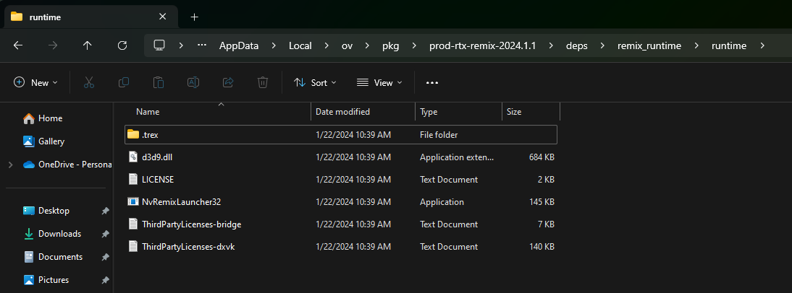
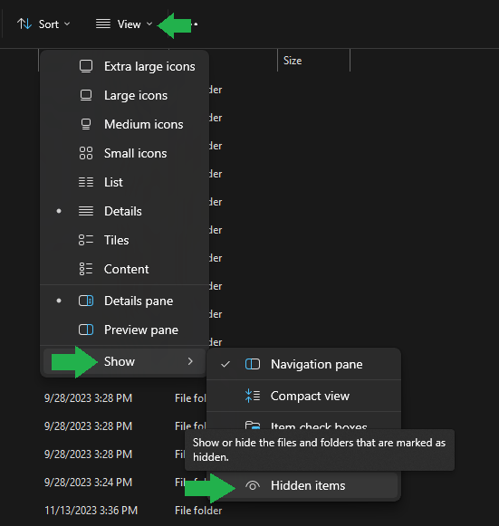
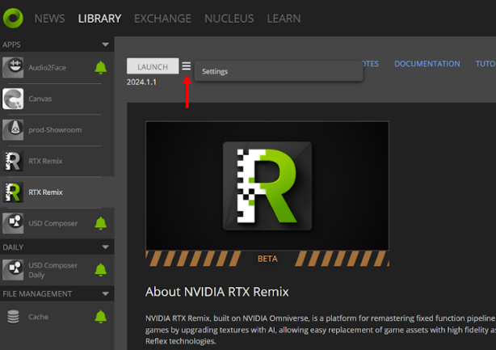

# Installation Guide

RTX Remix consists of two components - the **RTX Remix Runtime** and the **RTX Remix Toolkit**.  The **RTX Remix Runtime**, which is open source,  injects the path tracing into the game and bridges the gap between the original game's renderer and the RTX Toolkit.  The **RTX Remix Toolkit** allows you to modify captures created via the RTX Runtime, ingest assets, and make scene changes.  Both are required to fully remaster a game end-to-end.


## Install the RTX Remix Runtime

### Install the Runtime from the App Files

If you’ve downloaded the RTX Remix Toolkit, you have access to the RTX Remix Runtime. Simply navigate to the contents of the runtime folder to discover it:

Navigate to this folder: <code>C:\Users\<USERNAME>\AppData\Local\ov\pkg\<rtx-remix-XXX.X.X>\deps\remix_runtime\runtime</code>



> **NOTE:** You may need to make hidden files visible in order to see the <code>AppData</code> folder.  To do this, select the hamburger menu in the file explorer > Show > Hidden Files


### Install the Runtime from the Omniverse Launcher

If you're having trouble finding this folder, you can also do it through the Omniverse Launcher:
1. Click on the hamburger menu next to "Launch."
2. Select "Settings."
3. Click the folder icon.



From there, you will find yourself nearly at the runtime folder–all you have to do is go to: <code>deps\remix_runtime\runtime</code>

### Install the Runtime from GitHub

Alternatively, you can also download the latest version of the RTX Remix Runtime through GitHub.

To install RTX Remix Runtime, you’ll need to download the latest files through GitHub via this link: [github.com/NVIDIAGameWorks/rtx-remix](https://github.com/NVIDIAGameWorks/rtx-remix/releases/).

> This version includes the **Runtime Bridge** and the **DXVK-Remix** applications required to run the Runtime.  

When you download RTX Remix Runtime, you should get a zip file with the necessary components to prepare a supported game for RTX Remix. Unzipping the file, you should see a folder structure like the following:

```text
remix-0.4.0/
|--- d3d9.dll  <-- Bridge interposer
|--- ...
\--- .trex/
    |--- NvRemixBridge.exe
    |--- d3d9.dll  <-- Remix Renderer/DXVK-Remix
    \--- ...
```

Once you have the files on your computer, you’ll need to copy them alongside your game executables following the instructions in the section [Setup RTX Remix Runtime with your Game](howto/learning-runtimesetup.md) with your Game. 

We also host the RTX Remix Bridge and DXVK-Remix files separately through GitHub, and update them with experimental changes before they are ready to be packaged as part of an official RTX Remix Runtime release. If you would like to access those files, feel free to check them out below:

1. For the Bridge Application: [bridge-remix](https://github.com/NVIDIAGameWorks/bridge-remix).
2. For the DXVK-Remix Application: [dxvk-remix](https://github.com/NVIDIAGameWorks/dxvk-remix/)

## Install the RTX Remix Toolkit

1. Click here to go to NVIDIA's™ [RTX Remix website](https://www.nvidia.com/en-us/geforce/rtx-remix/)
2. Follow the instructions for Installation

### Install the RTX Remix from the Omniverse Launcher

1. Follow the instructions on how to Install the NVIDIA Omniverse Platform here: [Install NVIDIA Omniverse](https://docs.omniverse.nvidia.com/install-guide/latest/index.html)
2. In Omniverse Launcher, under the Exchange Tab, search for “**RTX Remix**”


3. Select RTX Remix Application, (ensure that the dropdown next to the install button displays the latest release or the release you wish to download) and select the green “**INSTALL**” button to install the application


4. After the application has been installed, the green “**INSTALL**” button will change into a grayish-white “**LAUNCH**” button.  Click the LAUNCH button to launch the** RTX Remix** application.


***
<sub> Need to leave feedback about the RTX Remix Documentation?  [Click here](https://github.com/NVIDIAGameWorks/rtx-remix/issues/new?assignees=nvdamien&labels=documentation%2Cfeedback%2Ctriage&projects=&template=documentation_feedback.yml&title=%5BDocumentation+feedback%5D%3A+) <sub>