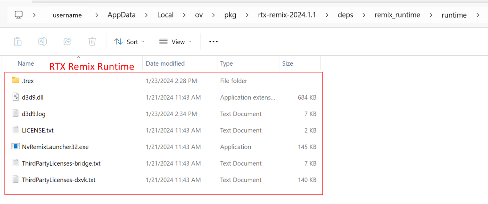

# What Should You Install

RTX Remix consists of two components: the **RTX Remix Toolkit** and the **RTX Remix Runtime**. The components that are required will depend on what you want to do with Remix...

- If you want to create your own Remix mod, you should install the [**RTX Remix Toolkit**](#install-the-rtx-remix-toolkit) which contains a bundled version of the [**RTX Remix Runtime**](#install-the-rtx-remix-runtime). Both are required to fully remaster a game end-to-end.
- If you just want to play a Remix mod, you only need the [**RTX Remix Runtime**](#install-the-rtx-remix-runtime).

# Install the RTX Remix Toolkit

## Install the RTX Remix Toolkit from the NVIDIA App

1. Click here to go to NVIDIA's™ [RTX Remix website](https://www.nvidia.com/en-us/geforce/rtx-remix/)
2. Follow the instructions to download the [**NVIDIA App**](https://www.nvidia.com/en-us/software/nvidia-app/) and install it.
3. Launch the NVIDIA App and install "RTX Remix".


## _[DEPRECATED]_ Install the RTX Remix Toolkit from the Omniverse Launcher

```{warning}
The Omniverse Launcher is deprecated. You should instead use the [NVIDIA App](#install-the-rtx-remix-toolkit-from-the-nvidia-app)
to install the RTX Remix Toolkit.
```

1. Follow the instructions on how to Install the NVIDIA Omniverse Platform here: [Install NVIDIA Omniverse](https://docs.omniverse.nvidia.com/install-guide/latest/index.html)
2. In Omniverse Launcher, under the Exchange Tab, search for “**RTX Remix**”


3. Select the RTX Remix Application, (ensure that the dropdown next to the install button displays the latest release or the release you wish to download) and select the green “**INSTALL**” button to install the application


4. After the application has been installed, the green “**INSTALL**” button will change into a grayish-white “**LAUNCH**” button. Click the **LAUNCH** button to launch the **RTX Remix** application.


## Install the RTX Remix Toolkit from GitHub

Alternatively, you can also download the very latest version of the RTX Remix Toolkit through GitHub. This version may be unstable but it will have our latest in-progress features.

To install RTX Remix Toolkit, you’ll need to clone this repository and follow the "Build instructions" section in the README:

[github.com/NVIDIAGameWorks/toolkit-remix](https://github.com/NVIDIAGameWorks/toolkit-remix).

## Locating the RTX Remix Toolkit installation directory

The default installation directory for the RTX Remix Toolkit will vary depending on your installation method.

The easiest way to locate your RTX Remix Toolkit installation directory is to click the "Show Install Directory"
button on the home screen of the RTX Remix Toolkit.



You should now be in the RTX Remix Toolkit installation directory.

# Install the RTX Remix Runtime

## Install the Runtime bundled with the Toolkit

If you’ve downloaded the RTX Remix Toolkit, you have access to the RTX Remix Runtime.
Simply navigate to the contents of the runtime folder to discover it:

Navigate to this folder: <code>[<INSTALLATION_DIRECTORY>](#locating-the-rtx-remix-toolkit-installation-directory)\deps\remix_runtime\runtime</code>

## Install the Runtime from GitHub

Alternatively, you can also download the latest version of the RTX Remix Runtime through GitHub.

To install RTX Remix Runtime, you’ll need to download the latest files through GitHub via this link: [github.com/NVIDIAGameWorks/rtx-remix](https://github.com/NVIDIAGameWorks/rtx-remix/releases/).

```{note}
This version includes the **Runtime Bridge** and the **DXVK-Remix** applications required to run the Runtime.
```

When you download RTX Remix Runtime, you should get a zip file with the necessary components to prepare a supported game for RTX Remix. Unzipping the file, you should see a folder structure like the following:

```text
remix-0.4.0/
|--- d3d9.dll  <-- Bridge interposer
|--- ...
\--- .trex/
    |--- NvRemixBridge.exe
    |--- d3d9.dll  <-- Remix Renderer/DXVK-Remix
    \--- ...
```

We also host the RTX Remix Bridge and DXVK-Remix files separately through GitHub, and update them with experimental changes before they are ready to be packaged as part of an official RTX Remix Runtime release. If you would like to access those files, feel free to check them out below:

1. For the Bridge Application: [bridge-remix](https://github.com/NVIDIAGameWorks/bridge-remix).
2. For the DXVK-Remix Application: [dxvk-remix](https://github.com/NVIDIAGameWorks/dxvk-remix/)


# Next Steps
Once you have the files on your computer, you’ll need to copy the runtime files alongside your game executables following the instructions in the section [Setup RTX Remix Runtime with your Game](gettingstarted/learning-runtimesetup.md).

***
<sub> Need to leave feedback about the RTX Remix Documentation?  [Click here](https://github.com/NVIDIAGameWorks/rtx-remix/issues/new?assignees=nvdamien&labels=documentation%2Cfeedback%2Ctriage&projects=&template=documentation_feedback.yml&title=%5BDocumentation+feedback%5D%3A+) </sub>
