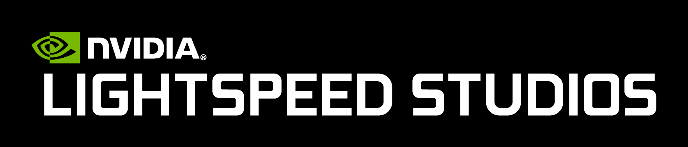
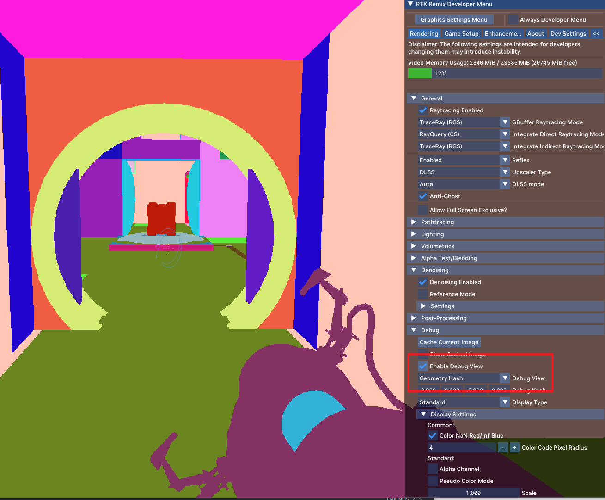

# [What Is It](#what-is-it)

RTX Remix is a modding platform for remastering a catalog of fixed-function DirectX 8 and 9 games with cutting edge graphics. With NVIDIA RTX Remix, experienced modders can upgrade textures with AI, easily replace game assets with high fidelity assets built with physically accurate (PBR) materials, and inject RTX ray tracing, DLSS and Reflex technologies into the game. It's like giving your old games a makeover with gorgeous modern-looking graphical mods.

Remix consists of two main parts. The first part is the [RTX Remix Runtime](../docs/runtimeinterface/index.md), which allows you to capture classic game scenes for your mod. The runtime is also responsible for making your mod “work” when a gamer is playing your mod–in real time, it replaces any old asset with the remastered assets you’ve added to the game scene, and re-lights the game with path tracing at playback. The second part is the [RTX Remix Application](../docs/toolkitinterface/index.md) (also known as the Toolkit), which is used for creating lights, revamping textures with AI, and adding remastered assets into a game scene that you’ve made with your favorite DCC tool. With the release of the RTX Remix Application in Open Beta, the full power of RTX Remix is now in the hands of modders to make next level RTX mods.


# [How Does It Work](#how-does-it-work)

You don't need to be a computer expert to use RTX Remix. It does most of the hard work for you, but it helps to know a bit about how it works. As we said above, RTX Remix has two main parts; the RTX Remix Runtime which attaches to the game while being played, and the RTX Remix Toolkit which is used to edit assets for the game offline (without needing to have the game running).

The RTX Remix Runtime also has two components: the Remix Bridge and the Renderer. The Bridge is like a middleman. It sits next to the game and listens to what the game wants to do. It then sends this information to another program called NvRemixBridge.exe, which is a special program that allows the original game's renderer to operate in 64-bit, allowing the game to use more of the systems memory than is available in 32-bit (which most classic games are) and because of this, we can use raytracing to render high resolution textures and meshes.

The Bridge acts as the messenger - it sends all the game instructions to the Renderer. This Renderer is a super powerful graphics engine. It takes all the things the game wants to draw, like characters and objects, but does so using a powerful real-time path-tracing engine.

The Renderer also knows how to swap out the old game stuff with new and improved things from an RTX Remix Mod that you put in a special folder. It keeps track of what's what using special codes (hash IDs) so it knows what to change in the game as you play.

Finally, using the RTX Remix Toolkit, you are able to easily make and add new game objects, materials, and lights. And since it's built on the NVIDIA Omniverse ecosystem, you'll have lots of cool tools to make your game look even better.


<!----- ON HOLD - Need to figure out how to handle this section

### [Development Roadmap](#development-roadmap)

[https://github.com/NVIDIAGameWorks/rtx-remix/wiki/Roadmap](https://github.com/NVIDIAGameWorks/rtx-remix/wiki/Roadmap)

 ----->

# Requirements

## Technical Requirements

RTX Remix and its mods are built to run on RTX-powered machines. For ideal performance, we recommend using GeForce RTX™ 4070 or higher. For latest drivers, visit  [NVIDIA Driver Downloads](https://www.nvidia.com/Download/index.aspx). For Quadro, select 'Quadro New Feature Driver (QNF).


|      Level      | Operating System |                 CPU                 |  RAM  |       GPU        | VRAM  |      Disk      |
|:---------------:|:----------------:|:-----------------------------------:|:-----:|:----------------:|:-----:|:--------------:|
|   **Minimum**   |    Windows 10    |                 N/A                 |  N/A  |   Any RTX GPU    |  N/A  |   10 GB SSD    |
| **Recommended** |    Windows 11    | Intel i7 13700K / AMD Ryzen 7 7700X | 32 GB | GeForce RTX 4070 | 12 GB | 10 GB NVME SSD |

Since the RTX Remix Toolkit is built using the Omniverse Kit SDK, We recommend that you review the [Omniverse Technical Requirement Documentation](https://docs.omniverse.nvidia.com/materials-and-rendering/latest/common/technical-requirements.html) for further details on what is required to use Applications within the Omniverse Platform.

## Requirements For Modders

* Windows 10 or 11

## RTX Remix Runtime Requirements for Developers

* Windows 10 or 11
* [Visual Studio](https://visualstudio.microsoft.com/vs/older-downloads/) _VS 2019 or newer_
* [Windows SDK and emulator](https://developer.microsoft.com/en-us/windows/downloads/sdk-archive/) _10.0.19041.0 or newer_
*  [Meson](https://mesonbuild.com/) _V0.61.4 or newer_
    * Please Note that v1.2.0 does not work (missing library)
    * Follow these [instructions](https://mesonbuild.com/SimpleStart.html#installing-meson) on how to install and reboot the PC before
* [Vulkan SDK](https://vulkan.lunarg.com/sdk/home#windows) _1.3.211.0 or newer_
    * Please Note that you may need to uninstall previous SDK if you have an old version
* [Python](https://www.python.org/downloads/) _version 3.9 or newer_


# Compatibility

The RTX Remix Runtime is primarily targeting DirectX 8 and 9 games with a fixed function pipeline for compatibility. Injecting the RTX Remix Runtime into other content is unlikely to work. It is important to state that even amongst DX8/9 games with fixed function pipelines, there is diversity in how they utilize certain shader techniques or handle rendering. As a result, there are crashes and unexpected rendering scenarios that require improvements to the RTX Remix Runtime for content to work perfectly.

It is our goal to work in parallel with the community to identify these errors and improve the runtime to widen compatibility with as many DX8 and 9 fixed function games as possible.  As Remix development continues, we will be adding revisions to the RTX Remix Runtime that will expand compatibility for more and more titles.  Some of those solutions will be code contributions submitted by our talented [developer community](http://discord.gg/rtxremix), which we will receive on our [GitHub as pull requests](https://github.com/NVIDIAGameWorks/rtx-remix/pulls) and integrate into the main RTX Remix Runtime.  RTX Remix is a first of its kind modding platform for reimagining a diverse set of classic games with the same workflow, but it's going to take some investigation and work to achieve that broad compatibility.

## [Defining Compatibility](#defining-compatibility)

Games are 'compatible' if the majority of their draw calls can be intercepted by Remix. That doesn't mean there won't currently be crashes or other bugs that prevent a specific game from launching. If the game crashes, but the content is compatible, then fixing the crash means the game can be remastered. If the game's content isn't compatible, then fixing the crash won't really achieve anything.

This also doesn't mean that everything in the game will be Remix compatible - often specific effects will either need to be replaced using the existing replacements flow, or will need some kind of custom support added to the runtime.

## [Fixed Function Pipelines](#fixed-function-pipelines)

Remix functions by intercepting the data the game sends to the GPU, recreating the game's scene based on that data, and then path tracing that recreated scene. With a fixed function graphics pipeline, the game is just sending textures and meshes to the GPU, using standardized data formats. It's reasonable (though not easy) to recreate a scene from this standardized data.

Part of why RTX Remix targets DX8 and 9 titles with fixed function pipelines is because later games utilize shader graphics pipelines, where the game can send the data in any format, and the color of a given surface isn't determined until it is actually drawn on the screen. This makes it very difficult for RTX Remix to recreate the scene - which, amongst other problems, causes the game to be incompatible.

The transition from 100% fixed function to 100% shader was gradual - most early DirectX 9.0 games only used shaders for particularly tricky cases, while later DirectX 9.0 games (like most made with 9.0c) may not use the fixed function pipeline at all. Applying Remix to a game using a mix of techniques will likely result in the fixed function objects showing up, and the shader dependent objects either looking wrong, or not showing up at all.

We have some experimental code to handle very simple vertex shaders, which will enable some objects which would otherwise fail. Currently, though, this is very limited. See the ‘Vertex Shader Capture’ option in ‘Game Setup -> Parameters’.

## [DirectX Versions](#directx-versions)

Remix functions as a DirectX 9 replacer, and by itself cannot interact with OpenGL or DirectX 7, 8, etc.

However, there exists various wrapper libraries which can translate from early OpenGL or DirectX 8 to fixed function DirectX 9. While multiple translation layers introduce even more opportunities for bugs, these have been effectively used to get Remix working with several games that are not DirectX 9.

We are not currently aware of any wrapper libraries for DirectX 7 to fixed function DirectX 9, but in theory such a wrapper could be created to extend RTX Remix compatibility further.

## [ModDB Compatibility Table](#moddb-compatibility-table)

ModDB’s community has banded together to make modding with RTX Remix even easier. You can visit the [ModDB website](https://www.moddb.com/rtx/) and see a community maintained compatibility table, which indicates every game the mod community has found currently works with RTX Remix. It also specifies the last RTX Remix runtime that was tested with any given game, and provides config files (called “rtx.conf” files) that make any compatible game work with RTX Remix out of the box. Take a look, and be sure to contribute and update the table if you make any discoveries of your own.

## [Rules of Thumb](#rules-of-thumb)

The following quick checks can help you quickly narrow down on how likely a game is to be compatible, even before you try to run RTX Remix.

### [Publish Date](#publish-date)

The best “at a glance” way to guess if a game is compatible is to look at the publish date. Games released between 2000 and 2005 are most likely to work. Games after 2010 are almost certainly not going to work (unless they are modified to support fixed function pipelines).

### [Graphics API version](#graphics-api-version)

DirectX 8 and DirectX 9.0 will probably be fixed function, and thus feasible. DirectX 9.0c games are usually mostly shader based, so probably won't work.

### [Supported GPU](#supported-gpu)

The Nvidia Geforce 2 graphics card was the last card to be fixed function only, so if the game could run on that card, it's probably fixed function. Note that many games supported fixed functions when they were released, but removed that support in later updates. Testing the content It's actually possible to tell dxvk to dump out any shaders used by the game by adding these settings to your environment variables:

```text
DXVK_SHADER_DUMP_PATH=/some/path
DXVK_LOG_LEVEL=debug
```
If that dumps out a few shaders, then the content may mostly be Remix compatible. If it dumps out a lot of shaders, then the game probably won't be workable.

### So Is My Game Content Being Processed by Remix?

Here is an alternate, more definitive way to check if Remix is processing the some steps to check:

1. Open the developer menu
2. Click Enable Debug View
3. Change the dropdown below it to Geometry Hash

If it looks anything like the image below, then the content is probably remixable. If objects have a stable color, those objects are probably replaceable (once the tool comes out). If a mesh's color changes when you're in that view, that means the mesh won't be reliably replaceable using the current settings - though there may be workarounds with different configurations.



If nothing changes, the game's content isn't going through remix at all. Try lowering the graphics settings as far as they will go, playing with the shader model, or whatever other tricks you can to try to force the game into a fixed function fallback mode.

Regarding the geometry hash mode above: Dynamic meshes are expected to change color every frame - things like particle effects and maybe animated meshes. Animated meshes may flicker, depending on how the game does skinning:

Games in this era could do skinning two different ways:

1. Software animation (apply skinning on the CPU) - this will flicker
2. Hardware animation (apply skinning on the GPU) - this should be stable

Some games will support both based on some config value, so you may be able to force it into hardware animation.

Remix still can't actually replace an animated mesh, but that's relatively straightforward to do if the mesh is GPU skinned- it is on our roadmap to address in the future.

We have ideas to also enable CPU skinned meshes... but that's going to be a big experiment. It is a more speculative feature, and we will be investigating it sometime in the future.

### Why are Shaders Hard to Path Trace?

```{note}
This is simplified and meant for someone with no knowledge of computer graphics
```

What is a fixed function pipeline? Imagine you're making a little shoebox diorama, and you want the background to look like a brick wall. So you print out a picture of a brick wall and glue it on the back of the shoebox. Simple, easy, works great. This is basically what fixed function does - surface + texture, slap it on screen, done.

What is a shader? What if you want to make it fancier? What if you wanted more artistic freedom to change the back of your box? Well, you could slap a tablet back there, and just display whatever you want on the screen. You could even write a little program that detects where someone is looking at the box from, and changes what is on the tablet's screen based on the viewing angle. This is basically what shaders do - they get passed a bunch of arbitrary data from the app, are told the camera position, and are asked what color a tiny piece of an object is supposed to be.

Until the pixel shader runs for that tiny piece of that object, for that specific camera position, that object doesn't actually have a color assigned to it. The shader has to compute what color it should be. It also doesn't actually output the raw color - it includes lighting and whatever else the game is doing.

That just describes pixel shaders though. Vertex shaders let that tablet change shape however it wants... and I think the metaphor starts to fall apart at this point.

So why are shaders a problem? First off, shaders don't require a standardized description of the scene (positions of surfaces, cameras, lights, etc). Remix needs that information to reconstruct the scene for path tracing, and there's no standard way to extract that information that works across every game.

It can be done on a per game basis, but it's a decent chunk of work for each game.

Secondly, we need to know the color (and other material properties) of every surface - without any lighting or shading interfering. With pixel shaders, there's no straightforward way to get that - even if we could run the shader for every surface, it wouldn't be outputting the raw color data we need. This may be solvable with automatic shader processing, or letting modders write new ray-hit shaders to replace the functionality of the game's pixel shaders, but we'll need to do more experimentation to know what approach will actually work.

Thirdly, there are the vertex shaders - but fortunately, we've already got an experimental solution that handles most vertex shaders.

Once Remix is more stable and fleshed out, it may be possible to remaster shader based games. I've seen the modding community succeed at equally complicated projects, so I'm not going to rule that out. But I don't think it's worth even starting those projects yet - we should focus on the games that are actually a good fit first, build out and stabilize the tech for those, and get some remasters out the door.

***
<sub> Need to leave feedback about the RTX Remix Documentation?  [Click here](https://github.com/NVIDIAGameWorks/rtx-remix/issues/new?assignees=nvdamien&labels=documentation%2Cfeedback%2Ctriage&projects=&template=documentation_feedback.yml&title=%5BDocumentation+feedback%5D%3A+) </sub>
