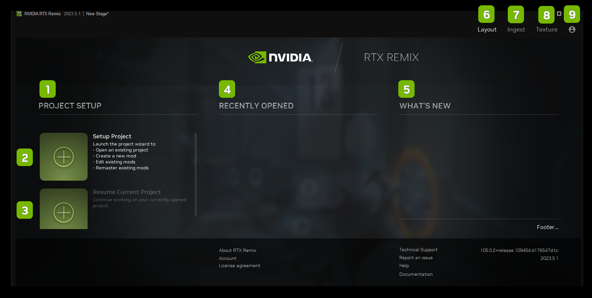

# RTX Remix Toolkit Interface

## Launch Screen

<table>
  <tr>
   <td><strong>Ref</strong>
   </td>
   <td><strong>Option</strong>
   </td>
   <td><strong>Description</strong>
   </td>
  </tr>
  <tr>
   <td>1
   </td>
   <td>Project Setup
   </td>
   <td>Project Setup Section
   </td>
  </tr>
  <tr>
   <td>2
   </td>
   <td>Setup Project
   </td>
   <td>Create a projecte to be remastered
   </td>
  </tr>
   <td>3
   </td>
   <td>Resume Current Project
   </td>
   <td>Open a project your are currently working on
   </td>
  </tr>
   <td>4
   </td>
   <td>Recently Opened
   </td>
   <td>List of Recently Opened Project(s)
   </td>
  </tr>
   <td>5
   </td>
   <td>What’s New
   </td>
   <td>Newest updates to the software
   </td>
  </tr>
   <td>6
   </td>
   <td>Layout
   </td>
   <td>Opens the Layout Tab
   </td>
  </tr>
   <td>7
   </td>
   <td>Ingest
   </td>
   <td>Opens the Ingest Tab
   </td>
  </tr>
   <td>8
   </td>
   <td>Texture
   </td>
   <td>Opens the Texture Tab
   </td>
  </tr>
   <td>9
   </td>
   <td>Profile
   </td>
   <td>Opens the User Profile
   </td>
  </tr>
</table>