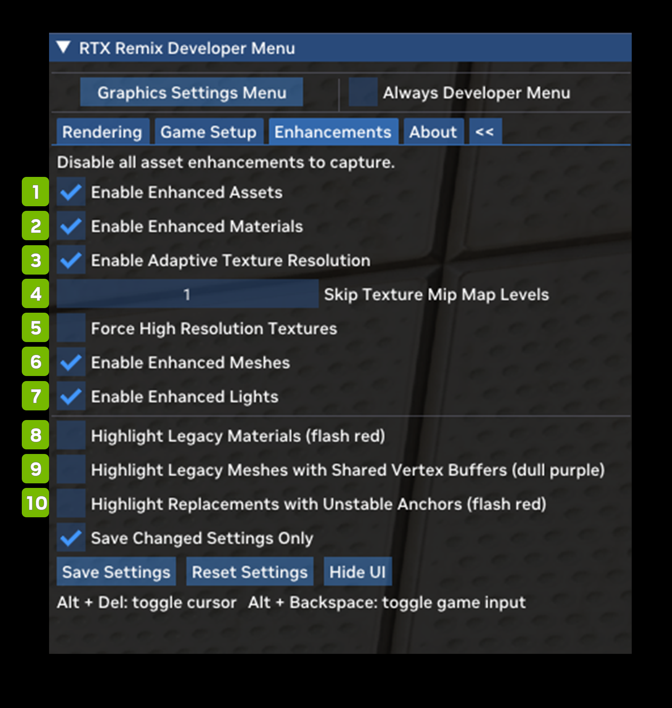

# Enhancements Tab

The Enhancements tab allows you to review the impact and extent of replacements in the active mod. Remix mods can replace virtually any mesh, texture or light in the modded game, and this menu allows you to toggle these enhancements on and off at will to help compare with unmodded assets.

The Enhancements tab also contains the all-important Capture Frame in USD button, at the top. Clicking on this button will create a capture of the game world in that location and point of time and store it in USD format on disk. These captures are the basis of all remastering work in the Remix App, where you can replace materials, meshes and lights with physically correct modern equivalents.

<table>
  <tr>
   <td><strong>Ref</strong>
   </td>
   <td><strong>Option</strong>
   </td>
   <td><strong>RTX Option</strong>
   </td>
   <td><strong>Default Value</strong>
   </td>
   <td><strong>Description</strong>
   </td>
  </tr>
  <tr>
   <td>1
   </td>
   <td>Enable Enhanced Assets Checkbox
   </td>
   <td>rtx.enableReplacementAssets
   </td>
   <td>Checked
   </td>
   <td>Globally enables or disables all enhanced asset replacement (materials, meshes, lights) functionality.
   </td>
  </tr>
  <tr>
   <td>2
   </td>
   <td>Enable Enhanced Materials Checkbox
   </td>
   <td>rtx.enableReplacementMeshes
   </td>
   <td>Checked
   </td>
   <td>Enables or disables enhanced mesh replacements.

Requires replacement assets in general to be enabled to have any effect.
   </td>
  </tr>
  <tr>
   <td>3
   </td>
   <td>Enable Adaptive Texture Resolution Checkbox
   </td>
   <td>rtx.enableAdaptiveResolutionReplacementTextures
   </td>
   <td>Checked
   </td>
   <td>A flag to enable or disable adaptive resolution replacement textures.

When enabled, this mode allows replacement textures to load in only up to an adaptive minimum mip level to cut down on memory usage, but only when forced high resolution replacement textures is disabled.

This should generally always be enabled to ensure Remix does not starve the system of CPU or GPU memory while loading textures.

Additionally, this setting must be set at startup and changing it will not take effect at runtime.
   </td>
  </tr>
  <tr>
   <td>4
   </td>
   <td>Skip Texture Mip Map Levels
   </td>
   <td>rtx.minReplacementTextureMipMapLevel
   </td>
   <td>0
   </td>
   <td>A parameter controlling the minimum replacement texture mipmap level to use, higher values will lower texture quality, 0 for default behavior of effectively not enforcing a minimum.

This minimum will always be considered as long as force high resolution replacement textures is not enabled, meaning that with or without adaptive resolution replacement textures enabled this setting will always enforce a minimum mipmap restriction.

Generally this should be changed to reduce the texture quality globally if desired to reduce CPU and GPU memory usage and typically should be controlled by some sort of texture quality setting.

Additionally, this setting must be set at startup and changing it will not take effect at runtime.
   </td>
  </tr>
  <tr>
   <td>5
   </td>
   <td>Force High Resolution Textures Checkbox
   </td>
   <td>rtx.forceHighResolutionReplacementTextures
   </td>
   <td>Unchecked
   </td>
   <td>A flag to enable or disable forcing high resolution replacement textures.

When enabled this mode overrides all other methods of mip calculation (adaptive resolution and the minimum mipmap level) and forces it to be 0 to always load in the highest quality of textures.

This generally should not be used other than for various forms of debugging or visual comparisons as this mode will ignore any constraints on CPU or GPU memory which may starve the system or Remix of memory.

Additionally, this setting must be set at startup and changing it will not take effect at runtime.
   </td>
  </tr>
  <tr>
   <td>6
   </td>
   <td>Enable Enhanced Meshes Checkbox
   </td>
   <td>rtx.enableReplacementMaterials
   </td>
   <td>Checked
   </td>
   <td>Enables or disables enhanced material replacements.

Requires replacement assets in general to be enabled to have any effect.
   </td>
  </tr>
  <tr>
   <td>7
   </td>
   <td>Enable Enhanced Lights Checkbox
   </td>
   <td>rtx.enableReplacementLights
   </td>
   <td>Checked
   </td>
   <td>Enables or disables enhanced light replacements.

Requires replacement assets in general to be enabled to have any effect.
   </td>
  </tr>
  <tr>
   <td>8
   </td>
   <td>Highlight Legacy Materials (flash red) Checkbox
   </td>
   <td><!--- Needs Description --->
   </td>
   <td>Unchecked
   </td>
   <td><!--- Needs Description --->
   </td>
  </tr>
  <tr>
   <td>9
   </td>
   <td>Highlight Legacy Meshes with Shared Vertex Buffers (dull purple) Checkbox
   </td>
   <td><!--- Needs Description --->
   </td>
   <td>Unchecked
   </td>
   <td><!--- Needs Description --->
   </td>
  </tr>
  <tr>
   <td>10
   </td>
   <td>Highlight Replacements with Unstable Anchors (flash red) Checkbox
   </td>
   <td>rtx.useHighlightUnsafeAnchorMode
   </td>
   <td>Unchecked
   </td>
   <td><!--- Needs Description --->
   </td>
  </tr>
</table>