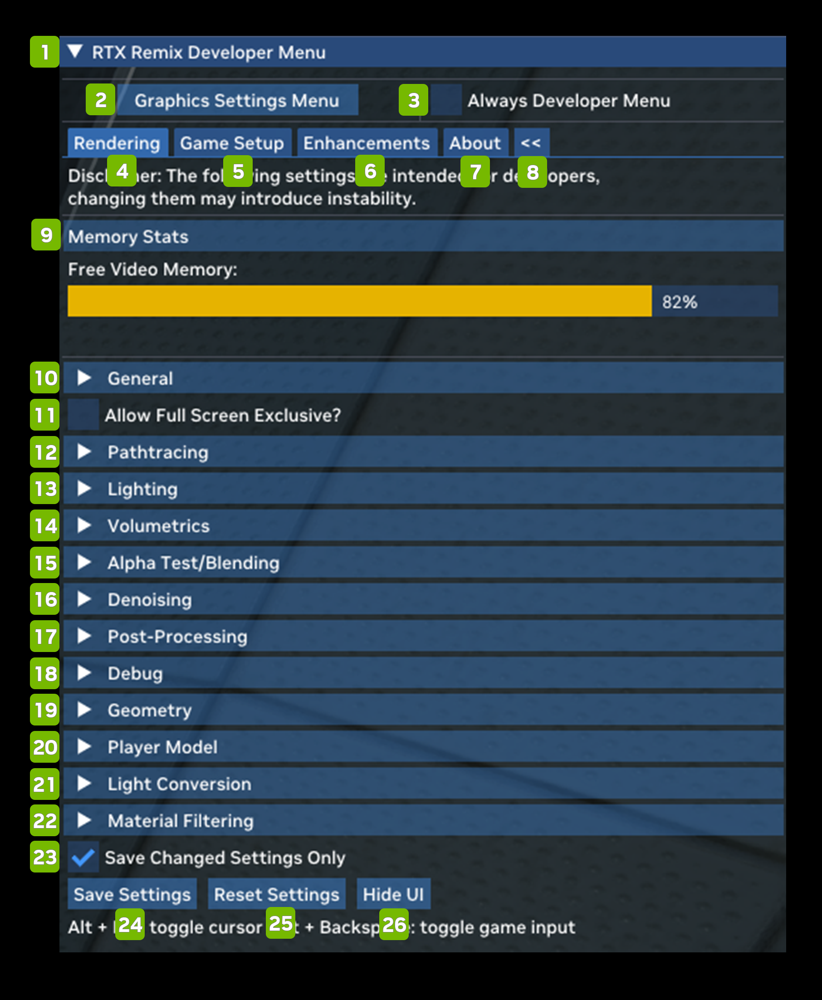

# Developer Menu

| **Ref** | **Option**                            | **Description**                                                                                                                                                                                                                                                                                                                                                 |
|---------|---------------------------------------|-----------------------------------------------------------------------------------------------------------------------------------------------------------------------------------------------------------------------------------------------------------------------------------------------------------------------------------------------------------------|
| 1       | RTX Remix Developer Menu              | The Remix Developer Menu                                                                                                                                                                                                                                                                                                                                        |
| 2       | Graphics Settings Menu                | Open the Graphics Settings Menu                                                                                                                                                                                                                                                                                                                                 |
| 3       | Always Developer Menu Checkbox        | (Default: Unchecked)                                                                                                                                                                                                                                                                                                                                            |
| 4       | Rendering Tab                         | Allows you to set Rendering Parameters                                                                                                                                                                                                                                                                                                                          |
| 5       | Game Setup Tab                        |                                                                                                                                                                                                                                                                                                                                                                 |
| 6       | Enhancements Tab                      |                                                                                                                                                                                                                                                                                                                                                                 |
| 7       | About Tab                             | Displays information about the Remix Application                                                                                                                                                                                                                                                                                                                |
| 8       | Panel Switch                          | Switch Between Left Side or Right Side Panel Menu                                                                                                                                                                                                                                                                                                               |
| 9       | Memory Stats                          | Displays the amount of memory available                                                                                                                                                                                                                                                                                                                         |
| 10      | General                               | The General settings deal mostly with performance and include various upscaling and latency reduction options.                                                                                                                                                                                                                                                  |
| 11      | Allow Full Screen Exclusive? Checkbox |                                                                                                                                                                                                                                                                                                                                                                 |
| 12      | Pathtracing                           | Pathtracing allows you to tweak the behavior of the Path Tracer in both subtle and profound ways. The technical details go deep into Ray Tracing theory                                                                                                                                                                                                         |
| 13      | Lighting                              | Lighting allows you to adjust global lighting intensity and other parameters, as well as go deep under the hood of two of the core lighting algorithms used by the Remix Path Tracing renderer: RTXDI and ReSTIR GI. You can read more about each technology.                                                                                                   |
| 14      | Volumetrics                           | Volumetrics allows you to adjust everything related to the volumetric fog in Remix. You can also turn the volumetric fog off or on via the Enable Volumetric Lighting Checkbox. Turning on "Enable Legacy Fog Remapping" will allow the volumetric fog to take in information from the legacy fog in the game and attempt to match its look.                    |
| 15      | Alpha Test / Blending                 | Alpha Test / Blending allows you to toggle alpha testing and blending in the Remix Toolkit.                                                                                                                                                                                                                                                                     |
| 16      | Denoising                             | Denoising allows you to toggle denoising on and off, as well as tune denoising parameters in detail. Denoising is a critical part of modern Path Tracing renderers and turning it off entirely has mainly educational value. Adjusting the individual settings may be beneficial for image quality or compatibility, depending on the game and mod in question. |
| 17      | Post-Processing                       | Post-Processing allows you to toggle on and off, as well as tune the look of each of the supported post-processing effects in Remix.                                                                                                                                                                                                                            |
| 18      | Debug                                 | Debug allows you to access a large variety of debug views in order to troubleshoot compatibility, content or rendering issues in a game or mod. Please refer to this document for an in depth guide to the Debug Display modes.                                                                                                                                 |
| 19      | Geometry                              | Various compatibility options for geometry handling.                                                                                                                                                                                                                                                                                                            |
| 20      | Player Model                          | Player Model allows you to toggle compatibility options related to first person character rendering here, as well as toggle first person character shadows.                                                                                                                                                                                                     |
| 21      | Light Conversion                      | Light Conversion allows you to control how game lights are translated into Path Tracing compatible physical light sources in the Remix renderer.                                                                                                                                                                                                                |
| 22      | Material Filtering                    | Material Filtering allows you to adjust material filtering options or render all white materials for an easier time when tuning lighting.                                                                                                                                                                                                                       |
| 23      | Save Changed Settings Only Checkbox   | (Default : Checked)                                                                                                                                                                                                                                                                                                                                             |
| 24      | Save Settings                         | Save settings parameters                                                                                                                                                                                                                                                                                                                                        |
| 25      | Reset Settings                        | Reset all parameters to default values                                                                                                                                                                                                                                                                                                                          |
| 26      | Hide UI                               | Close the RTX Remix UI                                                                                                                                                                                                                                                                                                                                          |

***
 Need to leave feedback about the RTX Remix Documentation?  [Click here](https://github.com/NVIDIAGameWorks/rtx-remix/issues/new?assignees=nvdamien&labels=documentation%2Cfeedback%2Ctriage&projects=&template=documentation_feedback.yml&title=%5BDocumentation+feedback%5D%3A+) 
