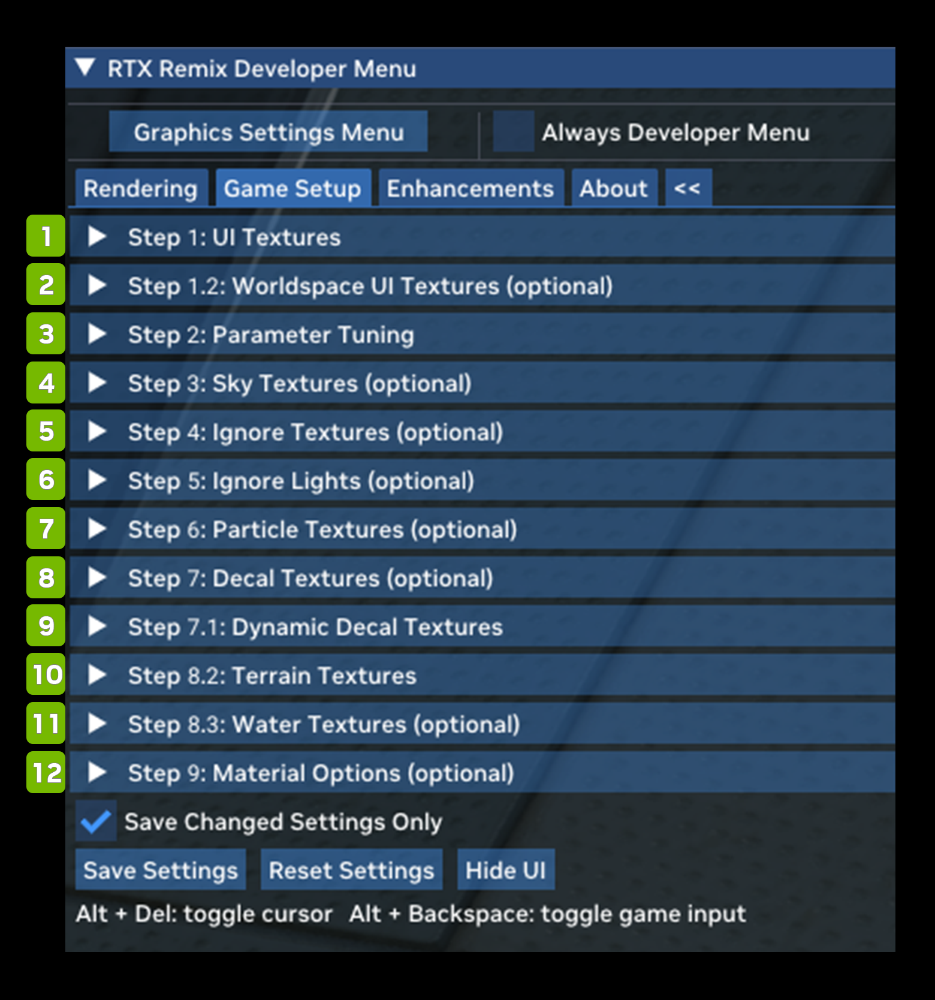
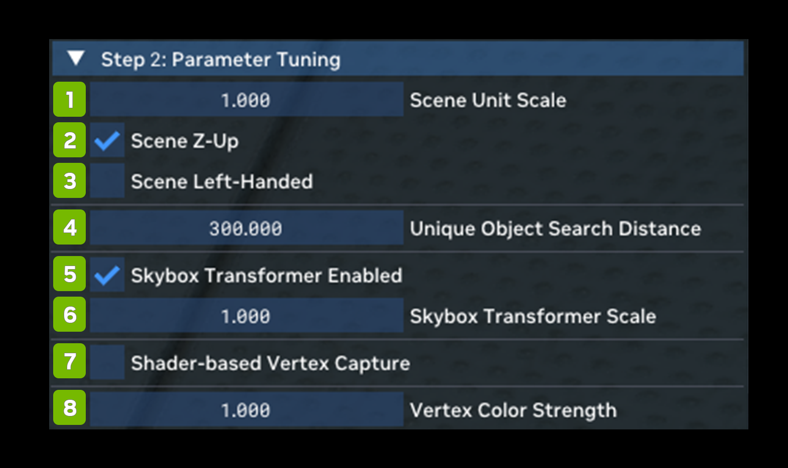
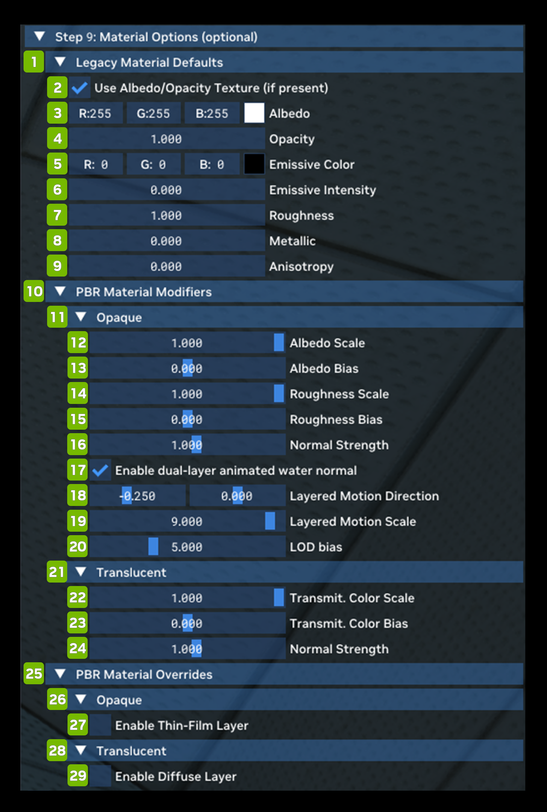

# Game Setup Tab

| **Ref** | **Option**                                  | **Description**                                                                                                                                                                                                                                                                                                                                                                                                                                                                                                      |
|---------|---------------------------------------------|----------------------------------------------------------------------------------------------------------------------------------------------------------------------------------------------------------------------------------------------------------------------------------------------------------------------------------------------------------------------------------------------------------------------------------------------------------------------------------------------------------------------|
| 1       | Step 1: UI Textures                         | This feature allows you to tag all textures known to be part of the UI. This will enable Remix to skip them when Path Tracing and render a complete UI view on top.                                                                                                                                                                                                                                                                                                                                                  |
| 2       | Step 1.2: Worldspace UI Textures (optional) | Like Step 1, this section allows you to tag UI textures, but this time for world-space rendering (as opposed to screen-space) – think user interface elements that exist in the 3D game world with the characters, not as a flat overlay on the screen.                                                                                                                                                                                                                                                              |
| 3       | Step 2: Parameter Tuning                    | This feature allows you to specify the coordinate system used in the game, to help ensure Remix can match the rendering correctly, and that captures look correct with the proper up direction in the Remix App. You can also enable shader-based vertex capture here and adjust its parameters.  *(See the Parameter Tuning Chart Below)*                                                                                                                                                                           |
| 4       | Step 3: Sky Textures (optional)             | This feature allows you to adjust the look of the Path Traced sky, as well as tune compatibility parameters to allow for better sky detection.                                                                                                                                                                                                                                                                                                                                                                       |
| 5       | Step 4: Ignore Textures (optional)          | This feature allows you to ignore certain objects by texture entirely.                                                                                                                                                                                                                                                                                                                                                                                                                                               |
| 6       | Step 5: Ignore Lights (optional)            | This feature allows you to ignore certain lights by texture entirely.                                                                                                                                                                                                                                                                                                                                                                                                                                                |
| 7       | Step 6: Particle Textures (optional)        | This feature allows you to tag certain textures as belonging to particles. This enables Remix to detect these particles properly and render them correctly in Path Tracing.                                                                                                                                                                                                                                                                                                                                          |
| 8       | Step 7: Decal Textures (optional)           | Like Step 7, but for dynamic decals. Dynamic decals are used for effects like bullet holes that appear during gameplay. Static decals are parts of the map.                                                                                                                                                                                                                                                                                                                                                          |
| 9       | Step 7.1: Dynamic Decal Textures            | Like Step 7, but for dynamic decals. Dynamic decals are used for effects like bullet holes that appear during gameplay. Static decals are parts of the map.                                                                                                                                                                                                                                                                                                                                                          |
| 10      | Step 8.1: Legacy Cutout Textures            | This feature allows you to tag certain textures as alpha tested ("cutout") even if the original game used alpha blending to represent surfaces with "holes." For a Path Tracing renderer there is a big difference in whether alpha testing or blending is used, so this tagging can help these surfaces render correctly.                                                                                                                                                                                           |
| 11      | Step 8.2: Water Textures                    | Like Decals, tagging Terrain textures can help Remix render terrain correctly.                                                                                                                                                                                                                                                                                                                                                                                                                                       |
| 12      | Step 8.3: Water Textures (optional)         | Like Decals and Terrain, tagging water textures can help Remix render water correctly.                                                                                                                                                                                                                                                                                                                                                                                                                               |
| 13      | Step 9: Material Options (optional)         | This feature allows you to adjust the properties of the Remix default Path Tracing material. This material gets used if there is no material replacement found for a given mesh or texture in the game (this happens when you have no mod loaded for example or decide to turn replacements off). You can also set modifiers for PBR materials in general – whether default or loaded from a Mod – that can adjust their general properties like roughness or color scale.  *(See the Material Options Chart Below)* |

## Parameter Tuning Options

| **Ref** | **Option**                           | **RTX Option**           | **Default Value** | **Description**                                                                                                                                                                                                                                                                                                                                  |
|---------|--------------------------------------|--------------------------|-------------------|--------------------------------------------------------------------------------------------------------------------------------------------------------------------------------------------------------------------------------------------------------------------------------------------------------------------------------------------------|
| 1       | Scene Unit Scale                     | rtx.sceneScale           | 1.000             | Defines the ratio of rendering unit (1cm) to game unit, i.e. sceneScale = 1cm / GameUnit.                                                                                                                                                                                                                                                        |
| 2       | Scene Z-Up Checkbox                  |                          | Checked           |                                                                                                                                                                                                                                                                                                                                                  |
| 3       | Scene Left-Handed Checkbox           |                          | Unchecked         |                                                                                                                                                                                                                                                                                                                                                  |
| 4       | Unique Object search Distance        | rtx.uniqueObjectDistance | 300.000           | [cm]                                                                                                                                                                                                                                                                                                                                             |
| 5       | Skybox Transformer Enabled Checkbox  |                          | 1.000             |                                                                                                                                                                                                                                                                                                                                                  |
| 6       | Skybox Transformer Scale             |                          | Checked           |                                                                                                                                                                                                                                                                                                                                                  |
| 7       | Shader-based Vertex Capture Checkbox | rtx.useVertexCapture     | Unchecked         | When enabled, it injects code into the original vertex shader to capture final shaded vertex positions. Is useful for games using simple vertex shaders, that still also set the fixed function transform matrices.                                                                                                                              |
| 8       | Vertex Color Strength                | rtx.vertexColorStrength  | 0.6               | A scalar to apply to how strong vertex color influence should be on materials.  A value of 1 indicates that it should be fully considered (though do note the texture operation and relevant parameters still control how much it should be blended with the actual albedo color), a value of 0 indicates that it should be fully ignored. |

## Material Options (optional)

| **Ref** | **Option**                                       | **RTX Option**                                     | **Default Value**    | **Description**                                                                                                                                                                                                                                                                                                                                                                                                                                                          |
|---------|--------------------------------------------------|----------------------------------------------------|----------------------|--------------------------------------------------------------------------------------------------------------------------------------------------------------------------------------------------------------------------------------------------------------------------------------------------------------------------------------------------------------------------------------------------------------------------------------------------------------------------|
| **1**   | **Legacy Material Defaults**                     |                                                    |                      |                                                                                                                                                                                                                                                                                                                                                                                                                                                                          |
| 2       | Use Albedo/Opacity Texture (if present) Checkbox | rtx.legacyMaterial.useAlbedoTextureIfPresent       | Checked              | A flag to determine if an "albedo" texture (a qualifying color texture) from the original application should be used if present on non-replaced "legacy" materials.                                                                                                                                                                                                                                                                                                      |
| 3       | Albedo                                           | rtx.legacyMaterial.albedoConstant                  | R: 255 G: 255 B: 255 | The default albedo constant to use for non-replaced "legacy" materials. Should be a color in sRGB colorspace with gamma encoding.                                                                                                                                                                                                                                                                                                                                        |
| 4       | Opacity                                          | rtx.legacyMaterial.opacityConstant                 | 1.0                  | The default opacity constant to use for non-replaced "legacy" materials. Should be in the range 0 to 1.                                                                                                                                                                                                                                                                                                                                                                  |
| 5       | Emissive Color                                   | rtx.legacyMaterial.emissiveColorConstant           | R: 0, G: 0, B: 0     | The default emissive color constant to use for non-replaced "legacy" materials. Should be a color in sRGB colorspace with gamma encoding.                                                                                                                                                                                                                                                                                                                                |
| 6       | Emissive Intensity                               | rtx.legacyMaterial.emissiveIntensity               | 0.0                  | The default emissive intensity to use for non-replaced "legacy" materials.                                                                                                                                                                                                                                                                                                                                                                                               |
| 7       | Roughness                                        | rtx.legacyMaterial.roughnessConstant               | 0.7                  | The default perceptual roughness constant to use for non-replaced "legacy" materials. Should be in the range 0 to 1.                                                                                                                                                                                                                                                                                                                                                     |
| 8       | Metallic                                         | rtx.legacyMaterial.metallicConstant                | 0.1                  | The default metallic constant to use for non-replaced "legacy" materials. Should be in the range 0 to 1.                                                                                                                                                                                                                                                                                                                                                                 |
| 9       | Anisotropy                                       | rtx.legacyMaterial.anisotropy                      | 0.0                  | The default roughness anisotropy to use for non-replaced "legacy" materials. Should be in the range -1 to 1, where 0 is isotropic.                                                                                                                                                                                                                                                                                                                                       |
| **10**  | **PBR Material Modifiers**                       |                                                    |                      |                                                                                                                                                                                                                                                                                                                                                                                                                                                                          |
| **11**  | **Opaque**                                       |                                                    |                      |                                                                                                                                                                                                                                                                                                                                                                                                                                                                          |
| 12      | Albedo Scale Slider                              | rtx.opaqueMaterial.albedoScale                     | 1.0                  | A scale factor to apply to all albedo values in the opaque material. Should only be used for debugging or development.                                                                                                                                                                                                                                                                                                                                                   |
| 13      | Albedo Bias Slider                               | rtx.opaqueMaterial.albedoBias                      | 0.0                  | A bias factor to add to all albedo values in the opaque material. Should only be used for debugging or development.                                                                                                                                                                                                                                                                                                                                                      |
| 14      | Roughness Scale Slider                           | rtx.opaqueMaterial.roughnessScale                  | 1.0                  | A scale factor to apply to all roughness values in the opaque material. Should only be used for debugging or development.                                                                                                                                                                                                                                                                                                                                                |
| 15      | Roughness Bias Slider                            | rtx.opaqueMaterial.roughnessBias                   | 0.0                  | A bias factor to add to all roughness values in the opaque material. Should only be used for debugging or development.                                                                                                                                                                                                                                                                                                                                                   |
| 16      | Normal Strength Slider                           | rtx.translucentMaterial.normalIntensity            | 1.0                  | An arbitrary strength scale factor to apply when decoding normals in the translucent material. Should only be used for debugging or development.                                                                                                                                                                                                                                                                                                                         |
| 17      | Enable dual-layer animated water normal Checkbox | rtx.opaqueMaterial.layeredWaterNormalEnable        | Checked              | A flag indicating if layered water normal should be enabled or disabled.  Note that objects must be properly classified as animated water to be rendered with this mode.                                                                                                                                                                                                                                                                                           |
| 18      | Layered Motion Direction Sliders                 | rtx.opaqueMaterial.layeredWaterNormalMotion        | -0.250, 0.0          | A vector describing the motion in the U and V axes across a texture to apply for layered water.  Only takes effect when layered water normals are enabled (and an object is properly classified as animated water).                                                                                                                                                                                                                                                |
| 19      | Layered Motion Scale  Slider                     | rtx.opaqueMaterial.layeredWaterNormalMotionScale   | 9.000                | A scale factor applied to the layered water normal motion vector.  Only takes effect when layered water normals are enabled (and an object is properly classified as animated water).                                                                                                                                                                                                                                                                              |
| 20      | LOD bias  Slider                                 | rtx.opaqueMaterial.layeredWaterNormalLodBias       | 5.000                | The LoD bias to use when sampling from the normal map on layered water for the second layer of detail.  This value typically should be greater than 0 to allow for a more blurry mip to be selected as this allows for a low frequency variation of normals to be applied to the higher frequency variation from the typical normal map.  Only takes effect when layered water normals are enabled (and an object is properly classified as animated water). |
| **21**  | **Translucent**                                  |                                                    |                      |                                                                                                                                                                                                                                                                                                                                                                                                                                                                          |
| 22      | Transmit. Color Scale Slider                     | rtx.translucentMaterial.transmittanceColorScale    | 1.0                  | A scale factor to apply to all transmittance color values in the translucent material. Should only be used for debugging or development.                                                                                                                                                                                                                                                                                                                                 |
| 23      | Transmit. Color Bias Slider                      | rtx.translucentMaterial.transmittanceColorBias     | 0.0                  | A bias factor to add to all transmittance color values in the opaque material. Should only be used for debugging or development.                                                                                                                                                                                                                                                                                                                                         |
| 24      | Normal Strength Slider                           | rtx.opaqueMaterial.normalIntensity                 | 1.0                  | An arbitrary strength scale factor to apply when decoding normals in the opaque material. Should only be used for debugging or development.                                                                                                                                                                                                                                                                                                                              |
| **25**  | **PBR Material Overrides**                       |                                                    |                      |                                                                                                                                                                                                                                                                                                                                                                                                                                                                          |
| **26**  | **Opaque**                                       |                                                    |                      |                                                                                                                                                                                                                                                                                                                                                                                                                                                                          |
| 27      | Enable Thin-Film Layer Checkbox                  | rtx.legacyMaterial.alphaIsThinFilmThickness        | Unchecked            | A flag to determine if the alpha channel from the albedo source should be treated as thin film thickness on non-replaced "legacy" materials.                                                                                                                                                                                                                                                                                                                             |
| **28**  | **Translucent**                                  |                                                    |                      |                                                                                                                                                                                                                                                                                                                                                                                                                                                                          |
| 29      | Enable Diffuse Layer Checkbox                    | rtx.translucentMaterial.enableDiffuseLayerOverride | Unchecked            | A flag to force the diffuse layer on the translucent material to be enabled. Should only be used for debugging or development.                                                                                                                                                                                                                                                                                                                                           |

***
 Need to leave feedback about the RTX Remix Documentation?  [Click here](https://github.com/NVIDIAGameWorks/rtx-remix/issues/new?assignees=nvdamien&labels=documentation%2Cfeedback%2Ctriage&projects=&template=documentation_feedback.yml&title=%5BDocumentation+feedback%5D%3A+) 
