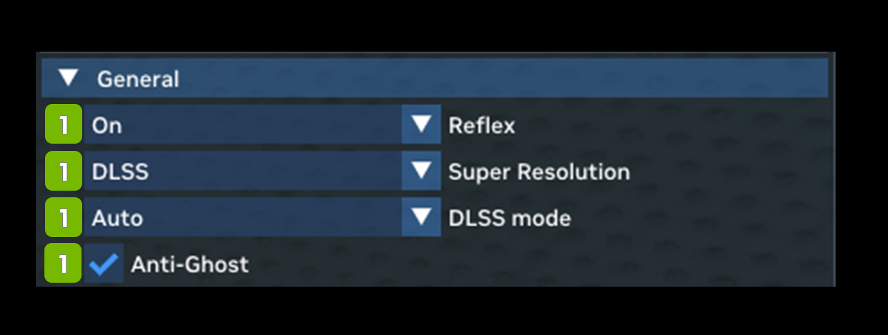

# General

The General settings deal mostly with performance and include various upscaling and latency reduction options.

| **Ref** | **Option**                | **RTX Option** | **Default Value** | **Description**                                                                                                                                                                                                                                                                                                 |
|---------|---------------------------|----------------|-------------------|-----------------------------------------------------------------------------------------------------------------------------------------------------------------------------------------------------------------------------------------------------------------------------------------------------------------|
| **1**   | **General**               |                |                   |                                                                                                                                                                                                                                                                                                                 |
| 2       | Reflex Dropdown           | rtx.reflexMode | On                | Reflex mode selection, enabling it to minimize input latency, boost mode may further reduce latency by boosting GPU clocks in CPU-bound cases.  Choices: On, Off, Boost  **NOTE:** The "Off" setting will still attempt to initialize.  Please use the RTX call **rtx.isReflexEnabled** to fully disable. |
| 3       | Super Resolution Dropdown |                | DLSS              | Choices: None, DLSS, NIS, TAA-U                                                                                                                                                                                                                                                                                 |
| 4       | DLSS Mode Dropdown        |                | Auto              | Choices: Ultra Performance, Performance, Balance  Quality, Auto, Full Resolution                                                                                                                                                                                                                          |
| 5       | Anti-Ghost Checkbox       |                | Checked           |                                                                                                                                                                                                                                                                                                                 |

***
 Need to leave feedback about the RTX Remix Documentation?  [Click here](https://github.com/NVIDIAGameWorks/rtx-remix/issues/new?assignees=nvdamien&labels=documentation%2Cfeedback%2Ctriage&projects=&template=documentation_feedback.yml&title=%5BDocumentation+feedback%5D%3A+) 
