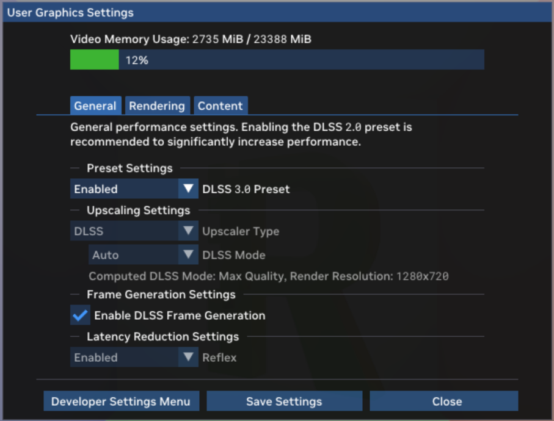
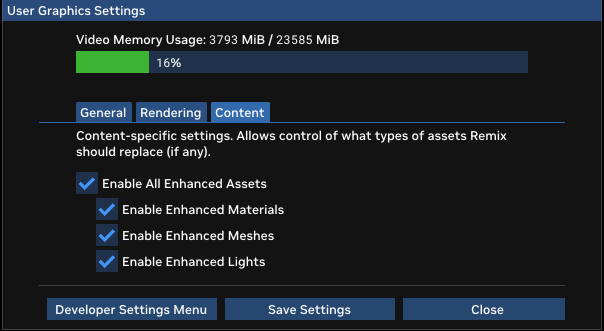
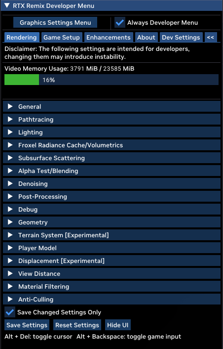

# RTX Remix Runtime Interface

> 📝 You can extend or shrink the Menu panel by holding your mouse cursor over the edge of the panels until the icon changes to the double arrow icon, then drag the edge of the panel to the size you prefer.

## User Graphics Settings

When pressing **Alt + X**, you will first be taken to the [User Graphic Settings](remix-runtimeinterface-usergraphicsettings.md) menu. This menu has various high-level settings intended for end users of RTX Remix mods to quickly customize their experience. There are three tabs: General, Rendering and Content. All the settings are described with a tooltip when you hover over them.

[FIXME: are these tabs outdated?]::

The **General** settings deal mostly with performance and include various upscaling and latency reduction options.

The **Rendering** settings contain high level image quality settings for the RTX Remix Path Tracing renderer. You can select one of the provided presets or customize each individual setting.

The **Content** settings allow you to turn off and on each of the three types of replacements supported by RTX Remix: Material, Mesh and Light replacements. These settings can be of interest when you want to evaluate the impact of each type of replacement on the mod project. Note however, that turning all the replacements off does not mean reverting to the original rendering that the underlying game uses. You are still Path Tracing, just with global defaults in place for materials and lights, and without any replacement meshes.

## Developer Settings

At the bottom of the User Graphics Settings menu, you should see a button for Developer Settings Menu. This will take you to a deeper and more detailed RTX Remix Developer Menu. It contains three main tabs.

1. The [Rendering Tab](renderingtab/index.md) is intended mostly for mod authors and runtime developers who need the ultimate control of renderer internals to achieve compatibility or the intended look for a mod or game.
2. The [Game Setup Tab](remix-runtimeinterface-gamesetup.md) contains the tagging workflow that will be needed to make a game moddable and compatible with RTX Remix.
3. The [Enhancements Tab](remix-runtimeinterface-enhancements.md) allows for capturing scenese and toggling various types of replacements on and off, as well as highlighting unreplaced assets, all useful for testing and validating mod content.
4. The [About Tab](remix-runtimeinterface-about.md) Contains contributor information.
5. The [Developer Settings Tab](remix-runtimeinterface-developermenu.md)Contains camera and other miscellaneous options.

> 📝 There is a checkbox at the top of the Developer Settings Menu that says "Always Developer Menu." Turning this checkbox on (and saving settings) will take you directly to the Developer menu when pressing **Alt + X**, saving you a click! 

> ⚠️ **Coders** Check out our RTX Options Documentation on GitHub [here](https://github.com/NVIDIAGameWorks/dxvk-remix/blob/main/RtxOptions.md).

## Saving Settings

Any settings you change in the menus can be saved as new defaults. They will be stored in a file named **rtx.conf** placed next to the **.trex/ runtime** folder. This file will be created if it does not already exist. The next time you start the game with RTX Remix, settings will be read from this file, and applied automatically.

## Keyboard Shortcuts

<table>
  <tr>
   <td><strong>Input</strong>
   </td>
   <td><strong>Description</strong>
   </td>
  </tr>
  <tr>
   <td><strong>Alt + X</strong>
   </td>
   <td>Open the RTX Runtime Developer Settings Menu
   </td>
  </tr>
  <tr>
   <td><strong>Alt + Delete</strong>
   </td>
   <td>Toggle Cursor
   </td>
  </tr>
  <tr>
   <td><strong>Alt + Backspace</strong>
   </td>
   <td>Toggle Game Input
   </td>
  </tr>
  <tr>
   <td><strong>CTRL + SHIFT + Q</strong>
   </td>
   <td>Open the <strong>Enhancements </strong>Developer Menu
   </td>
  </tr>
</table>

***
 Need to leave feedback about the RTX Remix Documentation?  [Click here](https://github.com/NVIDIAGameWorks/rtx-remix/issues/new?assignees=nvdamien&labels=documentation%2Cfeedback%2Ctriage&projects=&template=documentation_feedback.yml&title=%5BDocumentation+feedback%5D%3A+) 