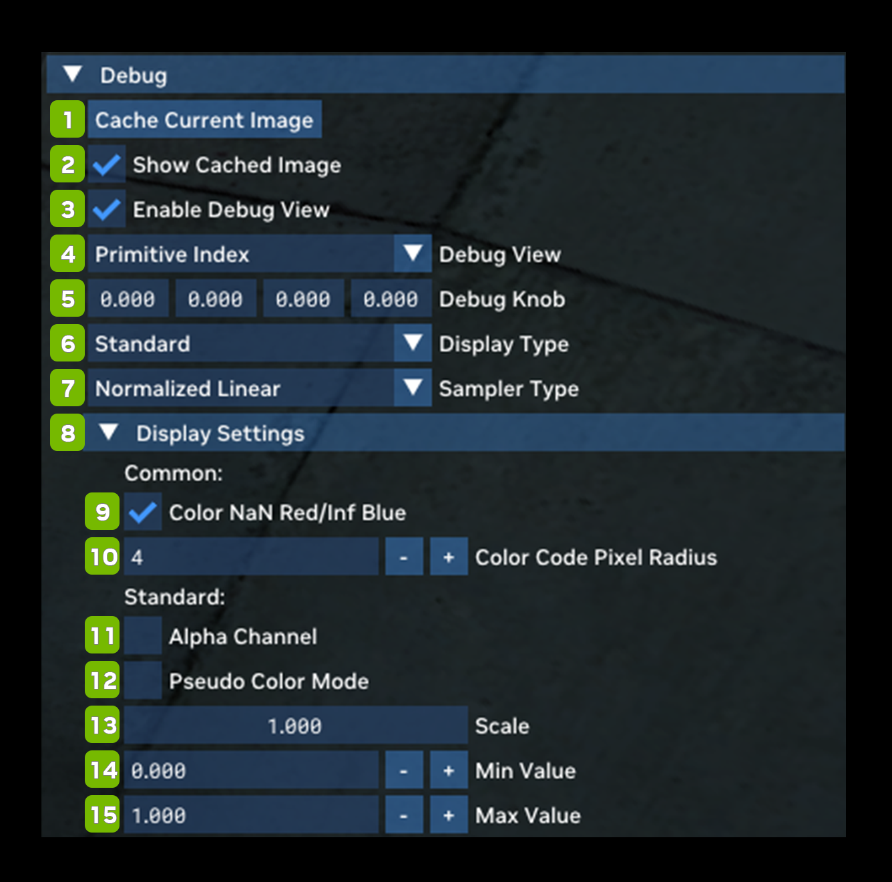

# Debug

Debug allows you to access a large variety of debug views in order to troubleshoot compatibility, content or rendering issues in a game or mod. Please refer to this document for an in depth guide to the Debug Display modes.

**Debug Search Menu**

You can use the Debug Search Menu to type in the Debug setting that you would like to test.

<table>
  <tr>
   <td><strong>Ref</strong>
   </td>
   <td><strong>Option</strong>
   </td>
   <td><strong>RTX Option</strong>
   </td>
   <td><strong>Default Value</strong>
   </td>
   <td><strong>Description</strong>
   </td>
  </tr>
  <tr>
   <td>1
   </td>
   <td>Cache Current Image Button
   </td>
   <td><!--- Needs Description --->
   </td>
   <td><!--- Needs Description --->
   </td>
   <td><!--- Needs Description --->
   </td>
  </tr>
  <tr>
   <td>2
   </td>
   <td>Show Cached Image Checkbox
   </td>
   <td>
   </td>
   <td>Unchecked
   </td>
   <td><!--- Needs Description --->
   </td>
  </tr>
  <tr>
   <td>3
   </td>
   <td>Enable Debug View Checkbox
   </td>
   <td>
   </td>
   <td>Unchecked
   </td>
   <td><!--- Needs Description --->
   </td>
  </tr>
  <tr>
   <td>4
   </td>
   <td>Debug View
   </td>
   <td>
   </td>
   <td>Primitive Index
   </td>
   <td><em>(See <strong>Debug View Chart </strong>Below)</em>
   </td>
  </tr>
  <tr>
   <td>5
   </td>
   <td>Debug Knob
   </td>
   <td>
   </td>
   <td>0.000 (for each value)
   </td>
   <td><!--- Needs Description --->
   </td>
  </tr>
  <tr>
   <td>6
   </td>
   <td>Display Type Dropdown
   </td>
   <td>rtx.debugView.displayType
   </td>
   <td>Standard
   </td>
   <td><!--- Needs Description --->Choices: Standard, BGR Exclusive Color, Exposure Value (EV100), & HDR Waveform
   </td>
  </tr>
  <tr>
   <td>8
   </td>
   <td>Sampler Type
   </td>
   <td>rtx.debugView.samplerType
   </td>
   <td>Normalized Linear
   </td>
   <td>Sampler type for debug views that sample from a texture (applies only to a subset of debug views).  Choices: Nearest, Normalized Nearest, & Normalized Linear
   </td>
  </tr>
  <tr>
   <td><strong>8</strong>
   </td>
   <td colspan="3" ><strong>Display Settings</strong>
   </td>
   <td><!--- Needs Description --->
   </td>
  </tr>
  <tr>
   <td><!--- Needs Description --->
   </td>
   <td colspan="3" ><strong>Common:</strong>
   </td>
   <td><!--- Needs Description --->
   </td>
  </tr>
  <tr>
   <td>9
   </td>
   <td>Color NaN/Inf Red Checkbox
   </td>
   <td><!--- Needs Description --->
   </td>
   <td>Checked
   </td>
   <td><!--- Needs Description --->
   </td>
  </tr>
  <tr>
   <td>10
   </td>
   <td>Color Code Pixel Radius
   </td>
   <td><!--- Needs Description --->
   </td>
   <td>4
   </td>
   <td><!--- Needs Description --->
   </td>
  </tr>
  <tr>
   <td><!--- Needs Description --->
   </td>
   <td colspan="3" ><strong>Standard:</strong>
   </td>
   <td><!--- Needs Description --->
   </td>
  </tr>
  <tr>
   <td>11
   </td>
   <td>Alpha Channel Checkbox
   </td>
   <td><!--- Needs Description --->
   </td>
   <td>Unchecked
   </td>
   <td><!--- Needs Description --->
   </td>
  </tr>
  <tr>
   <td>12
   </td>
   <td>Pseudo Color Mode Checkbox
   </td>
   <td>rtx.debugView.enablePseudoColor
   </td>
   <td>Unchecked
   </td>
   <td>Enables RGB color coding of a scalar debug view value.
   </td>
  </tr>
  <tr>
   <td>13
   </td>
   <td>Scale
   </td>
   <td><!--- Needs Description --->
   </td>
   <td>1.000
   </td>
   <td><!--- Needs Description --->
   </td>
  </tr>
  <tr>
   <td>14
   </td>
   <td>Min Value
   </td>
   <td>rtx.debugView.evMinValue
   </td>
   <td>-4
   </td>
   <td><!--- Needs Description --->
   </td>
  </tr>
  <tr>
   <td>15
   </td>
   <td>Max Value
   </td>
   <td>rtx.debugView.evMaxValue
   </td>
   <td>4
   </td>
   <td><!--- Needs Description --->
   </td>
  </tr>
</table>

**Debug View Chart**

<table>
  <tr>
   <td><strong>Debug View</strong>
   </td>
   <td><strong>Description</strong>
   </td>
  </tr>
  <tr>
   <td>Primitive Index
   </td>
   <td>Refers to a unique identifier or index associated with a primitive in a rendering or graphics pipeline. Primitives are fundamental geometric shapes or elements used in computer graphics to construct more complex scenes and objects. These primitives can include points, lines, triangles, and more.  Each primitive is assigned a unique index that allows the GPU to process them individually or in specific groups as required by the rendering algorithm.
   </td>
  </tr>
  <tr>
   <td>Geometry Hash
   </td>
   <td><!--- Needs Description --->
   </td>
  </tr>
  <tr>
   <td>Custom Index
   </td>
   <td><!--- Needs Description --->
   </td>
  </tr>
  <tr>
   <td>Barycentric Coordinates
   </td>
   <td>A set of coordinates used to describe the position of a point within a triangle or other convex polygon. These coordinates are defined relative to the vertices of the polygon and are useful for various operations in graphics rendering, including interpolation and texture mapping. Barycentric coordinates are represented as a set of weights for each vertex of the polygon.
   </td>
  </tr>
  <tr>
   <td>Is Front Hit
   </td>
   <td><!--- Needs Description --->
   </td>
  </tr>
  <tr>
   <td>Is Static
   </td>
   <td><!--- Needs Description --->
   </td>
  </tr>
  <tr>
   <td>Is Opaque
   </td>
   <td><!--- Needs Description --->
   </td>
  </tr>
  <tr>
   <td>Is Direction Altered
   </td>
   <td><!--- Needs Description --->
   </td>
  </tr>
  <tr>
   <td>Is Emissive Blend
   </td>
   <td><!--- Needs Description --->
   </td>
  </tr>
  <tr>
   <td>View Direction
   </td>
   <td><!--- Needs Description --->
   </td>
  </tr>
  <tr>
   <td>Cone Radius
   </td>
   <td>The path of a ray of light as it extends from the camera into the scene and helps determine which objects or surfaces in the 3D environment the ray intersects with.
   </td>
  </tr>
  <tr>
   <td>Position
   </td>
   <td><!--- Needs Description --->
   </td>
  </tr>
  <tr>
   <td>Texture Coordinates
   </td>
   <td>Texture coordinates specify which part of a 2D texture map should be applied to each point on the 3D model's surface. This mapping allows for realistic and detailed texturing of 3D objects, enabling the application of textures like color, bump maps, normal maps, and more. By specifying texture coordinates for each vertex, the graphics hardware can interpolate and apply the corresponding texture data smoothly across the entire surface, creating the illusion of complex surface properties and details on the 3D object when rendered.
   </td>
  </tr>
  <tr>
   <td>Virtual Motion Vector
   </td>
   <td>The motion of objects between frames. These motion vectors help reduce data redundancy and improve compression efficiency by describing how objects move from one frame to another.
   </td>
  </tr>
  <tr>
   <td>Screen-Space Motion Vector
   </td>
   <td>(SSMV) is a data representation that captures the motion of objects or pixels between consecutive frames within the screen space. SSMVs are used in various rendering techniques, such as motion blur and temporal anti-aliasing, to simulate realistic motion effects.
   </td>
  </tr>
  <tr>
   <td>Triangle Normal
   </td>
   <td>These normals help determine how light rays are reflected or refracted off the triangle's surface, affecting the appearance of the triangle in the rendered image.
   </td>
  </tr>
  <tr>
   <td>Interpolated Normal
   </td>
   <td>A normal vector calculated for a specific point on a 3D surface by interpolating or blending the normals of nearby vertices. These interpolated normals are used to determine how light interacts with the surface and are crucial for achieving smooth shading and realistic lighting effects.
   </td>
  </tr>
  <tr>
   <td>Tangent
   </td>
   <td>Refers to a vector that lies in the plane of a 3D surface and is perpendicular to the surface's normal vector. Tangent vectors are used in techniques like normal mapping and bump mapping to simulate fine surface details and enhance the realism.
   </td>
  </tr>
  <tr>
   <td>Bitangent
   </td>
   <td>A vector that is perpendicular to both the surface normal and the tangent vector of a 3D surface at a particular point. The bitangent vector is typically used in advanced shading techniques, such as normal mapping and bump mapping, to complete a local coordinate system known as the tangent space.
   </td>
  </tr>
  <tr>
   <td>Shading Normal
   </td>
   <td>Often referred to as a "Geometric Normal," is a vector that represents the orientation or facing direction of a surface at a particular point on a 3D object. This vector is used in shading calculations to determine how light interacts with the surface and how the surface should be illuminated or shaded.
   </td>
  </tr>
  <tr>
   <td>Virtual Shading Normal
   </td>
   <td><!--- Needs Description --->
   </td>
  </tr>
  <tr>
   <td>Vertex Color
   </td>
   <td>Refers to color information associated with individual vertices (corner points) of a 3D model or object. Each vertex can have a specific color value assigned to it, which is typically represented as a combination of red, green, and blue (RGB) values.
   </td>
  </tr>
  <tr>
   <td>Portal Space
   </td>
   <td><!--- Needs Description --->
   </td>
  </tr>
  <tr>
   <td>Material Type
   </td>
   <td>refers to a classification or categorization of the physical properties and visual characteristics of surfaces or materials used in 3D scenes. Material types are used to describe how light interacts with a particular surface and how it should be shaded and rendered.  Common material types might include: Diffuse Materials, Specular Materials, Translucent Materials, and Emissive Materials.
   </td>
  </tr>
  <tr>
   <td>Diffuse Albedo
   </td>
   <td>Refers to the inherent color or reflectance of a surface when it interacts with and scatters incoming light uniformly in all directions. It represents the base color or the color of a surface under diffuse lighting conditions, meaning when there are no specular highlights or reflections.
   </td>
  </tr>
  <tr>
   <td>Base Reflectivity
   </td>
   <td><!--- Needs Description --->
   </td>
  </tr>
  <tr>
   <td>Isotropic Roughness
   </td>
   <td>Refers to a property that describes the degree of micro-surface irregularities or roughness on a 3D object's surface in a uniform and non-directional manner. This roughness affects how light scatters and interacts with the surface, leading to diffuse reflections.
   </td>
  </tr>
  <tr>
   <td>Perceptual Roughness
   </td>
   <td><!--- Needs Description --->
   </td>
  </tr>
  <tr>
   <td>Anisotropy
   </td>
   <td>Refers to a property of materials or surfaces that causes them to exhibit different reflective or shading characteristics in different directions. Anisotropic materials have a direction-dependent behavior, meaning they can appear shinier or more reflective in one direction while exhibiting different properties in other directions.
   </td>
  </tr>
  <tr>
   <td>Anisotropic Roughness
   </td>
   <td>Refers to a property that describes surface roughness in a way that varies based on the direction of measurement. Unlike isotropic roughness, which is uniform in all directions, anisotropic roughness implies that the micro-surface irregularities on an object's surface have a directional preference.
   </td>
  </tr>
  <tr>
   <td>Opacity
   </td>
   <td>Refers to the degree to which an object or part of an object is transparent or allows light to pass through. It is a fundamental property used to control the visibility and transparency of 3D objects and their components within a rendered scene.
   </td>
  </tr>
  <tr>
   <td>Emissive Radiance
   </td>
   <td>Refers to the radiant energy emitted or radiated from a surface or object in a 3D scene. It represents the light or color that a surface emits as opposed to reflecting or scattering light like most materials.
   </td>
  </tr>
  <tr>
   <td>Thin Film Thickness
   </td>
   <td>Refers to the measurement of the thickness of a thin film or layer of material that is applied to a surface. This concept is often used in computer graphics and rendering to simulate the interaction of light with thin layers of materials, such as oil films on water or soap bubbles.
   </td>
  </tr>
  <tr>
   <td>Virtual Hit Distance
   </td>
   <td><!--- Needs Description --->
   </td>
  </tr>
  <tr>
   <td>Primary Depth
   </td>
   <td>Refers to the depth information associated with the primary rays in a ray tracing pipeline.
   </td>
  </tr>
  <tr>
   <td>Blue Noise
   </td>
   <td>Refers to a type of noise pattern that has unique properties, making it particularly useful for various applications, including texture mapping, sampling, and anti-aliasing. Blue noise is characterized by a distribution of points or values in such a way that they are more evenly spaced and have a more perceptually uniform distribution of energy in the high-frequency spectrum, especially in the blue part of the spectrum.
   </td>
  </tr>
  <tr>
   <td>Pixel Checkerboard
   </td>
   <td>A technique used to analyze and visualize the distribution of pixel shading workloads across the screen or image. It involves rendering a checkerboard pattern over a scene, where each square of the checkerboard represents a pixel. The color of each square can indicate the complexity or computational workload of the corresponding pixel.
   </td>
  </tr>
  <tr>
   <td>Volume Radiance Depth Layers
   </td>
   <td><!--- Needs Description --->
   </td>
  </tr>
  <tr>
   <td>Surface Volume Radiance
   </td>
   <td><!--- Needs Description --->
   </td>
  </tr>
  <tr>
   <td>Composite Output
   </td>
   <td>Refers to the final image that is generated by combining and blending various graphical elements or layers together. This process typically involves taking multiple rendered images, often with transparency information, and compositing them into a single cohesive image that represents the final scene as it will be displayed to the viewer.
   </td>
  </tr>
  <tr>
   <td>Local Tonemapper Luminance Output
   </td>
   <td>Refers to the output of a local tonemapping process that adjusts the brightness and contrast of an image on a pixel-by-pixel basis. This adjustment is based on the luminance or brightness values of the pixels in the image.
   </td>
  </tr>
  <tr>
   <td>Local Tonemapper Blend Weight
   </td>
   <td><!--- Needs Description --->
   </td>
  </tr>
  <tr>
   <td>Local Tonemapper Assembled Exposure
   </td>
   <td><!--- Needs Description --->
   </td>
  </tr>
  <tr>
   <td>Local Tonemapper Final Multiplier
   </td>
   <td><!--- Needs Description --->
   </td>
  </tr>
  <tr>
   <td>Final Output
   </td>
   <td><!--- Needs Description --->
   </td>
  </tr>
  <tr>
   <td>Final Output (pre-tonemap)
   </td>
   <td><!--- Needs Description --->
   </td>
  </tr>
  <tr>
   <td>Exposure Histogram
   </td>
   <td>A graphical representation that provides a visual summary of the distribution of pixel brightness or luminance values in an image. It shows how many pixels fall into different brightness or exposure levels, typically displayed as a histogram chart.
   </td>
  </tr>
  <tr>
   <td>View Model: Final Output
   </td>
   <td><!--- Needs Description --->
   </td>
  </tr>
  <tr>
   <td>ReSTIR GI Initial Sample
   </td>
   <td><!--- Needs Description --->
   </td>
  </tr>
  <tr>
   <td>ReSTIR GI Temporal Reprojection
   </td>
   <td><!--- Needs Description --->
   </td>
  </tr>
  <tr>
   <td>ReSTIR GI Spatial Reuse
   </td>
   <td><!--- Needs Description --->
   </td>
  </tr>
  <tr>
   <td>ReSTIR GI Final Shading MIS Weight
   </td>
   <td><!--- Needs Description --->
   </td>
  </tr>
  <tr>
   <td>ReSTIR GI Virtual Hit Distance
   </td>
   <td><!--- Needs Description --->
   </td>
  </tr>
  <tr>
   <td>ReSTIR GI Gradients
   </td>
   <td><!--- Needs Description --->
   </td>
  </tr>
  <tr>
   <td>ReSTIR GI Confidence
   </td>
   <td><!--- Needs Description --->
   </td>
  </tr>
  <tr>
   <td>Stochastic Alpha Blend Color
   </td>
   <td><!--- Needs Description --->
   </td>
  </tr>
  <tr>
   <td>Stochastic Alpha Blend Normal
   </td>
   <td><!--- Needs Description --->
   </td>
  </tr>
  <tr>
   <td>Stochastic Alpha Blend Geometry Hash
   </td>
   <td><!--- Needs Description --->
   </td>
  </tr>
  <tr>
   <td>Stochastic Alpha Blend Background Transparency
   </td>
   <td><!--- Needs Description --->
   </td>
  </tr>
  <tr>
   <td>Geometry Flags: First Sampled Lobe is Specular
   </td>
   <td><!--- Needs Description --->
   </td>
  </tr>
  <tr>
   <td>Indirect First Ray Throughput
   </td>
   <td><!--- Needs Description --->
   </td>
  </tr>
  <tr>
   <td>Indirect First Sampled Lobe PDF
   </td>
   <td><!--- Needs Description --->
   </td>
  </tr>
  <tr>
   <td>Indirect First Sampled Solid Angle PDF
   </td>
   <td><!--- Needs Description --->
   </td>
  </tr>
  <tr>
   <td>Primary Ray Interactions (RTS TR Only)
   </td>
   <td><!--- Needs Description --->
   </td>
  </tr>
  <tr>
   <td>Secondary Ray Interactions (RGX TR Only)
   </td>
   <td><!--- Needs Description --->
   </td>
  </tr>
  <tr>
   <td>Primary Ray Bounces
   </td>
   <td>Refers to the first set of rays cast from the camera or viewer into a 3D scene during the ray tracing process. These primary rays are used to determine which objects or surfaces in the scene are visible from the camera's perspective.
   </td>
  </tr>
  <tr>
   <td>Secondary Ray Bounces
   </td>
   <td>Refers to the rays that are cast after the primary rays during the ray tracing process. Primary rays are initially shot from the camera or viewer into the 3D scene to determine which objects or surfaces are visible. When these primary rays hit a reflective or refractive surface, secondary rays are generated to simulate additional lighting effects, such as reflections and refractions.
   </td>
  </tr>
  <tr>
   <td>Primary Unordered Ray Interactions
   </td>
   <td><!--- Needs Description --->
   </td>
  </tr>
  <tr>
   <td>Secondary Unordered Ray Interactions
   </td>
   <td><!--- Needs Description --->
   </td>
  </tr>
  <tr>
   <td>Primary Ray Interactions (+Unordered) (RGS TR Only)
   </td>
   <td><!--- Needs Description --->
   </td>
  </tr>
  <tr>
   <td>Secondary Ray Interactions (+Unordered) (RGS TR Only)
   </td>
   <td><!--- Needs Description --->
   </td>
  </tr>
  <tr>
   <td>PSR Primary Secondary Surface Mask
   </td>
   <td><!--- Needs Description --->
   </td>
  </tr>
  <tr>
   <td>PSR Selected Integration Surface PDF
   </td>
   <td><!--- Needs Description --->
   </td>
  </tr>
  <tr>
   <td>Primary Use Alternative Disocclusion Threshold
   </td>
   <td><!--- Needs Description --->
   </td>
  </tr>
  <tr>
   <td>Primary Specular Albedo
   </td>
   <td>Refers to the albedo or reflectance value that represents the color and intensity of the specular reflections on a surface when using ray tracing or other rendering techniques. It specifically relates to how a surface reflects light from direct light sources, such as point lights or directional lights.
   </td>
  </tr>
  <tr>
   <td>Secondary Specular Albedo
   </td>
   <td>Refers to the albedo or reflectance value that represents the color and intensity of the secondary, or indirect, specular reflections on a surface when using ray tracing or other advanced rendering techniques.
   </td>
  </tr>
  <tr>
   <td>Primary Direct Diffuse: Noisy Color
   </td>
   <td><!--- Needs Description --->
   </td>
  </tr>
  <tr>
   <td>Primary Direct Diffuse: Noisy HitT
   </td>
   <td><!--- Needs Description --->
   </td>
  </tr>
  <tr>
   <td>Primary Direct Diffuse: Demodulated Noisy Color
   </td>
   <td><!--- Needs Description --->
   </td>
  </tr>
  <tr>
   <td>Primary Direct Diffuse: Denoised Color
   </td>
   <td><!--- Needs Description --->
   </td>
  </tr>
  <tr>
   <td>Primary Direct Diffuse: Denoised HitT (ReBLUR) | Variance (ReLAX)
   </td>
   <td><!--- Needs Description --->
   </td>
  </tr>
  <tr>
   <td>Primary Direct Diffuse: NRD Normalized HitT
   </td>
   <td><!--- Needs Description --->
   </td>
  </tr>
  <tr>
   <td>Primary Direct Specular: Noisy Color
   </td>
   <td><!--- Needs Description --->
   </td>
  </tr>
  <tr>
   <td>Primary Direct Specular: Noisy Color
   </td>
   <td><!--- Needs Description --->
   </td>
  </tr>
  <tr>
   <td>Primary Direct Specular: Noisy HitT
   </td>
   <td><!--- Needs Description --->
   </td>
  </tr>
  <tr>
   <td>Primary Direct Specular: Demodulated Noisy Color
   </td>
   <td><!--- Needs Description --->
   </td>
  </tr>
  <tr>
   <td>Primary Direct Specular: Denoised Color
   </td>
   <td><!--- Needs Description --->
   </td>
  </tr>
  <tr>
   <td>Primary Direct Specular: Denoised HitT (ReBLUR) | Variance (ReLAX)
   </td>
   <td><!--- Needs Description --->
   </td>
  </tr>
  <tr>
   <td>Primary Direct Specular: NRD Normalized HitT
   </td>
   <td><!--- Needs Description --->
   </td>
  </tr>
  <tr>
   <td>Primary Indirect Diffuse: Noisy Color
   </td>
   <td><!--- Needs Description --->
   </td>
  </tr>
  <tr>
   <td>Primary Indirect Diffuse: Noisy Color
   </td>
   <td><!--- Needs Description --->
   </td>
  </tr>
  <tr>
   <td>Primary Indirect Diffuse: Noisy HitT
   </td>
   <td><!--- Needs Description --->
   </td>
  </tr>
  <tr>
   <td>Primary Indirect Diffuse: Demodulated Noisy Color
   </td>
   <td><!--- Needs Description --->
   </td>
  </tr>
  <tr>
   <td>Primary Indirect Diffuse: Denoised Color
   </td>
   <td><!--- Needs Description --->
   </td>
  </tr>
  <tr>
   <td>Primary Indirect Diffuse: Denoised HitT (ReBLUR) | Variance (ReLAX)
   </td>
   <td><!--- Needs Description --->
   </td>
  </tr>
  <tr>
   <td>Primary Indirect Diffuse: NRD Normalized HitT
   </td>
   <td><!--- Needs Description --->
   </td>
  </tr>
  <tr>
   <td>Primary Indirect Specular: Noisy Color
   </td>
   <td><!--- Needs Description --->
   </td>
  </tr>
  <tr>
   <td>Primary Indirect Specular: Diffuse: Noisy Color
   </td>
   <td><!--- Needs Description --->
   </td>
  </tr>
  <tr>
   <td>Primary Indirect Specular: Diffuse: Noisy HitT
   </td>
   <td><!--- Needs Description --->
   </td>
  </tr>
  <tr>
   <td>Primary Indirect Specular: Demodulated Noisy Color
   </td>
   <td><!--- Needs Description --->
   </td>
  </tr>
  <tr>
   <td>Primary Indirect Specular: Denoised Color
   </td>
   <td><!--- Needs Description --->
   </td>
  </tr>
  <tr>
   <td>Primary Indirect Specular: Denoised HitT (ReBLUR) | Variance (ReLAX)
   </td>
   <td><!--- Needs Description --->
   </td>
  </tr>
  <tr>
   <td>Primary Indirect Specular: NRD Normalized HitT
   </td>
   <td><!--- Needs Description --->
   </td>
  </tr>
  <tr>
   <td>Secondary Direct Diffuse: Noisy Color
   </td>
   <td><!--- Needs Description --->
   </td>
  </tr>
  <tr>
   <td>Secondary Indirect Diffuse: Noisy Color
   </td>
   <td><!--- Needs Description --->
   </td>
  </tr>
  <tr>
   <td>Secondary Combined Diffuse: Noisy Color
   </td>
   <td><!--- Needs Description --->
   </td>
  </tr>
  <tr>
   <td>Secondary Combined Diffuse: Demodulated Noisy Color
   </td>
   <td><!--- Needs Description --->
   </td>
  </tr>
  <tr>
   <td>Secondary Combined Diffuse: Denoised Color
   </td>
   <td><!--- Needs Description --->
   </td>
  </tr>
  <tr>
   <td>Secondary Direct Speculary: Noisy Color
   </td>
   <td><!--- Needs Description --->
   </td>
  </tr>
  <tr>
   <td>Secondary Indirect Specular: Noisy Color
   </td>
   <td><!--- Needs Description --->
   </td>
  </tr>
  <tr>
   <td>Secondary Combined Specular: Noisy Color
   </td>
   <td><!--- Needs Description --->
   </td>
  </tr>
  <tr>
   <td>Secondary Combined Specular: Demodulated Noisy Color
   </td>
   <td><!--- Needs Description --->
   </td>
  </tr>
  <tr>
   <td>Secondary Combined Specular: Denoised Color
   </td>
   <td><!--- Needs Description --->
   </td>
  </tr>
  <tr>
   <td>Thread Divergence (Debug Knob.x)
   </td>
   <td><!--- Needs Description --->
   </td>
  </tr>
  <tr>
   <td>Inf/Nan Check
   </td>
   <td>Refers to a process or technique used to identify and handle numerical values that are either infinite (Inf) or not-a-number (NaN) during rendering or computation.
   </td>
  </tr>
  <tr>
   <td>Surface / Lobe Consistency Check
   </td>
   <td><!--- Needs Description --->
   </td>
  </tr>
  <tr>
   <td>Scrolling Line
   </td>
   <td><!--- Needs Description --->
   </td>
  </tr>
</table>

***
 Need to leave feedback about the RTX Remix Documentation?  [Click here](https://github.com/NVIDIAGameWorks/rtx-remix/issues/new?assignees=nvdamien&labels=documentation%2Cfeedback%2Ctriage&projects=&template=documentation_feedback.yml&title=%5BDocumentation+feedback%5D%3A+) 
