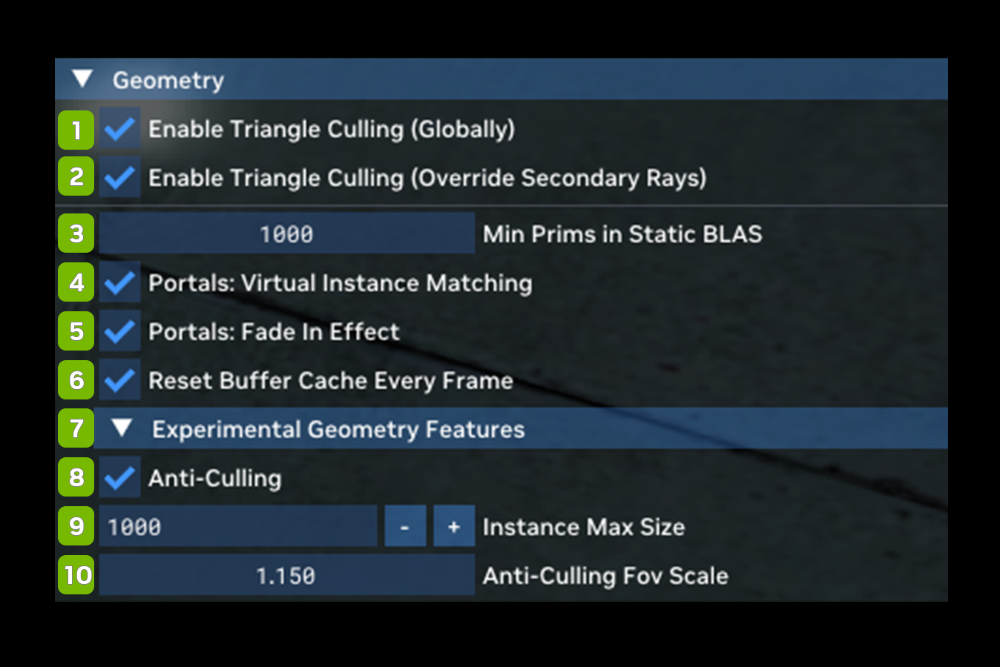

# Geometry

Various compatibility options for geometry handling.

<table>
  <tr>
   <td><strong>Ref</strong>
   </td>
   <td><strong>Option</strong>
   </td>
   <td><strong>RTX Option</strong>
   </td>
   <td><strong>Default Value</strong>
   </td>
   <td><strong>Description</strong>
   </td>
  </tr>
  <tr>
   <td>1
   </td>
   <td>Enable Triangle Culling (Globally)
   </td>
   <td>
   </td>
   <td><!--- Needs Description --->
   </td>
   <td><!--- Needs Description --->
   </td>
  </tr>
  <tr>
   <td>2
   </td>
   <td>Enable Triangle Culling (Override Secondary Rays)
   </td>
   <td>
   </td>
   <td><!--- Needs Description --->
   </td>
   <td><!--- Needs Description --->
   </td>
  </tr>
  <tr>
   <td>3
   </td>
   <td>Min Prims in Static BLAS
   </td>
   <td>
   </td>
   <td>1000
   </td>
   <td><!--- Needs Description --->
   </td>
  </tr>
  <tr>
   <td>4
   </td>
   <td>Portals: Virtual Instance Matching Checkbox
   </td>
   <td>rtx.useRayPortalVirtualInstanceMatching
   </td>
   <td>Checked
   </td>
   <td><!--- Needs Description --->
   </td>
  </tr>
  <tr>
   <td>5
   </td>
   <td>Portals: Fade in Effect Checkbox
   </td>
   <td>rtx.enablePortalFadeInEffect
   </td>
   <td>Unchecked
   </td>
   <td><!--- Needs Description --->
   </td>
  </tr>
  <tr>
   <td>6
   </td>
   <td>Reset Buffer Cache Every Frame Checkbox
   </td>
   <td>
   </td>
   <td><!--- Needs Description --->
   </td>
   <td><!--- Needs Description --->
   </td>
  </tr>
  <tr>
   <td><strong>7</strong>
   </td>
   <td colspan="3" ><strong>Experimental Geometry Features</strong>
   </td>
   <td>
   </td>
  </tr>
  <tr>
   <td>8
   </td>
   <td>Anti-Culling Checkbox
   </td>
   <td>rtx.antiCulling.object.enable
   </td>
   <td>Unchecked
   </td>
   <td>Extends lifetime of objects that go outside the camera frustum (anti-culling frustum).
   </td>
  </tr>
  <tr>
   <td>9
   </td>
   <td>Instance Max Size
   </td>
   <td>rtx.antiCulling.object.numObjectsToKeep
   </td>
   <td>1000
   </td>
   <td>The maximum number of RayTracing instances to keep when Anti-Culling is enabled.
   </td>
  </tr>
  <tr>
   <td>10
   </td>
   <td>Anti-Culling FoV Scale
   </td>
   <td>rtx.antiCulling.object.fovScale
   </td>
   <td>1.000
   </td>
   <td>Scalar of the FOV of Anti-Culling Frustum.
   </td>
  </tr>
</table>

***
 Need to leave feedback about the RTX Remix Documentation?  [Click here](https://github.com/NVIDIAGameWorks/rtx-remix/issues/new?assignees=nvdamien&labels=documentation%2Cfeedback%2Ctriage&projects=&template=documentation_feedback.yml&title=%5BDocumentation+feedback%5D%3A+) 
