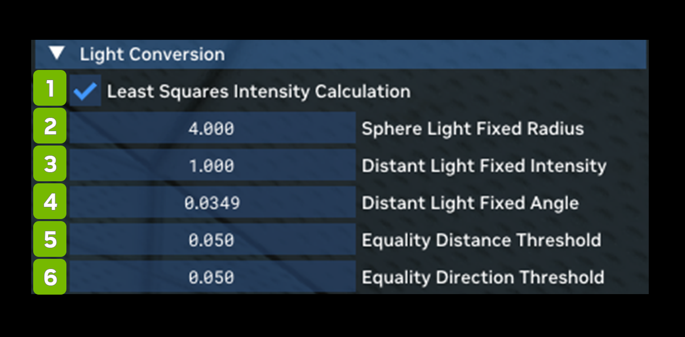

# Light Conversion

Light Conversion allows you to control how game lights are translated into Path Tracing compatible physical light sources in the Remix Toolkit.

<table>
  <tr>
   <td><strong>Ref</strong>
   </td>
   <td><strong>Option</strong>
   </td>
   <td><strong>RTX Option</strong>
   </td>
   <td><strong>Default Value</strong>
   </td>
   <td><strong>Description</strong>
   </td>
  </tr>
  <tr>
   <td>1
   </td>
   <td>Least Squares Intensity Calculation Checkbox
   </td>
   <td>rtx.calculateLightIntensityUsingLeastSquares
   </td>
   <td>Checked
   </td>
   <td>Enable usage of least squares for approximating a light's falloff curve rather than a more basic single point approach. This will generally result in more accurate matching of the original application's custom light attenuation curves, especially with non physically based linear-style attenuation.
   </td>
  </tr>
  <tr>
   <td>2
   </td>
   <td>Sphere Light Fixed Radius
   </td>
   <td>rtx.lightConversionSphereLightFixedRadius
   </td>
   <td>4
   </td>
   <td>The fixed radius in world units to use for legacy lights converted to sphere lights (currently point and spot lights will convert to sphere lights). Use caution with large light radii as many legacy lights will be placed close to geometry and intersect it, causing suboptimal light sampling performance or other visual artifacts (lights clipping through walls, etc).
   </td>
  </tr>
  <tr>
   <td>3
   </td>
   <td>Distant Light Fixed Intensity
   </td>
   <td>rtx.lightConversionDistantLightFixedIntensity
   </td>
   <td>1
   </td>
   <td>The fixed intensity (in W/sr) to use for legacy lights converted to distant lights (currently directional lights will convert to distant lights).
   </td>
  </tr>
  <tr>
   <td>4
   </td>
   <td>Distant Light Fixed Angle
   </td>
   <td>rtx.lightConversionDistantLightFixedAngle
   </td>
   <td>0.0349
   </td>
   <td>The angular size in radiance of the distant light source for legacy lights converted to distant lights. Set to ~2 degrees in radians by default.
   </td>
  </tr>
  <tr>
   <td>5
   </td>
   <td>Equality Distance Threshold
   </td>
   <td>rtx.lightConversionEqualityDistanceThreshold
   </td>
   <td>0.05
   </td>
   <td>The upper distance threshold between two positions is used to determine if two positional lights are the same light when uniquely identifying legacy lights for conversion.
   </td>
  </tr>
  <tr>
   <td>6
   </td>
   <td>Equality Direction Threshold
   </td>
   <td>rtx.lightConversionEqualityDirectionThreshold
   </td>
   <td>0.99
   </td>
   <td>The lower cosine angle threshold between two directions is used to determine if two directional lights are the same light when uniquely identifying legacy lights for conversion.
   </td>
  </tr>
</table>

***
 Need to leave feedback about the RTX Remix Documentation?  [Click here](https://docs.google.com/forms/d/1vym6SgptS4QJvp6ZKTN8Mu9yfd5yQc76B3KHIl-n4DQ/prefill) 