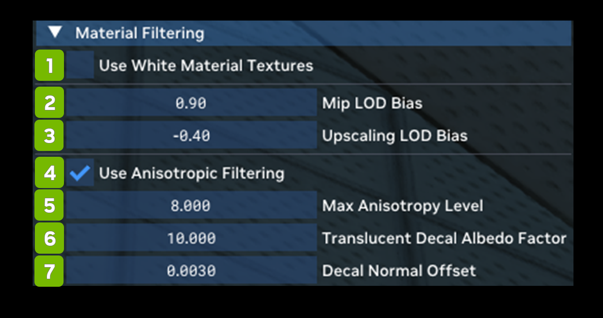

# Material Filtering

Material Filtering allows you to adjust material filtering options or render all white materials for an easier time when tuning lighting.

<table>
  <tr>
   <td><strong>Ref</strong>
   </td>
   <td><strong>Option</strong>
   </td>
   <td><strong>RTX Option</strong>
   </td>
   <td><strong>Default Value</strong>
   </td>
   <td><strong>Description</strong>
   </td>
  </tr>
  <tr>
   <td>1
   </td>
   <td>Use White Material Textures Checkbox
   </td>
   <td>rtx.useWhiteMaterialMode
   </td>
   <td>Unchecked
   </td>
   <td><!--- Needs Description --->
   </td>
  </tr>
  <tr>
   <td>2
   </td>
   <td>Mip LOD Bias
   </td>
   <td>
   </td>
   <td>0.90
   </td>
   <td><!--- Needs Description --->
   </td>
  </tr>
  <tr>
   <td>3
   </td>
   <td>Upscaling LOD Bias
   </td>
   <td>
   </td>
   <td>-0.4
   </td>
   <td><!--- Needs Description --->
   </td>
  </tr>
  <tr>
   <td>4
   </td>
   <td>Use Anisotropic Filtering Checkbox
   </td>
   <td>rtx.useAnisotropicFiltering
   </td>
   <td>Checked
   </td>
   <td>A flag to indicate if anisotropic filtering should be used on material textures, otherwise typical trilinear filtering will be used.

This should generally be enabled as anisotropic filtering allows for less blurring on textures at grazing angles than typical trilinear filtering with only usually minor performance impact (depending on the max anisotropy samples).
   </td>
  </tr>
  <tr>
   <td>5
   </td>
   <td>Max Anisotropy Level
   </td>
   <td>rtx.maxAnisotropySamples
   </td>
   <td>8.000
   </td>
   <td>The maximum number of samples to use when anisotropic filtering is enabled.

The actual max anisotropy used will be the minimum between this value and the hardware's maximum. Higher values increase quality but will likely reduce performance.
   </td>
  </tr>
  <tr>
   <td>6
   </td>
   <td>Translucent Decal Albedo Factor
   </td>
   <td>rtx.translucentDecalAlbedoFactor
   </td>
   <td>10
   </td>
   <td>A global scale factor applied to the albedo of decals that are applied to a translucent base material, to make the decals more visible.

This is generally needed as albedo values for decals may be fairly low when dealing with opaque surfaces, but the translucent diffuse layer requires a fairly high albedo value to result in an expected look.

The need for this option could be avoided by simply authoring decals applied to translucent materials with a higher albedo to begin with, but sometimes applications may share decals between different material types.
   </td>
  </tr>
  <tr>
   <td>7
   </td>
   <td>Decal Normal Offset
   </td>
   <td><!--- Needs Description --->
   </td>
   <td>0.0030
   </td>
   <td><!--- Needs Description --->
   </td>
  </tr>
</table>

***
 Need to leave feedback about the RTX Remix Documentation?  [Click here](https://github.com/NVIDIAGameWorks/rtx-remix/issues/new?assignees=nvdamien&labels=documentation%2Cfeedback%2Ctriage&projects=&template=documentation_feedback.yml&title=%5BDocumentation+feedback%5D%3A+) 