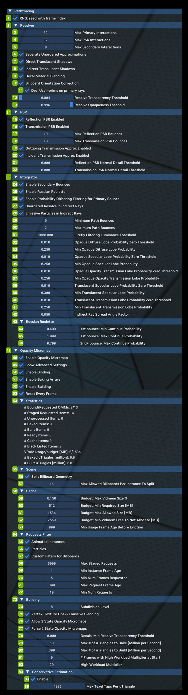

# Pathtracing

Pathtracing allows you to tweak the behavior of the Path Tracer in both subtle and profound ways. The technical details go deep into Ray Tracing theory.

<table>
  <tr>
   <td><strong>Ref</strong>
   </td>
   <td><strong>Option</strong>
   </td>
   <td><strong>RTX Option</strong>
   </td>
   <td><strong>Default Value</strong>
   </td>
   <td><strong>Description</strong>
   </td>
  </tr>
  <tr>
   <td>1
   </td>
   <td>RNG: Seed with Frame Index Checkbox
   </td>
   <td>rtx.rngSeedWithFrameIndex
   </td>
   <td>Checked
   </td>
   <td>Indicates that pseudo-random number generator should be seeded with the frame number of the application every frame, otherwise seed with 0.

This should generally always be enabled as without the frame index each frame will typically be identical in the random values that are produced which will result in incorrect rendering. Only meant as a debugging tool.
   </td>
  </tr>
  <tr>
   <td><strong>2</strong>
   </td>
   <td colspan="3" ><strong>Resolver</strong>
   </td>
   <td>
   </td>
  </tr>
  <tr>
   <td>3
   </td>
   <td>Max Primary Interactions
   </td>
   <td>rtx.primaryRayMaxInteractions
   </td>
   <td>32
   </td>
   <td>The maximum number of resolver interactions to use for primary (initial G-Buffer) rays.

This affects how many Decals, Ray Portals and potentially particles (if unordered approximations are not enabled) may be interacted with along a ray at the cost of performance for higher amounts of interactions.
   </td>
  </tr>
  <tr>
   <td>4
   </td>
   <td>Max PSR Interactions
   </td>
   <td>rtx.psrRayMaxInteractions
   </td>
   <td>32
   </td>
   <td>The maximum number of resolver interactions to use for PSR (primary surface replacement G-Buffer) rays.  This affects how many Decals, Ray Portals and potentially particles (if unordered approximations are not enabled) may be interacted with along a ray at the cost of performance for higher amounts of interactions. 
   </td>
  </tr>
  <tr>
   <td>5
   </td>
   <td>Max Secondary Interactions
   </td>
   <td>rtx.secondaryRayMaxInteractions
   </td>
   <td>8
   </td>
   <td>The maximum number of resolver interactions to use for primary (initial G-Buffer) rays.

This affects how many Decals, Ray Portals and potentially particles (if unordered approximations are not enabled) may be interacted with along a ray at the cost of performance for higher amounts of interactions.
   </td>
  </tr>
  <tr>
   <td>6
   </td>
   <td>Separate Unordered Approximations Checkbox
   </td>
   <td>rtx.enableSeparateUnorderedApproximations
   </td>
   <td>Checked
   </td>
   <td>Use a separate loop during resolving for surfaces which can have lighting evaluated in an approximate unordered way on each path segment (such as particles).

This improves performance typically in how particles or decals are rendered and should usually always be enabled.

Do note however the unordered nature of this resolving method may result in visual artifacts with large numbers of stacked particles due to difficulty in determining the intended order.

Additionally, unordered approximations will only be done on the first indirect ray bounce (as particles matter less in higher bounces), and only if enabled by its corresponding setting.
   </td>
  </tr>
  <tr>
   <td>7
   </td>
   <td>Direct Translucent Shadows Checkbox
   </td>
   <td>rtx.enableDirectTranslucentShadows
   </td>
   <td>Unchecked
   </td>
   <td>Include OBJECT_MASK_TRANSLUCENT into primary visibility rays.
   </td>
  </tr>
  <tr>
   <td>8
   </td>
   <td>Indirect Translucent Shadows Checkbox
   </td>
   <td>rtx.enableIndirectTranslucentShadows
   </td>
   <td>Unchecked
   </td>
   <td>Include OBJECT_MASK_TRANSLUCENT into secondary visibility rays.
   </td>
  </tr>
  <tr>
   <td>9
   </td>
   <td>Decal Material Blending Checkbox
   </td>
   <td>rtx.enableDecalMaterialBlending
   </td>
   <td>Checked
   </td>
   <td>A flag to enable or disable material blending on decals.

This should generally always be enabled when decals are in use as this allows decals to be blended down onto the surface they sit slightly above which results in more convincing decals rendering.
   </td>
  </tr>
  <tr>
   <td>10
   </td>
   <td>Billboard Orientation Correction Checkbox
   </td>
   <td>rtx.enableBillboardOrientationCorrection
   </td>
   <td>Checked
   </td>
   <td>
   </td>
  </tr>
  <tr>
   <td>11
   </td>
   <td>Dev: Use I-Prims on Primary Rays Checkbox
   </td>
   <td>
   </td>
   <td>Unchecked
   </td>
   <td>
   </td>
  </tr>
  <tr>
   <td>12
   </td>
   <td>Resolve Transparency Threshold
   </td>
   <td>rtx.resolveTransparencyThreshold
   </td>
   <td>0.00392157
   </td>
   <td>A threshold for which any opacity value below is considered totally transparent and may be safely skipped without as significant of a performance cost.
   </td>
  </tr>
  <tr>
   <td>13
   </td>
   <td>Resolve Opaqueness Threshold
   </td>
   <td>rtx.resolveOpaquenessThreshold
   </td>
   <td>0.996078
   </td>
   <td>A threshold for which any opacity value above is considered totally opaque.
   </td>
  </tr>
  <tr>
   <td><strong>14</strong>
   </td>
   <td colspan="3" ><strong>PSR</strong>
   </td>
   <td>
   </td>
  </tr>
  <tr>
   <td>15
   </td>
   <td>Reflection PSR Enabled Checkbox
   </td>
   <td>rtx.enablePSRR
   </td>
   <td>Checked
   </td>
   <td>A flag to enable or disable reflection PSR (Primary Surface Replacement).

When enabled this feature allows higher quality mirror-like reflections in special cases by replacing the G-Buffer's surface with the reflected surface.

Should usually be enabled for the sake of quality as almost all applications will utilize it in the form of glass or mirrors.
   </td>
  </tr>
  <tr>
   <td>16
   </td>
   <td>Transmission PSR Enabled
   </td>
   <td>rtx.enablePSTR
   </td>
   <td>Checked
   </td>
   <td>A flag to enable or disable transmission PSR (Primary Surface Replacement).

When enabled this feature allows higher quality glass-like refraction in special cases by replacing the G-Buffer's surface with the refracted surface.

Should usually be enabled for the sake of quality as almost all applications will utilize it in the form of glass.
   </td>
  </tr>
  <tr>
   <td>17
   </td>
   <td>Max Reflection PSR Bounces
   </td>
   <td>rtx.psrrMaxBounces
   </td>
   <td>10
   </td>
   <td>The maximum number of Reflection PSR bounces to traverse. Must be 15 or less due to payload encoding.

Should be set higher when many mirror-like reflection bounces may be needed, though more bounces may come at a higher performance cost.
   </td>
  </tr>
  <tr>
   <td>18
   </td>
   <td>Max Transmission PSR Bounces
   </td>
   <td>rtx.pstrMaxBounces
   </td>
   <td>10
   </td>
   <td>The maximum number of Transmission PSR bounces to traverse. Must be 15 or less due to payload encoding.

Should be set higher when refraction through many layers of glass may be needed, though more bounces may come at a higher performance cost.
   </td>
  </tr>
  <tr>
   <td>19
   </td>
   <td>Outgoing Transmission Approx Enabled Checkbox
   </td>
   <td>rtx.enablePSTROutgoingSplitApproximation
   </td>
   <td>Checked
   </td>
   <td>Enable transmission PSR on outgoing transmission events such as leaving translucent materials (rather than respecting no-split path PSR rule).

Typically this results in better looking glass when enabled (at the cost of accuracy due to ignoring non-TIR inter-reflections within the glass itself).
   </td>
  </tr>
  <tr>
   <td>20
   </td>
   <td>Incident Transmission Approx Enabled Checkbox
   </td>
   <td>
   </td>
   <td>Checked
   </td>
   <td>
   </td>
  </tr>
  <tr>
   <td>21
   </td>
   <td>Reflection PSR Normal Detail Threshold
   </td>
   <td>rtx.psrrNormalDetailThreshold
   </td>
   <td>0.000
   </td>
   <td>A threshold value to indicate that the denoiser's alternate disocclusion threshold should be used when normal map "detail" on a reflection PSR surface exceeds a desired amount.

Normal detail is defined as 1-dot(tangent_normal, vec3(0, 0, 1)), or in other words it is 0 when no normal mapping is used, and 1 when the normal mapped normal is perpendicular to the underlying normal.

This is typically used to reduce flickering artifacts resulting from reflection on surfaces like glass leveraging normal maps as often the denoiser is too aggressive with disocclusion checks frame to frame when DLSS or other camera jittering is in use.
   </td>
  </tr>
  <tr>
   <td>22
   </td>
   <td>Transmission PSR Normal Detail Threshold
   </td>
   <td>rtx.pstrNormalDetailThreshold
   </td>
   <td>0.000
   </td>
   <td>A threshold value to indicate that the denoiser's alternate disocclusion threshold should be used when normal map "detail" on a transmission PSR surface exceeds a desired amount.

Normal detail is defined as 1-dot(tangent_normal, vec3(0, 0, 1)), or in other words it is 0 when no normal mapping is used, and 1 when the normal mapped normal is perpendicular to the underlying normal.

This is typically used to reduce flickering artifacts resulting from refraction on surfaces like glass leveraging normal maps as often the denoiser is too aggressive with disocclusion checks frame to frame when DLSS or other camera jittering is in use.
   </td>
  </tr>
  <tr>
   <td><strong>23</strong>
   </td>
   <td colspan="3" ><strong>Integrator</strong>
   </td>
   <td>
   </td>
  </tr>
  <tr>
   <td>24
   </td>
   <td>Enable Secondary Bounces Checkbox
   </td>
   <td>rtx.enableSecondaryBounces
   </td>
   <td>Checked
   </td>
   <td>Enables indirect lighting (lighting from diffuse/specular bounces to one or more other surfaces) on surfaces when set to true, otherwise disables it.
   </td>
  </tr>
  <tr>
   <td>25
   </td>
   <td>Enable Russian Roulette Checkbox
   </td>
   <td>rtx.enableRussianRoulette
   </td>
   <td>Checked
   </td>
   <td>A flag to enable or disable Russian Roulette, a rendering technique to give paths a chance of terminating randomly with each bounce based on their importance.

This is usually useful to have enabled as it will ensure useless paths are terminated earlier while more important paths are allowed to accumulate more bounces.

Furthermore this allows for the renderer to remain unbiased whereas a hard clamp on the number of bounces will introduce bias (though this is also done in Remix for the sake of performance).

On the other hand, randomly terminating paths too aggressively may leave threads in GPU warps without work which may hurt thread occupancy when not used with a thread-reordering technique like SER.
   </td>
  </tr>
  <tr>
   <td>26
   </td>
   <td>Enable Probability Dithering Filtering for Primary Bounch Checkbox
   </td>
   <td>rtx.enableFirstBounceLobeProbabilityDithering
   </td>
   <td>Checked
   </td>
   <td>A flag to enable or disable screen-space probability dithering on the first indirect lobe sampled.

Generally sampling a diffuse, specular or other lobe relies on a random number generated against the probability of sampling each lobe, effectively focusing more rays/paths on lobes which matter more.

This can cause issues however with denoisers which do not handle sparse stochastic signals (like those from path tracing) well as they may be expecting a more "complete" signal like those used in simpler branching ray tracing setups.

To help solve this issue this option uses a temporal screen space dithering based on the probability rather than a purely random choice to determine which lobe to sample from on the first indirect bounce.

This as a result helps ensure there will always be a diffuse or specular sample within the dithering pattern's area and should help the denoising resolve a more stable result.
   </td>
  </tr>
  <tr>
   <td>27
   </td>
   <td>Unordered Resolve in Indirect Rays Checkbox
   </td>
   <td>rtx.enableUnorderedResolveInIndirectRays
   </td>
   <td>Checked
   </td>
   <td>A flag to enable or disable unordered resolve approximations in indirect rays.

This allows for the presence of unordered approximations in resolving to be overridden in indirect rays and as such requires separate unordered approximations to be enabled to have any effect.

This option should be enabled if objects which can be resolvered in an unordered way in indirect rays are expected for higher quality in reflections, but may come at a performance cost.

Note that even with this option enabled, unordered resolve approximations are only done on the first indirect bounce for the sake of performance overall.
   </td>
  </tr>
  <tr>
   <td>28
   </td>
   <td>Emissive Particles in Indirect Rays Checkbox
   </td>
   <td>rtx.beamTextures
   </td>
   <td>Unchecked
   </td>
   <td>Textures on draw calls that are already particles or emissivity blended and have beam-like geometry.

Typically objects marked as particles or objects using emissive blending will be rendered with a special method which allows re-orientation of the billboard geometry assumed to make up the draw call in indirect rays (reflections for example).

This method works fine for typical particles, but some (e.g. a laser beam) may not be well-represented with the typical billboard assumption of simply needing to rotate around its centroid to face the view direction.

To handle such cases a different beam mode is used to treat objects as more of a cylindrical beam and re-orient around its main spanning axis, allowing for better rendering of these beam-like effect objects.
   </td>
  </tr>
  <tr>
   <td>29
   </td>
   <td>Minimum Path Bounces
   </td>
   <td>rtx.pathMinBounces
   </td>
   <td>1
   </td>
   <td>The minimum number of indirect bounces the path must complete before Russian Roulette can be used. Must be &lt; 16.

This value is recommended to stay fairly low (1 for example) as forcing longer paths when they carry little contribution quickly becomes detrimental to performance.
   </td>
  </tr>
  <tr>
   <td>30
   </td>
   <td>Maximum Path Bounces
   </td>
   <td>rtx.pathMaxBounces
   </td>
   <td>4
   </td>
   <td>The maximum number of indirect bounces the path will be allowed to complete. Must be &lt; 16.

Higher values result in better indirect lighting quality due to biasing the signal less, lower values result in better performance.

Very high values are not recommended however as while long paths may be technically needed for unbiased rendering, in practice the contributions from higher bounces have diminishing returns.
   </td>
  </tr>
  <tr>
   <td>31
   </td>
   <td>Firefly Filtering Luminance Threshold
   </td>
   <td>rtx.fireflyFilteringLuminanceThreshold
   </td>
   <td>1000.000
   </td>
   <td>Maximum luminance threshold for the firefly filtering to clamp to.
   </td>
  </tr>
  <tr>
   <td>32
   </td>
   <td>Opaque Diffuse Lobe Probability Zero Threshold
   </td>
   <td>rtx.opaqueDiffuseLobeSamplingProbabilityZeroThreshold
   </td>
   <td>0.010
   </td>
   <td>The threshold for which to zero opaque diffuse probability weight values.
   </td>
  </tr>
  <tr>
   <td>33
   </td>
   <td>Min Opaque Diffuse Lobe Probability
   </td>
   <td>rtx.minOpaqueDiffuseLobeSamplingProbability
   </td>
   <td>0.250
   </td>
   <td>The minimum allowed non-zero value for opaque diffuse probability weights.
   </td>
  </tr>
  <tr>
   <td>34
   </td>
   <td>Opaque Specular Lobe Probability Zero Threshold
   </td>
   <td>rtx.opaqueSpecularLobeSamplingProbabilityZeroThreshold
   </td>
   <td>0.010
   </td>
   <td>The threshold for which to zero opaque specular probability weight values.
   </td>
  </tr>
  <tr>
   <td>35
   </td>
   <td>Min Opaque Specular Lobe Probability
   </td>
   <td>rtx.minOpaqueSpecularLobeSamplingProbability
   </td>
   <td>0.250
   </td>
   <td>The minimum allowed non-zero value for opaque specular probability weights.
   </td>
  </tr>
  <tr>
   <td>36
   </td>
   <td>Opaque Opacity Transmission Lobe Probability Zero Threshold
   </td>
   <td>rtx.opaqueOpacityTransmissionLobeSamplingProbabilityZeroThreshold
   </td>
   <td>0.010
   </td>
   <td>The threshold for which to zero opaque opacity probability weight values.
   </td>
  </tr>
  <tr>
   <td>37
   </td>
   <td>Min Opaque Opacity Transmission Lobe Probability
   </td>
   <td>rtx.minOpaqueOpacityTransmissionLobeSamplingProbability
   </td>
   <td>0.250
   </td>
   <td>The minimum allowed non-zero value for opaque opacity probability weights.
   </td>
  </tr>
  <tr>
   <td>38
   </td>
   <td>Translucent Specular Lobe Probability Zero Threshold
   </td>
   <td>rtx.translucentSpecularLobeSamplingProbabilityZeroThreshold
   </td>
   <td>0.010
   </td>
   <td>The threshold for which to zero translucent specular probability weight values.
   </td>
  </tr>
  <tr>
   <td>39
   </td>
   <td>Min Translucent Specular Lobe Probability
   </td>
   <td>rtx.minTranslucentSpecularLobeSamplingProbability
   </td>
   <td>0.300
   </td>
   <td>The minimum allowed non-zero value for translucent specular probability weights.
   </td>
  </tr>
  <tr>
   <td>40
   </td>
   <td>Translucent Transmission Lobe Probability Zero Threshold
   </td>
   <td>rtx.translucentTransmissionLobeSamplingProbabilityZeroThreshold
   </td>
   <td>0.010
   </td>
   <td>The threshold for which to zero translucent transmission probability weight values.
   </td>
  </tr>
  <tr>
   <td>41
   </td>
   <td>Min Translucent Transmission Lobe Probability
   </td>
   <td>rtx.minTranslucentTransmissionLobeSamplingProbability
   </td>
   <td>0.250
   </td>
   <td>The minimum allowed non-zero value for translucent transmission probability weights.
   </td>
  </tr>
  <tr>
   <td>42
   </td>
   <td>Indirect Ray Spread Angle Factor
   </td>
   <td>rtx.indirectRaySpreadAngleFactor
   </td>
   <td>0.050
   </td>
   <td>A tuning factor applied to the spread angle calculated from the sampled lobe solid angle PDF. Should be 0-1.

This scaled spread angle is used to widen a ray's cone angle after indirect lighting BRDF samples to essentially prefilter the effects of the BRDF lobe's spread which potentially may reduce noise from indirect rays (e.g. reflections).

Prefiltering will overblur detail however compared to the ground truth of casting multiple samples especially given this calculated spread angle is a basic approximation and ray cones to begin with are a simple approximation for ray pixel footprint.

As such rather than using the spread angle fully this spread angle factor allows it to be scaled down to something more narrow so that overblurring can be minimized. Similarly, setting this factor to 0 disables this cone angle widening feature.
   </td>
  </tr>
  <tr>
   <td><strong>43</strong>
   </td>
   <td colspan="3" ><strong>Russian Roulette</strong>
   </td>
   <td><!--- Needs Description --->
   </td>
  </tr>
  <tr>
   <td>44
   </td>
   <td>1st Bounce: Min Continue Probability
   </td>
   <td>rtx.russianRoulette1stBounceMinContinueProbability
   </td>
   <td>0.600
   </td>
   <td>The minimum probability of continuing a path when Russian Roulette is being used on the first bounce.

This ensures that on the first bounce rays are not terminated too aggressively as it may be useful for some denoisers to have a contribution even if it is a relatively unimportant one rather than a missing indirect sample.
   </td>
  </tr>
  <tr>
   <td>45
   </td>
   <td>1st Bounce: Max Continue Probability
   </td>
   <td>rtx.russianRoulette1stBounceMaxContinueProbability
   </td>
   <td>1.000
   </td>
   <td>The maximum probability of continuing a path when Russian Roulette is being used on the first bounce.

This is similar to the usual max continuation probability for Russian Roulette, but specifically only for the first bounce.
   </td>
  </tr>
  <tr>
   <td>46
   </td>
   <td>2nd+ Bounce: Max Continue Probability
   </td>
   <td>rtx.russianRouletteMaxContinueProbability
   </td>
   <td>0.900
   </td>
   <td>"The maximum probability of continuing a path when Russian Roulette is being used.

This ensures all rays have a small probability of terminating each bounce, mostly to prevent infinite paths in perfectly reflective mirror rooms (though the maximum path bounce count will also ensure this)."
   </td>
  </tr>
  <tr>
   <td><strong>47</strong>
   </td>
   <td colspan="3" ><strong>Opacity Micromap</strong>
   </td>
   <td><!--- Needs Description --->
   </td>
  </tr>
  <tr>
   <td>48
   </td>
   <td>Enable Opacity Micromap Checkbox
   </td>
   <td>rtx.opacityMicromap.enable
   </td>
   <td>Unchecked
   </td>
   <td>Enables Opacity Micromaps for geometries with textures that have alpha cutouts.

This is generally the case for geometries such as fences, foliage, particles, etc. .

Opacity Micromaps greatly speed up raytracing of partially opaque triangles.

Examples of scenes that benefit a lot: multiple trees with a lot of foliage,

a ground densely covered with grass blades or steam consisting of many particles.
   </td>
  </tr>
  <tr>
   <td>49
   </td>
   <td>Show Advanced Settings Checkbox
   </td>
   <td>rtx.opacityMicromap.showAdvancedOptions
   </td>
   <td>Unchecked
   </td>
   <td>Shows advanced options.
   </td>
  </tr>
  <tr>
   <td>50
   </td>
   <td>Enable Binding Checkbox
   </td>
   <td>rtx.opacityMicromap.enableBinding
   </td>
   <td>Checked
   </td>
   <td>Enables binding of built Opacity Micromaps to bottom level acceleration structures.
   </td>
  </tr>
  <tr>
   <td>51
   </td>
   <td>Enable Baking Arrays Checkbox
   </td>
   <td>rtx.opacityMicromap.enableBakingArrays
   </td>
   <td>Checked
   </td>
   <td>Enables baking of opacity textures into Opacity Micromap arrays per triangle.
   </td>
  </tr>
  <tr>
   <td>52
   </td>
   <td>Enable Building Checkbox
   </td>
   <td>rtx.opacityMicromap.enableBuilding
   </td>
   <td>Checked
   </td>
   <td>Enables building of Opacity Micromap arrays.
   </td>
  </tr>
  <tr>
   <td>53
   </td>
   <td>Reset Every Frame Checkbox
   </td>
   <td>rtx.opacityMicromap.enableResetEveryFrame
   </td>
   <td>Unchecked
   </td>
   <td>Debug: resets Opacity Micromap runtime data every frame.
   </td>
  </tr>
  <tr>
   <td><strong>54</strong>
   </td>
   <td colspan="3" ><strong>Statistics</strong>
   </td>
   <td>View Scene Statistics
   </td>
  </tr>
  <tr>
   <td><strong>55</strong>
   </td>
   <td colspan="3" ><strong>Scene</strong>
   </td>
   <td><!--- Needs Description --->
   </td>
  </tr>
  <tr>
   <td>56
   </td>
   <td>Split Billboard Geometry Checkbox
   </td>
   <td>rtx.opacityMicromap.building.splitBillboardGeometry
   </td>
   <td>Checked
   </td>
   <td>Splits billboard geometry and corresponding Opacity Micromaps to quads for higher reuse.

Games often batch instanced geometry that reuses the same geometry and textures, such as for particles.

Splitting such batches into unique subgeometries then allows higher reuse of build Opacity Micromaps.
   </td>
  </tr>
  <tr>
   <td>57
   </td>
   <td>Max Allowed Billboards Per Instance To Split
   </td>
   <td>rtx.opacityMicromap.building.maxAllowedBillboardsPerInstanceToSplit
   </td>
   <td>16
   </td>
   <td>Max billboards per instance to consider for splitting (large value results in increased CPU costs on BLAS builds).
   </td>
  </tr>
  <tr>
   <td><strong>58</strong>
   </td>
   <td colspan="3" ><strong>Cache</strong>
   </td>
   <td><!--- Needs Description --->
   </td>
  </tr>
  <tr>
   <td>59
   </td>
   <td>Budget: Max Vidmem Size %
   </td>
   <td>rtx.opacityMicromap.cache.maxVidmemSizePercentage
   </td>
   <td>0.015
   </td>
   <td>Budget: Max Video Memory Size %.
   </td>
  </tr>
  <tr>
   <td>60
   </td>
   <td>Budget: MIn Required Size [MB]
   </td>
   <td>rtx.opacityMicromap.cache.minBudgetSizeMB
   </td>
   <td>512
   </td>
   <td>Budget: Min Video Memory [MB] required.

If the min amount is not available, then the budget will be set to 0.
   </td>
  </tr>
  <tr>
   <td>61
   </td>
   <td>Budget: Max Allowed Size [MB]
   </td>
   <td>rtx.opacityMicromap.cache.maxBudgetSizeMB
   </td>
   <td>1536
   </td>
   <td>Budget: Max Allowed Size [MB]
   </td>
  </tr>
  <tr>
   <td>62
   </td>
   <td>Budget: Min Vidmem Free to Not Allocate [MB]
   </td>
   <td>rtx.opacityMicromap.cache.minFreeVidmemMBToNotAllocate
   </td>
   <td>2560
   </td>
   <td>Min Video Memory [MB] to keep free before allocating any for Opacity Micromaps.
   </td>
  </tr>
  <tr>
   <td>63
   </td>
   <td>Budget: Min Vidmem Free To Not Allocate [MB]
   </td>
   <td><!--- Needs Description --->
   </td>
   <td>900
   </td>
   <td><!--- Needs Description --->
   </td>
  </tr>
  <tr>
   <td><strong>64</strong>
   </td>
   <td colspan="3" ><strong>Request Filter</strong>
   </td>
   <td><!--- Needs Description --->
   </td>
  </tr>
  <tr>
   <td>65
   </td>
   <td>Animated Instances Checkbox
   </td>
   <td>rtx.opacityMicromap.buildRequests.enableAnimatedInstances
   </td>
   <td>Unchecked
   </td>
   <td>Enables Opacity Micromaps for animated instances.
   </td>
  </tr>
  <tr>
   <td>66
   </td>
   <td>Particles Checkbox
   </td>
   <td>rtx.opacityMicromap.buildRequests.enableParticles
   </td>
   <td>Checked
   </td>
   <td>Enables Opacity Micromaps for particles.
   </td>
  </tr>
  <tr>
   <td>67
   </td>
   <td>Custom Filters for Billboards Checkbox
   </td>
   <td>rtx.opacityMicromap.buildRequests.customFiltersForBillboards
   </td>
   <td>Checked
   </td>
   <td>Applies custom filters for staged Billboard requests.
   </td>
  </tr>
  <tr>
   <td>68
   </td>
   <td>Max Staged Requests
   </td>
   <td>rtx.opacityMicromap.buildRequests.maxRequests
   </td>
   <td>5000
   </td>
   <td>Max number of staged unique Opacity Micromap build requests.

Any further requests will simply be discarded until the number of staged requests decreases below this threshold.

Once a staged request passes filters for building, it is removed from the staging list.
   </td>
  </tr>
  <tr>
   <td>69
   </td>
   <td>MIn Instance Frame Age
   </td>
   <td>rtx.opacityMicromap.buildRequests.minInstanceFrameAge
   </td>
   <td>1
   </td>
   <td>Min instance's frame age which allows building Opacity Micromaps for.
   </td>
  </tr>
  <tr>
   <td>70
   </td>
   <td>Min Num Frames Requested
   </td>
   <td>rtx.opacityMicromap.buildRequests.minNumFramesRequested
   </td>
   <td>5
   </td>
   <td>Min number of frames for a staged Opacity Micromap request before it is allowed to be built.
   </td>
  </tr>
  <tr>
   <td>71
   </td>
   <td>Max Request Frame Age
   </td>
   <td>rtx.opacityMicromap.buildRequests.maxRequestFrameAge
   </td>
   <td>300
   </td>
   <td>Max requested frame age to allow building Opacity Micromaps for. Any requests older than this are purged.
   </td>
  </tr>
  <tr>
   <td>72
   </td>
   <td>Min Num Requests
   </td>
   <td>rtx.opacityMicromap.buildRequests.minNumRequests
   </td>
   <td>10
   </td>
   <td>Min number of Opacity Micromap usage requests for a staged Opacity Micromap request before it is allowed to be built.
   </td>
  </tr>
  <tr>
   <td><strong>73</strong>
   </td>
   <td colspan="3" ><strong>Building</strong>
   </td>
   <td>
   </td>
  </tr>
  <tr>
   <td>74
   </td>
   <td>Subdivision Level
   </td>
   <td>rtx.opacityMicromap.building.subdivisionLevel
   </td>
   <td>8
   </td>
   <td>Opacity Micromap subdivision level per triangle.
   </td>
  </tr>
  <tr>
   <td>75
   </td>
   <td>Vertex, Texture Ops & Emissive Blending Checkbox
   </td>
   <td>rtx.opacityMicromap.building.enableVertexAndTextureOperations
   </td>
   <td>Checked
   </td>
   <td>Applies vertex and texture operations during baking.
   </td>
  </tr>
  <tr>
   <td>76
   </td>
   <td>Allow 2 State Opacity Micromaps Checkbox
   </td>
   <td>rtx.opacityMicromap.building.allow2StateOpacityMicromaps
   </td>
   <td>Checked
   </td>
   <td>Allows generation of two state Opacity Micromaps.
   </td>
  </tr>
  <tr>
   <td>77
   </td>
   <td>Force 2 State Opacity Micromaps Checkbox
   </td>
   <td>rtx.opacityMicromap.building.force2StateOpacityMicromaps
   </td>
   <td>Unchecked
   </td>
   <td>Forces generation of two state Opacity Micromaps.
   </td>
  </tr>
  <tr>
   <td>78
   </td>
   <td>Decals: Min Resolve Transparency Threshold
   </td>
   <td>rtx.opacityMicromap.building.decalsMinResolveTransparencyThreshold
   </td>
   <td>0.0
   </td>
   <td>Min resolve transparency threshold for decals.
   </td>
  </tr>
  <tr>
   <td>79
   </td>
   <td>Max # of uTriangles to Bake [Million per Second]
   </td>
   <td>rtx.opacityMicromap.building.maxMicroTrianglesToBakeMillionPerSecond
   </td>
   <td>60
   </td>
   <td>Max Micro Triangles to bake [Million/Second].
   </td>
  </tr>
  <tr>
   <td>80
   </td>
   <td>Max # of uTriangles to Build [Million per Second]
   </td>
   <td>rtx.opacityMicromap.building.maxMicroTrianglesToBuildMillionPerSecond
   </td>
   <td>300
   </td>
   <td>Max Micro Triangles to build [Million/Second].
   </td>
  </tr>
  <tr>
   <td>81
   </td>
   <td># Frames with High Workload Multiplier at Start
   </td>
   <td>rtx.opacityMicromap.building.numFramesAtStartToBuildWithHighWorkload
   </td>
   <td>0
   </td>
   <td>Number of frames to bake and build Opacity Micromaps with high workload multipliers.

This is used for testing to decrease frame latency for Opacity Micromaps being ready.
   </td>
  </tr>
  <tr>
   <td>82
   </td>
   <td>High Workload Multiplier
   </td>
   <td>rtx.opacityMicromap.building.highWorkloadMultiplier
   </td>
   <td>20
   </td>
   <td>High workload multiplier that is applied to the number of Opacity Micromaps to bake and build per frame.

This is used for testing to decrease frame latency for Opacity Micromaps being ready.
   </td>
  </tr>
  <tr>
   <td><strong>83</strong>
   </td>
   <td colspan="3" ><strong>Conservative Estimation</strong>
   </td>
   <td><!--- Needs Description --->
   </td>
  </tr>
  <tr>
   <td>84
   </td>
   <td>Enable Checkbox
   </td>
   <td>rtx.opacityMicromap.building.conservativeEstimation.enable
   </td>
   <td>Checked
   </td>
   <td>Enables Conservative Estimation of micro triangle opacities.
   </td>
  </tr>
  <tr>
   <td>85
   </td>
   <td>Max Texel Taps Per uTriangle
   </td>
   <td>rtx.opacityMicromap.building.conservativeEstimation.maxTexelTapsPerMicroTriangle
   </td>
   <td>64
   </td>
   <td>Max number of texel taps per micro triangle when Conservative Estimation is enabled.

Set to 64 as a safer cap. 512 has been found to cause a timeout.

Any micro triangles requiring more texel taps will be tagged as Opaque Unknown.
   </td>
  </tr>
</table>