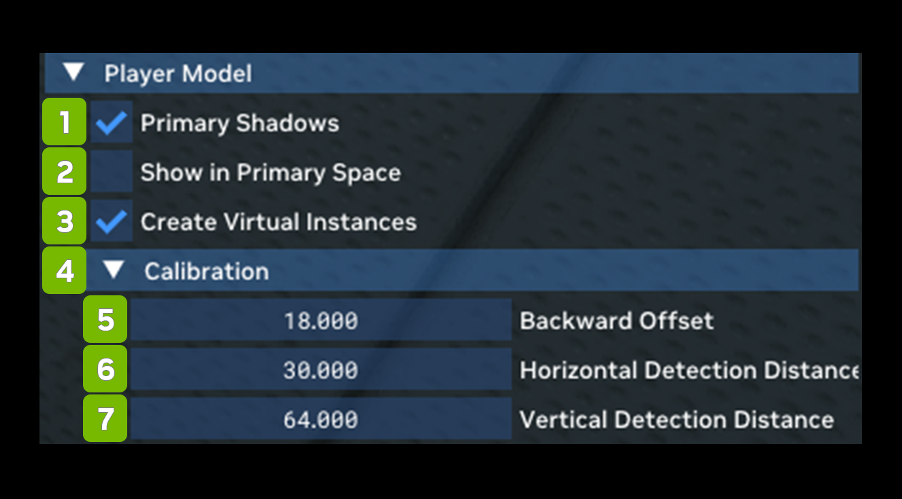

# Player Model

Player Model allows you to toggle compatibility options related to first person character rendering here, as well as
toggle first person character shadows.

| **Ref** | **Option**                        | **RTX Option**                              | **Default Value** | **Description** |
|---------|-----------------------------------|---------------------------------------------|-------------------|-----------------|
| 1       | Primary Shadows Checkbox          | rtx.playerModel.enablePrimaryShadows        | Checked           |                 |
| 2       | Show in Primary Space Checkbox    | rtx.playerModel.enableInPrimarySpace        | Unchecked         |                 |
| 3       | Create Virtual Instances Checkbox | rtx.playerModel.enableVirtualInstances      | Checked           |                 |
| **4**   | **Calibration**                   |                                             |                   |                 |
| 5       | Backward Offset                   | rtx.playerModel.backwardOffset              | 18                |                 |
| 6       | Horizontal Detection Distance     | rtx.playerModel.horizontalDetectionDistance | 34                |                 |
| 7       | Vertical Detection Distance       | rtx.playerModel.verticalDetectionDistance   | 64                |                 |

***
 Need to leave feedback about the RTX Remix Documentation?  [Click here](https://github.com/NVIDIAGameWorks/rtx-remix/issues/new?assignees=nvdamien&labels=documentation%2Cfeedback%2Ctriage&projects=&template=documentation_feedback.yml&title=%5BDocumentation+feedback%5D%3A+) 
