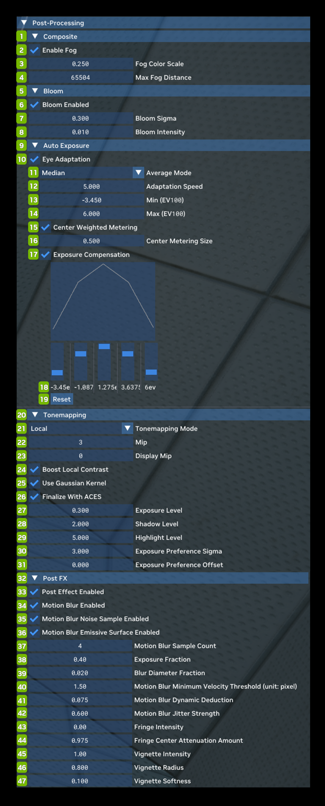

# Post-Processing

Post-Processing allows you to toggle on and off, as well as tune the look of each of the supported post-processing effects in Remix.

<table>
  <tr>
   <td><strong>Ref</strong>
   </td>
   <td><strong>Option</strong>
   </td>
   <td><strong>RTX Option</strong>
   </td>
   <td><strong>Default Value</strong>
   </td>
   <td><strong>Description</strong>
   </td>
  </tr>
  <tr>
   <td><strong>1</strong>
   </td>
   <td colspan="3" ><strong>Composite</strong>
   </td>
   <td><!--- Needs Description --->
   </td>
  </tr>
  <tr>
   <td>2
   </td>
   <td>Enable Fog Checkbox
   </td>
   <td>rtx.enableFog
   </td>
   <td>Checked
   </td>
   <td><!--- Needs Description --->
   </td>
  </tr>
  <tr>
   <td>3
   </td>
   <td>Fog Color Scale
   </td>
   <td>rtx.fogColorScale
   </td>
   <td>0.250
   </td>
   <td><!--- Needs Description --->
   </td>
  </tr>
  <tr>
   <td>4
   </td>
   <td>Max Fog Distance
   </td>
   <td>rtx.maxFogDistance
   </td>
   <td>65504
   </td>
   <td><!--- Needs Description --->
   </td>
  </tr>
  <tr>
   <td><strong>5</strong>
   </td>
   <td colspan="3" ><strong>Bloom</strong>
   </td>
   <td><!--- Needs Description --->
   </td>
  </tr>
  <tr>
   <td>6
   </td>
   <td>Bloom Enabled Checkbox
   </td>
   <td>rtx.bloom.enable
   </td>
   <td>Checked
   </td>
   <td><!--- Needs Description --->
   </td>
  </tr>
  <tr>
   <td>7
   </td>
   <td>Bloom Sigma
   </td>
   <td>rtx.bloom.sigma
   </td>
   <td>0.100
   </td>
   <td><!--- Needs Description --->
   </td>
  </tr>
  <tr>
   <td>8
   </td>
   <td>Bloom Intensity
   </td>
   <td>rtx.bloom.intensity
   </td>
   <td>0.06
   </td>
   <td><!--- Needs Description --->
   </td>
  </tr>
  <tr>
   <td><strong>9</strong>
   </td>
   <td colspan="3" ><strong>Auto Exposure</strong>
   </td>
   <td><!--- Needs Description --->
   </td>
  </tr>
  <tr>
   <td>10
   </td>
   <td>Eye Adaptation Checkbox
   </td>
   <td>rtx.autoExposure.enabled
   </td>
   <td>Checked
   </td>
   <td>Automatically adjusts exposure so that the image won't be too bright or too dark.
   </td>
  </tr>
  <tr>
   <td>11
   </td>
   <td>Average Mode Dropdown
   </td>
   <td>rtx.autoExposure.exposureAverageMode
   </td>
   <td>Median
   </td>
   <td>Average mode. The mean mode averages exposures across pixels. The median mode is more stable for extreme pixel values.  Choices: Mean & Median
   </td>
  </tr>
  <tr>
   <td>12
   </td>
   <td>Adaptation Speed
   </td>
   <td>rtx.autoExposure.autoExposureSpeed
   </td>
   <td>5.000
   </td>
   <td>Average exposure changing speed when the image changes.
   </td>
  </tr>
  <tr>
   <td>13
   </td>
   <td>Min (EV100)
   </td>
   <td>rtx.autoExposure.evMinValue
   </td>
   <td>-2.000
   </td>
   <td>Min/Max values are tuned by moving from bright/dark locations in game, and adjusting until they look correct.
   </td>
  </tr>
  <tr>
   <td>14
   </td>
   <td>Max (EV100)
   </td>
   <td>rtx.autoExposure.evMaxValue
   </td>
   <td>5
   </td>
   <td>Min/Max values are tuned by moving from bright/dark locations in game, and adjusting until they look correct.
   </td>
  </tr>
  <tr>
   <td>15
   </td>
   <td>Center Weighted Metering Checkbox
   </td>
   <td>rtx.autoExposure.exposureCenterMeteringEnabled
   </td>
   <td>Unchecked
   </td>
   <td>Gives higher weight to pixels around the screen center.
   </td>
  </tr>
  <tr>
   <td>16
   </td>
   <td>Center Metering Size
   </td>
   <td>rtx.autoExposure.centerMeteringSize
   </td>
   <td>0.500
   </td>
   <td>The importance of pixels around the screen center.
   </td>
  </tr>
  <tr>
   <td>17
   </td>
   <td>Exposure Compensation Checkbox
   </td>
   <td>rtx.autoExposure.useExposureCompensation
   </td>
   <td>Unchecked
   </td>
   <td>Uses a curve to determine the importance of different exposure levels when calculating average exposure.
   </td>
  </tr>
  <tr>
   <td>18
   </td>
   <td>Exposure Compensation Graph Values
   </td>
   <td>rtx.autoExposure.useExposureCompensation
   </td>
   <td>1 (for all Curve Values)
   </td>
   <td>Curve Values for Exposure Compensation
   </td>
  </tr>
  <tr>
   <td>19
   </td>
   <td>Reset
   </td>
   <td><!--- Needs Description --->
   </td>
   <td><!--- Needs Description --->
   </td>
   <td>Reset Curve values for Exposure Compensation to default
   </td>
  </tr>
  <tr>
   <td><strong>20</strong>
   </td>
   <td colspan="3" ><strong>Tonemapping</strong>
   </td>
   <td><!--- Needs Description --->
   </td>
  </tr>
  <tr>
   <td>21
   </td>
   <td>Tonemapping Mode Dropdown
   </td>
   <td>rtx.tonemappingMode
   </td>
   <td>Local
   </td>
   <td>Global tonemapping tonemaps the image with respect to global parameters, usually based on statistics about the rendered image as a whole.

Local tonemapping on the other hand uses more spatially-local parameters determined by regions of the rendered image rather than the whole image.

Local tonemapping can result in better preservation of highlights and shadows in scenes with high amounts of dynamic range whereas global tonemapping may have to compromise between over or underexposure.  Choices: Global & Local
   </td>
  </tr>
  <tr>
   <td>22
   </td>
   <td>Mip
   </td>
   <td>rtx.localtonemap.mip
   </td>
   <td>3
   </td>
   <td>Top mip level of tone map pyramid.
   </td>
  </tr>
  <tr>
   <td>23
   </td>
   <td>Display Mip
   </td>
   <td>rtx.localtonemap.displayMip
   </td>
   <td>0
   </td>
   <td>Bottom mip level of tone map pyramid.
   </td>
  </tr>
  <tr>
   <td>24
   </td>
   <td>Boot Local Contrast Checkbox
   </td>
   <td>rtx.localtonemap.boostLocalContrast
   </td>
   <td>Unchecked
   </td>
   <td>Boosts contrast on local features.
   </td>
  </tr>
  <tr>
   <td>25
   </td>
   <td>Use Gaussian Kernel Checkbox
   </td>
   <td>rtx.localtonemap.useGaussian
   </td>
   <td>Checked
   </td>
   <td>Uses a gaussian kernel to generate a tone map pyramid.
   </td>
  </tr>
  <tr>
   <td>26
   </td>
   <td>Finalize with ACES Checkbox
   </td>
   <td>rtx.tonemap.finalizeWithACES
   </td>
   <td>Checked
   </td>
   <td>Applies ACES tone mapping on final result.
   </td>
  </tr>
  <tr>
   <td>27
   </td>
   <td>Exposure Level
   </td>
   <td>rtx.localtonemap.exposure
   </td>
   <td>0.750
   </td>
   <td>Exposure factor applied on average exposure.
   </td>
  </tr>
  <tr>
   <td>28
   </td>
   <td>Shadow Level
   </td>
   <td>rtx.localtonemap.shadows
   </td>
   <td>2.000
   </td>
   <td>Shadow area strength. Higher values cause brighter shadows.
   </td>
  </tr>
  <tr>
   <td>29
   </td>
   <td>Highlight Level
   </td>
   <td>rtx.localtonemap.highlights
   </td>
   <td>4.000
   </td>
   <td>Highlight area strength. Higher values cause darker highlights.
   </td>
  </tr>
  <tr>
   <td>30
   </td>
   <td>Exposure Preference Sigma
   </td>
   <td>rtx.localtonemap.exposurePreferenceSigma
   </td>
   <td>4
   </td>
   <td>Transition sharpness between different areas of exposure. Smaller values result in sharper transitions.
   </td>
  </tr>
  <tr>
   <td>31
   </td>
   <td>Exposure Preference Offset
   </td>
   <td>rtx.localtonemap.exposurePreferenceOffset
   </td>
   <td>0
   </td>
   <td>Offset to reference luminance when calculating the weights a pixel belongs to shadow/normal/highlight areas.
   </td>
  </tr>
  <tr>
   <td><strong>32</strong>
   </td>
   <td colspan="3" ><strong>Post FX</strong>
   </td>
   <td>
   </td>
  </tr>
  <tr>
   <td>33
   </td>
   <td>Post Effect Enabled Checkbox
   </td>
   <td>rtx.postfx.enable
   </td>
   <td>Checked
   </td>
   <td>Enables post-processing effects
   </td>
  </tr>
  <tr>
   <td>34
   </td>
   <td>Motion Blur Enabled
   </td>
   <td>rtx.postfx.enableMotionBlur
   </td>
   <td>Checked
   </td>
   <td>Enables motion blur post-processing effect.
   </td>
  </tr>
  <tr>
   <td>35
   </td>
   <td>Motion Blur Noise Sample Enabled
   </td>
   <td>rtx.postfx.enableMotionBlurNoiseSample
   </td>
   <td>Checked
   </td>
   <td>Enable random distance sampling for every step along the motion vector. The random pattern is generated with interleaved gradient noise.
   </td>
  </tr>
  <tr>
   <td>36
   </td>
   <td>Motion Blur Emissive Surface Enabled
   </td>
   <td>rtx.postfx.enableMotionBlurEmissive
   </td>
   <td>Checked
   </td>
   <td>Enable Motion Blur for Emissive surfaces. Disable this when the motion blur on emissive surfaces cause severe artifacts.
   </td>
  </tr>
  <tr>
   <td>37
   </td>
   <td>Motion Blur Sample Count
   </td>
   <td>rtx.postfx.motionBlurSampleCount
   </td>
   <td>4
   </td>
   <td>The number of samples along the motion vector. More samples could help to reduce motion blur noise.
   </td>
  </tr>
  <tr>
   <td>38
   </td>
   <td>Exposure Fraction
   </td>
   <td>rtx.postfx.exposureFraction
   </td>
   <td>0.4
   </td>
   <td>Simulate the camera exposure, the longer exposure will cause stronger motion blur.
   </td>
  </tr>
  <tr>
   <td>39
   </td>
   <td>Blur Diameter Fraction
   </td>
   <td>rtx.postfx.blurDiameterFraction
   </td>
   <td>0.02
   </td>
   <td>The diameter of the circle that motion blur samplings occur. Motion vectors beyond this circle will be clamped.
   </td>
  </tr>
  <tr>
   <td>40
   </td>
   <td>Motion Blur Minimum Velocity Threshold (unit:pixel)
   </td>
   <td>rtx.postfx.motionBlurMinimumVelocityThresholdInPixel
   </td>
   <td>1
   </td>
   <td>The minimum motion vector distance that enables the motion blur. The unit is pixel size.
   </td>
  </tr>
  <tr>
   <td>41
   </td>
   <td>Motion Blur Dynamic Deduction
   </td>
   <td>rtx.postfx.motionBlurDynamicDeduction
   </td>
   <td>1
   </td>
   <td>The deduction of motion blur for dynamic objects.
   </td>
  </tr>
  <tr>
   <td>42
   </td>
   <td>Motion Blur Jitter Strength
   </td>
   <td>rtx.postfx.motionBlurJitterStrength
   </td>
   <td>0.6
   </td>
   <td>The jitter strength of every sample along the motion vector.
   </td>
  </tr>
  <tr>
   <td>43
   </td>
   <td>Fringe Intensity
   </td>
   <td>rtx.postfx.chromaticAberrationAmount
   </td>
   <td>0.02
   </td>
   <td>The strength of chromatic aberration.
   </td>
  </tr>
  <tr>
   <td>44
   </td>
   <td>Fringe Center Attenuation Amount
   </td>
   <td>rtx.postfx.chromaticCenterAttenuationAmount
   </td>
   <td>0.975
   </td>
   <td>Control the amount of chromatic aberration effect that attenuated when close to the center of screen.
   </td>
  </tr>
  <tr>
   <td>45
   </td>
   <td>Vignette Intensity
   </td>
   <td>rtx.postfx.vignetteIntensity
   </td>
   <td>0.8
   </td>
   <td>The darkness of the vignette effect.
   </td>
  </tr>
  <tr>
   <td>46
   </td>
   <td>Vignette Radius
   </td>
   <td>rtx.postfx.vignetteRadius
   </td>
   <td>0.8
   </td>
   <td>The radius of the vignette effect starts. The unit is normalized screen space, 0 represents the center, 1 means the edge of the short edge of the rendering window. So, this setting can be larger than 1 until it reaches the long edge of the rendering window.
   </td>
  </tr>
  <tr>
   <td>47
   </td>
   <td>Vignette Softness
   </td>
   <td>rtx.postfx.vignetteSoftness
   </td>
   <td>0.2
   </td>
   <td>The gradient that the color drops to black from the vignetteRadius to the edge of the rendering window.
   </td>
  </tr>
</table>

***
 Need to leave feedback about the RTX Remix Documentation?  [Click here](https://github.com/NVIDIAGameWorks/rtx-remix/issues/new?assignees=nvdamien&labels=documentation%2Cfeedback%2Ctriage&projects=&template=documentation_feedback.yml&title=%5BDocumentation+feedback%5D%3A+) 
