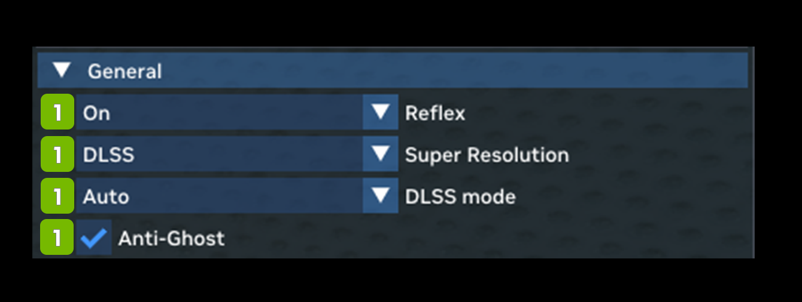

# General

The General settings deal mostly with performance and include various upscaling and latency reduction options.

<table>
  <tr>
   <td><strong>Ref</strong>
   </td>
   <td><strong>Option</strong>
   </td>
   <td><strong>RTX Option</strong>
   </td>
   <td><strong>Default Value</strong>
   </td>
   <td><strong>Description</strong>
   </td>
  </tr>
  <tr>
   <td><strong>1</strong>
   </td>
   <td colspan="3" ><strong>General</strong>
   </td>
   <td><!--- Needs Description --->
   </td>
  </tr>
  <tr>
   <td>2
   </td>
   <td>Reflex Dropdown
   </td>
   <td>rtx.reflexMode
   </td>
   <td>On
   </td>
   <td>Reflex mode selection, enabling it to minimize input latency, boost mode may further reduce latency by boosting GPU clocks in CPU-bound cases.  Choices: On, Off, Boost

<strong>NOTE:</strong> The “Off” setting will still attempt to initialize.  Please use the RTX call <strong>rtx.isReflexEnabled</strong> to fully disable.
   </td>
  </tr>
  <tr>
   <td>3
   </td>
   <td>Super Resolution Dropdown
   </td>
   <td><!--- Needs Description --->
   </td>
   <td>DLSS
   </td>
   <td>Choices: None, DLSS, NIS, TAA-U
   </td>
  </tr>
  <tr>
   <td>4
   </td>
   <td>DLSS Mode Dropdown
   </td>
   <td><!--- Needs Description --->
   </td>
   <td>Auto
   </td>
   <td>Choices: Ultra Performance, Performance, Balance

Quality, Auto, Full Resolution
   </td>
  </tr>
  <tr>
   <td>5
   </td>
   <td>Anti-Ghost Checkbox
   </td>
   <td><!--- Needs Description --->
   </td>
   <td>Checked
   </td>
   <td><!--- Needs Description --->
   </td>
  </tr>
</table>
