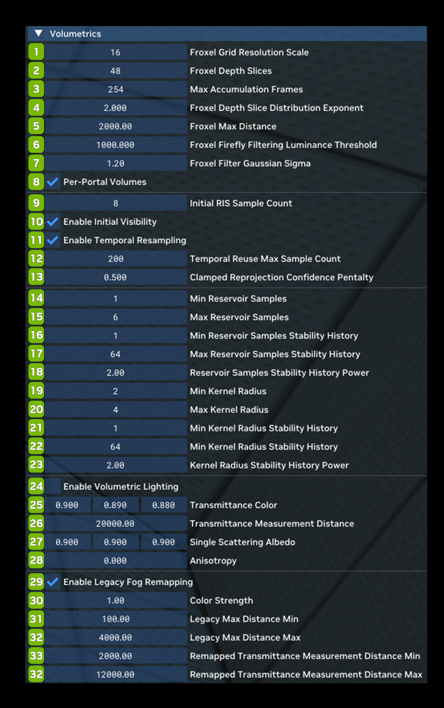

# Volumetrics

Volumetrics allows you to adjust everything related to the volumetric fog in Remix. You can also turn the volumetric fog off or on via the Enable Volumetric Lighting Checkbox. Turning on “Enable Legacy Fog Remapping” will allow the volumetric fog to take in information from the legacy fog in the game and attempt to match its look.

<table>
  <tr>
   <td><strong>Ref</strong>
   </td>
   <td><strong>Option</strong>
   </td>
   <td><strong>RTX Option</strong>
   </td>
   <td><strong>Default Value</strong>
   </td>
   <td><strong>Description</strong>
   </td>
  </tr>
  <tr>
   <td>1
   </td>
   <td>Froxel Grid Resolution Scale
   </td>
   <td>rtx.froxelGridResolutionScale
   </td>
   <td>16
   </td>
   <td>The scale factor to divide the x and y render resolution by to determine the x and y dimensions of the froxel grid.
   </td>
  </tr>
  <tr>
   <td>2
   </td>
   <td>Froxel Depth Slices
   </td>
   <td>rtx.froxelDepthSlices
   </td>
   <td>48
   </td>
   <td>The z dimension of the froxel grid. Must be constant after initialization.
   </td>
  </tr>
  <tr>
   <td>3
   </td>
   <td>Max Accumulation Frames
   </td>
   <td>rtx.maxAccumulationFrames
   </td>
   <td>254
   </td>
   <td>The number of frames to accumulate volume lighting samples over, maximum of 254.

Large values result in greater image stability at the cost of potentially more temporal lag.Should generally be set to as large a value as is viable as the froxel radiance cache is assumed to be fairly noise-free and stable which temporal accumulation helps with.
   </td>
  </tr>
  <tr>
   <td>4
   </td>
   <td>Froxel Depth Slice Distribution Exponent
   </td>
   <td>rtx.froxelDepthSliceDistributionExponent
   </td>
   <td>2.000
   </td>
   <td>The exponent to use on depth values to nonlinearly distribute froxels away from the camera. Higher values bias more froxels closer to the camera with 1 being linear.
   </td>
  </tr>
  <tr>
   <td>5
   </td>
   <td>Froxel Max Distance
   </td>
   <td>rtx.froxelMaxDistance
   </td>
   <td>2000.00
   </td>
   <td>The maximum distance in world units to allocate the froxel grid out to. Should be less than the distance between the camera's near and far plane, as the froxel grid will clip to the far plane otherwise.
   </td>
  </tr>
  <tr>
   <td>6
   </td>
   <td>Froxel Firefly Filtering Luminance Threshold
   </td>
   <td>rtx.froxelFireflyFilteringLuminanceThreshold
   </td>
   <td>1000.000
   </td>
   <td>Sets the maximum luminance threshold for the volumetric firefly filtering to clamp to.
   </td>
  </tr>
  <tr>
   <td>7
   </td>
   <td>Froxel Filter Gaussian Sigma
   </td>
   <td>rtx.froxelFilterGaussianSigma
   </td>
   <td>1.20
   </td>
   <td>The sigma value of the gaussian function used to filter volumetric radiance values. Larger values cause a smoother filter to be used.
   </td>
  </tr>
  <tr>
   <td>8
   </td>
   <td>Per-Portal Volumes Checkbox
   </td>
   <td>rtx.enableVolumetricsInPortals
   </td>
   <td>Checked
   </td>
   <td>Enables using extra frustum-aligned volumes for lighting in portals.

Note that enabling this option will require 3x the memory of the typical froxel grid as well as degrade performance in some cases.

This option should be enabled always in games using ray portals for proper looking volumetrics through them, but should be disabled on any game not using ray portals.

Additionally, this setting must be set at startup and changing it will not take effect at runtime.
   </td>
  </tr>
  <tr>
   <td>9
   </td>
   <td>Initial RIS Sample Count
   </td>
   <td>rtx.volumetricInitialRISSampleCount
   </td>
   <td>8
   </td>
   <td>The number of RIS samples to select from the global pool of lights when constructing a Reservoir sample.

Higher values generally increase the quality of the selected light sample, though similar to the general RIS light sample count has diminishing returns.
   </td>
  </tr>
  <tr>
   <td>10
   </td>
   <td>Enable Initial Visibility Checkbox
   </td>
   <td>rtx.volumetricEnableInitialVisibility
   </td>
   <td>Checked
   </td>
   <td>Determines whether to trace a visibility ray for Reservoir samples.

Results in slightly higher quality froxel grid light samples at the cost of a ray per froxel cell each frame and should generally be enabled.
   </td>
  </tr>
  <tr>
   <td>11
   </td>
   <td>Enable Temporal Resampling Checkbox
   </td>
   <td>rtx.volumetricEnableTemporalResampling
   </td>
   <td>Checked
   </td>
   <td>Indicates if temporal resampling should be used for volume integration.

Temporal resampling allows for reuse of temporal information when picking froxel grid light samples similar to how ReSTIR works, providing higher quality light samples.

This should generally be enabled but currently due to the lack of temporal bias correction this option will slightly bias the lighting result.
   </td>
  </tr>
  <tr>
   <td>12
   </td>
   <td>Temporal Reuse Max Sample Count
   </td>
   <td>rtx.volumetricTemporalReuseMaxSampleCount
   </td>
   <td>200
   </td>
   <td>The number of samples to clamp temporal reservoirs to, should usually be around the value: desired_max_history_frames * average_reservoir_samples.
   </td>
  </tr>
  <tr>
   <td>13
   </td>
   <td>Clamped Reprojection Confidence Penalty
   </td>
   <td>rtx.volumetricClampedReprojectionConfidencePenalty
   </td>
   <td>0.500
   </td>
   <td>The penalty from [0, 1] to apply to the sample count of temporally reprojected reservoirs when reprojection is clamped to the fustrum (indicating lower quality reprojection).
   </td>
  </tr>
  <tr>
   <td>14
   </td>
   <td>Min Reservoir Samples
   </td>
   <td>rtx.froxelMinReservoirSamples
   </td>
   <td>1
   </td>
   <td>The minimum number of Reservoir samples to do for each froxel cell when stability is at its maximum, should be at least 1.
   </td>
  </tr>
  <tr>
   <td>15
   </td>
   <td>Max Reservoir Samples
   </td>
   <td>rtx.froxelMaxReservoirSamples
   </td>
   <td>6
   </td>
   <td>The maximum number of Reservoir samples to do for each froxel cell when stability is at its minimum, should be at least 1 and greater than or equal to the minimum.
   </td>
  </tr>
  <tr>
   <td>16
   </td>
   <td>Min Reservoir Samples Stability History
   </td>
   <td>rtx.froxelMinReservoirSamplesStabilityHistory
   </td>
   <td>1
   </td>
   <td>The minimum history to consider history at minimum stability for Reservoir samples.
   </td>
  </tr>
  <tr>
   <td>17
   </td>
   <td>Max Reservoir Samples Stability History
   </td>
   <td>rtx.froxelMaxReservoirSamplesStabilityHistory
   </td>
   <td>64
   </td>
   <td>The maximum history to consider history at maximum stability for Reservoir samples.
   </td>
  </tr>
  <tr>
   <td>18
   </td>
   <td>Reservoir Samples Stability History Power
   </td>
   <td>rtx.froxelReservoirSamplesStabilityHistoryPower
   </td>
   <td>2.00
   </td>
   <td>The power to apply to the Reservoir sample stability history weight.
   </td>
  </tr>
  <tr>
   <td>19
   </td>
   <td>Min Kernel Radius
   </td>
   <td>rtx.froxelMinKernelRadius
   </td>
   <td>2
   </td>
   <td>The minimum filtering kernel radius to use when stability is at its maximum, should be at least 1.
   </td>
  </tr>
  <tr>
   <td>20
   </td>
   <td>Max Kernel Radius
   </td>
   <td>rtx.froxelMaxKernelRadius
   </td>
   <td>4
   </td>
   <td>The maximum filtering kernel radius to use when stability is at its minimum, should be at least 1 and greater than or equal to the minimum.
   </td>
  </tr>
  <tr>
   <td>21
   </td>
   <td>Min Kernel Radius Stability History
   </td>
   <td>rtx.froxelMinKernelRadiusStabilityHistory
   </td>
   <td>1
   </td>
   <td>The minimum history to consider history at minimum stability for filtering.
   </td>
  </tr>
  <tr>
   <td>22
   </td>
   <td>Max Kernel Radius Stability History
   </td>
   <td>rtx.froxelMaxKernelRadiusStabilityHistory
   </td>
   <td>64
   </td>
   <td>The maximum history to consider history at maximum stability for filtering.
   </td>
  </tr>
  <tr>
   <td>23
   </td>
   <td>Kernel Radius Stability History Power
   </td>
   <td>rtx.froxelKernelRadiusStabilityHistoryPower
   </td>
   <td>2.00
   </td>
   <td>The power to apply to the kernel radius stability history weight.
   </td>
  </tr>
  <tr>
   <td>24
   </td>
   <td>Enable Volumetric Lighting Checkbox
   </td>
   <td>rtx.enableVolumetricLighting
   </td>
   <td>Unchecked
   </td>
   <td>Enabling volumetric lighting provides higher quality ray traced physical volumetrics, disabling falls back to cheaper depth based fog.

Note that disabling this option does not disable the froxel radiance cache as a whole as it is still needed for other non-volumetric lighting approximations.
   </td>
  </tr>
  <tr>
   <td>25
   </td>
   <td>Transmittance Color
   </td>
   <td>rtx.volumetricTransmittanceColor
   </td>
   <td>0.953237, 0.92879, 0.903545
   </td>
   <td>The color to use for calculating transmittance measured at a specific distance.

Note that this color is assumed to be in sRGB space and gamma encoded as it will be converted to linear for use in volumetrics.
   </td>
  </tr>
  <tr>
   <td>26
   </td>
   <td>Transmittance Measurement Distance
   </td>
   <td>rtx.volumetricTransmittanceMeasurementDistance
   </td>
   <td>10000
   </td>
   <td>The distance the specified transmittance color was measured at. Lower distances indicate a denser medium.
   </td>
  </tr>
  <tr>
   <td>27
   </td>
   <td>Single Scattering Albedo
   </td>
   <td>rtx.volumetricSingleScatteringAlbedo
   </td>
   <td>0.900, 0.900, 0.900
   </td>
   <td>The single scattering albedo (otherwise known as the particle albedo) represents the ratio of scattering to absorption.

While color-like in many ways this value is assumed to be more of a mathematical albedo (unlike material albedo which is treated more as a color), and is therefore treated as linearly encoded data (not gamma).
   </td>
  </tr>
  <tr>
   <td>28
   </td>
   <td>Anisotropy
   </td>
   <td>rtx.volumetricAnisotropy
   </td>
   <td>0.000
   </td>
   <td>The anisotropy of the scattering phase function (-1 being backscattering, 0 being isotropic, 1 being forward scattering).
   </td>
  </tr>
  <tr>
   <td>29
   </td>
   <td>Enable Legacy Fog Remapping Checkbox
   </td>
   <td>rtx.enableFogRemap
   </td>
   <td>Unchecked
   </td>
   <td>A flag to enable or disable fixed function fog remapping. Only takes effect when volumetrics are enabled.

Typically many old games used fixed function fog for various effects and while sometimes this fog can be replaced with proper volumetrics globally, other times require some amount of dynamic behavior controlled by the game.

When enabled this option allows for remapping of fixed function fog parameters from the game to volumetric parameters to accommodate this dynamic need.
   </td>
  </tr>
  <tr>
   <td>30
   </td>
   <td>Color Strength
   </td>
   <td><!--- Needs Description --->
   </td>
   <td>1.00
   </td>
   <td><!--- Needs Description --->
   </td>
  </tr>
  <tr>
   <td>31
   </td>
   <td>Legacy Max Distance Min
   </td>
   <td>rtx.fogRemapMaxDistanceMin
   </td>
   <td>100.00
   </td>
   <td>A value controlling the "max distance" fixed function fog parameter's minimum remapping bound.

Note that fog remapping and fog max distance remapping must be enabled for this setting to have any effect.
   </td>
  </tr>
  <tr>
   <td>32
   </td>
   <td>Legacy Max Distance Max
   </td>
   <td>rtx.fogRemapMaxDistanceMax
   </td>
   <td>4000.00
   </td>
   <td>A value controlling the "max distance" fixed function fog parameter's maximum remapping bound.

Note that fog remapping and fog max distance remapping must be enabled for this setting to have any effect.
   </td>
  </tr>
  <tr>
   <td>33
   </td>
   <td>Remapped Transmittance Measurement Distance Min
   </td>
   <td>rtx.fogRemapTransmittanceMeasurementDistanceMin
   </td>
   <td>2000.00
   </td>
   <td>A value representing the transmittance measurement distance's minimum remapping bound.

When the fixed function fog's "max distance" parameter is at or below its specified minimum the volumetric system's transmittance measurement distance will be set to this value and interpolated upwards.

Note that fog remapping and fog max distance remapping must be enabled for this setting to have any effect.
   </td>
  </tr>
  <tr>
   <td>34
   </td>
   <td>Remapped Transmittance Measurement Distance Max
   </td>
   <td>rtx.fogRemapTransmittanceMeasurementDistanceMax
   </td>
   <td>12000.00
   </td>
   <td>A value representing the transmittance measurement distance's maximum remapping bound.

When the fixed function fog's "max distance" parameter is at or above its specified maximum the volumetric system's transmittance measurement distance will be set to this value and interpolated upwards.

Note that fog remapping and fog max distance remapping must be enabled for this setting to have any effect.
   </td>
  </tr>
</table>

***
 Need to leave feedback about the RTX Remix Documentation?  [Click here](https://docs.google.com/forms/d/1vym6SgptS4QJvp6ZKTN8Mu9yfd5yQc76B3KHIl-n4DQ/prefill) 